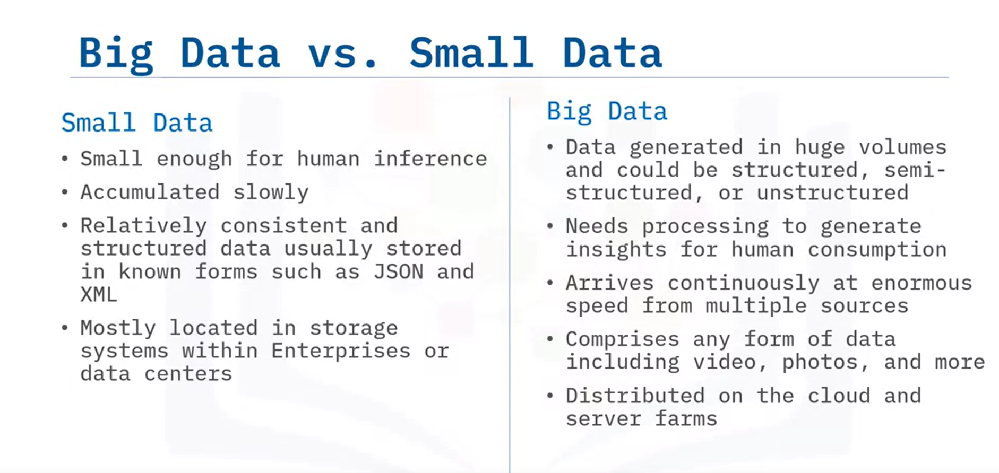
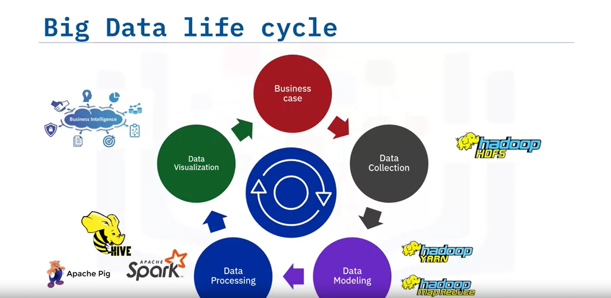

# What is Big Data?

Welcome to “What is Big Data?” After watching this video, you will be able to:

- Explain Big Data
- Identify the characteristics of Big Data
- Explain the five V’s of Big Data

Bernard Marr, an expert in analytics, KPI, AI, and Big Data, defines Big Data as the digital trace we generate in this digital era.

## Comparing Big Data and Small Data

- **Small Data**: Limited in quantity, easily interpreted by humans, and often structured (e.g., sports scores, employee shift schedules). It is accumulated slowly, may not be updated continuously, and is stored easily within an enterprise's infrastructure.
- **Big Data**: Generated in massive volumes with little or no structure (e.g., social media posts, medical records). It requires specialized programs for interpretation, is collected continuously, and grows exponentially. It can include text, images, audio, and videos, and is stored in the Cloud or server farms.

## The Big Data Life Cycle

1. **Collection**: Initiated by a business problem or requirement.
2. **Storage**: Using a distributed storage framework like Hadoop HDFS.
3. **Modeling**: Using Map and Reduce tasks to create a data model.
4. **Processing**: Using tools like Apache Spark to produce meaningful information.
5. **Visualization**: Presenting data in graphical formats for decision-making.

## Gartner's Definition of Big Data

Gartner defines Big Data as a high-volume, high-velocity, and high-variety information asset that demands cost-effective and innovative tools for processing.

## Understanding the Volume of Big Data

Big Data can be much larger than familiar terms like megabytes, gigabytes, and terabytes. For example, one exabyte can store over 11 million 4k movies. Big Data can extend to zettabytes and yottabytes, containing billions and trillions of terabytes, respectively.

## The Four V's of Big Data

1. **Velocity**: The speed at which data arrives. It can be batch, real-time, or streaming, driven by improving connectivity and hardware.
2. **Volume**: The amount of data stored, driven by increased data sources, higher resolution sensors, and scalable infrastructure.
3. **Variety**: The diversity of data (structured, semi-structured, and unstructured), driven by mobile technologies and efficient storage and retrieval.
4. **Veracity**: The accuracy and quality of data, driven by robust ETL mechanisms and the need for traceability.

## The Fifth V: Value

Value is the outcome of making intelligent business decisions by leveraging the previous four V’s. It includes:

- Faster and smarter business decisions
- Efficient use of resources
- Discovery of new market opportunities

Big Data supports innovation and thus creates value.

## Summary

In this video, you learned that:

- Big Data is the digital trace generated in the digital era.
- It is a high-volume, high-velocity, and/or high-variety information asset requiring cost-effective and innovative tools for processing.
- The core features of Big Data are the 4 V’s: Velocity, Volume, Variety, and Veracity.
- Big Data creates a fifth V, Value, when collected, stored, and processed correctly.