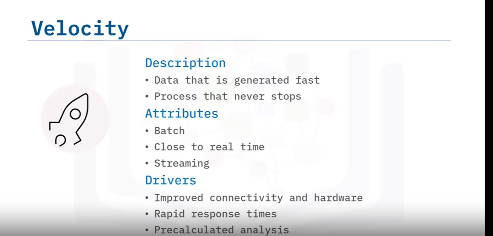
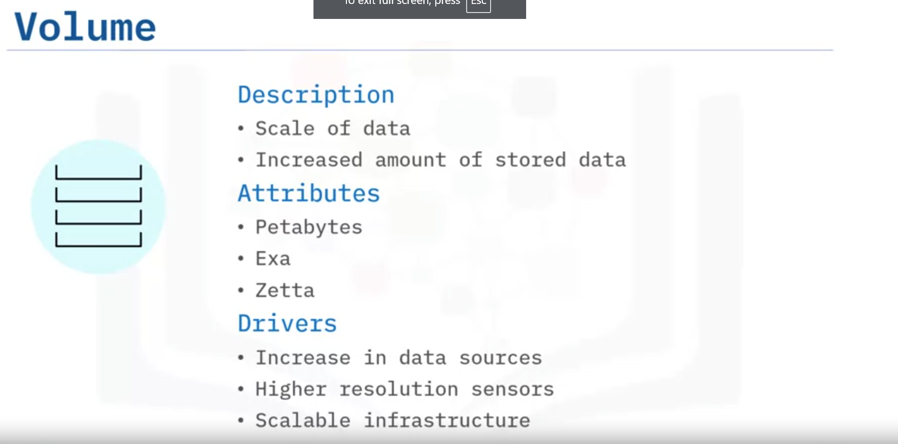
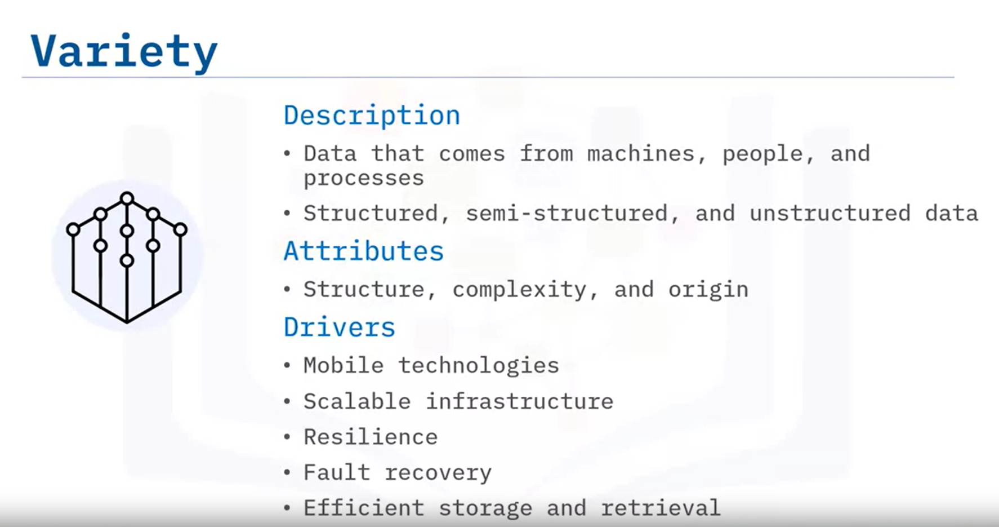
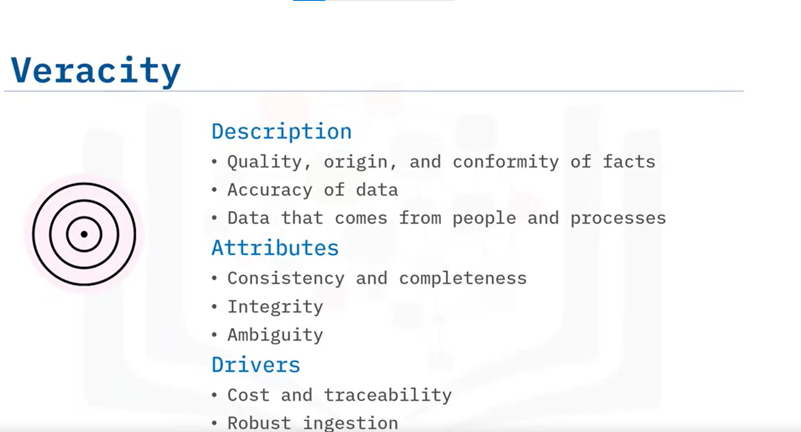
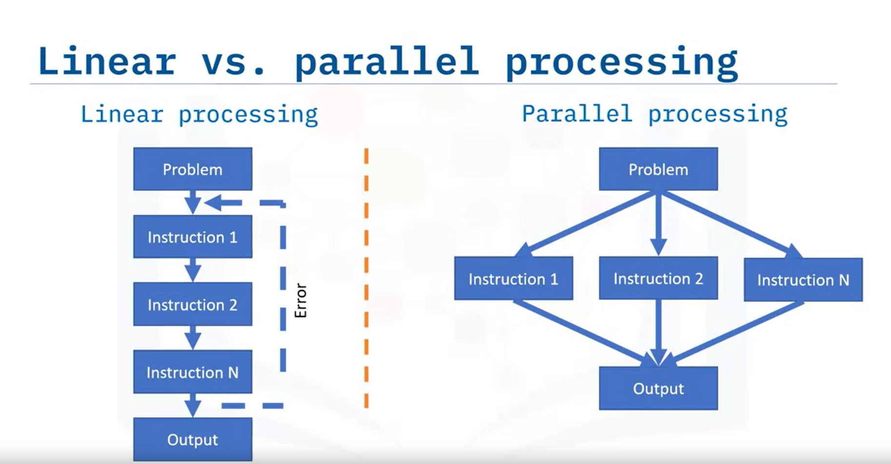
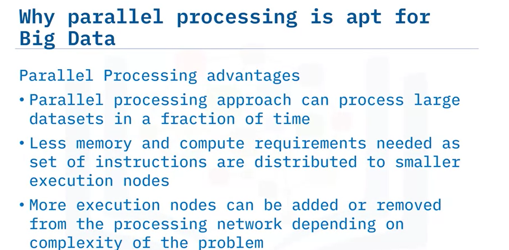
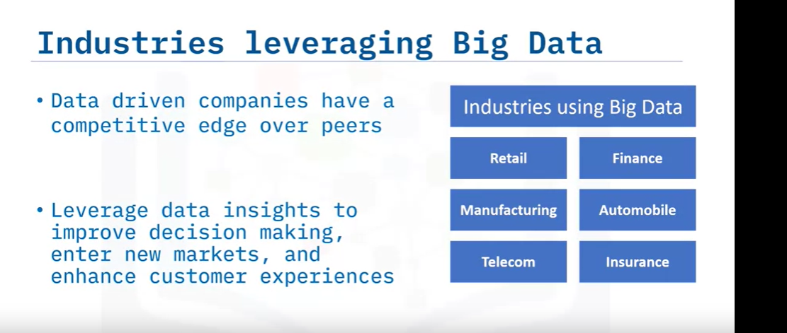
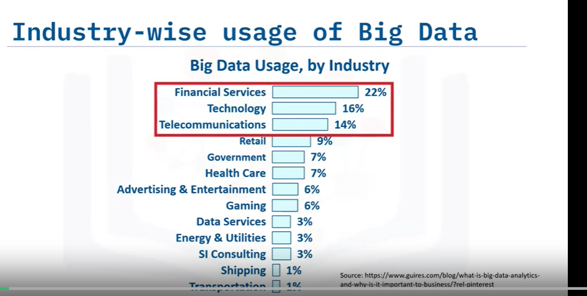

# What is Big Data?

Welcome to “What is Big Data?” After watching this video, you will be able to:

- Explain Big Data
- Identify the characteristics of Big Data
- Explain the five V’s of Big Data

Bernard Marr, an expert in analytics, KPI, AI, and Big Data, defines Big Data as the digital trace we generate in this digital era.

## Comparing Big Data and Small Data

- **Small Data**: Limited in quantity, easily interpreted by humans, and often structured (e.g., sports scores, employee shift schedules). It is accumulated slowly, may not be updated continuously, and is stored easily within an enterprise's infrastructure.
- **Big Data**: Generated in massive volumes with little or no structure (e.g., social media posts, medical records). It requires specialized programs for interpretation, is collected continuously, and grows exponentially. It can include text, images, audio, and videos, and is stored in the Cloud or server farms.

## The Big Data Life Cycle

1. **Collection**: Initiated by a business problem or requirement.
2. **Storage**: Using a distributed storage framework like Hadoop HDFS.
3. **Modeling**: Using Map and Reduce tasks to create a data model.
4. **Processing**: Using tools like Apache Spark to produce meaningful information.
5. **Visualization**: Presenting data in graphical formats for decision-making.

## Gartner's Definition of Big Data

Gartner defines Big Data as a high-volume, high-velocity, and high-variety information asset that demands cost-effective and innovative tools for processing.

## Understanding the Volume of Big Data

Big Data can be much larger than familiar terms like megabytes, gigabytes, and terabytes. For example, one exabyte can store over 11 million 4k movies. Big Data can extend to zettabytes and yottabytes, containing billions and trillions of terabytes, respectively.

## The Four V's of Big Data

1. **Velocity**: The speed at which data arrives. It can be batch, real-time, or streaming, driven by improving connectivity and hardware.
   
2. **Volume**: The amount of data stored, driven by increased data sources, higher resolution sensors, and scalable infrastructure.
   
3. **Variety**: The diversity of data (structured, semi-structured, and unstructured), driven by mobile technologies and efficient storage and retrieval.
   
4. **Veracity**: The accuracy and quality of data, driven by robust ETL mechanisms and the need for traceability.

## The Fifth V: Value

Value is the outcome of making intelligent business decisions by leveraging the previous four V’s. It includes:

- Faster and smarter business decisions
- Efficient use of resources
- Discovery of new market opportunities

Big Data supports innovation and thus creates value.

## Summary

In this video, you learned that:

- Big Data is the digital trace generated in the digital era.
- It is a high-volume, high-velocity, and/or high-variety information asset requiring cost-effective and innovative tools for processing.
- The core features of Big Data are the 4 V’s: Velocity, Volume, Variety, and Veracity.
- Big Data creates a fifth V, Value, when collected, stored, and processed correctly.

# Impact of Big Data

Welcome to "Impact of Big Data"

## Learning Objectives
After watching this video, you will be able to:
- List examples of Big Data related technologies.
- Explain the impact of Big Data on businesses and people.
- Describe the Internet of Things (IoT) and its impact on Big Data.

## Overview
Big Data is one of the most important subjects of this century. Globally, millions of people generate and use Big Data without necessarily being aware of it. This personal data, in the form of photos, videos, and text, forms the bulk of data collected by consumer goods companies.

### Impact on Businesses and People
- **Amazon Recommendations**: Amazon’s recommendations are based on users' search history, past purchases, items in their cart, and ratings. Companies like Amazon, Netflix, and Spotify use algorithms based on Big Data to make specific recommendations.
- **Personal Assistants**: Siri and Alexa use Big Data to answer users' questions. These assistants use advanced neural networks to process speech, translate text, and carry out complex tasks.
- **Google Now**: This service makes recommendations before users ask for them by linking to calendars, locations, and sensors on users' phones. It forecasts future needs and behavior.

### Impact on Businesses
Clive Humby called data the “New Oil,” and Geoffrey Moore compared its value to our senses of sight and hearing. Big Data is fundamentally changing the way businesses compete and operate, with machine learning algorithms driving business decisions to increase effectiveness. The demand for data scientists and Big Data engineers is increasing significantly.

### Internet of Things (IoT)
The IoT refers to physical objects connected through the Internet, including smart devices and communication devices like smartphones and computers. These devices collect and transfer massive amounts of data without manual intervention.

- **Components of IoT**: 
  - Smart devices and sensors produce and transmit data.
  - A Gateway routes data to Cloud storage.
  - Data Engineers use algorithms to analyze this data, which is then used for business and consumer decisions.

For example, a security camera could upload footage continuously, and a cloud-based algorithm might alert the user if any activity is detected.

## Summary
In this video, you learned that:
- Big Data is everywhere and is used to drive business decisions and influence lives.
- Virtual personal assistants like Siri and Alexa use Big Data to answer questions.
- Google Now uses Big Data to forecast future needs and behavior.
- IoT devices generate massive data volumes, and Big Data analytics helps companies gain insights from this data.

# Welcome to "Parallel Processing and Scalability for Big Data"

After watching this video, you will be able to:
- Explain why Big Data requires parallel processing.
- Identify the differences between linear and parallel processing.
- Identify why parallel processing is apt for Big Data.
- Explain parallel processing and scalability.
- Describe the motivation for horizontal scaling.
- Demonstrate “embarrassingly parallel.”
- Explain fault tolerance in parallel computing.

You can do lots of things with data at various sizes, right? In any normal analytics cycle, the functionality of the computer is to store data and move that data from its storage capacity into a compute capacity (which includes memory), and back to storage once important results are computed. With Big Data, you have more data than will fit on a single computer.

## Parallelism or Parallel Processing

Parallel processing can best be understood by comparing it to linear processing.

### Linear Processing

Linear processing is the traditional method of computing a problem where the problem statement is broken into a set of instructions that are executed sequentially till all instructions are completed successfully. If an error occurs in any one of the instructions, the entire sequence of instructions is executed from the beginning after the error has been resolved. Linear processing is best suited for minor computing tasks and is inefficient and time-consuming when it comes to processing complex problems such as Big Data.

### Parallel Processing

The alternative to linear processing is parallel processing. Here too, the problem statement is broken down into a set of executable instructions. The instructions are then distributed to multiple execution nodes of equal processing power and are executed in parallel. Since the instructions are run on separate execution nodes, errors can be fixed and executed locally independent of other instructions.

Some other benefits of using parallel processing are:
- **Reduced processing times**: Parallel processing can process Big Data in a fraction of the time compared to linear processing.
- **Less memory and processing requirements**: Since the problem instructions are executed on separate execution nodes, memory and processing requirements are low even while processing large volumes of data.
- **Flexibility**: The biggest advantage of parallel processing is that execution nodes can be added and removed as and when required. This significantly reduces infrastructure cost.

## Data Scaling

Data scaling is a technique to manage, store, and process the overflow of data. You can get a larger single-node computer. But when your data is growing exponentially, eventually it will outgrow the capacity that is available. Increasing the capacity of a single node as a means of increasing capacity is called scaling up. A better strategy, or at least the one most people ultimately choose, is to scale out or to scale horizontally. This simply means adding additional nodes with the same capacity until the problem is tractable. The individual nodes arranged in this way are called a computing cluster.

## Compute Clusters

Compute clusters can solve problems that are known as “embarrassingly parallel” calculations. These are the kinds of workloads that can easily be divided and run independent of one another. If any one process fails, it has no impact on the others and can easily be rerun. An example would be to, say, change the date format in a single column of a large dataset that has been split into multiple smaller chunks that are stored in different nodes of the cluster. Sometimes, sorting a large data set adds significant complexity to the process. Now, the multiple computations must coordinate with one another because each process needs to be aware of the state of its peer processes in order to complete the calculation. This requires sending messages across a network to each other or writing them to a file system that is accessible to all processes on the cluster. The level of complexity increases significantly because you are basically asking a cluster of computers to behave as a single computer.

Most calculations in enterprise environments are considered “embarrassingly parallel with some not so easy” calculations. While this statement is true to varying degrees it has guided the design of underlying frameworks. In the Hadoop ecosystem, the concept of “bringing compute to the data” is a central idea in the design of the cluster. The cluster is designed in a way that computations on certain pieces, or partitions, of the data will take place right at the location of the data when possible. The resulting output will also be written to the same node.

## Fault Tolerance

Computers break, outages happen, and you need to be prepared. In such cases, fault tolerance comes into play. Fault tolerance refers to the ability of a system to continue operating without interruption when one or more of its components fail. This works for Hadoop primary data storage system (HDFS) and other similar storage systems (like S3 and object storage), a system like the one we showcase here. Consider the first 3 partitions of a data set labeled P1, P2, and P3, which reside on the first node. In this system, copies of each of these data partitions are also stored in other locations or nodes within the cluster. If the first node ever goes down, you can add a new node to the cluster and recover the lost partitions by copying data from one of the other nodes where copies of P1, P2, and P3 partitions are stored. Clearly, this is an extraordinarily complex maintenance process, but the Hadoop filesystem is a robust and time-tested framework. It can be reliable to 5 9s (99.999%).

## Summary

In this video, you learned that:
- Big Data requires parallel processing on account of massive volumes of data that are too large to fit on any one computer.
- Linear processing is sequential while parallel processing works on multiple instructions at the same time.
- Parallel processing has significant advantages over linear processing and it is best suited for processing Big Data.
- Parallelism in Big Data is parallelization across multiple processors in parallel computing environments. It focuses on distributing the data across different nodes operating on the data in parallel.
- Horizontal scaling, or scaling out, means adding more machines or nodes to handle the increased workload, improving capacity and flexibility.
- “Embarrassingly parallel” calculations are the kinds of workloads that can easily be divided and run independently of one another. If any one process fails, it has no impact on the others and can simply be rerun.
- Fault tolerance is the property that enables a system to continue operating properly in the event of the failure of some of its components.

# Welcome to "Parallel Processing and Scalability for Big Data"

After watching this video, you will be able to:
- Explain why Big Data requires parallel processing.
- Identify the differences between linear and parallel processing.
- Identify why parallel processing is apt for Big Data.
- Explain parallel processing and scalability.
- Describe the motivation for horizontal scaling.
- Demonstrate "embarrassingly parallel."
- Explain fault tolerance in parallel computing.

## Data Processing Basics

With data at various sizes, a computer stores data, moves it to memory for computation, and then back to storage. Big Data, however, exceeds the capacity of a single computer.

## Linear Processing

- Traditional method: Sequentially executes instructions.
- Inefficient for Big Data: Errors require restarting the entire process.

## Parallel Processing

- Alternative to linear processing.
- Breaks down tasks and distributes them to multiple nodes.
- Errors can be fixed independently on each node.
- Benefits:
  - Reduced processing times.
  - Lower memory and processing requirements.
  - Flexible: Nodes can be added or removed as needed, reducing costs.

## Data Scaling

- **Scaling up**: Increasing the capacity of a single node.
- **Scaling out (horizontal scaling)**: Adding more nodes to handle growing data.
  - Nodes form a computing cluster to solve "embarrassingly parallel" tasks.
  - Each task runs independently; failures do not affect other tasks.

## Complex Parallel Processing

- Some tasks need coordination across nodes, increasing complexity.
- Example: Sorting large datasets requires nodes to communicate their states.

## Hadoop and Fault Tolerance

- Hadoop's design: "Bringing compute to the data."
  - Processes data on the node where it's stored, reducing data movement.
- Fault tolerance:
  - System continues operating despite component failures.
  - Data is replicated across nodes.
  - If a node fails, data can be recovered from other nodes.

## Summary

- Big Data requires parallel processing due to its size.
- Parallel processing is more efficient than linear processing for Big Data.
- Horizontal scaling improves capacity and flexibility.
- "Embarrassingly parallel" tasks are easily divisible and independent.
- Fault tolerance ensures system reliability despite failures.

# Welcome to "Big Data Tools and Ecosystem"

After watching this video, you will be able to:
- Identify the key tooling categories within the Big Data ecosystem.
- Describe the role of each tooling category in the Big Data life cycle.
- List major tools and vendors within each Big Data tooling category.

Big Data tools have six different categories:
1. Data Technologies
2. Analytics and Visualization
3. Business Intelligence
4. Cloud Service Providers
5. NoSQL Databases
6. Programming Tools

## Data Technologies

- **Purpose**: Analyze, process, and extract information from Big Data.
- **Features**: Handle structured and unstructured data, offer high-performance parallel processing.
- **Examples**: Apache Hadoop, Apache HDFS, Apache Spark.
- **Vendors**: Cloudera, Databricks.

## Analytics and Visualization

- **Purpose**: Examine data to find patterns and trends, provide visual representations.
- **Examples**: Tableau, Palantir, SAS, Pentaho, Teradata.

## Business Intelligence (BI)

- **Purpose**: Transform raw data into actionable insights for business analysis.
- **Features**: Use probability, statistics, and flowcharts.
- **Examples**: Cognos, Oracle, PowerBI, Business Objects, Hyperion.

## Cloud Service Providers

- **Purpose**: Offer infrastructure and support for Big Data.
- **Features**: Provide computing, storage, networking, and analytical software.
- **Examples**: AWS, IBM, GCP, Oracle.

## NoSQL Databases

- **Purpose**: Store and process vast amounts of data.
- **Features**: Use documents, key-value stores, wide-column databases, and graph databases.
- **Examples**: MongoDB, CouchDB, Cassandra, Redis.

## Programming Tools

- **Purpose**: Perform large-scale analytical tasks and operationalize Big Data.
- **Functions**: Data collection, cleaning, exploration, modeling, and visualization.
- **Examples**: R, Python, SQL, Scala, Julia.

## Summary

In this video, you learned that:
- There are six main components of Big Data tools: 
  1. Data technologies
  2. Analytics and visualization
  3. Business Intelligence
  4. Cloud providers
  5. NoSQL databases
  6. Programming tools
- Each category plays a specific role in the Big Data life cycle.
- Several major vendors provide tools and support for Big Data processing.

# Welcome to "Big Data Tools and Ecosystem"

After watching this video, you will be able to:
- Identify the key tooling categories within the Big Data ecosystem.
- Describe the role of each tooling category in the Big Data life cycle.
- List major tools and vendors within each Big Data tooling category.

Big Data tools have six different categories:
1. Data Technologies
2. Analytics and Visualization
3. Business Intelligence
4. Cloud Service Providers
5. NoSQL Databases
6. Programming Tools

## Data Technologies

- **Purpose**: Analyze, process, and extract information from Big Data.
- **Features**: Handle structured and unstructured data, offer high-performance parallel processing.
- **Examples**: Apache Hadoop, Apache HDFS, Apache Spark.
- **Vendors**: Cloudera, Databricks.

## Analytics and Visualization

- **Purpose**: Examine data to find patterns and trends, provide visual representations.
- **Examples**: Tableau, Palantir, SAS, Pentaho, Teradata.

## Business Intelligence (BI)

- **Purpose**: Transform raw data into actionable insights for business analysis.
- **Features**: Use probability, statistics, and flowcharts.
- **Examples**: Cognos, Oracle, PowerBI, Business Objects, Hyperion.

## Cloud Service Providers

- **Purpose**: Offer infrastructure and support for Big Data.
- **Features**: Provide computing, storage, networking, and analytical software.
- **Examples**: AWS, IBM, GCP, Oracle.

## NoSQL Databases

- **Purpose**: Store and process vast amounts of data.
- **Features**: Use documents, key-value stores, wide-column databases, and graph databases.
- **Examples**: MongoDB, CouchDB, Cassandra, Redis.

## Programming Tools

- **Purpose**: Perform large-scale analytical tasks and operationalize Big Data.
- **Functions**: Data collection, cleaning, exploration, modeling, and visualization.
- **Examples**: R, Python, SQL, Scala, Julia.

## Summary

In this video, you learned that:
- There are six main components of Big Data tools: 
  1. Data technologies
  2. Analytics and visualization
  3. Business Intelligence
  4. Cloud providers
  5. NoSQL databases
  6. Programming tools
- Each category plays a specific role in the Big Data life cycle.
- Several major vendors provide tools and support for Big Data processing.

# Welcome to "Open Source and Big Data"

After watching this video, you will be able to:
- Explain the role of open source in Big Data.
- Describe platforms for coordinating open source.
- Describe the most popular open-source frameworks.

## What is Open Source Software?

Open source software is free. Both the runnable version and the source code are available for people to view, use, and reuse. True open source projects embrace an open-governance model, allowing any contributor to propose changes. Different licenses determine how software can be used, so it's important to check the license type before using any open source software.

## Why is Open Source Used for Big Data?

Open source projects are massive efforts that persist beyond the efforts of any single organization. They form the foundation of modern Big Data infrastructure. An example is the Linux Kernel, which started as an open source project and now is the standard for servers worldwide. The open-source model, similar to democracy, is transparent and serves the community's needs. 

## Contributing to Open Source Projects

Most open source projects have formal processes for contributing code:
- **Committers**: Can modify the code directly.
- **Contributors**: Submit code for review by a committer.
- **Users**: Use the code without modifying it.

Major open source projects often belong to open source foundations that provide best practices for development and governance.

## Popular Open Source Frameworks for Big Data

### Hadoop Project
- **MapReduce**: A framework for running code at scale on a Hadoop cluster.
- **HDFS (Hadoop File System)**: Manages large and distributed datasets with resilience and partitioning.
- **YARN**: A resource manager for Hadoop and many Big Data applications, like Hive and Spark.

### Other Frameworks
- **Apache Spark**: A modern Big Data computation framework.
- **Apache Hive**: Supports ETL (Extract, Transform, Load) and computation tasks on Hadoop systems.
- **Apache HBase**: A large NoSQL datastore often used with Hadoop.
- **Hortonworks Data Platform (HDP)**: A package that includes important open source tools like Hadoop, Spark, Hive, and HBase.

## Conclusion

In this video, you learned that:
- Open source runs the world of Big Data.
- Open source projects are free and transparent.
- The Hadoop project, including MapReduce, HDFS, and YARN, is the biggest component of Big Data.
- Other important tools include Apache Hive and Apache Spark.

# Welcome to "Beyond the Hype"

After watching this video, you will be able to:
- Describe facts about big data.
- Describe the key sources of Big Data.
- Explain different types of Big Data.
- Describe the contribution of cloud computing in Big Data.

## Why is Everyone Talking About Big Data?

- More data has been created in the past two years than in the entire previous history of humankind.
- There is a 40% projected growth in global data generated per year.
- By 2026, the amount of digital data created will exceed twice the amount of data created since the advent of digital storage.
- The chart on the right shows the growth in global data in zettabytes.

## Major Sources of Big Data

1. **Social Data**: 
   - Comes from likes, Tweets & Retweets, comments, video uploads, and general media shared via social media platforms.

2. **Machine-Generated Data**:
   - Generated by IoT sensors, industrial equipment, and web logs tracking user behavior.

3. **Transactional Data**:
   - Generated from daily transactions, such as invoices, payment orders, storage records, and delivery receipts.

## Types of Big Data

1. **Structured Data**:
   - Organized, labeled, and conforms to a tabular format.
   - Examples: names, dates, addresses, credit card numbers.

2. **Unstructured Data**:
   - Does not conform to any predetermined format and makes up about 80% of data.
   - Examples: images, audio or video files, IoT sensor data, text messages, social media posts.

3. **Semi-Structured Data**:
   - Mostly unstructured but includes metadata that identifies certain characteristics.
   - Examples: emails (content is unstructured, but email addresses, subject lines, etc., are structured).

## Sources of Big Data

- **Structured Data**: 
  - Relational databases and spreadsheets, easy to query using SQL.
  
- **Semi-Structured Data**: 
  - XML and JSON files, use tags or markers to enforce hierarchies of records and fields.

## The Role of Cloud Computing in Big Data

- Cloud computing allows users to access scalable computing and storage resources through the Internet.
- Companies can use server capacity as needed and expand rapidly to process big data sets and run complicated models.
- Cloud computing lowers the cost of analyzing big data as resources are shared among many users, who pay only for what they use.

## Summary

In this video, you learned that:
- Big Data creation is growing at an exponential rate.
- Data types include social-, machine-, and transactional-generated data.
- Big Data is collected in structured, unstructured, and semi-structured forms.
- Advances in cloud computing have significantly increased the potential of Big Data.

# Welcome to "Big Data Use Cases"

After watching this video, you will be able to:
- Identify industries where Big Data is leveraged.
- Discuss and outline the usage of Big Data in key industries.

## Introduction

Data is being generated at unprecedented volumes. Data-driven companies can gain a competitive edge by effectively aggregating and analyzing data to generate valuable insights. Every major industry is leveraging data insights to improve decision-making, enter new markets, and enhance customer experiences.

## Leading Industries Using Big Data

- **Financial Services**
- **Technology**
- **Telecommunications**

These industries are at the forefront of innovation with Big Data. They are closely followed by:

- **Retail**
- **Government**
- **Healthcare**
- **Advertising and Entertainment**
- **Gaming Industry**
- **Data Services**
- **Energy and Utilities**
- **System Integrator Consulting**
- **Shipping and Transportation**

## Use Cases of Big Data in Various Industries

### Retail
- **Price Analytics**: Understand market segmentation, identify optimal price points, and perform margin analysis for profitability.
- **Sentiment Analysis**: Use social media conversations to gauge consumer opinions and devise effective marketing strategies.

### Insurance
- **Fraud Analytics**: Detect fraudulent claims and anomalies in trends to prevent suspicious activities.
- **Risk Assessment**: Use predictive modeling and behavioral analytics to identify customers at higher risk.

### Telecommunications
- **Network Security**: Use machine learning-based pattern analysis to identify threats and perform predictive maintenance.
- **Contextualized Promotions**: Offer location-based promotions to increase conversion rates.
- **Traffic Pattern Monitoring**: Use analytics to determine when to upgrade the network for optimal customer experience.
- **Real-Time Pricing Promotions**: Test and optimize pricing packages with targeted customer groups.

### Manufacturing
- **Predictive Maintenance**: Analyze sensor data to predict equipment failure, maintenance needs, and parts replacement.
- **Production Optimization**: Use AI algorithms to recommend optimizations in production lines.

### Automotive
- **Supply Chain Analytics**: Enhance various aspects from supply chain to targeted marketing and traffic management.
- **Predictive Maintenance**: Predict breakdowns and schedule repairs based on sensor data.
- **Connected Cars**: Use real-time data for self-driving cars and trucks to make adjustments in speed and direction.

### Finance
- **Fraud Detection and Risk Assessment**: Identify fraudulent activities and assess risks.
- **Customer Segmentation**: Group customers into segments for personalized solutions.
- **Algorithmic Trading**: Use machine learning for quick, predictive decisions in financial transactions.

## Conclusion

In this video, you learned that:
- Companies are heavily relying on Big Data to differentiate themselves from competitors.
- Various industries like retail, insurance, telecom, manufacturing, automotive, and finance use Big Data to reduce costs, increase customer satisfaction, and make strategic business decisions.

| Term                              | Definition                                                                                                                                                                                                                                                                                                                               |
|-----------------------------------|-------------------------------------------------------------------------------------------------------------------------------------------------------------------------------------------------------------------------------------------------------------------------------------------------------------------------------------------|
| Apache Spark                      | An open-source, in-memory application framework used for distributed data processing and iterative analysis of large data sets.                                                                                                                                                                                                           |
| Apache HBase                      | A robust NoSQL datastore that efficiently manages storage and computation resources independently of the Hadoop ecosystem.                                                                                                                                                                                                                |
| Business Intelligence (BI)        | Encompasses various tools and methodologies designed to convert data into actionable insights efficiently.                                                                                                                                                                                                                                 |
| Big Data                          | Data sets whose volume, velocity, or variety exceeds the capacity of conventional relational databases to effectively manage, capture, and process with minimal latency. Key characteristics of big data include substantial volume, high velocity, and diverse variety.                                         |
| Big Data Analytics                | Uses advanced analytic techniques against large, diverse big data sets that include structured, semi-structured, and unstructured data from different sources and sizes, from terabytes to zettabytes. It helps companies gain insights from the data collected by IoT devices.                                    |
| Big Data Programming Tools        | Programming tools are the final component of big data commercial tools. These programming tools perform large-scale analytical tasks and operationalize big data. They also provide all necessary functions for data collection, cleaning, exploration, modeling, and visualization. Some popular tools you can use for programming include R, Python, SQL, Scala, and Julia. |
| Committer                         | Most open-source projects have formal processes for contributing code and include various levels of influence and obligation to the project: Committer, contributor, user, and user group. Typically, committers can modify the code directly.                                                            |
| Cloud Computing                   | Allows customers to access infrastructure and applications over the internet without needing on-premises installation and maintenance. By leveraging cloud computing, companies can utilize server capacity on-demand and rapidly scale up to handle the extensive computational requirements of processing large data sets and executing complex mathematical models.                           |
| Cloud Providers                   | Offer essential infrastructure and support, providing shared computing resources encompassing computing power, storage, networking, and analytical software. These providers also offer software as a service model featuring specific solutions, enabling enterprises to gather, process, and visualize data efficiently. Prominent examples of cloud service providers include AWS, IBM, GCP, and Oracle.          |
| Extract, Transform, and Load (ETL) Process | A systematic approach that involves extracting data from various sources, transforming it to meet specific requirements, and loading it into a data warehouse or another centralized data repository.                                                                                                                                      |
| Hadoop                            | An open-source software framework that provides dependable distributed processing for large data sets through the utilization of simplified programming models.                                                                                                                                                                          |
| Hadoop Distributed File System (HDFS) | A file system distributed on multiple file servers, allowing programmers to access or store files from any network or computer. It is the storage layer of Hadoop. It works by splitting the files into blocks, creating replicas of the blocks, and storing them on different machines. It is built to access streaming data seamlessly. It uses a command-line interface to interact with Hadoop.                    |
| Hive                              | A data warehouse infrastructure employed for data querying and analysis, featuring an SQL-like interface. It facilitates report generation and utilizes a declarative programming language, enabling users to specify the data they want to retrieve.                                                 |
| Internet of Things (IoT)          | A system of physical objects connected through the internet. A thing or device can include a smart device in our homes or a personal communication device such as a smartphone or computer. These collect and transfer massive amounts of data over the internet without manual intervention by using embedded technologies.                                   |
| Machine Data                      | Refers to information generated by various sources, including the Internet of Things (IoT) sensors embedded in industrial equipment, as well as weblogs that capture user behavior and interactions.                                                                                                                                          |
| Map                               | MapReduce converts a set of data into another set of data, and the elements are fragmented into tuples (key or value pairs).                                                                                                                                                                                                              |
| MapReduce                         | A program model and processing technique used in distributed computing based on Java. It splits the data into smaller units and processes big data. It is the first method used to query data stored in HDFS. It allows massive scalability across hundreds or thousands of servers in a Hadoop cluster.                              |
| NoSQL Databases                   | NoSQL databases are built from the ground up to store and process vast amounts of data at scale and support a growing number of modern businesses. NoSQL databases store data in documents rather than relational tables. Types of NoSQL databases include pure document databases, key-value stores, wide-column databases, and graph databases such as MongoDB, CouchDB, Cassandra, and Redis.          |
| Open-Source Software              | Not only is the runnable version of the code free, but the source code is also completely open, meaning that every line of code is available for people to view, use, and reuse as needed.                                                                                                                                                  |
| Price Analytics                   | Helps understand market segmentation, identify the best price points for a product line, and perform margin analysis for maximum profitability.                                                                                                                                                                                            |
| Relational Databases              | Data is structured in the form of tables, with rows and columns, collectively forming a relational database. These tables are interconnected using primary and foreign keys to establish relationships across the data set.                                                                                                                   |
| Sentiment Analysis                | Utilizes social media conversations to gain insights into consumer opinions about a product. It is used to develop effective marketing strategies and establish customer connections based on their sentiments and preferences.                                                                        |
| Social Data                       | Comes from the likes, tweets and retweets, comments, video uploads, and general media that are uploaded and shared via the world's favorite social media platforms. Machine-generated data and business-generated data are data that organizations generate within their own operations.                              |
| Transactional Data                | Generated from all the daily transactions that take place both online and offline, such as invoices, payment orders, storage records, and delivery receipts.                                                                                                                                                                                  |
| Velocity                          | The speed at which data arrives. Velocity is one of the four main components used to describe the dimensions of big data.                                                                                                                                                                                                                 |
| Volume                            | The increase in the amount of data stored over time. Volume is one of the four main components used to describe the dimensions of big data.                                                                                                                                                                                                 |
| Variety                           | The diversity of data or the various data forms that need to be stored. Variety is one of the four main components used to describe the dimensions of big data.                                                                                                                                                                              |
| Veracity                          | The certainty of data, as with a large amount of data available, makes it difficult to determine if the data collected is accurate. Veracity is one of the four main components used to describe the dimensions of big data.                                                                                                                  |
| Yet Another Resource Negotiator (YARN) | Serves as the resource manager bundled with Hadoop and is typically the default resource manager for numerous big data applications, such as HIVE and Spark. While it remains a robust resource manager, it's important to note that more contemporary container-based resource managers, such as Kubernetes, are gradually emerging as the new standard practices in the field.                              |