# Welcome to "Introduction to Hadoop"

After watching this video, you will be able to:
- Define Hadoop
- Explain the history of Hadoop
- List reasons why Hadoop was the answer to Big Data processing
- Outline some of the challenges of Hadoop

Hadoop is an open-source framework used to process enormous datasets. 

### Scenario
Imagine this scenario: You have one gigabyte of data that you need to process, perhaps customer sales records or survey responses. The data is stored in a relational database on your desktop computer or laptop. Neither device has a problem handling this data set and you can query the data with ease.

You have a great year, and you pick up a few more clients. Your company starts growing very quickly, and that data grows to ten gigabytes, then 100 gigabytes. You pick up a big client, a retailer perhaps, with multiple databases. Maybe you are a mine manager and a new executive decision means that you must now start processing data from equipment, front end loaders, excavators, and haul trucks. You also have data about the environment, data about soil and weather, and data about safety and rock samples.

Or perhaps your company is a delivery service, and you attach sensors to your entire fleet. Overnight your clients, drivers, and their vehicles all start gathering data that you need to process! When your data grows from 1 terabyte to 10 terabytes, and then 100 terabytes, you are again quickly approaching the limits of your local computers. And maybe you need to process unstructured data coming from sources like Facebook, Twitter, sensors, and so on. The senior leadership team at your company wants to derive insights from both the relational data and the unstructured data in order to make informed decisions. And they want this information as soon as possible. 

How can you accomplish this task? Hadoop might be the answer.

### Understanding Hadoop

#### Definition
Hadoop is a set of open-source programs and procedures which can be used as the framework for Big Data operations. It is used for processing massive data in distributed file systems that are linked together. It allows for running applications on clusters. A cluster is a collection of computers working together at the same to time to perform tasks. It should be noted that Hadoop is not a database but an ecosystem that can handle processes and jobs in parallel or concurrently.

Hadoop is optimized to handle massive quantities of data which could be:
- Structured, tabular data
- Unstructured data, such as images and videos
- Semi-structured data

#### History
In the 1990s, coming into the new millennium, the web grew significantly to millions of pages and different structures of data. Automation was needed to help handle simultaneously the differences in data structure and the web searches.

In 1999, the Apache Software Foundation was established as a non-profit. In 2002, the Nutch web search engine was created by Doug Cutting and Mike Cafarella. Nutch was created on the basis that it could handle multiple tasks across different computers at the same time, while storing and processing the data in a distributed way, so that the most relevant search would be returned faster. In 2006, Cutting joined Yahoo with the Nutch project, and the project was divided into the web crawler and distributed processing. The distributed processing segment was called Hadoop, and in 2008, Yahoo released Hadoop to the Apache Software Foundation.

Data is now in petabytes and exabytes and Big Data is the term used to explain the complexity of the data.

### Core Components of Hadoop
Hadoop has individual components for storing and processing data. The term Hadoop is often used to refer to both the core components of Hadoop as well as the ecosystem of related projects. The core components of Hadoop include:

1. **Hadoop Common**: An essential part of the Apache Hadoop Framework that refers to the collection of common utilities and libraries that support other Hadoop modules.
2. **Hadoop Distributed File System (HDFS)**: Handles large data sets running on commodity hardware. A commodity hardware is low-specifications industry-grade hardware and scales a single Hadoop cluster to hundreds or even thousands.
3. **MapReduce**: The processing unit of Hadoop and an important core component to the Hadoop framework. MapReduce processes data by splitting large amounts of data into smaller units and processes them simultaneously.
4. **YARN**: Short for "Yet Another Resource Negotiator." YARN is a very important component because it prepares the RAM and CPU for Hadoop to run data in batch processing, stream processing, interactive processing, and graph processing, which are stored in HDFS.

### Challenges of Hadoop
The drawbacks of Hadoop could not be left unnoticed by developers. Hadoop contained many smaller components. Although efficient at first glance, Hadoop failed at simple tasks. Hadoop is not good for:
- Processing transactions due to its lack of random access
- Work that cannot be done in parallel or when there are dependencies within the data (dependencies arise when record one must be processed before record two)
- Low latency data access ("low latency" allows small delays, unnoticeable to humans, between an input being processed and the corresponding output providing real time characteristics)
- Processing lots of small files (although, there is work being done in this area such as IBM’s Adaptive MapReduce)
- Intensive calculations with little data

To deal with the shortcomings of Hadoop, new tools like Hive were built on top of Hadoop. Hive provided SQL-like query and provided users with strong statistical functions. Pig was popular for its multi query approach to cut down the number of times that the data is scanned.

### Summary
In this video you learned that:
- Hadoop is an open-source framework for Big Data
- The core components of Hadoop are HDFS, MapReduce, YARN, and Hadoop Common
- The drawbacks of Hadoop outweighed the benefits

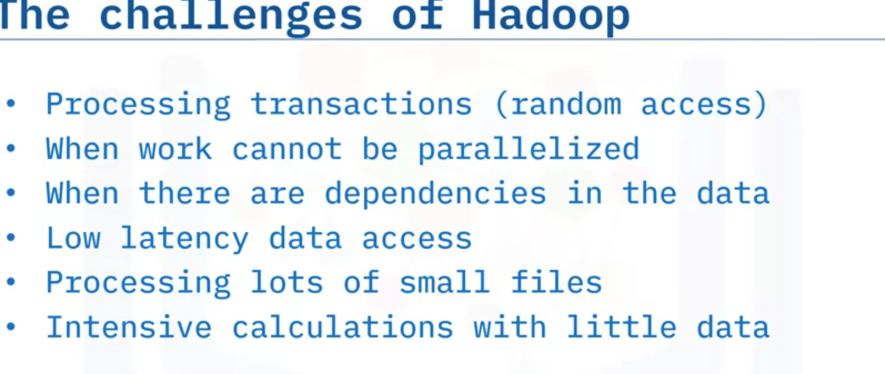

# Welcome to Introduction to MapReduce

After watching this video, you will be able to:
- Explain the terms Map and Reduce in MapReduce
- Describe why we use MapReduce
- List the components of MapReduce
- Outline examples of common use cases of MapReduce

### What is MapReduce?

MapReduce is a programming pattern that enables massive scalability across hundreds or thousands of servers in a Hadoop cluster. As the processing component, MapReduce is the heart of Apache Hadoop. MapReduce is a processing technique and a program model for distributed computing based on Java. Distributed computing is a system or machine with multiple components located on different machines. Each component has its own job, but the components communicate with each other to run as one system to the end user.

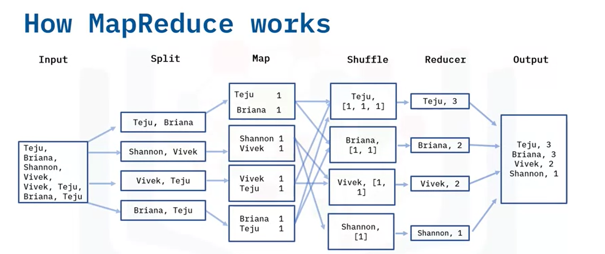

### The MapReduce Algorithm

The MapReduce algorithm consists of two important tasks: Map and Reduce. Many MapReduce programs are written in Java, but MapReduce can also be coded in C++, Python, Ruby, R, and so on.

#### Map Task
As the name suggests, the MapReduce framework contains two tasks, Map and Reduce. The Map task takes in an input file and performs some mapping tasks by processing and extracting important data information into key-value pairs, which are the preliminary output list. Some reorganization occurs before the preliminary output is sent to the Reducer.

#### Reduce Task
The Reducer works with multiple map functions and aggregates the pairs using their keys to produce a final output. MapReduce keeps track of its tasks by creating unique keys to ensure that all the processes are solving the same problem.

### MapReduce Framework Visualized

**Map Step**: The Map step takes a set of data and converts it into another set of data, where individual elements are broken down into key/value pairs. The key is the name, and the value is the content. The input data is a file that is saved in the Hadoop file system called HDFS.

**Example**: Suppose we have an input file that contains names of people, and we want to perform a word count on the unique name occurrences. The data is split into multiple files, each containing key-value pairs worked on separately. For instance, the first split line for Teju and Briana produces two key-value pairs with one occurrence in each file. This process repeats for all key-value pairs.

**Reducer Step**: The Reducer processes the data from the Map step. After processing, it produces a new set of outputs, which are stored in HDFS. The Reducer starts with shuffling, which sorts the key and a list of values. For example, the key Teju and its corresponding values list from the Map step might look like Teju [1, 1, 1], indicating the name Teju occurred three times. This process repeats for the rest of the names. The Reducer layer aggregates these values and saves them, then the final output is stored in an output file.

### Advantages of MapReduce

- **Parallel Processing**: MapReduce allows for a high level of parallel jobs across multiple nodes. A node is an independent computer used for processing and storing large volumes of data. In Hadoop, we have two types of nodes: the name node and the data node. MapReduce enables splitting and running independent tasks in parallel by dividing each task, thus saving time.
- **Flexibility**: MapReduce can process data in both tabular and non-tabular forms, providing business value to organizations regardless of data structure.
- **Support for Multiple Languages**: MapReduce supports different programming languages and provides a platform for analysis, data warehousing, and more.

### Use Cases of MapReduce

- **Social Media**: Platforms like LinkedIn and Instagram use MapReduce to analyze user interactions with profiles and posts.
- **Entertainment**: Netflix uses MapReduce to recommend movies based on user viewing history and interests.
- **Financial Institutions**: Banks and credit card companies use MapReduce to detect anomalies in user transactions.
- **Advertisement**: The advertisement industry uses MapReduce to understand user behavior and engagement with ads. Google ads, for instance, utilize MapReduce to analyze user engagement.
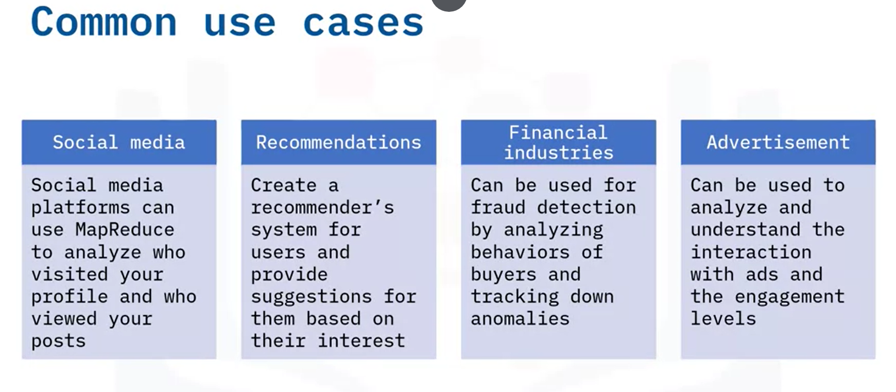
### Summary

In this video, you have learned that:
- MapReduce is a framework used in parallel computing.
- It contains two major tasks: Map and Reduce.
- The Map task processes data into key-value pairs, sorts, and organizes the data.
- The Reduce task aggregates and computes a set of results, producing a final output.
- MapReduce is flexible for all data types, including structured and unstructured data.
- It can be applied to multiple industries such as social media, entertainment, financial services, and more.

# Welcome to "Hadoop Ecosystem"

After watching this video, you will be able to:
- List the stages of the Hadoop Ecosystem
- Differentiate between the core components and the extended components
- List some examples of tools used in each stage

### Core Components of Hadoop

Apart from the core components of Hadoop, Hadoop Common refers to the common utilities and libraries that support the other Hadoop modules. The core components include:
- **Hadoop Distributed File System (HDFS)**: Stores the data collected from ingestion and distributes it across multiple nodes.
- **MapReduce**: Makes Big Data manageable by processing it in clusters.
- **Yet Another Resource Negotiator (YARN)**: Acts as the resource manager across clusters.

### Extended Hadoop Ecosystem

The extended Hadoop Ecosystem consists of libraries or software packages commonly used with or installed on top of the Hadoop core. These components support each other for Big Data processing. We can examine the Hadoop ecosystem based on various stages.

### Stages of the Hadoop Ecosystem

1. **Ingest**
2. **Store**
3. **Process and Analyze**
4. **Access**
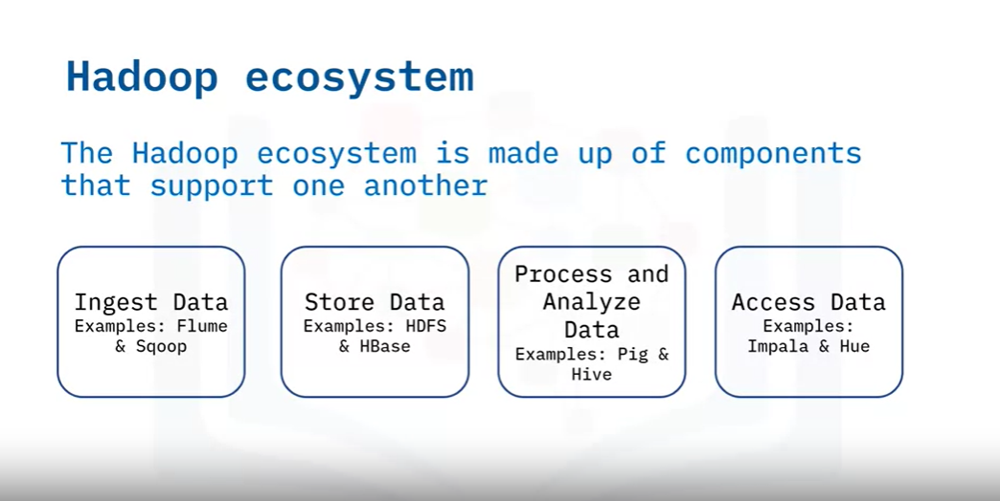
#### 1. Ingesting Data

When dealing with Big Data, data comes from different sources. Tools like Flume and Sqoop are used in this stage:
- **Flume**: A distributed service that collects, aggregates, and transfers Big Data to the storage system. Flume has a simple and flexible architecture based on streaming data flows and uses an extensible data model for online analytic applications.
- **Sqoop**: An open-source product designed to transfer bulk data between relational database systems and Hadoop. Sqoop generates MapReduce code to import and export data, allowing for quick development of MapReduce applications using the stored records in HDFS.

#### 2. Storage

- **HDFS**: Stores large datasets across multiple nodes.
- **HBase**: A column-oriented non-relational database system that runs on top of HDFS. It provides real-time random access to the Hadoop file system, using hash tables for faster lookups.
- **Cassandra**: A scalable NoSQL database designed to have no single point of failure.

#### 3. Process and Analyze Data

- **Pig**: Used for analyzing large amounts of data. Pig is a procedural data flow and programming language that follows a set order and commands.
- **Hive**: Mainly used for creating reports and operates on the server side of a cluster. Hive is a declarative programming language, allowing users to specify which data they wish to retrieve.

#### 4. Access Data

At this stage, tools like Impala and Hue are often used:
- **Impala**: A scalable system that allows non-technical users to search and access the data in Hadoop without needing programming skills.
- **Hue**: An acronym for Hadoop User Experience, Hue allows users to upload, browse, and query data. It provides a SQL editor for several query languages like Hive and MySQL and supports running Pig jobs and workflows.

### Summary

In this video, you learned that:
- The four main stages of the Hadoop Ecosystem are Ingest, Store, Process and Analyze, and Access.
- Examples of tools associated with each stage.
- How each stage interacts with the others.

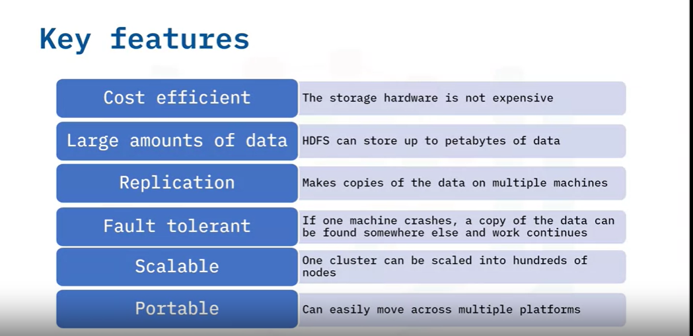

# Welcome to "Hadoop Distributed File System"

After watching this video, you will be able to:
- Explain Hadoop Distributed File System and important concepts
- Identify the key HDFS features
- Describe the HDFS architecture

## What is HDFS?

HDFS stands for Hadoop Distributed File System. It is the storage layer of Hadoop and works by splitting files into blocks, creating replicas of these blocks, and storing them on different machines. HDFS allows programmers to access or store files from any network or computer seamlessly.

## Key Features of HDFS

- **Cost Efficiency**: HDFS uses commodity hardware, which is inexpensive and reduces storage costs.
- **Scalability**: HDFS can store very large amounts of data (petabytes), and a single cluster can scale into hundreds of nodes.
- **Fault Tolerance**: HDFS replicates data blocks to minimize the costs associated with data loss when hardware fails.
- **Portability**: HDFS is designed to move easily from one platform to another.
- **Large Data Storage**: HDFS can store data in any format, tabular and non-tabular, and splits these large amounts of data into smaller chunks called blocks.

## Important Concepts in HDFS

### Blocks

- **Definition**: A block is the minimum amount of data that can be read or written in HDFS and provides fault tolerance.
- **Default Block Size**: The default block size could be 64 or 128 megabytes.
- **Example**: A 500-megabyte file with a default block size of 128 megabytes will be divided into 3 blocks of 128 megabytes and one block of 116 megabytes.

### Nodes

- **Node**: A single system responsible for storing and processing data.
- **Name Node (Primary Node)**: Regulates file access to clients, maintains, manages, and assigns tasks to the data nodes.
- **Data Node (Secondary Node)**: Manages the storage system and performs read and write requests at the instruction of the name node.
- **Rack Awareness**: The name node maximizes performance by choosing data nodes closest to themselves (same rack or nearby racks). A rack is a collection of about forty to fifty data nodes using the same network switch.

### Replication

- **Definition**: Creating a copy of the data block for backup purposes.
- **Replication Factor**: Defined as the number of times a data block is copied. For example, if the replication factor is 2 for a 500-megabyte file, it will create eight copies of the file blocks for backup.
- **Rack Awareness in Replication**: Replicas are saved in different racks to ensure data availability even if a rack is down.
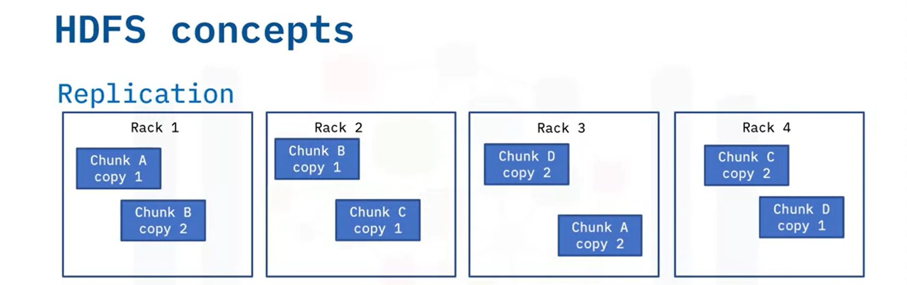
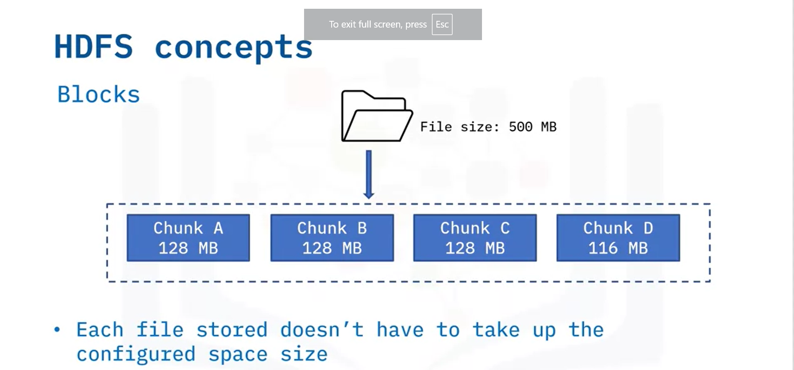
### Read and Write Operations

- **Write Once, Read Many**: HDFS allows files to be written once and read many times. Editing existing files is not allowed, but new data can be appended.
- **Read Operation**:
  - The client sends a request to the name node for the location of the data nodes containing blocks.
  - The name node verifies client privileges and provides the locations.
  - The client interacts with the data nodes to read the files.
- **Write Operation**:
  - The name node checks client privileges and ensures the file doesn't already exist.
  - The client receives write permission and the data nodes start creating replicas.
  - Confirmation is sent to the client once replicas are created.
  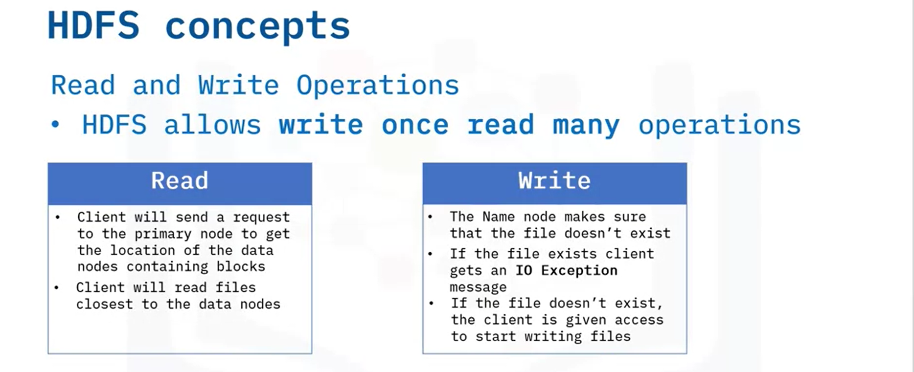

## HDFS Architecture

HDFS follows the primary/secondary node architecture. The primary node is the name node, and there is one name node per cluster with multiple data nodes as secondary nodes. A file is split into blocks stored in data nodes. The name node oversees file operations and maps file blocks to the data nodes. Data nodes handle read and write requests, create, replicate, and delete file blocks based on instructions from the name node.
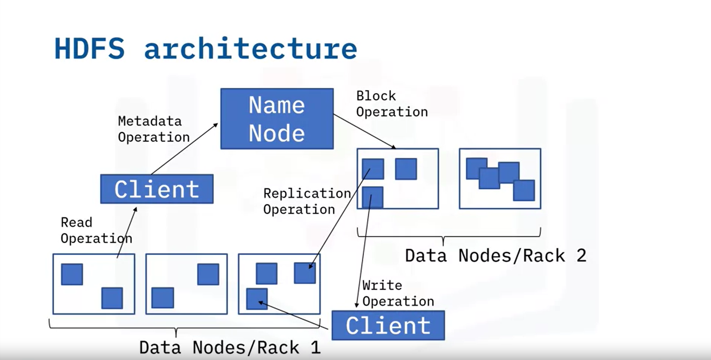
## Summary

In this video, you learned that:
- Key HDFS benefits include cost efficiency, scalability, data storage expansion, and data replication capabilities.
- A block is the minimum size of a file in HDFS.
- Replication creates a copy of data blocks for backup purposes.
- Rack awareness helps reduce network traffic and improve cluster performance.
- HDFS enables write once, read many operations.

# Welcome to Hive

After watching this video, you will be able to:
- Articulate the reasons why Hive is used
- List Hive features
- Differentiate between Hive vs. traditional RDBMS
- Identify components of the Hive architecture
- Discuss Hive concepts

## What is Hive?

Hive is a data warehouse software within Hadoop designed to read, write, and manage large and tabular-type datasets and data analysis. It stores historical data from various sources for analysis and reporting. Hive is scalable, fast, and easy to use, especially for those familiar with SQL, as Hive Query Language (Hive QL) is based on SQL. Hive supports several file formats, including sequence files, record columnar files, and text or flat files, and allows for data cleaning and filtering tasks.

## Hive Features

- **Scalability**: Designed to work on petabytes of data.
- **Ease of Use**: Based on SQL, making it easy to learn for users familiar with relational databases.
- **File Format Support**: Supports sequence files, record columnar files, and text/flat files.
- **Data Cleaning and Filtering**: Allows customization according to user requirements.

## Hive vs. Traditional RDBMS
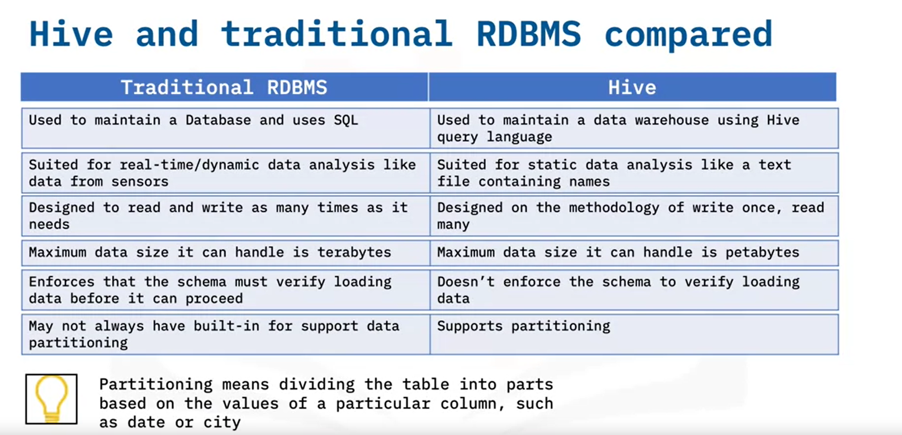
### Traditional RDBMS

- **Purpose**: Maintains a database.
- **Query Language**: SQL (Structured Query Language).
- **Data Analysis**: Suited for real-time data analysis.
- **Read/Write Operations**: Allows numerous read and write operations.
- **Data Handling**: Handles up to terabytes of data.
- **Schema Verification**: Enforces schema verification before loading data.
- **Data Partitioning**: May not support built-in data partitioning.

### Hive

- **Purpose**: Maintains a data warehouse.
- **Query Language**: Hive QL (inspired by SQL).
- **Data Analysis**: Suited for static data analysis.
- **Read/Write Operations**: Based on the write once, read many methodology.
- **Data Handling**: Designed to handle petabytes of data.
- **Schema Verification**: Does not enforce schema verification before loading data.
- **Data Partitioning**: Supports partitioning (e.g., by date or city).

## Hive Architecture
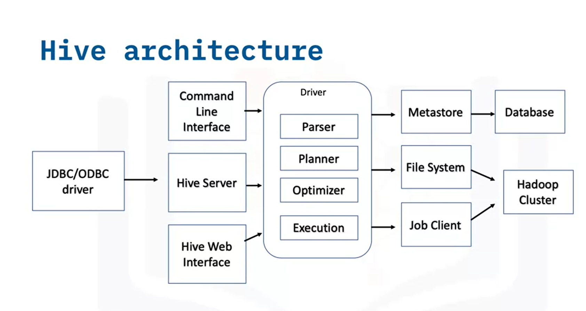
Hive architecture consists of three main parts:

1. **Hive Client**
2. **Hive Services**
3. **Hive Storage and Computing**

### Hive Client

Hive provides different drivers for communication depending on the application type:
- **JDBC Driver**: For Java-based applications.
- **ODBC Driver**: For applications based on the ODBC protocol.

### Hive Services

Client interactions and query operations are handled by Hive services:
- **Command Line Interface**: Interface for the Hive service.
- **Driver**: Manages query statements, monitors session progress, and stores metadata.
- **Meta Store**: Stores metadata about tables (location, schema, etc.).

### Hive Storage and Computing

- **Metadata Storage**: Metadata information is stored in a database.
- **Query Results and Data Storage**: Stored in Hadoop cluster or HDFS.

## Hive Concepts in Detail
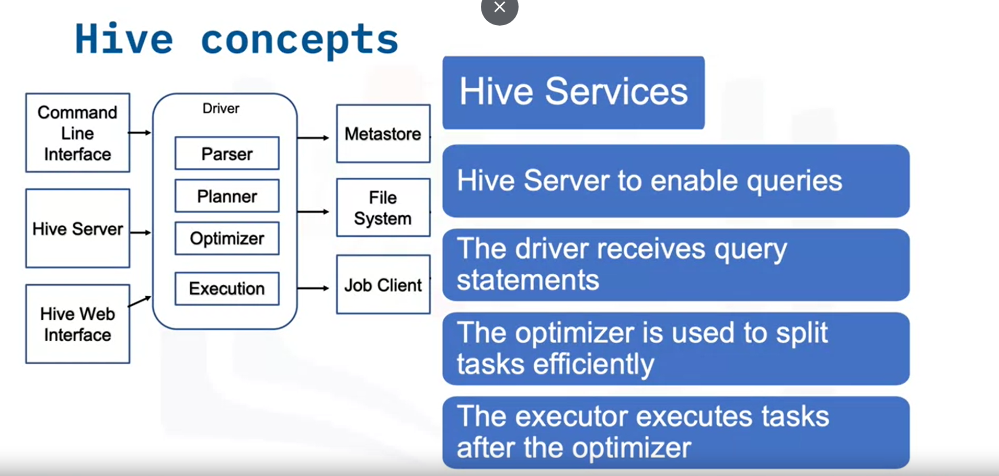
### Components in Hive Clients

- **JDBC Client**: Connects Java-based applications to Hive.
- **ODBC Client**: Connects ODBC protocol-based applications to Hive.

### Hive Services

- **Hive Server**: Runs queries and allows multiple clients to submit requests, supporting JDBC and ODBC clients.
- **Driver**: Receives and manages query statements, sending them to the compiler and optimizing execution plans.
- **Optimizer**: Performs transformations on execution plans and splits tasks for efficiency.
- **Executor**: Executes tasks after optimization.
- **Meta Store**: Central storage for metadata information about tables.

## Summary

In this video, you learned that:
- Hive is data warehouse software for managing datasets.
- Hive and traditional RDBMS are similar but have key differences.
- The three main parts of the Hive architecture are Hive Client, Hive Services, and Hive Storage and Computing.

