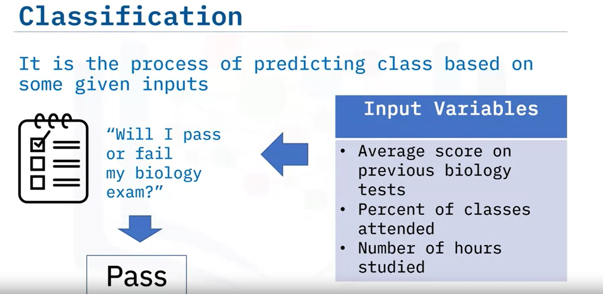

# Welcome to Introduction to Machine Learning for Everyone

After watching this video, you will be able to:

- Define the term machine learning.
- Explain how machine learning works.
- Describe use-cases of machine learning.
- Differentiate between AI, machine, and deep learning.
- List the different categories and branches of machine learning.

Machine learning is the subfield of computer science that gives "computers the ability to learn without being explicitly programmed.” Arthur Samuel, an American pioneer in the field of computer gaming and artificial intelligence, coined the term "machine learning" in 1959 while at IBM.

Let’s explore what “without being explicitly programmed” means. Assume that you have a data set of animal images such as cats and dogs, and you want to create a program that can recognize which images are cats and which images are dogs. You first interpret the images as a set of features. For example:

- Does the image show the animal’s eyes, and if so, what is the size?
- Does it have ears or a tail?
- How many legs?

Prior to machine learning, each image would be transformed into an ordered collection of features and then you define some rules or methods to teach the computers how to detect the animals. This approach failed. The rules were numerous, highly dependent on the current data set, and not generalized enough to detect out-of-sample cases. This is when machine learning entered the scene.

Machine learning lets you build a model that looks at all the feature sets and their corresponding types of animals to learn the patterns of each animal. So, machine learning algorithms, inspired by the human learning process, iteratively learn from data and allow computers to find hidden insights. These models are helpful in a variety of tasks, such as object recognition, summarization, recommendation, and so on.

This is a human cell sample extracted from a patient. The cell has many characteristics, for example, its clump thickness is 6, its uniformity of cell size is 1, its marginal adhesion is 1, and so on. An interesting question you can ask at this point is, “Is this a benign or malignant cell?” Unlike the cells of a benign tumor, a malignant tumor may invade its surrounding tissue or spread around the body and diagnosing it early might be the key to a patient’s survival.

You might think that only a doctor with years of experience could diagnose that tumor and say if the patient is developing cancer or not. Right? Imagine you have obtained a data set containing characteristics of thousands of human cell samples extracted from patients believed to be at risk of developing cancer. Analysis of the original data showed that many of the characteristics differed significantly between benign and malignant samples. You can use the values of these cell characteristics in samples from other patients to give an early indication of whether a new sample might be benign or malignant.

You should clean your data, select a proper algorithm for building a prediction model, and train your model to understand patterns of benign or malignant cells within the data. Once the model has been trained by iteratively going through data, it can be used to predict a new or unknown cell with rather high accuracy. This is machine learning! Accordingly, a machine learning model can perform a doctor’s task or at least help make the process faster.

Machine learning impacts society in a very influential way. Here are some real-life examples:

- Netflix and Amazon recommend videos, movies, and TV shows to their users, based on their knowledge of the types of shows they like to watch.
- Banks decide when to approve a loan application by using machine learning to predict the probability of default for each applicant and then approve or deny the loan application based on that probability.
- Telecommunication companies use their customers’ demographic data to segment them or predict if they will unsubscribe from their company in the next month.

There are many other applications of machine learning in our daily life, such as chatbots and computer games using face recognition. Each of these uses different machine learning techniques and algorithms.

By this point, you are probably wondering, “What is the difference between current buzzwords such as artificial intelligence (or AI), machine learning, and deep learning?” Well, let’s look at the differences:

- Briefly, AI tries to make computers intelligent enough to mimic humans’ cognitive functions. So, AI is a general field with a broad scope, including computer vision, language processing, creativity, and summarization.
- Machine learning (or ML) is the branch of AI that covers the statistical part of artificial intelligence. It teaches the computer to solve problems by looking at hundreds or thousands of examples, learning from them, and then using that experience to solve the same problem in new situations.
- Deep learning is an exceptional field of machine learning where computers can learn and make intelligent decisions independently. Deep learning involves a deeper level of automation in comparison to most machine learning algorithms.

The two categories for machine learning are supervised and unsupervised learning:

- Supervised learning uses labeled data to train your model. It can be split into two subcategories:
  - Regression techniques are used for predicting a continuous value. For example, predicting the price of a house based on its characteristics or estimating the CO2 emission from a car’s engine.
  - Classification techniques are used for predicting the class or category of a case. For example, if a cell is benign or malignant, or whether a customer will churn.
- Unsupervised learning uses unlabeled data and algorithms to detect patterns in the data. An example of unsupervised learning is clustering. Clustering algorithms are used to group similar cases, for example, they can be used to find similar patients or to segment bank customers.

Branches of the machine learning field include the following:

- Deep learning deals with algorithms inspired by the human brain and how humans learn.
- Natural language processing encompasses how a machine understands written or spoken human language.
- Computer vision deals with how computers see and understand digital images.
- Reinforcement learning includes teaching a machine to make decisions by rewarding desired actions and punishing undesired actions.

In this video, you learned that:

- Machine learning techniques teach computers to perform tasks without explicitly being programmed to do so.
- Machine learning can be used in industries such as banking and telecommunications and for generating Netflix and Amazon recommendations.
- The two machine learning categories are supervised and unsupervised learning.
- The branches of machine learning are deep learning, natural language processing, computer vision, and reinforcement learning.

# Welcome to Introduction to Machine Learning for Everyone

After watching this video, you will be able to:

- Define the term machine learning.
- Explain how machine learning works.
- Describe use-cases of machine learning.
- Differentiate between AI, machine, and deep learning.
- List the different categories and branches of machine learning.

Machine learning is the subfield of computer science that gives "computers the ability to learn without being explicitly programmed.” Arthur Samuel, an American pioneer in the field of computer gaming and artificial intelligence, coined the term "machine learning" in 1959 while at IBM.

Let’s explore what “without being explicitly programmed” means. Assume that you have a data set of animal images such as cats and dogs, and you want to create a program that can recognize which images are cats and which images are dogs. You first interpret the images as a set of features. For example:

- Does the image show the animal’s eyes, and if so, what is the size?
- Does it have ears or a tail?
- How many legs?

Prior to machine learning, each image would be transformed into an ordered collection of features and then you define some rules or methods to teach the computers how to detect the animals. This approach failed. The rules were numerous, highly dependent on the current data

set, and not generalized enough to detect out-of-sample cases. This is when machine learning entered the scene.

Machine learning lets you build a model that looks at all the feature sets and their corresponding types of animals to learn the patterns of each animal. So, machine learning algorithms, inspired by the human learning process, iteratively learn from data and allow computers to find hidden insights. These models are helpful in a variety of tasks, such as object recognition, summarization, recommendation, and so on.

This is a human cell sample extracted from a patient. The cell has many characteristics, for example, its clump thickness is 6, its uniformity of cell size is 1, its marginal adhesion is 1, and so on. An interesting question you can ask at this point is, “Is this a benign or malignant cell?” Unlike the cells of a benign tumor, a malignant tumor may invade its surrounding tissue or spread around the body and diagnosing it early might be the key to a patient’s survival.

You might think that only a doctor with years of experience could diagnose that tumor and say if the patient is developing cancer or not. Right? Imagine you have obtained a data set containing characteristics of thousands of human cell samples extracted from patients believed to be at risk of developing cancer. Analysis of the original data showed that many of the characteristics differed significantly between benign and malignant samples. You can use the values of these cell characteristics in samples from other patients to give an early indication of whether a new sample might be benign or malignant.

You should clean your data, select a proper algorithm for building a prediction model, and train your model to understand patterns of benign or malignant cells within the data. Once the model has been trained by iteratively going through data, it can be used to predict a new or unknown cell with rather high accuracy. This is machine learning! Accordingly, a machine learning model can perform a doctor’s task or at least help make the process faster.

Machine learning impacts society in a very influential way. Here are some real-life examples:

- Netflix and Amazon recommend videos, movies, and TV shows to their users, based on their knowledge of the types of shows they like to watch.
- Banks decide when to approve a loan application by using machine learning to predict the probability of default for each applicant and then approve or deny the loan application based on that probability.
- Telecommunication companies use their customers’ demographic data to segment them or predict if they will unsubscribe from their company in the next month.

There are many other applications of machine learning in our daily life, such as chatbots and computer games using face recognition. Each of these uses different machine learning techniques and algorithms.

By this point, you are probably wondering, “What is the difference between current buzzwords such as artificial intelligence (or AI), machine learning, and deep learning?” Well, let’s look at the differences:

- Briefly, AI tries to make computers intelligent enough to mimic humans’ cognitive functions. So, AI is a general field with a broad scope, including computer vision, language processing, creativity, and summarization.
- Machine learning (or ML) is the branch of AI that covers the statistical part of artificial intelligence. It teaches the computer to solve problems by looking at hundreds or thousands of examples, learning from them, and then using that experience to solve the same problem in new situations.
- Deep learning is an exceptional field of machine learning where computers can learn and make intelligent decisions independently. Deep learning involves a deeper level of automation in comparison to most machine learning algorithms.

The two categories for machine learning are supervised and unsupervised learning:

- Supervised learning uses labeled data to train your model. It can be split into two subcategories:
  - Regression techniques are used for predicting a continuous value. For example, predicting the price of a house based on its characteristics or estimating the CO2 emission from a car’s engine.
  - Classification techniques are used for predicting the class or category of a case. For example, if a cell is benign or malignant, or whether a customer will churn.
- Unsupervised learning uses unlabeled data and algorithms to detect patterns in the data. An example of unsupervised learning is clustering. Clustering algorithms are used to group similar cases, for example, they can be used to find similar patients or to segment bank customers.

Branches of the machine learning field include the following:

- Deep learning deals with algorithms inspired by the human brain and how humans learn.
- Natural language processing encompasses how a machine understands written or spoken human language.
- Computer vision deals with how computers see and understand digital images.
- Reinforcement learning includes teaching a machine to make decisions by rewarding desired actions and punishing undesired actions.

In this video, you learned that:

- Machine learning techniques teach computers to perform tasks without explicitly being programmed to do so.
- Machine learning can be used in industries such as banking and telecommunications and for generating Netflix and Amazon recommendations.
- The two machine learning categories are supervised and unsupervised learning.
- The branches of machine learning are deep learning, natural language processing, computer vision, and reinforcement learning.

# Welcome to the Role of Data Engineering in Machine Learning

After watching this video, you will be able to:

- Define data engineering in the domain of machine learning
- List the various responsibilities of data engineers in machine learning

Machine learning projects rely heavily on data engineering, which is responsible for designing, constructing, and overseeing the infrastructure and architecture required to support data storage, processing, and analysis. The data engineering process includes gathering, storing, processing, and managing data in a way that allows for efficient access, analysis, and utilization by data scientists, analysts, and other stakeholders. The accuracy and dependability of the data used to train the models are critical factors in ensuring a machine learning project's success.

Data engineers are responsible for comprehensive, precise, and relevant data availability in machine learning projects. They are also responsible for acquiring data from different sources and following a series of critical steps in the data collection process.

First, they establish the data requirements for the analysis or decision-making process, specifying the types of data needed, such as structured or unstructured, and the data sources, such as internal or external. Next, data engineers identify specific sources such as databases, APIs, web scraping, or manual data entry. They also evaluate the quality, relevance, reliability, accessibility, and cost of the data from these sources. Finally, data engineers collect the data from the identified sources using techniques like database querying, web scraping, or manual data entry. Throughout this process, they ensure consistency and structure in the collected data to facilitate analysis and decision-making.

Raw data often needs cleaning and preprocessing to ensure optimal performance of machine learning models and address missing values, errors, and outliers. Data engineers play a crucial role in preparing the data for model training, ensuring its accuracy, completeness, consistency, and analysis readiness. Preparing the data involves several stages:

1. **Data Exploration**: This stage involves examining the data to identify anomalies like missing values, inconsistencies, or outliers.
2. **Data Cleaning**: In this stage, errors or inconsistencies in the data are corrected or removed. Tasks can include eliminating duplicates, correcting typos, filling in missing values, and addressing outliers.
3. **Data Transformation**: The data is transformed into a suitable format for analysis. Techniques like normalization, scaling, and feature selection can be applied.
4. **Data Integration**: Data from various sources is combined into a unified dataset for analysis. Techniques like merging, joining, or concatenating data are employed.
5. **Data Formatting**: This stage focuses on formatting the data appropriately for analysis purposes, such as converting text or dates into numerical formats.

Data engineers are also responsible for designing and implementing data storage solutions that can handle the volume and velocity of data required by machine learning models. They ensure that the data is stored in suitable, usable formats, such as structured databases, unstructured data stores, or cloud-based storage solutions. The key stages of data storage and management include:

1. **Storing Data**: Data engineers identify the appropriate type of storage for the data based on its characteristics. This stage also involves selecting and configuring storage systems that can handle the scale and speed of data ingestion.
2. **Organizing Data**: After choosing the storage solution, data engineers logically and efficiently organize the data. These tasks include designing data schemas, partitioning strategies, and indexing mechanisms to optimize data retrieval.
3. **Securing Data**: Data engineers implement security measures to protect sensitive data from unauthorized access or manipulation. They establish access controls, encryption techniques, and backup strategies to ensure data security and recoverability in case of a breach.
4. **Retrieving Data**: Data engineers enable efficient data retrieval by implementing mechanisms for querying and accessing the stored data. They optimize data retrieval performance through indexing, caching, and data distribution strategies.
5. **Backing Up and Recovering Data**: To prevent data loss or corruption, data engineers establish regular data backup processes. They create data backups and implement recovery mechanisms to restore the data in case of unexpected incidents.

Data engineers are responsible for performing various tasks to transform and extract features from the original dataset, enhancing its usefulness for analysis and machine learning. The key steps involved in data transformation and feature extraction are:

1. **Feature Selection**: Identify the most relevant features from the original dataset that are informative for analysis or machine learning tasks. This selection process helps focus on the essential aspects of the data.
2. **Scaling Features**: Data engineers scale the features to a common scale. Scaling ensures that the features are comparable and avoids bias towards features with larger values.
3. **Deriving New Features**: Data engineers apply techniques such as creating interaction terms, polynomial features, or feature binning to derive new features from the existing ones. This step enhances the data set by capturing additional patterns and relationships.
4. **Dimensionality Reduction**: Data engineers reduce the number of features while preserving the most important information. Techniques like Principal Component Analysis (PCA) or feature extraction algorithms help compress the data while maintaining its essential characteristics.
5. **Encoding Categorical Features**: Data engineers convert categorical features into numerical representations suitable for analysis or machine learning algorithms. Data engineers employ one-hot or label encoding methods to transform categorical variables into numeric forms.
6. **Handling Missing Values**: Data engineers handle missing values in the dataset by imputing those values using techniques like mean imputation or interpolation. This work ensures that the dataset is complete and ready for analysis.

In this video, you learned that:

- Data engineering is essential for machine learning projects, providing the infrastructure and architecture for data storage, processing, and analysis.
- Data engineers ensure comprehensive, precise, and relevant data availability in machine learning projects.
- Data engineers play a crucial role in cleaning and preprocessing raw data for machine learning models, ensuring accuracy, completeness, consistency, and analysis readiness.
- Data engineers design and implement scalable data storage solutions for machine learning models, ensuring accessible and usable data formats.
- Data engineers perform tasks to transform and extract features from datasets, enhancing their usefulness for analysis and machine learning.

# Welcome to Supervised vs Unsupervised Learning

After watching this video, you will be able to:

- Define Supervised and Unsupervised Learning.
- List examples of supervised and unsupervised machine learning use cases.
- Define Clustering.
- Differentiate between Supervised and Unsupervised Learning.

## Supervised Learning

An easy way to begin grasping the concept of supervised learning is by looking directly at the words that make it up. **Supervise** means to observe and direct the execution of a task, project, or activity. We aren’t going to be supervising a person. Instead, we’ll be supervising a machine learning model that might be able to produce a classification of a data set into its respective regions as we see here.

So, how do we supervise a machine learning model? We do this by “teaching” the model. We load the model with the knowledge to predict future instances. But this leads to the next question: “How exactly do we teach a model?” We teach the model by training it with some data from a **labeled data set**.

A labeled data set categorizes data into classes. For example, if we had data about cancer, labels could include ‘benign’ or ‘malignant.’ As you can see, we have some historical data for patients, and we know the class of labels of each row.

Let's introduce some components of this table:

- The names up here, which are called clump thickness, uniformity of cell size, uniformity of cell shape, marginal adhesion, and so on, are called **features**.
- The columns are called features or input variables, including the data. If you plot this data and look at a single data point on a plot, it will have all these attributes. These attributes form a row on this chart, also referred to as an **observation**.

### Data Types in Machine Learning

- **Numerical**: When dealing with machine learning, this is the most used data type.
- **Categorical**: Non-numeric data because it contains characters rather than numbers. In this case, it’s categorical because this data set is made for classification.

### Types of Supervised Learning Techniques

1. **Classification**: The process of predicting a class label or category. For example, “Will I pass or fail my biology test?” There are only two outcomes, and I can only be bucketed in one at a time; for example, either I will pass, or I will fail the exam.

2. **Regression**: The relationship between a dependent and an independent variable. The dependent variable is a continuous variable that we want to predict, and the independent variables are the variables that we believe influence the value of the dependent variable. Unlike classification, the outcome that we want to predict is a continuous variable rather than a categorical value.

### Example of Regression

Assume we want to predict the CO2 emissions of a new car that is not listed in this data set. CO2 emission is the dependent variable because it is what we want to predict, and it is a continuous variable. We know the values of its engine size, cylinders, and fuel consumption; these are the independent variables because we believe these variables influence the CO2 emission. Given this data set and the information you have based on the independent variable, you can calculate a regression line to predict the CO2 emission of a car.

## Unsupervised Learning

Since we know the meaning of supervised learning, what do you think unsupervised learning means? **Unsupervised learning** is precisely as it sounds. We do not supervise the model, but we allow it to work independently to discover patterns and structures in the data that may not be visible to the human eye. This means that the unsupervised algorithm trains on the data set and draws conclusions based on the unlabeled data on its own.

Unsupervised learning uses more difficult algorithms than supervised learning because we know little to no information about the data or the outcomes that are to be expected.

### Unsupervised Learning Techniques

1. **Dimension Reduction**: Reducing redundant features to make the classification easier.
2. **Density Estimation**: Mainly used to explore the data and find some structure.
3. **Market Basket Analysis**: A modeling technique based on the theory that if you buy a particular group of items, you are more likely to buy another group of items.
4. **Clustering**: Grouping data points or objects that are somehow similar by the characteristics of the data.

## Clustering

Since clustering is one of the most popular unsupervised machine learning techniques, let us look at it more in-depth. Clustering works by grouping data points or objects that are somehow similar by the characteristics of the data. Clustering is mainly used for:

- Discovering the structure of the data
- Summarizing the data
- Detecting anomalies within a data set

Cluster analysis has many applications in different domains, whether helping a bank segment its customers, based on specific characteristics, or assisting an individual group with their favorite types of music!

## Recap

The most significant difference between supervised and unsupervised learning is that supervised learning deals with labeled data while unsupervised learning deals with unlabeled data.

- In supervised learning, we have machine learning algorithms for classification and regression.
- In unsupervised learning, we have methods such as clustering.
- In comparison to supervised learning, unsupervised learning has fewer models and fewer evaluation methods that can be used to ensure that the outcome of the model is accurate. As such, unsupervised learning creates a less controllable environment as the machine creates outcomes for us.

## Key Takeaways

- In supervised machine learning, we use labeled data to train our model.
- In unsupervised machine learning, we use unlabeled data to train our model and allow the model to work independently to discover patterns and structures in the data that may not be visible to the human eye.
- There are two types of supervised learning techniques: classification and regression.
- Clustering is a grouping of data points or objects that are somehow similar.

By understanding the differences and applications of supervised and unsupervised learning, you can better determine which method to use for various data analysis and machine learning tasks.

# Welcome to Regression

After watching this video, you will be able to:

- Define key concepts in regression.
- List some common regression algorithms.
- Interpret the results of regression.
- Differentiate between classification and regression.
- Determine whether classification or regression is suitable for your problem type.

## Introduction to Regression

To begin, consider the following scatter plot. Assume you have midterm grades on the x-axis and final grades on the y-axis, and you have plotted the points associated with each grade. Now, you want to know the final exam scores of students who had a score of 35 on their midterm. You can guess that their final score will be very close to 40. What if you wanted to guess a final score for a student whose midterm grade falls outside the range of the plotted points? Say, a student who got 80? Okay, you guess. I will guess around 85. Let’s look at the data set. For a student who scored 80 on the midterm, the original data set has a final score of 86.5, close to what I guessed.

The previous example was a regression analysis. Basically, you can fit a line through the data and make an educated guess for values within or outside the range of the data set. This line is called the **line of best fit**. Simply put, regression is the relationship between a dependent and independent variable. In regression, the dependent variable is a continuous variable. Examples of regression include predicting the prices of houses, predicting scores on a final exam, predicting the weather, and so on.

### The Line of Best Fit

Looking at our line again, you can use a formula to predict values that are not accounted for. The formula for this line is \( y = mx + b \).

- \( m \) is the slope of the line calculated as rise over run.
- Let’s calculate \( m \). You can choose random rise and run points as any two points on this line will give you the same result for \( m \).

**Example Calculation:**

- Rise = \( 76 - 55 \)
- Run = \( 70 - 50 \)
- Slope \( m \) = \( \frac{76 - 55}{70 - 50} = 1.05 \)

This means that for every 1 mark increase in a midterm grade, the final exam score will increase by 1.05.

- \( b \) is the y-intercept, that is, where the line meets the y-axis. Mathematically speaking, it is the value of y when x is 0.
- If you substitute x as zero into the \( y = mx + b \) equation, you will see that the y-intercept is 2.5.

This means that even if a student gets a 0 on the midterm, they will still get a 2.5 on the final exam.

### Types of Regression

The examples that you have seen assume a linear relationship between the dependent and independent variable, which is the simplest form of regression. Sometimes you may have multiple independent variables predicting your dependent variable. For example, in the final exam problem, you can have more variables that predict the outcome of the final exam score. You may have two variables instead, such as midterm score and attendance percentage. In this case, you would be dealing with a 3D graph with two slopes: one for the relationship between midterm score and final score, and one for attendance percentage and final score.

Now, imagine you have 10 variables. Sometimes, you may have a non-linear relationship and the linear regression model won't do well with a straight line. An example of that is polynomial regression. This model uses a polynomial of degree two to account for the nonlinear relationship. When you want to avoid too much reliance on the training data, you can use regularized regression, such as Ridge, Lasso, and ElasticNet. The main idea here is to constrain the slope of the independent variables to zero by adding a penalty.

- **Ridge Regression**: Shrinks the coefficients by the same factor but doesn’t eliminate any of the coefficients.
- **Lasso Regression**: Shrinks the data values toward the mean, which normally leads to a sparser model and fewer coefficients.
- **ElasticNet Regression**: The optimal combination of Ridge and Lasso that adds a quadratic penalty.

### Advanced Regression Techniques

The following are popular examples of advanced regression techniques:

- **Random Forest**: A group of decision trees combined into a single model.
- **Support Vector Regression (SVR)**: Creates a line or a hyperplane that separates the data into classes.
- **Gradient Boosting**: Makes predictions by using a group of weak models like decision trees.
- **Neural Networks**: Inspired by the neurons in the brain used to make predictions.

## Classification vs Regression

Here are some differences between classification and regression:

- **Classification**:
  - Works with classes such as ”Will I pass or fail?” or “Is this email spam or not spam?”
  - Values are not ordered; belonging to one class doesn’t necessarily make a value more or less superior.
  - Performance is measured using accuracy, that is, how many you predicted correctly from the total population.

- **Regression**:
  - Mapped to a continuous variable.
  - Values are ordered, and higher numbers have more value than lower numbers.
  - Performance is measured using the error term, that is, how far away you were from the actual predictions.

## Key Takeaways

- One key concept of regression is that it is the relationship between a dependent and independent variable.
- Some common algorithms for regression include random forests, SVR, and neural networks.
- A difference between classification and regression is that classification works with classes while regression is mapped to a continuous variable.

By understanding these concepts, you can better determine whether classification or regression is suitable for your problem type.

# Predicting Annual Salary Based on Years of Experience Using Linear Regression

In this example, we are trying to predict the annual salary (in thousands of dollars) of employees based on their years of experience. We have the following dataset:

| Years of Experience (x) | Salary (y) |
|-------------------------|------------|
| 1                       | 45         |
| 2                       | 50         |
| 3                       | 55         |
| 4                       | 60         |
| 5                       | 65         |

## Linear Regression Model

The relationship between the years of experience \( x \) and the salary \( y \) can be modeled using a simple linear equation:

\[ y = mx + b \]

where:

- \( y \) is the dependent variable (salary in this case).
- \( x \) is the independent variable (years of experience).
- \( m \) is the slope of the line.
- \( b \) is the intercept.

### Understanding the Slope (\( m \))

The slope (\( m \)) represents the rate of change of the dependent variable \( y \) with respect to the independent variable \( x \). In simpler terms, it tells us how much the salary changes for each additional year of experience. Mathematically, the slope is calculated as:

`m = change in y / change in x = Δy/Δx]`

Using the given dataset, let's calculate the slope. Considering the change from 1 year of experience to 2 years of experience:

 `m = 50 - 45/2 - 1 = 5/1 = 5`

This means that for each additional year of experience, the salary increases by $5000.

### Understanding the Intercept (\( b \))

The intercept (\( b \)) represents the value of the dependent variable (\( y \)) when the independent variable (\( x \)) is zero. In this context, it is the predicted salary for an employee with 0 years of experience.

To find the intercept, we use the equation of the line with one of the points from our dataset. Let's use the points (1, 45):

\[ y = mx + b \]

Substituting the known values:

\[ 45 = 5(1) + b \]

\[ 45 = 5 + b \]

\[ b = 45 - 5 = 40 \]

So, the intercept \( b \) is 40. This means the model predicts that an employee with 0 years of experience would have a salary of $40,000.

### Final Model

Putting it all together, the linear regression model for our dataset is:

\[ y = 5x + 40 \]

### Using the Model

Now, let's use this model to make predictions. For example, to predict the salary of an employee with 3 years of experience:

\[ y = 5(3) + 40 = 15 + 40 = 55 \]

So, the predicted salary for an employee with 3 years of experience is $55,000, which matches our dataset.

## Visualization

Let's create a visual representation of the data points and the regression line using the provided data and the regression equation \( y = 5x + 40 \).

### Visualization Description

- **Data Points (Blue Dots)**: Each dot corresponds to an employee's salary based on their years of experience.
- **Regression Line (Red Line)**: This line represents our model's prediction, showing the relationship between experience and salary.

Next, we can plot the data points and the regression line using Python and a library like Matplotlib to create a visual representation.

Would you like me to generate this plot for you?

# Classification in Machine Learning

Welcome to the topic of Classification. After watching this video, you will be able to:

1. Define key concepts of classification.
2. List the types of classification.
3. List some common classification algorithms.
4. Evaluate the accuracy and results of a classification model.
5. Differentiate between classification and regression.
6. Determine whether classification or regression is suitable for your problem type.

## Introduction to Classification

Classification and regression are two types of prediction problems in machine learning and data science.

- **Classification** answers the question: "What category does this fall into?"
  - Example: "Will I pass or fail my biology exam?" This is a binary classification problem because there are two possible outcomes: pass or fail.

- **Regression** answers the question: "What will my biology exam score be?"
  - Example: Determining how hours of sleep and studying impact biology exam scores.

## Key Concepts in Classification

### Definition

Classification is the process of predicting an outcome, known as a "class," based on given inputs (features).

### Input Variables (Features)

Input variables, or features, are used to make predictions. For example:

- Average score on previous biology tests
- Percent of classes attended
- Number of hours studied

These features help predict whether the outcome will be "pass" or "fail."

### Types of Classification

- **Binary Classification**: When there are only two classes.
  - Example: Predicting if an email is spam or not spam.
  
- **Multiclass Classification**: When there are three or more classes.
  - Example: Predicting handwritten digits from 0 to 9 or predicting the type of fruit (apple, orange, mango).

## Important Terminologies

- **Classifier**: A machine learning algorithm used to solve the classification problem.
- **Feature**: An independent variable used as an input in the model.
- **Evaluation**: Validating how well a model has performed.

## Types of Classification Algorithms

### Lazy Learners

Lazy learners do not have a training phase and wait to receive a test dataset before making predictions. They do not generalize the model, which results in longer prediction times. A popular example is the **k-nearest neighbor (KNN)** algorithm.

#### k-Nearest Neighbor (KNN)

- KNN classifies unknown data points by finding the most common classes among the k-nearest examples.
- Example: Predicting if a student will pass or fail based on the proximity of their features to other students.

### Eager Learners

Eager learners spend a lot of time training and generalizing the model, resulting in faster predictions on the test dataset. Examples include:

#### Logistic Regression

- Used to predict the probability of a class.
- Example: Predicting the probability of passing or failing a biology exam based on class attendance.

#### Decision Trees

- Tree-like algorithms that use "if-then" rules to classify data.
- Example: Classifying if a student will pass or fail based on certain rules.

### Advanced Algorithms

- **Support Vector Machines (SVM)**
- **Naive Bayes**
- **Discriminant Analysis**
- **Neural Networks**

## Differences Between Classification and Regression

- **Classification**: Deals with predefined classes (e.g., pass/fail, spam/not spam).
- **Regression**: Deals with continuous variables (e.g., exam scores, house prices).
- **Performance Evaluation**:
  - **Classification**: Accuracy (how many predictions were correct).
  - **Regression**: Error term (how far predictions were from actual values).

## Conclusion

In this video, you learned:

1. Classification and regression are two types of prediction problems in machine learning.
2. Classification deals with predefined classes, while regression deals with continuous variables.
3. Key terminologies in classification include classifier, feature, and evaluation.
4. Common classification algorithms are KNN, logistic regression, and decision trees.

# Evaluating Machine Learning Models

Welcome! After watching this video, you will be able to:

- Define train/test split.
- Evaluate classification models using accuracy, a confusion matrix, precision, and recall.
- Interpret a confusion matrix.
- Evaluate a regression model using mean squared error and other error terms.
- Define R-squared in the context of variance and goodness of fit.

## Train/Test Split

Before evaluating machine learning models, split your data into:

- **Training set**: Used to teach the model with examples.
- **Test set**: Used to evaluate the model's performance.

## Classification Evaluation

### Accuracy

To calculate accuracy:

1. **Example**: Predicting pass/fail for a biology test.
2. Calculate: Correct predictions / Total predictions.
3. **Confusion Matrix**: Table comparing predicted vs. actual values.
   - **True Positive (TP)**: Predicted pass and it was pass.
   - **True Negative (TN)**: Predicted fail and it was fail.
   - **False Positive (FP)**: Predicted pass but it was fail.
   - **False Negative (FN)**: Predicted fail but it was pass.

### Precision

- **Definition**: True positives / (True positives + False positives).
- **Example**: Movie recommendation engine to reduce the cost of false positives.

### Recall

- **Definition**: True positives / (True positives + False negatives).
- **Example**: Medical field to reduce the cost of false negatives.

### F1-Score

- **Definition**: Harmonic mean of precision and recall.
- **Usage**: Balance between precision and recall.

## Regression Evaluation

### Mean Squared Error (MSE)

- **Definition**: Average of squared differences between prediction and true values.
- **Goal**: Minimize MSE for better predictions.

### Root Mean Squared Error (RMSE)

- **Definition**: Square root of MSE, same unit as the target variable.
- **Interpretation**: Easier to interpret than MSE.

### Mean Absolute Error (MAE)

- **Definition**: Average of absolute errors.

### R-Squared

- **Definition**: Amount of variance in the dependent variable explained by the independent variable.
- **Range**: 0 (bad fit) to 1 (perfect fit).

## Summary

- Split your data into training and test sets.
- Use a confusion matrix to measure classification performance.
- MSE helps evaluate regression models.
- R-squared shows the variance explained by the model.

[FYI for more info](https://cf-courses-data.static.labs.skills.network/3NBHt9Lywc7DJntRVgNbIA/EvaluationMetrics-v1.md.html?origin=www.coursera.org)

## Clustering in Machine Learning: An Overview

**Introduction:**

- **Clustering** is the process of grouping unlabeled examples to identify patterns or connections in data. It utilizes unsupervised machine learning techniques.

**Key Concepts:**

- **Unsupervised Learning:** Learning from data without labeled responses.
- **Similarity/Distance:** The basis on which data points are grouped into clusters.

**Applications of Clustering:**

1. **Customer Segmentation:** Grouping customers based on purchase history and demographics to tailor marketing strategies.
2. **Image Segmentation:** Categorizing images based on color and content for image analysis and computer vision.
3. **Anomaly Detection:** Identifying unusual or abnormal data points, useful in fraud detection and cybersecurity.
4. **Document Clustering:** Grouping documents with similar content for better information retrieval and organization, such as sorting news articles.
5. **Recommendation Systems:** Grouping similar items or products to provide personalized recommendations to users in e-commerce.

**Types of Clustering Algorithms:**

1. **Partitioning Clustering:**
   - *Description:* Divides the dataset into k clusters, where k is a parameter specified by the user.
   - *Algorithms:* K-means, K-medoids.

2. **Hierarchical Clustering:**
   - *Description:* Creates a hierarchy of clusters, where each level represents a different granularity.
   - *Algorithms:* Agglomerative clustering (bottom-up approach), Divisive clustering (top-down approach).

3. **Density-based Clustering:**
   - *Description:* Identifies clusters as dense regions of data points separated by lower density areas.
   - *Algorithms:* DBSCAN (Density-Based Spatial Clustering of Applications with Noise), OPTICS (Ordering Points to Identify the Clustering Structure).

**The K-means Algorithm:**

- **Overview:** A popular and efficient partitioning clustering algorithm.
- **Steps:**
  1. **Initialization:** Randomly select k initial cluster centroids from the dataset.
  2. **Assignment:** Assign each data point to the closest centroid based on Euclidean distance.
  3. **Recalculation:** Compute the mean of the data points in each cluster to find new centroids.
  4. **Reassignment:** Reassign data points to the new closest centroids.
  5. **Iteration:** Repeat steps 3 and 4 until the cluster assignments no longer change.

**Summary:**

- Clustering helps in uncovering patterns and connections in data without requiring labeled examples.
- It is widely used across various industries for applications like customer segmentation, image analysis, anomaly detection, document organization, and recommendation systems.
- There are different types of clustering algorithms, each suited to specific needs and data characteristics.
- The K-means algorithm is a straightforward and commonly used method for partitioning clustering, involving iterative refinement of cluster centroids and data point assignments.

This overview provides a foundational understanding of clustering, its applications, types, and the workings of the K-means algorithm.

**Generative AI Overview and Use Cases**

**Introduction:**

- **Artificial Intelligence (AI):** Augmented Intelligence that enables experts to scale their capabilities while machines handle time-consuming tasks like recognizing speech, playing games, and making decisions.
- **Generative AI (GenAI):** An AI technique capable of creating new and unique data, such as images, music, text, and virtual worlds. Unlike conventional AI models that rely on predefined rules and patterns, Generative AI uses deep learning techniques and vast datasets to generate new data.

**Key Concepts:**

- **Deep Learning:** A subset of machine learning involving neural networks with many layers, enabling the creation of complex models.
- **Large Language Models (LLM):** AI models based on deep learning techniques designed to process and generate natural language. Generative AI can develop new LLM algorithms or integrate them into larger AI systems for tasks like decision-making and creative work.

**Significance of Generative AI:**

- **Creativity and Innovation:** Generates new and original content, fostering creativity.
- **Cost and Time Savings:** Automates content creation and other processes, reducing costs and time.
- **Personalization:** Tailors content and recommendations to individual preferences.
- **Scalability:** Handles large volumes of data and tasks efficiently.
- **Robustness:** Adapts to various tasks and conditions.
- **Exploration of New Possibilities:** Opens up new avenues for innovation and problem-solving.

**Use Cases of Generative AI:**

1. **Healthcare and Precision Medicine:**
   - Identifies genetic mutations and provides tailored treatments.
   - Produces medical images, simulates surgeries, and predicts drug properties to aid in treatment development.

2. **Agriculture:**
   - Optimizes crop yields and creates robust plant varieties that withstand environmental stressors, pests, and diseases.

3. **Biotechnology:**
   - Develops new therapies and drugs by identifying potential drug targets, simulating drug interactions, and forecasting drug efficacy.

4. **Forensics:**
   - Analyzes DNA evidence and identifies suspects to solve crimes.

5. **Environmental Conservation:**
   - Protects endangered species by analyzing genetic data and suggesting breeding and conservation strategies.

6. **Creative Fields:**
   - Produces unique digital art, music, and video content for advertising, marketing, films, and video games.

7. **Gaming:**
   - Creates interactive game worlds by generating new levels, characters, and objects that adapt to player behavior.

8. **Fashion:**
   - Designs virtual try-on experiences and recommends personalized fashion choices based on customer behavior and preferences.

9. **Robotics:**
   - Designs new robot movements and adapts them to changing environments for performing complex tasks.

10. **Education:**
    - Creates customized learning materials and interactive environments that adjust to students' learning styles and paces.

11. **Data Augmentation:**
    - Produces new training data for machine learning models to enhance their accuracy and performance.

**Summary:**

- Generative AI is a powerful technique capable of creating new and unique data, surpassing traditional AI models in creativity, cost and time savings, personalization, scalability, robustness, and exploring new possibilities.
- It has the potential to transform various industries, improve lives, and perform a wide range of tasks, similar to human intelligence in flexibility and adaptability.

**Generative AI Applications**

**Introduction:**

- Generative AI is a powerful technology that enables software applications to create, generate, and simulate new content, enhancing their capabilities and providing unique experiences.
- Unlike traditional software that follows predefined rules and algorithms, Generative AI leverages machine learning and deep learning techniques to learn patterns and generate original content based on the knowledge it has acquired during training.
- Due to its potential to create new, personalized content that would have been impossible to create otherwise, Generative AI has been used in various fields, leading to the development of numerous engaging and well-liked applications.

**Popular Applications of Generative AI:**

1. **Generative Pre-trained Transformers (GPT):**
   - **Description:** GPT is a family of large language models developed by OpenAI capable of producing human-like text.
   - **Applications:** Chatbots (like ChatGPT), automated journalism, creative writing.
   - **Examples:** GPT-3.5 and GPT-4, with more advanced models under development.

2. **ChatGPT:**
   - **Description:** A chatbot or conversational AI tool by OpenAI that enables users to have text-based conversations with the underlying language model, GPT.
   - **Capabilities:** Generating human-like responses, providing information, answering questions, assisting with tasks, engaging in creative writing, offering suggestions across various subjects.
   - **Usage:** Customer support, personal assistants, educational tools.

3. **Bard:**
   - **Description:** An AI-powered writing assistant from Google that helps users produce high-quality writing for communication documents like emails and social media posts.
   - **Model Used:** LaMDA (Language Model for Dialogue Applications).
   - **Capabilities:** Generating text, adjusting to user preferences for style and tone.

4. **Watsonx by IBM:**
   - **Description:** An AI and data platform comprising Watsonx.ai for model development, Watsonx.data for scalable analytics, and Watsonx.governance for responsible AI workflows.
   - **Capabilities:** Building, deploying, and managing AI applications at scale.
   - **Usage:** Enhancing AI impact across organizations.

5. **DeepDream:**
   - **Description:** A generative model that creates surreal and psychedelic images from real-life images.
   - **Usage:** Art and entertainment, producing unique and visually stunning images.

6. **StyleGAN:**
   - **Description:** A generative model capable of producing high-quality images of faces that do not exist in reality.
   - **Applications:** Creating realistic video game avatars, simulating human faces for medical research.

7. **AlphaFold:**
   - **Description:** A generative model that can predict protein structure.
   - **Impact:** Transforming drug discovery, developing more effective treatments for diseases.

8. **Magenta:**
   - **Description:** A Google project that creates music and art using generative AI.
   - **Examples:** AI-generated piano duets performed with humans.
   - **Impact:** Producing intriguing and impressive creative results.

9. **PaLM 2 by Google AI:**
   - **Description:** A powerful LLM trained on a dataset ten times larger than previous models.
   - **Capabilities:** Understanding nuances, generating coherent text and code, translating, answering questions.
   - **Future Impact:** Revolutionizing human-computer interactions, enhancing accuracy, efficiency, creativity, and communication.

10. **GitHub Copilot:**
    - **Description:** An AI-powered coding assistant developed by OpenAI and GitHub.
    - **Capabilities:** Helping developers write code more efficiently, auto-completing code snippets, suggesting functions based on context.
    - **Impact:** Improving coding efficiency and productivity.

**Conclusion:**

- Generative AI is a rapidly evolving space with significant growth potential in the coming years.
- Ethical concerns include potential misuse of AI-generated content and implications for intellectual property and copyright laws.
- Generative AI enables applications to create, generate, and simulate new content, leveraging machine learning and deep learning techniques to learn patterns and generate original content.
- Notable applications of Generative AI include GPT-4, ChatGPT, Bard, GitHub Copilot, and PaLM 2.
