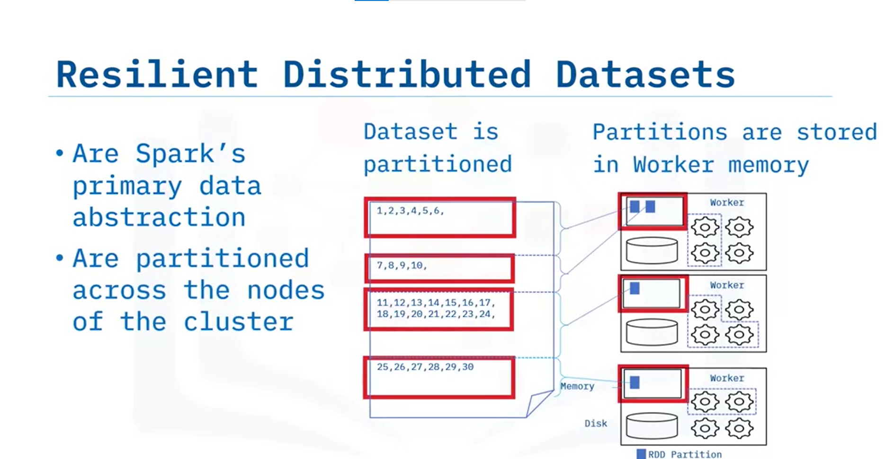
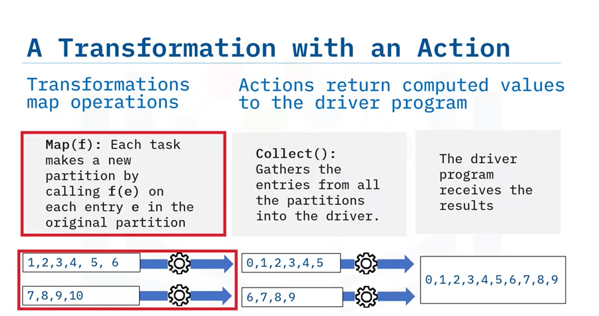
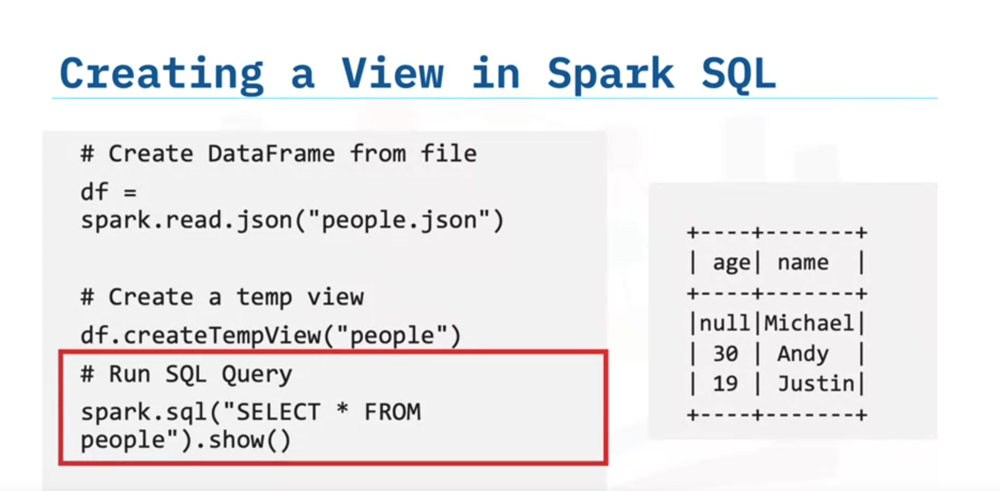
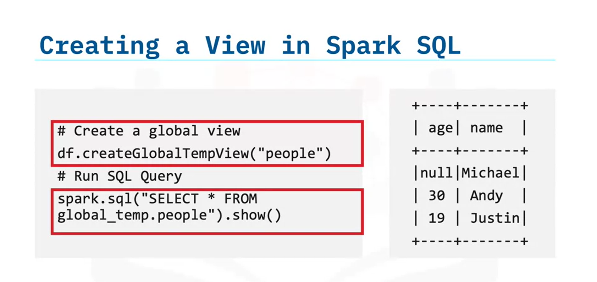
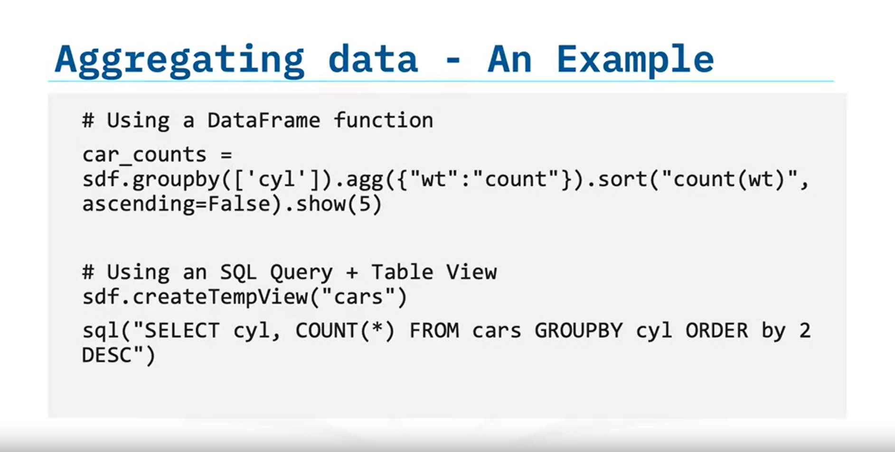

# Why Use Apache Spark

Welcome to "Why Use Apache Spark." After watching this video, you will be able to:

- Describe Apache Spark attributes
- Describe distributed computing
- List the benefits of Apache Spark and distributed computing
- Compare and contrast Apache Spark to MapReduce

## Overview of Apache Spark

- **Open-Source**: Spark is available under the Apache Foundation.
- **In-Memory**: All operations happen within the memory (RAM).
- **Distributed Data Processing**: Spark processes data across multiple machines.
- **Scalability**: Spark scales well with large datasets.
- **Programming Language**: Spark is primarily written in Scala and runs on Java virtual machines.

## What is Distributed Computing?

- **Definition**: A group of computers or processors working together.
- **Parallel vs. Distributed Computing**:
  - Parallel computing shares all memory.
  - Distributed computing has each processor access its own memory.


## Benefits of Distributed Computing


1. **Scalability and Modular Growth**:
   - Distributed systems can scale horizontally by adding more machines.
2. **Fault Tolerance and Redundancy**:
   - Systems continue to function even if some nodes fail, ensuring business continuity.

## Spark and Distributed Computing

- **Spark Advantages**:
  - Large-scale data processing and analysis.
  - Parallel distributed data processing.
  - Scalability and fault-tolerance on commodity hardware.
  - In-memory processing for efficiency.
  - Flexible programming with Python, Scala, and Java APIs.

## Comparing Apache Spark to MapReduce


- **MapReduce**:
  - Iterative jobs require reads and writes to disk or HDFS.
  - Disk I/O operations are time-consuming and expensive.
- **Apache Spark**:
  - Keeps much of the data in-memory.
  - Avoids expensive disk I/O.
  - Reduces overall processing time significantly.

## Spark's Applications

- **Data Engineering**:
  - Core Spark engine, cluster management, SparkSQL, and DataFrames.
- **Data Science and Machine Learning**:
  - Libraries like SparkML and Streaming for advanced analytics.


# Functional Programming Basics

Welcome to "Functional Programming Basics!" After watching this video, you will be able to:

- Explain the term functional programming
- Explain Lambda functions
- Relate functional programming with Apache Spark

## What is Functional Programming?

Functional Programming (FP) is a style of programming that follows the mathematical function format. Think of an algebra class with the f(x) notation.


### Key Characteristics of Functional Programming

- **Declarative Nature**: Emphasis on the "what" of the solution rather than the "how to."
- **Expressions**: Use expressions like f(x).

### Historical Background

- **LISP**: The first functional programming language, starting in the 1950s.
- **Modern Languages**: Scala, Python, R, and Java are some of the modern options.

## Functional Programming in Scala


- **Scala**: The most recent representative in the family of functional programming languages.
- **First-Class Functions**: Functions can be passed as arguments, returned by other functions, and used as variables.

### Example


```scala
val increment = (x: Int) => x + 1
val numbers = List(1, 2, 3, 4)
val incrementedNumbers = numbers.map(increment)
```

This program increments each element in the list by one.

## Imperative vs. Functional Programming

### Imperative Paradigm

- Uses explicit steps to perform tasks.
- Example: Using a "for-loop" to increment each element in an array.

### Functional Paradigm

- Emphasizes the "what" part of the solution.
- Directly applies functions to entire lists or arrays.

## Benefits of Functional Programming

### Parallelization

- Functional programming allows tasks to be split into multiple computing chunks (nodes) and run in parallel.
- No need to change function definitions or code to parallelize.

### Example

- Incrementing a large array from 1 to 9 by splitting the task into three nodes running in parallel.

## Lambda Calculus

- **Lambda Calculus**: A mathematical concept where every computation is expressed as an anonymous function applied to a data set.
- **Lambda Functions**: Anonymous functions used to write functional programming code.

### Example in Scala and Python

#### Scala

```scala
val add = (a: Int, b: Int) => a + b
```

#### Python

```python
add = lambda a, b: a + b
```

Both examples abstract the result directly, a hallmark of the declarative paradigm.

## Functional Programming and Apache Spark


- **Parallelization**: Spark parallelizes computations using lambda functions.
- **Scalability**: Spark programs are inherently parallel, capable of scaling from one kilobyte to one petabyte by adding more resources to the Spark cluster.

## Key Takeaways

- Functional programming follows a declarative model emphasizing "What" instead of "how to" and uses expressions.
- Lambda functions are anonymous functions that enable functional programming.
- Spark parallelizes computations using lambda calculus, making all functional Spark programs inherently parallel.

# Parallel Programming Using Resilient Distributed Datasets (RDDs)

Welcome to parallel programming using resilient distributed datasets. After watching this video, you'll be able to:

- Define resilient distributed datasets (RDDs)
- Define parallel programming
- Explain resilience in Apache Spark
- Relate RDDs and parallel programming with Apache Spark

## What is an RDD?

A resilient distributed dataset (RDD) is Spark's primary data abstraction. It is a collection of fault-tolerant elements partitioned across a cluster's nodes capable of receiving parallel operations. RDDs are immutable, meaning they cannot be changed once created.

### Key Features of RDDs

- **Fault Tolerant**: RDDs can recover from node failures.
- **Partitioned**: Data is split across multiple nodes for parallel processing.
- **Immutable**: Data cannot be altered once created.

### Spark Applications

Every Spark application consists of a driver program that runs the user's main functions and executes multiple parallel operations on a cluster.

### Supported File Types

RDDs support various file types, including:

- Text
- Sequence files
- Avro
- Parquet
- Hadoop input formats

### Supported Storage Systems

RDDs can work with:

- Local file systems
- Cassandra
- HBase
- HDFS
- Amazon S3
- Many relational and NoSQL databases

## Creating RDDs


### Methods to Create RDDs

1. **Using External or Local Files**:
   - From Hadoop-supported file systems like HDFS, Cassandra, HBase, or Amazon S3.

2. **Using the Parallelize Function**:
   - Apply the parallelize function to an existing collection in the driver program.
   - This can be done in Python, Java, or Scala.

   ```scala
   // Scala example
   val data = List(1, 2, 3, 4)
   val rdd = sc.parallelize(data)
   ```

   ```python
   # Python example
   data = [1, 2, 3, 4]
   rdd = sc.parallelize(data)
   ```

   - Important: Specify the number of partitions to optimize parallel processing.

3. **Using Transformations**:
   - Create a new RDD by applying a transformation to an existing RDD.

## Parallel Programming


### Definition

Parallel programming is the simultaneous use of multiple compute resources to solve a computational task. It involves:

- Parsing tasks into discrete parts.
- Solving these parts concurrently using multiple processors.
- Processors accessing a shared pool of memory.

### RDDs and Parallel Programming

RDDs enable parallel programming by distributing partitions across nodes. Spark runs one task per partition, allowing RDDs to be operated on in parallel.

## Resilience in Spark

### How RDDs Provide Resilience

- **Immutability**: Data is always recoverable because RDDs are immutable.
- **Caching**:
  - Persisting or caching data in memory makes future actions much faster.
  - Each node stores the partitions it computes, allowing for reuse in future actions.

### Benefits of Caching

- **Fault Tolerance**: Cached data is fault-tolerant and recoverable.
- **Performance**: Iterative operations are significantly faster, often by more than 10 times.

## Key Takeaways

- You can create RDDs from external or local files, collections, or other RDDs.
- RDDs are immutable and always recoverable.
- Parallel programming uses multiple compute resources to solve tasks concurrently.
- RDDs can persist or cache datasets in memory, enhancing iterative operations.

# Scale Out and Data Parallelism in Apache Spark

Welcome to "Scale out and Data Parallelism in Apache Spark." After watching this video, you will be able to:

- Describe Apache Spark components.
- Describe how Apache Spark scales with big data.

## Apache Spark Architecture

Apache Spark architecture consists of three main components:

1. **Data Storage**:
   - Datasets load from data storage into memory.
   - Any Hadoop-compatible data source is acceptable.

2. **High-Level Programming APIs**:
   - Spark has APIs in Scala, Python, and Java.

3. **Cluster Management Framework**:
   - Handles the distributed computing aspects of Spark.
   - Can exist as a stand-alone server, Mesos, or YARN (Yet Another Resource Negotiator).

### Visualization of Spark Architecture

- **Data Flow**: Data from a Hadoop file system flows into the compute interface (API), which then distributes tasks across different nodes.

## Spark Core


- **Spark Core**: The base engine for large-scale parallel and distributed data processing.
  - **Functions**:
    - Manages memory and task scheduling.
    - Contains APIs used to define RDDs and other data types.
    - Parallelizes a distributed collection of elements across the cluster.


## Scaling with Big Data: Spark Application Architecture

### Components

1. **Driver Program**:
   - Manages the Spark jobs and splits them into tasks.
   - Communicates with executors and receives task results.

2. **Executor Programs**:
   - Run on worker nodes.
   - Perform tasks assigned by the driver.
   - Can start additional processes if there is enough memory and cores available.
   - Can use multiple cores for multithreaded calculations.

### Communication

- **Driver and Executors**: The driver submits tasks to executors and receives results upon completion.

### Organizational Analogy

- **Driver Code**: Executive management making decisions and allocating work.
- **Executors**: Junior employees executing tasks.
- **Worker Nodes**: Physical office space where tasks are performed.

### Scaling

- Add additional worker nodes to scale big data processing incrementally.

## Key Takeaways

- **Apache Spark Architecture**: Consists of data storage, compute input (APIs), and management (cluster framework).
- **Spark Core**: Performs large-scale parallel and distributed data processing, manages memory, schedules tasks, and houses APIs for defining RDDs.
- **Driver Program**: Communicates with the cluster and distributes RDDs among worker nodes.


# SparkSQL and DataFrames

In this video, you'll learn about SparkSQL and DataFrames. By the end, you'll be able to:

- Define SparkSQL and understand its components and benefits.
- Understand what DataFrames are, their components, and why they are beneficial.
- Explore how DataFrames work with Spark SQL.

## SparkSQL

SparkSQL is a module in Apache Spark for structured data processing. It allows interaction through SQL queries and the DataFrame API. Key points:

- Supports Java, Scala, Python, and R APIs.
- Utilizes the same execution engine for processing.
- Offers flexibility to choose the most natural API for transformations.

Example of a Spark SQL query using Python:

```sql
SELECT * FROM people;
```

- DataFrames are built on top of the Spark SQL RDD API.
- Provide optimizations like a cost-based optimizer, columnar storage, and code generation.

## DataFrames

DataFrames are collections of data organized into named columns, similar to tables in databases or data frames in R/Python. Key features:

- Conceptually equivalent to a table in a relational database.
- Built on top of Spark SQL RDD API.
- Highly scalable and support various data formats and storage systems.
- Offer optimization and code generation through a Catalyst optimizer.
- Developer-friendly, with integration across big data tooling via Spark and APIs.

Example Python code snippet to create a DataFrame from a JSON file:

```python
# Read from JSON file and create DataFrame
df = spark.read.json("file.json")
```

- Supports relational queries using RDDs.
- Enables running SQL queries on the data.

### Benefits of DataFrames


- Highly scalable, from small to large datasets.
- Support various data formats and storage systems.
- Offer optimization through Catalyst.
- Developer-friendly with broad API support.

## Query Examples

### Example 1: Retrieving Names Column

```sql
-- SQL Query
SELECT names FROM people;
```

### Example 2: DataFrame API

```python
# DataFrame API
df.select("names")
```


### Filtering Data

To locate people above the age of 21:

```sql
-- SQL Query
SELECT * FROM people WHERE age > 21;
```

```python
# DataFrame API
df.filter(df["age"] > 21)
```

## Summary

- SparkSQL is a module for structured data processing, providing DataFrames and a SQL query engine.
- DataFrames offer similar functionality to tables in databases or data frames in R/Python, with optimizations for big data processing.

Here's the information organized in a tabular format:

| Package/Method       | Description                                                                                                                           | Code Example                                                                                               |
|----------------------|---------------------------------------------------------------------------------------------------------------------------------------|------------------------------------------------------------------------------------------------------------|
| `appName()`          | A name for your job to display on the cluster web UI.                                                                                 | ```python\nfrom pyspark.sql import SparkSession\nspark = SparkSession.builder.appName("MyApp").getOrCreate()\n``` |
| `cache()`            | An Apache Spark transformation often used on a DataFrame, dataset, or RDD when you want to perform multiple actions. `cache()` caches the specified DataFrame, dataset, or RDD in the memory of your cluster's workers. Since `cache()` is a transformation, the caching operation takes place only when a Spark action (for example, `count()`, `show()`, `take()`, or `write()`) is also used on the same DataFrame, dataset, or RDD in a single action. | ```python\ndf = spark.read.csv("customer.csv")\ndf.cache()\n```                                               |
| `count()`            | Returns the number of elements with the specified value.                                                                              | ```python\ncount = df.count()\nprint(count)\n```                                                             |
| `createTempView()`   | Creates a temporary view that can later be used to query the data. The only required parameter is the name of the view.               | ```python\ndf.createOrReplaceTempView("cust_tbl")\n```                                                       |
| `filter()`           | Returns an iterator where the items are filtered through a function to test if the item is accepted or not.                           | ```python\nfiltered_df = df.filter(df['age'] > 30)\n```                                                      |
| `getOrCreate()`      | Get or instantiate a SparkContext and register it as a singleton object.                                                              | ```python\nspark = SparkSession.builder.getOrCreate()\n```                                                   |
| `import`             | Used to make code from one module accessible in another. Python imports are crucial for a successful code structure. You may reuse code and keep your projects manageable by using imports effectively, which can increase your productivity. | ```python\nfrom pyspark.sql import SparkSession\n```                                                         |
| `len()`              | Returns the number of items in an object. When the object is a string, the `len()` function returns the number of characters in the string. | ```python\nrow_count = len(df.collect())\nprint(row_count)\n```                                              |
| `map()`              | Returns a map object (an iterator) of the results after applying the given function to each item of a given iterable (list, tuple, etc.) | ```python\nrdd = df.rdd.map(lambda row: (row['name'], row['age']))\n```                                      |
| `pip`                | To ensure that requests will function, the pip program searches for the package in the Python Package Index (PyPI), resolves any dependencies, and installs everything in your current Python environment. | ```python\npip list\n```                                                                                     |
| `pip install`        | The `pip install <package>` command looks for the latest version of the package and installs it.                                      | ```python\npip install pyspark\n```                                                                          |
| `print()`            | Prints the specified message to the screen or other standard output device. The message can be a string or any other object; the object will be converted into a string before being written to the screen. | ```python\nprint("Hello, PySpark!")\n```                                                                     |
| `printSchema()`      | Used to print or display the schema of the DataFrame or dataset in tree format along with the column name and data type. If you have a DataFrame or dataset with a nested structure, it displays the schema in a nested tree format. | ```python\ndf.printSchema()\n```                                                                             |
| `sc.parallelize()`   | Creates a parallelized collection. Distributes a local Python collection to form an RDD. Using range is recommended if the input represents a range for performance. | ```python\nrdd = sc.parallelize([1, 2, 3, 4, 5])\n```                                                        |
| `select()`           | Used to select one or multiple columns, nested columns, column by index, all columns from the list, by regular expression from a DataFrame. `select()` is a transformation function in Spark and returns a new DataFrame with the selected columns. | ```python\nselected_df = df.select('name', 'age')\n```                                                       |
| `show()`             | Spark DataFrame `show()` is used to display the contents of the DataFrame in a table row and column format. By default, it shows only twenty rows, and the column values are truncated at twenty characters. | ```python\ndf.show()\n```                                                                                    |
| `spark.read.json`    | Spark SQL can automatically infer the schema of a JSON dataset and load it as a DataFrame. The `read.json()` function loads data from a directory of JSON files where each line of the files is a JSON object. Note that the file offered as a JSON file is not a typical JSON file. | ```python\njson_df = spark.read.json("customer.json")\n```                                                   |
| `spark.sql()`        | To issue any SQL query, use the `sql()` method on the SparkSession instance. All `spark.sql` queries executed in this manner return a DataFrame on which you may perform further Spark operations if required. | ```python\nresult = spark.sql("SELECT name, age FROM cust_tbl WHERE age > 30")\nresult.show()\n```           |
| `time()`             | Returns the current time in the number of seconds since the Unix Epoch.                                                              | ```python\nfrom pyspark.sql.functions import current_timestamp\ncurrent_time = df.select(current_timestamp().alias("current_time"))\ncurrent_time.show()\n``` |

# Glossary

Here's the information organized in a tabular format:

| Term                                           | Definition                                                                                                                                                                                                                   |
|------------------------------------------------|------------------------------------------------------------------------------------------------------------------------------------------------------------------------------------------------------------------------------|
| Amazon Simple Storage Service (Amazon S3)      | An object store interface protocol that Amazon invented. It is a Hadoop component that understands the S3 protocol. S3 provides an interface for Hadoop services, such as IBM Db2 Big SQL, to consume S3-hosted data.          |
| Apache Spark                                   | An in-memory and open-source application framework for distributed data processing and iterative analysis of enormous data volumes.                                                                                           |
| Application programming interface (API)        | Set of well-defined rules that help applications communicate with each other. It functions as an intermediary layer for processing data transfer between systems, allowing companies to open their application data and functionality to business partners, third-party developers, and other internal departments. |
| Big data                                       | Data sets whose type or size supersedes the ability of traditional relational databases to manage, capture, and process the data with low latency. Big data characteristics include high volume, velocity, and variety.         |
| Classification algorithms                      | A type of machine learning algorithm that helps computers learn how to categorize things into different groups based on patterns they find in data.                                                                            |
| Cluster management framework                   | It handles the distributed computing aspects of Spark. It can exist as a stand-alone server, Apache Mesos, or Yet Another Resource Network (YARN). A cluster management framework is essential for scaling big data.             |
| Commodity hardware                             | Consists of low-cost workstations or desktop computers that are IBM-compatible and run multiple operating systems such as Microsoft Windows, Linux, and DOS without additional adaptations or software.                         |
| Compute interface                              | A shared boundary in computing against which two or more different computer system components exchange information.                                                                                                             |
| Data engineering                               | A prominent practice that entails designing and building systems for collecting, storing, and analyzing data at scale. It is a discipline with applications in different industries. Data engineers use Spark tools, including the core Spark engine, clusters, executors and their management, Spark SQL, and DataFrames. |
| Data science                                   | Discipline that combines math and statistics, specialized programming, advanced analytics, artificial intelligence (AI), and machine learning with specific subject matter expertise to unveil actionable insights hidden in the organization's data. These insights can be used in decision-making and strategic planning. |
| DataFrames                                     | Data collection categorically organized into named columns. DataFrames are conceptually equivalent to a table in a relational database and similar to a dataframe in R or Python, but with greater optimizations. They are built on top of the Spark SQL RDD API. They use RDDs to perform relational queries. Also, they are highly scalable and support many data formats and storage systems. They are developer-friendly, offering integration with most big data tools via Spark and APIs for Python, Java, Scala, and R. |
| Declarative programming                        | A programming paradigm that a programmer uses to define the program's accomplishment without defining how it needs to be implemented. The approach primarily focuses on what needs to be achieved, rather than advocating how to achieve it. |
| Distributed computing                          | A group of computers or processors working together behind the scenes. It is often used interchangeably with parallel computing. Each processor accesses its own memory.                                                        |
| Fault tolerance                                | A system is fault-tolerant if it can continue performing despite parts failing. Fault tolerance helps to make your remote-boot infrastructure more robust. In the case of OS deployment servers, the whole system is fault-tolerant if the OS deployment servers back up each other. |
| For-loop                                       | Extends from a FOR statement to an END FOR statement and executes for a specified number of iterations, defined in the FOR statement.                                                                                           |
| Functional programming (FP)                    | A style of programming that follows the mathematical function format. Declarative implies that the emphasis of the code or program is on the "what" of the solution as opposed to the "how to" of the solution. Declarative syntax abstracts out the implementation details and only emphasizes the final output, restating "the what." We use expressions in functional programming, such as the expression f of x, as mentioned earlier. |
| Hadoop                                         | An open-source software framework offering reliable distributed processing of large data sets by using simplified programming models.                                                                                           |
| Hadoop Common                                  | Fundamental part of the Apache Hadoop framework. It refers to a collection of primary utilities and libraries that support other Hadoop modules.                                                                                |
| Hadoop Distributed File System (HDFS)          | A file system distributed on multiple file servers, allowing programmers to access or store files from any network or computer. It is the storage layer of Hadoop. It works by splitting the files into blocks, creating replicas of the blocks, and storing them on different machines. It is built to access streaming data seamlessly. It uses a command-line interface to interact with Hadoop. |
| HBase                                          | A column-oriented, non-relational database system that runs on top of Hadoop Distributed File System (HDFS). It provides real-time wrangling access to the Hadoop file system. It uses hash tables to store data in indexes, allowing for random data access and making lookups faster. |
| Immutable                                      | This type of object storage allows users to set indefinite retention on the object if they are unsure of the final duration of the retention period or want to use event-based retention. Once set to indefinite, user applications can change the object retention to a finite value. |
| Imperative programming paradigm                | In this software development paradigm, functions are implicitly coded in every step used in solving a problem. Every operation is coded, specifying how the problem will be solved. This implies that pre-coded models are not called on. |
| In-memory processing                           | The practice of storing and manipulating data directly in a computer's main memory (RAM), allowing for faster and more efficient data operations compared to traditional disk-based storage.                                     |
| Iterative process                              | An approach to continuously improving a concept, design, or product. Creators produce a prototype, test it, tweak it, and repeat the cycle to get closer to the solution.                                                        |
| Java                                           | A technology equipped with a programming language and a software platform.                                                                                                                                                     |
| Java virtual machines (JVMs)                   | The platform-specific component that runs a Java program. At runtime, the VM interprets the Java bytecode compiled by the Java compiler. The VM is a translator between the language and the underlying operating system and hardware. |
| JavaScript Object Notation (JSON)              | A simplified data-interchange format based on a subset of the JavaScript programming language. IBM Integration Bus provides support for a JSON domain. The JSON parser and serializer process messages in the JSON domain.       |
| Lambda calculus                                | A mathematical concept that implies every computation can be expressed as an anonymous function that is applied to a data set.                                                                                                   |
| Lambda functions                               | Calculus functions, or operators. These are anonymous functions that enable functional programming. They are used to write functional programming code.                                                                          |
| List processing language (Lisp)                | The functional programming language that was initially used in the 1950s. Today, there are many functional programming language options, including Scala, Python, R, and Java.                                                    |
| Machine learning                               | A full-service cloud offering that allows developers and data scientists to collaborate and integrate predictive capabilities with their applications.                                                                           |
| MapReduce                                      | A program model and processing technique used in distributed computing based on Java. It splits the data into smaller units and processes big data. It is the first method used to query data stored in HDFS. It allows massive scalability across hundreds or thousands of servers in a Hadoop cluster. |
| Modular development                            | Techniques used in job designs to maximize the reuse of parallel jobs and components and save user time.                                                                                                                        |
| Parallel computing                             | A computing architecture in which multiple processors execute different small calculations fragmented from a large, complex problem simultaneously.                                                                              |
| Parallel programming                           | It resembles distributed programming. It is the simultaneous use of multiple compute resources to solve a computational task. Parallel programming parses tasks into discrete parts solved concurrently using multiple processors. The processors access a shared pool of memory, which has control and coordination mechanisms in place. |
| Parallelization                                | Parallel regions of program code executed by multiple threads, possibly running on multiple processors. Environment variables determine the number of threads created and calls to library functions.                          |
| Persistent cache                               | Information is stored in "permanent" memory. Therefore, data is not lost after a system crash or restart, as if it were stored in cache memory.                                                                                 |
| Python                                         | Easy-to-learn, high-level, interpreted, and general-purpose dynamic programming language focusing on code readability. It provides a robust framework for building fast and scalable applications for z/OS, with a rich ecosystem of modules to develop new applications like any other platform. |
| R                                              | An open-source, optimized programming language for statistical analysis and data visualization. Developed in 1992, it has a rich ecosystem with complex data models and elegant tools for data reporting.                       |
| Redundancy                                     | Duplication of data across multiple partitions or nodes in a cluster. This duplication is implemented to enhance fault tolerance and reliability. If one partition or node fails, the duplicated data on other partitions or nodes can still be used to ensure that the computation continues without interruption. Redundancy is critical in maintaining data availability and preventing data loss in distributed computing environments like Spark clusters. |
| Resilient Distributed Datasets (RDDs)          | A fundamental abstraction in Apache Spark that represents distributed collections of data. RDDs allow you to perform parallel and fault-tolerant data processing across a cluster of computers. RDDs can be created from existing data in storage systems (like HDFS), and they can undergo various transformations and actions to perform operations like filtering, mapping, and aggregating. The "resilient" aspect refers to RDDs' ability

# Resilient Distributed Datasets in Parallel Programming and Spark

Welcome to "Resilient Distributed Datasets in Parallel Programming and Spark." After watching this video, you will be able to:

- Describe Resilient Distributed Datasets.
- Explain how to use Resilient Distributed Datasets in Spark.
- Explain RDD transformations and actions.
- List fundamental transformations and actions.

## What are Resilient Distributed Datasets (RDDs)?

Resilient Distributed Datasets, known as RDDs, are Spark's primary data abstraction and are partitioned across a cluster's nodes.


## Transformations

An RDD transformation creates a new RDD from an existing RDD. Transformations in Spark are considered lazy because Spark does not compute transformation results immediately. Instead, the results are only computed when evaluated by "actions."

### Example of a Transformation

The `map` transformation passes each element of a dataset through a function, resulting in a new RDD.

## Actions

To evaluate a transformation in Spark, you use an action. The action returns a value to the driver program after running a computation.

### Example of an Action

The `reduce` action aggregates all the elements of an RDD and returns the result to the driver program.

## Directed Acyclic Graph (DAG)

Spark uses a unique data structure called a Directed Acyclic Graph (DAG) and an associated DAG Scheduler to perform RDD operations.

### What is a DAG?

- A DAG is a graphical structure composed of edges and vertices.
- The term "acyclic" means that new edges only originate from an existing vertex.
- Vertices represent RDDs, and edges represent transformations or actions.

### Why does Spark use DAGs?

DAGs help enable fault tolerance. When a node goes down, Spark replicates the DAG and restores the node.

## Process Overview

1. Spark creates a DAG when creating an RDD.
2. The DAG Scheduler performs a transformation and updates the DAG.
3. The DAG now points to the new RDD.
4. If there is an action, the driver program evaluates the DAG after Spark completes the action.

## Examples of RDD Transformations and Actions

### Transformations

- `map`: Applies a function to each element of the dataset.
- `filter`: Filters elements based on a function.
- `distinct`: Finds the number of distinct elements in a dataset.
- `flatmap`: Similar to `map`, but can return multiple items for each input item.

### Actions

- `reduce`: Aggregates dataset elements using a function.
- `take`: Returns an array with the first `n` elements.
- `collect`: Returns all the elements of the dataset as an array.
- `takeOrdered`: Returns elements ordered in ascending order or as specified by an optional function argument.

For more details about transformations and actions, visit the [Spark Apache website](https://spark.apache.org).

## Example


Consider a function `f(x)` that decrements `x` by 1. Applying this function as a transformation to a dataset using the `map` transformation:

1. Each task makes a new partition by calling `f(e)` on each entry `e` in the original partition.
2. The `collect` action gathers the entries from all the partitions into the driver, which receives the results.

## Summary

- RDDs are Spark's primary data abstraction partitioned across the nodes of the cluster.
- Spark uses DAGs to enable fault tolerance. When a node goes down, Spark replicates the DAG and restores the node.
- Transformations create new RDDs based on the transformation function and are evaluated lazily.
- Actions are necessary to get the computed values to the driver program.

# Datasets and DataFrames in Spark

Welcome to “Datasets and DataFrames in Spark.” After watching this video, you will be able to:

- Describe dataset features and benefits within Apache Spark.
- Explain three ways you can create datasets for use in Spark.
- Summarize the differences between datasets and DataFrames.

## What are Datasets?

Datasets are the newest Spark data abstraction. Like RDDs and DataFrames, datasets provide an API to access a distributed data collection. Datasets are a collection of strongly typed Java Virtual Machine (JVM) objects. Strongly typed means that datasets are typesafe, and the dataset’s datatype is made explicit during its creation.

## Benefits of Datasets

Datasets provide the benefits of both RDDs and DataFrames:

- **Type-safety:** Datasets are strongly typed.
- **Lambda Functions:** Datasets support lambda functions.
- **SQL Optimizations:** Datasets benefit from SparkSQL optimizations.

### Additional Features of Datasets

- **Immutability:** Datasets, like RDDs, cannot be deleted or lost.
- **Encoders:** Convert type-specified JVM objects to a tabular representation.
- **Extension of DataFrame API:** A dataset of a generic untyped “Row” is a JVM object seen as a column of a DataFrame.
- **Statically Typed Languages:** APIs are available in Scala and Java, which are statically typed languages. Dynamically typed languages like Python and R do not support dataset APIs.

## Advantages of Datasets Over DataFrames and RDDs

- **Compile-time Type Safety:** Detects syntax and semantic errors before deployment, saving time and costs.
- **Faster Computation:** Especially for aggregate queries.
- **Query Optimization:** Enhanced by Catalyst and Tungsten.
- **Improved Memory Usage and Caching:** Spark optimizes the layout within memory based on the data structure.

## High-level Operations

The dataset API offers functions for convenient high-level aggregate operations, including:

- `sum`
- `average`
- `join`
- `group-by`

## Creating Datasets in Spark

### 1. Using `toDS` Function (Scala)

```scala
val data = Seq(1, 2, 3, 4, 5)
val ds = data.toDS()
```

### 2. From a Text File

```scala
val textFile = spark.read.textFile("path/to/file.txt").toDS()
```

### 3. Using a JSON File with a Custom Class

```scala
case class Customer(name: String, id: Long)
val customerDS = spark.read.json("path/to/file.json").as[Customer]
```

## Datasets vs. DataFrames

- **Strongly Typed:** Datasets are strongly typed, while DataFrames are not typesafe.
- **APIs:** Datasets use unified Java and Scala APIs. DataFrames have APIs in Java, Scala, Python, and R.
- **Foundation:** Datasets are built on top of DataFrames, which are built on RDDs.

## Summary

- A dataset is a distributed collection of data that provides the combined benefits of both RDDs and SparkSQL.
- Datasets consist of strongly typed JVM objects.
- Datasets use DataFrame typesafe capabilities and extend object-oriented API capabilities.
- Datasets work with both Scala and Java APIs.

# Spark SQL Memory Optimization using Catalyst and Tungsten

Welcome to “Spark SQL Memory Optimization using Catalyst and Tungsten.” After watching this video, you will be able to:

- Describe the goals of Apache Spark SQL Optimization.
- Explain how Catalyst and Tungsten benefit Spark SQL.
- Explain how Spark performs SQL and memory optimization using Catalyst and Tungsten.

## Goals of Spark SQL Optimization

The primary goal of Spark SQL Optimization is to improve SQL query run-time performance by reducing the query’s time and memory consumption, thereby saving organizations time and money. Spark SQL supports both rule-based and cost-based query optimization.

## Catalyst Optimizer

Catalyst, also known as the Catalyst Optimizer, is the built-in rule-based query optimizer for Spark SQL. It is based on Scala functional programming constructs and is designed to easily add new optimization techniques and features to Spark SQL. Developers can extend the optimizer by adding data-source-specific rules and support for new data types.

### Rule-based Optimization

During rule-based optimization, the SQL optimizer follows predefined rules to determine how to run the SQL query. Examples of predefined rules include:

- Validating that a table is indexed.
- Checking that a query contains only the required columns.

### Cost-based Optimization

With the query itself optimized, cost-based optimization measures and calculates cost based on the time and memory that the query consumes. The Catalyst optimizer selects the query path that results in the lowest time and memory consumption. This process can become complex with large datasets.

## Catalyst Optimization Phases

Catalyst uses a tree data structure and follows four high-level tasks or phases to optimize a query:

1. **Analysis**: Catalyst analyzes the query, the DataFrame, the unresolved logical plan, and the Catalog to create a logical plan.
2. **Logical Optimization**: The logical plan evolves into an optimized logical plan. This is the rule-based optimization step, where rules like folding, pushdown, and pruning are applied.
3. **Physical Planning**: Catalyst generates multiple physical plans based on the logical plan. A cost model then chooses the physical plan with the least cost, which is the cost-based optimization step.
4. **Code Generation**: Catalyst applies the selected physical plan and generates Java bytecode to run on each node.

## Tungsten Optimization

Tungsten optimizes the performance of underlying hardware by focusing on CPU performance instead of IO. It improves CPU and memory performance using methods more suited to data processing for the JVM.

### Tungsten Capabilities

- **Memory Management**: Manages memory explicitly without relying on the JVM object model or garbage collection.
- **Cache-friendly Data Structures**: Uses STRIDE-based memory access for better arrangement and security.
- **JVM Bytecode**: Supports on-demand JVM bytecode.
- **Reduced CPU Calls**: Eliminates virtual function dispatches.
- **Efficient CPU Usage**: Places intermediate data in CPU registers and enables loop unrolling.

## Summary

- **Catalyst**: The built-in rule-based query optimizer for Spark SQL. It performs analysis, logical optimization, physical planning, and code generation.
- **Tungsten**: The built-in cost-based optimizer for CPU and memory usage in Spark. It enables cache-friendly computation of algorithms and data structures.

# User-Defined Schema (UDS) for DSL and SQL

## Estimated time needed: 10 minutes

In this reading, you will learn how to define and enforce a user-defined schema in PySpark.

Spark provides a structured data processing framework that can define and enforce schemas for various data sources, including CSV files. Let's look at the steps to define and use a user-defined schema for a CSV file in PySpark:

## Step 1: Import the Required Libraries

```python
from pyspark.sql.types import StructType, IntegerType, FloatType, StringType, StructField
```

## Step 2: Define the Schema

Understanding the data before defining a schema is an important step. Let's take a look at the step-by-step approach to understanding the data and defining an appropriate schema for a given input file:

### Explore the Data

Understand the different data types present in each column.

### Column Data Types

Determine the appropriate data types for each column based on your observed values.

### Define the Schema

Use the `StructType` class in Spark and create a `StructField` for each column, mentioning the column name, data type, and other properties.

### Example

```python
schema = StructType([
    StructField("Emp_Id", StringType(), False),
    StructField("Emp_Name", StringType(), False),
    StructField("Department", StringType(), False),
    StructField("Salary", IntegerType(), False),
    StructField("Phone", IntegerType(), True),
])
```

'False' indicates null values are NOT allowed for the column.

### Example Data: `employee.csv`

```csv
emp_id,emp_name,dept,salary,phone
A101,jhon,computer science,1000,+1 (701) 846 958
A102,Peter,Electronics,2000,
A103,Micheal,IT,2500,
```

## Step 3: Read the Input File with User-Defined Schema

```python
#create a dataframe on top of a csv file
df = (spark.read
  .format("csv")
  .schema(schema)
  .option("header", "true")
  .load("employee.csv")
)
# display the dataframe content
df.show()
```

## Step 4: Display the Schema

Use the `printSchema()` method in Spark to display the schema of a DataFrame and ensure that the schema is applied correctly to the data.

```python
df.printSchema()
```

Through these four steps, you've acquired the ability to establish a schema for a CSV file. Additionally, you've employed this user-defined schema (UDF) to read the CSV file, exhibit its contents, and showcase the schema itself.

# Using DataFrames with Real World Data

Welcome to "Using DataFrames with Real World Data." After watching this video, you will be able to:

- Identify the basic DataFrame operational steps
- Apply basic DataFrame operations on real-world data
- Apply Spark DataFrames to real-world data

## Basic DataFrame Operations

DataFrame operations can be summarized in the following steps:

1. **Reading**
2. **Analysis**
3. **Transformation**
4. **Loading**
5. **Writing**

### Step 1: Reading Data

Spark reads in the data and loads it into a DataFrame. For example, you can load a dataset into a Pandas DataFrame in Python and then load that same dataset into a Spark DataFrame object.

### Step 2: Analyzing Data

Analyze the dataset by examining:

- Columns
- Data types
- Number of rows

You can also perform aggregated stats, trend analysis, and other operations.

#### Example Analysis

- **Print Schema**: Examine the DataFrame column data types.
  
  ```python
  df.printSchema()
  ```
  
- **Show Function**: View a specified number of DataFrame rows.
  
  ```python
  df.show(5)
  ```
  
- **Select Function**: Examine data from a specific column.

  ```python
  df.select("mpg").show(5)
  ```

### Step 3: Transforming Data

Transform the data to retain only relevant information. Common transformation techniques include:

- **Filtering**: Locate specific values.
  
  ```python
  df.filter(df["mpg"] < 18).show()
  ```
  
- **Sorting**: Sort the dataset based on specific criteria.
- **Joining**: Join this dataset with another dataset.
- **Columnar Operations**: Multiply each column by a specific number, convert units, etc.
- **Grouping/Aggregating**: Aggregate data, such as grouping by a column and calculating sums or averages.

#### Example Transformation

- **Filter Function**: Filter the dataset for cars with mileage less than 18 miles per gallon.
  
  ```python
  df.filter(df["mpg"] < 18).show()
  ```

- **Aggregation**: Aggregate records with the same number of cylinders and count the vehicles.

  ```python
  df.groupBy("cyl").count().orderBy("cyl").show()
  ```

### Step 4: Loading Data

Load your transformed dataset back to a database or a file system.

### Step 5: Writing Data

Write the data back to disk, save it into another database, or export it using an API.

```python
# Example: Save the DataFrame to a JSON file
df.write.format("json").save("output.json")
```

## ETL and ELT Processes

### ETL: Extract, Transform, Load

- **Extract**: Read data from various sources.
- **Transform**: Process and transform data as needed.
- **Load**: Load transformed data into a data warehouse or database.

ETL is essential for making data accessible to data warehouses, machine learning models, and other downstream applications.

### ELT: Extract, Load, Transform

- **Extract**: Read data and load it into a data lake.
- **Load**: Store all data in its raw form.
- **Transform**: Transform data as needed for specific projects.

ELT is beneficial for big data processing, where transformations are applied individually for each project.

## Summary

In this video, you learned that:

- Basic DataFrame operations are reading, analysis, transformation, loading, and writing.
- You can use a Pandas DataFrame in Python to load a dataset.
- You can apply the `printSchema`, `select`, and `show` functions for data analysis.
- For transform tasks, keep only relevant data and apply functions such as filters, joins, column operations, grouping, and aggregations.

# Welcome to "Apache Spark SQL"

After watching this video, you will be able to:

- Define Spark SQL
- Create a table view in Spark SQL
- Explain how to aggregate data using Spark SQL
- Explain the various data sources Spark SQL supports

## Quick Recap of Spark SQL

### What is Spark SQL?

Spark SQL is a Spark module for structured data processing. It is used to run SQL queries on Spark DataFrames and has available APIs in Java, Scala, Python, and R.

### Creating a Table View in Spark SQL

The first step to running SQL queries in Spark SQL is to create a table view. A table view is a temporary table used to run SQL queries. Spark SQL supports both temporary and global temporary table views.

- **Temporary View**: Has local scope, meaning it exists only within the current Spark session on the current node.
- **Global Temporary View**: Exists within the general Spark application and is shareable across different Spark sessions.

#### Example: Creating a Temporary View in Python using PySpark

First, create the DataFrame from the JSON file, then create a temporary view called "people." You can then run a SQL query using this view.



#### Example: Creating a Global Temporary View


Note the minor syntax change, including the "Global" prefix to the function name and the "global_temp" prefix to the view name.

### Aggregating Data Using Spark SQL

Aggregation, a standard Spark SQL process, is generally used to present grouped statistics. DataFrames come inbuilt with commonly used aggregation functions such as count, average, max, and others. You can also perform aggregation programmatically using SQL queries and table views.

1. **Import Your Data into a DataFrame**: Use pandas on Python to read the CSV file and create a DataFrame.
2. **Examine Data**: Apply the Select function to view the first five rows of the "mpg" column.

#### Example: Aggregating and Grouping Cars by Cylinders


You can perform this action using two methods:

1. **Inbuilt Functions of the DataFrame**: Use DataFrame functions to group and aggregate data.
2. **SQL Query with Table View**: Create a temp view for the DataFrame and run a SQL query to group by cylinders and view the data in descending order.

Both approaches produce the same results.

### Data Sources Supported by Spark SQL

1. **Parquet**: A columnar format supported by many data processing systems. Spark SQL supports reading and writing data from Parquet files and preserves the data schema.
2. **JSON**: Spark SQL can load and write to JSON datasets by inferring the schema.
3. **Hive**: Spark SQL supports reading and writing data stored in Hive.

## Summary

In this video, you learned that:

- Spark modules for structured data processing can run SQL queries on Spark DataFrames and are usable in Java, Scala, Python, and R.
- Spark SQL supports both temporary views and global temporary views.
- You can use a DataFrame function or a SQL Query plus Table View for data aggregation.
- Spark SQL supports Parquet files, JSON datasets, and Hive tables.

# Common Transformations and Optimization Techniques in Spark

**Estimated time needed:** 30 minutes

When working with PySpark DataFrames for data processing, it's important to understand the two types of transformations: narrow and wide.

## Narrow Transformations

Narrow transformations in Spark work within partitions without shuffling data between them. They're applied locally to each partition, avoiding data exchange.

**Examples of Narrow Transformations:**

- **Map:** Applying a function to each element in the data set.

    ```python
    from pyspark import SparkContext
    sc = SparkContext("local", "MapExample")
    data = [1, 2, 3, 4, 5]
    rdd = sc.parallelize(data)
    mapped_rdd = rdd.map(lambda x: x * 2)
    mapped_rdd.collect() # Output: [2, 4, 6, 8, 10]
    ```

- **Filter:** Selecting elements based on a specified condition.

    ```python
    from pyspark import SparkContext
    sc = SparkContext("local", "FilterExample")
    data = [1, 2, 3, 4, 5]
    rdd = sc.parallelize(data)
    filtered_rdd = rdd.filter(lambda x: x % 2 == 0)
    filtered_rdd.collect() # Output: [2, 4]
    ```

- **Union:** Combining two data sets with the same schema.

    ```python
    from pyspark import SparkContext
    sc = SparkContext("local", "UnionExample")
    rdd1 = sc.parallelize([1, 2, 3])
    rdd2 = sc.parallelize([4, 5, 6])
    union_rdd = rdd1.union(rdd2)
    union_rdd.collect() # Output: [1, 2, 3, 4, 5, 6]
    ```

## Wide Transformations

Wide transformations in Spark involve redistributing and shuffling data between partitions, leading to more resource-intensive and complex operations.

**Examples of Wide Transformations:**

- **GroupBy:** Aggregating data based on a specific key.

    ```python
    from pyspark import SparkContext
    sc = SparkContext("local", "GroupByExample")
    data = [("apple", 2), ("banana", 3), ("apple", 5), ("banana", 1)]
    rdd = sc.parallelize(data)
    grouped_rdd = rdd.groupBy(lambda x: x[0])
    sum_rdd = grouped_rdd.mapValues(lambda values: sum([v[1] for v in values]))
    sum_rdd.collect() # Output: [('apple', 7), ('banana', 4)]
    ```

- **Join:** Combining two data sets based on a common key.

    ```python
    from pyspark import SparkContext
    sc = SparkContext("local", "JoinExample")
    rdd1 = sc.parallelize([("apple", 2), ("banana", 3)])
    rdd2 = sc.parallelize([("apple", 5), ("banana", 1)])
    joined_rdd = rdd1.join(rdd2)
    joined_rdd.collect() # Output: [('apple', (2, 5)), ('banana', (3, 1))]
    ```

- **Sort:** Rearranging data based on a specific criterion.

    ```python
    from pyspark import SparkContext
    sc = SparkContext("local", "SortExample")
    data = [4, 2, 1, 3, 5]
    rdd = sc.parallelize(data)
    sorted_rdd = rdd.sortBy(lambda x: x, ascending=True)
    sorted_rdd.collect() # Output: [1, 2, 3, 4, 5]
    ```

## PySpark DataFrame: Rule-Based Common Transformations

The DataFrame API in PySpark offers various transformations based on predefined rules designed to improve query execution and boost overall performance.

**Common Rule-Based Transformations:**

- **Predicate Pushdown:** Pushing filtering conditions closer to the data source to minimize data movement.
- **Constant Folding:** Evaluating constant expressions during query compilation to reduce computation during runtime.
- **Column Pruning:** Eliminating unnecessary columns from the query plan to enhance processing efficiency.
- **Join Reordering:** Rearranging join operations to minimize intermediate data size and enhance performance.

**Example Code:**

```python
from pyspark.sql import SparkSession
from pyspark.sql.functions import col

# Create a Spark session
spark = SparkSession.builder.appName("RuleBasedTransformations").getOrCreate()

# Sample input data for DataFrame 1
data1 = [("Alice", 25, "F"), ("Bob", 30, "M"), ("Charlie", 22, "M"), ("Diana", 28, "F")]

# Sample input data for DataFrame 2
data2 = [("Alice", "New York"), ("Bob", "San Francisco"), ("Charlie", "Los Angeles"), ("Eve", "Chicago")]

# Create DataFrames
columns1 = ["name", "age", "gender"]
df1 = spark.createDataFrame(data1, columns1)
columns2 = ["name", "city"]
df2 = spark.createDataFrame(data2, columns2)

# Applying Predicate Pushdown (Filtering)
filtered_df = df1.filter(col("age") > 25)

# Applying Constant Folding
folded_df = filtered_df.select(col("name"), col("age") + 2)

# Applying Column Pruning
pruned_df = folded_df.select(col("name"))

# Join Reordering
reordered_join = df1.join(df2, on="name")

# Show the final results
print("Filtered DataFrame:")
filtered_df.show()
print("Folded DataFrame:")
folded_df.show()
print("Pruned DataFrame:")
pruned_df.show()
print("Reordered Join DataFrame:")
reordered_join.show()

# Stop the Spark session
spark.stop()
```

## Optimization Techniques Used in Spark SQL

**Predicate Pushdown:** Apply a filter to DataFrame `df1` to only select rows where the "age" column is greater than 25.

**Constant Folding:** Perform an arithmetic operation on the "age" column in `folded_df`, adding a constant value of 2.

**Column Pruning:** Select only the "name" column in `pruned_df`, eliminating unnecessary columns from the query plan.

**Join Reordering:** Perform a join between `df1` and `df2` on the "name" column, allowing Spark to potentially reorder the join for better performance.

## Cost-Based Optimization Techniques in Spark

Spark employs cost-based optimization techniques to enhance the efficiency of query execution. These methods involve estimating and analyzing the costs associated with queries, leading to more informed decisions that result in improved performance.

**Cost-Based Techniques:**

- **Adaptive Query Execution:** Dynamically adjusts the query plan during execution based on runtime statistics to optimize performance.
- **Cost-Based Join Reordering:** Optimizes join order based on estimated costs of different join paths.
- **Broadcast Hash Join:** Optimizes small-table joins by broadcasting one table to all nodes, reducing data shuffling.
- **Shuffle Partitioning and Memory Management:** Efficiently manages data shuffling during operations like `groupBy` and aggregation, optimizing memory usage.

**Example Code:**

```python
from pyspark.sql import SparkSession
from pyspark.sql.functions import col

# Create a Spark session
spark = SparkSession.builder.appName("CostBasedOptimization").getOrCreate()

# Sample input data for DataFrame 1
data1 = [("Alice", 25), ("Bob", 30), ("Charlie", 22), ("Diana", 28)]

# Sample input data for DataFrame 2
data2 = [("Alice", "New York"), ("Bob", "San Francisco"), ("Charlie", "Los Angeles"), ("Eve", "Chicago")]

# Create DataFrames
columns1 = ["name", "age"]
df1 = spark.createDataFrame(data1, columns1)
columns2 = ["name", "city"]
df2 = spark.createDataFrame(data2, columns2)

# Enable adaptive query execution
spark.conf.set("spark.sql.adaptive.enabled", "true")

# Applying Adaptive Query Execution (Runtime adaptive optimization)
optimized_join = df1.join(df2, on="name")

# Show the optimized join result
print("Optimized Join DataFrame:")
optimized_join.show()

# Stop the Spark session
spark.stop()
```

In this example, we created two DataFrames (`df1` and `df2`) with sample input data. Then, we enabled the adaptive query execution feature by setting the configuration parameter `"spark.sql.adaptive.enabled"` to `"true"`. Adaptive Query Execution allows Spark to adjust the query plan during execution based on runtime statistics.

The code performs a join between `df1` and `df2` on the "name" column. Spark's adaptive query execution dynamically adjusts the query plan based on runtime statistics, which can result in improved performance.
