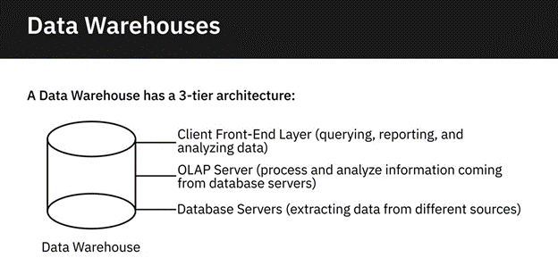

## Types of Data

### Structured Data:

* Well-defined structure adhering to specified data models.
* Typically stored in databases and represented in tabular formats.
* Sources include SQL databases, spreadsheets (e.g., Excel), online forms, sensors (e.g., GPS, RFID), and network/web server logs.
* Can be easily examined with standard data analysis methods and tools.

### Semi-structured Data:

* Has some organizational properties but lacks a fixed schema.
* Cannot be stored in traditional rows and columns.
* Contains tags, elements, or metadata for grouping and hierarchy.
* Sources include emails, XML, binary executables, TCP/IP packets, zipped files, and integration of data from different sources.
* XML and JSON are commonly used to store and exchange semi-structured data.

## Unstructured Data:

* Lacks an identifiable structure and cannot be organized in traditional databases.
* Does not follow a specific format, sequence, semantics, or rules.
* Sources include web pages, social media feeds, images, video/audio files, documents/PDFs, presentations, media logs, and surveys.
* Can be stored in files/documents for manual analysis or in NoSQL databases with specialized analysis tools.

## Tupes of File formats

### Delimited Text File Formats:

* Store data as text with values separated by delimiters like comma or tab.
* Common formats include CSV (comma-separated values) and TSV (tab-separated values).
* Each row represents a record with values separated by delimiters.
* Suitable for providing straightforward information schema and can be processed by various applications.

### Microsoft Excel Open XML Spreadsheet (XLSX):
* XML-based file format created by Microsoft for Excel.
* Contains multiple worksheets organized into rows and columns.
* Each cell contains data.
* Open file format accessible to most applications, known for security.

### Extensible Markup Language (XML):

* Markup language for encoding data.
* Readable by humans and machines.
* Self-descriptive language for sending information over the internet.
* Platform and programming language independent, simplifying data sharing.
### Portable Document Format (PDF):

* Developed by Adobe for presenting documents independent of software, hardware, and operating systems.
* Frequently used in legal, financial documents, and form filling.

### JavaScript Object Notation (JSON):

* Text-based open standard for transmitting structured data over the web.
* Language-independent data format readable in any programming language.
* Easy to use, compatible with a wide range of browsers.
* Commonly used in APIs and web services for sharing data.

## Sources of Data

### Relational Databases:

* Utilized in internal applications for managing business activities and transactions.
* Examples include SQL Server, Oracle, MySQL, and IBM DB2.
* Data from databases can be analyzed for insights such as sales analysis or customer projections.

### Flatfiles and XML Datasets:
* External datasets available in formats like flat files (CSV), spreadsheet files, or XML documents.
* Flat files store data in plain text format with delimiters like commas or tabs.
* XML files support complex data structures and are used for hierarchical data.

### APIs and Web Services:

* Offer data access for multiple users or applications in various formats like plain text, XML, HTML, JSON, or media files.
* Examples include Twitter and Facebook APIs for sentiment analysis, stock market APIs, and data lookup/validation APIs.

### Web Scraping:
* Extracts specific data from unstructured sources on web pages based on defined parameters.
* Common uses include collecting product details, generating sales leads, and gathering training datasets for machine learning.
* Popular tools include BeautifulSoup, Scrapy, Pandas, and Selenium.

### Data Streams and Feeds:

* Aggregate constant streams of data from various sources like IoT devices, social media, and web clicks.
* Used for tasks such as financial trading, supply chain management, threat detection, and sentiment analysis.
* Popular applications for processing data streams include Apache Kafka, Apache Spark Streaming, and Apache Storm.

### RSS Feeds:

* Capture updated data from online forums and news sites.
Updates are streamed to user devices through feed readers.

## Languages of Data professionals

### Query Languages

- Query languages are designed for accessing and manipulating data in a database, such as SQL.

### Programming Languages

- Programming languages are designed for developing applications and controlling application behavior. Examples include Python, R, and Java.

### Shell and Scripting Languages

- Shell and scripting languages, such as Unix/Linux Shell and PowerShell, are ideal for repetitive and time-consuming operational tasks.

### SQL

SQL (Structured Query Language) is a querying language designed for accessing and manipulating information from relational databases. Using SQL, we can:

- Insert, update, and delete records
- Create new databases, tables, and views
- Write stored procedures

Advantages of using SQL include:

- Portability across platforms
- Simple syntax similar to English
- Efficiency in retrieving large amounts of data
- Quick prototyping due to its interpreter system

### Python

- Python is a widely-used open-source, general-purpose, high-level programming language. Advantages of Python include:
- Expressiveness and readability
- Large developer community
- Ease of learning
- Performance in handling vast amounts of data
- Support for multiple programming paradigms

### R

- R is an open-source programming language and environment for data analysis, visualization, machine learning, and statistics. Key benefits of R include:
- Platform independence
- Extensibility
- Comprehensive data capabilities
- Compelling visualizations with libraries like Ggplot2 and Plotly

### Java

- Java is an object-oriented, platform-independent programming language used in data analytics processes such as cleaning, importing/exporting data, and statistical analysis.
- Java is also prominent in big data frameworks like Hadoop, Hive, and Spark.

### Unix/Linux Shell

- A Unix/Linux Shell is a series of commands written in a plain text file to accomplish specific tasks, useful for repetitive and time-consuming operations such as file manipulation, system administration, and backups.

### PowerShell

- PowerShell is a cross-platform automation tool and configuration framework by Microsoft. It's optimized for working with structured data formats, and it's object-based, making it suitable for tasks like data mining, GUI building, and report creation.

## Metadata in Data Management

Metadata is data that provides information about other data. In the context of databases, data warehousing, business intelligence systems, and various data repositories, metadata can be categorized into three main types:

### 1. Technical Metadata

Technical metadata defines data structures primarily from a technical perspective. Examples include:

- Tables recording information about tables in a database (e.g., name, number of columns and rows)
- Data catalog inventorying tables and their attributes (e.g., database names, column names, data types)
- Typically stored in specialized tables in the database's System Catalog.

### 2. Process Metadata

Process metadata describes the processes operating behind business systems, tracking things like:

- Process start and end times
- Disk usage
- Data movement between sources
- User access patterns
- Vital for troubleshooting and optimizing workflows.

### 3. Business Metadata

Business metadata is information about data described in readily interpretable ways for business users, including:

- How data is acquired
- What data measures or describes
- Connections between data sources
- Serves as documentation for the data warehouse system.

### Managing Metadata

Managing metadata involves developing policies and processes to ensure information can be accessed, integrated, and shared across the enterprise. Key components include:

- Reliable, user-friendly data catalog
- Web-based user interface for easy search and access
- Central to any Data Governance initiative.

### Importance of Metadata Management

Good metadata management offers numerous benefits, including:

- Enhanced data discovery and repeatability
- Improved data governance and lineage tracing
- Better understanding of business context associated with data.

### Popular Tools for Metadata Management

Some popular metadata management tools include:

- IBM InfoSphere Information Server
- CA Erwin Data Modeler
- Oracle Warehouse Builder
- SAS Data Integration Server
- Talend Data Fabric
- Alation Data Catalog
- SAP Information Steward
- Microsoft Azure Data Catalog
- IBM Watson Knowledge Catalog
- Oracle Enterprise Metadata Management (OEMM)
- Adaptive Metadata Manager
- Unifi Data Catalog
- data.world
- Informatica Enterprise Data Catalog

### Data Repositories
A data repository is a general term used to refer to data that has been collected, organized, and isolated so that it can be used for business operations or mined for reporting and data analysis. It can be a small or large database infrastructure with one or more databases that collect, manage, and store data sets. In this video, we will provide an overview of the different types of repositories your data might reside in, such as databases, data warehouses, and big data stores, and examine them in greater detail in further videos. Let’s begin with databases.

### Databases

A database is a collection of data, or information, designed for the input, storage, search and retrieval, and modification of data. And a Database Management System, or DBMS, is a set of programs that creates and maintains the database. It allows you to store, modify, and extract information from the database using a function called querying. For example, if you want to find customers who have been inactive for six months or more, using the query function, the database management system will retrieve data of all customers from the database that have been inactive for six months and more. Even though a database and DBMS mean different things, the terms are often used interchangeably.

There are different types of databases. Several factors influence the choice of database, such as the data type and structure, querying mechanisms, latency requirements, transaction speeds, and intended use of the data. It’s important to mention two main types of databases here—relational and non-relational databases.

#### Relational Databases

Relational databases, also referred to as RDBMSes, build on the organizational principles of flat files, with data organized into a tabular format with rows and columns following a well-defined structure and schema. However, unlike flat files, RDBMSes are optimized for data operations and querying involving many tables and much larger data volumes. Structured Query Language, or SQL, is the standard querying language for relational databases.

#### Non-relational Databases

Then we have non-relational databases, also known as NoSQL, or “Not Only SQL”. Non-relational databases emerged in response to the volume, diversity, and speed at which data is being generated today, mainly influenced by advances in cloud computing, the Internet of Things, and social media proliferation. Built for speed, flexibility, and scale, non-relational databases made it possible to store data in a schema-less or free-form fashion. NoSQL is widely used for processing big data.

### Data Warehouses

A data warehouse works as a central repository that merges information coming from disparate sources and consolidates it through the extract, transform, and load process, also known as the ETL process, into one comprehensive database for analytics and business intelligence. At a very high-level, the ETL process helps you to extract data from different data sources, transform the data into a clean and usable state, and load the data into the enterprise’s data repository. Related to Data Warehouses are the concepts of Data Marts and Data Lakes, which we will cover later. Data Marts and Data Warehouses have historically been relational since much of the traditional enterprise data has resided in RDBMSes. However, with the emergence of NoSQL technologies and new sources of data, non-relational data repositories are also now being used for Data Warehousing.

### Big Data Stores

Another category of data repositories are Big Data Stores, that include distributed computational and storage infrastructure to store, scale, and process very large data sets. Overall, data repositories help to isolate data and make reporting and analytics more efficient and credible while also serving as a data archive.

### RDMS
- **Relational Database Structure**: 
  - Organized into tables.
  - Tables can be linked based on common data.
  - Rows represent records, and columns represent attributes.
  
- **Querying with SQL**:
  - Uses Structured Query Language (SQL) for data querying.
  - Allows for retrieving data from multiple tables with a single query.
  
- **Optimized Storage and Processing**:
  - Ideal for large volumes of data.
  - Minimizes data redundancy.
  
- **Data Integrity and Consistency**:
  - Ensures consistency and integrity through data types and constraints.
  
- **Security and Access Control**:
  - Provides controlled access to data.
  - Enforces standards and policies for data governance.
  
- **Scalability**:
  - Ranges from small desktop systems to massive cloud-based systems.
  
- **Popular Relational Databases**:
  - IBM DB2, Microsoft SQL Server, MySQL, Oracle Database, PostgreSQL.
  
- **Cloud Relational Databases**:
  - Offered as Database-as-a-Service (DBaaS).
  - Examples include Amazon RDS, Google Cloud SQL, IBM DB2 on Cloud, Oracle Cloud, SQL Azure.
  
- **Advantages**:
  - Flexibility in schema modifications.
  - Reduced data redundancy.
  - Ease of backup and disaster recovery.
  - ACID-compliance for data reliability.
  
- **Use Cases**:
  - Online Transaction Processing (OLTP).
  - Data Warehousing and Online Analytical Processing (OLAP).
  - IoT Solutions.
  
- **Limitations**:
  - Not suitable for semi-structured and unstructured data.
  - Schema and data type matching required for migration.
  - Limits on data field lengths.
  
- **Continued Relevance**:
  - Despite limitations, remains predominant for structured data management.

### NoSQL

- **NoSQL Overview**:
  - Stands for “not only SQL” or sometimes “non SQL”.
  - Provides flexible schemas for data storage and retrieval.
  - Gained popularity in the era of cloud, big data, and high-volume web and mobile applications.
  - Chosen for attributes such as scale, performance, and ease of use.

- **NoSQL Characteristics**:
  - Built for specific data models.
  - Flexible schemas, not based on fixed row/column/table design.
  - Typically do not use SQL for querying.
  - Allows for schema-less or free-form data storage.

- **Types of NoSQL Databases**:
  1. **Key-value store**:
     - Data stored as key-value pairs.
     - Great for user session data, real-time recommendations, and caching.
     - Examples: Redis, Memcached, DynamoDB.
     
  2. **Document-based**:
     - Stores each record and associated data within a single document.
     - Suitable for eCommerce, CRM, and analytics platforms.
     - Examples: MongoDB, DocumentDB, CouchDB.
     
  3. **Column-based**:
     - Stores data in columns rather than rows.
     - Ideal for heavy write requests, time-series data, and IoT data.
     - Examples: Cassandra, HBase.
     
  4. **Graph-based**:
     - Uses graphical model to represent and store data.
     - Useful for analyzing interconnected relationships.
     - Examples: Neo4J, CosmosDB.

- **Advantages of NoSQL**:
  - Handles large volumes of structured, semi-structured, and unstructured data.
  - Can run as distributed systems scaled across multiple data centers.
  - Provides efficient and cost-effective scale-out architecture.
  - Offers simpler design, better control over availability, and improved scalability.
  
- **Key Differences with Relational Databases**:
  - NoSQL databases are schema-agnostic, allowing unstructured and semi-structured data.
  - Relational databases support ACID-compliance, ensuring reliability of transactions.
  - RDBMS is mature and well-documented, while NoSQL is relatively newer.
  
- **Continued Relevance**:
  - NoSQL databases are increasingly used for mission-critical applications.

- **NoSQL Overview**:
  - Stands for “not only SQL” or sometimes “non SQL”.
  - Provides flexible schemas for data storage and retrieval.
  - Popular in the era of cloud, big data, and high-volume applications.

- **Flexibility and Data Models**:
  - Built for specific data models with flexible schemas.
  - Does not strictly adhere to traditional row/column/table designs.
  - May not use SQL for querying data.

- **Common Types of NoSQL Databases**:
  - **Key-value store**: Redis, Memcached, DynamoDB.
  - **Document-based**: MongoDB, DocumentDB, CouchDB.
  - **Column-based**: Cassandra, HBase.
  - **Graph-based**: Neo4J, CosmosDB.

- **Advantages of NoSQL**:
  - Handles large volumes of structured, semi-structured, and unstructured data.
  - Runs as distributed systems scaled across multiple data centers.
  - Cost-effective scale-out architecture.
  - Simpler design and improved scalability.

- **Key Differences from Relational Databases**:
  - NoSQL databases are schema-agnostic, allowing for unstructured and semi-structured data.
  - Designed for low-cost commodity hardware.
  - ACID-compliance may not be supported.
  - Less mature compared to relational databases.

- **Use Cases**:
  - Key-value stores for user session data, real-time recommendations.
  - Document databases for flexible indexing, powerful ad hoc queries.
  - Column databases for heavy write requests, time-series data.
  - Graph databases for visualizing and analyzing interconnected data.

- **Continued Relevance**:
  - Increasingly used for mission-critical applications despite being a relatively newer technology.

### Data Warehouses, Data Marts, and Data Lakes

- **Data Mining Repositories Overview**:
  - Goal: House data for reporting, analysis, and deriving insights.
  - Characteristics and applications of data warehouses, data marts, and data lakes discussed.

- **Data Warehouse**:
   
  - Central repository of integrated data from multiple sources.
  - Single source of truth storing cleansed, conformed, and categorized current and historical data.
  - Three-tier architecture: Database servers, OLAP Server, Client front-end layer.
  - Moving to the cloud for benefits like lower costs and faster disaster recovery.
  - Popular examples include Teradata, Oracle Exadata, Amazon RedShift.

- **Data Mart**:
  - Sub-section of a data warehouse for specific business functions or user communities.
  - Types: Dependent, independent, hybrid data marts.
  - Purpose: Provide relevant data, accelerate processes, facilitate data-driven decisions.

- **Data Lake**:
  - Stores structured, semi-structured, and unstructured data in native format.
  - No need to define structure/schema before loading data.
  - Governance ensures data classification, protection, and governance.
  - Reference architecture independent of technology.
  - Benefits: Stores all types of data, scales based on capacity, saves time in defining structures.

- **Technologies and Vendors**:
  - Deployed using Cloud Object Storage (e.g., Amazon S3) or distributed systems (e.g., Apache Hadoop).
  - Vendors include Amazon, Cloudera, Google, IBM, Microsoft, Oracle, SAS, Snowflake, Teradata, Zaloni.

- **Evaluation**:
  - Need to be evaluated within the context of use case and technology infrastructure.
  
### Considerations for Choice of Data Repository

