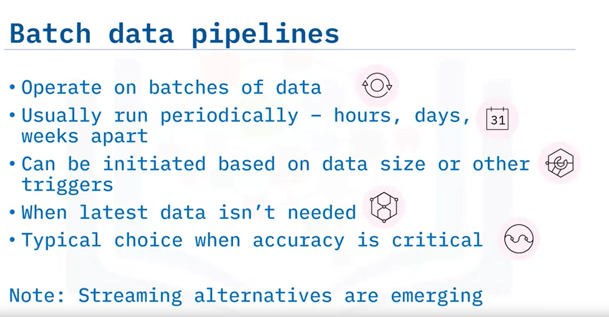
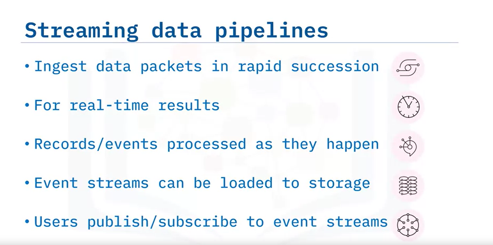
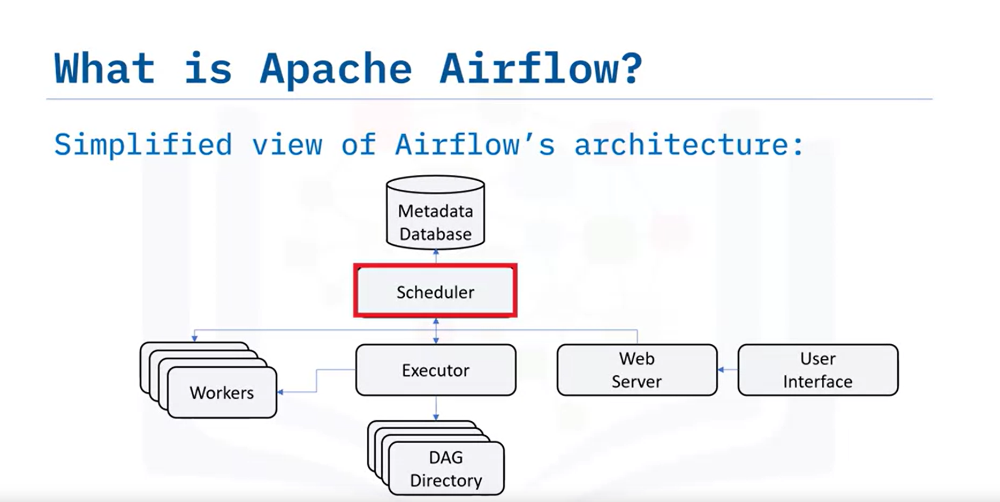
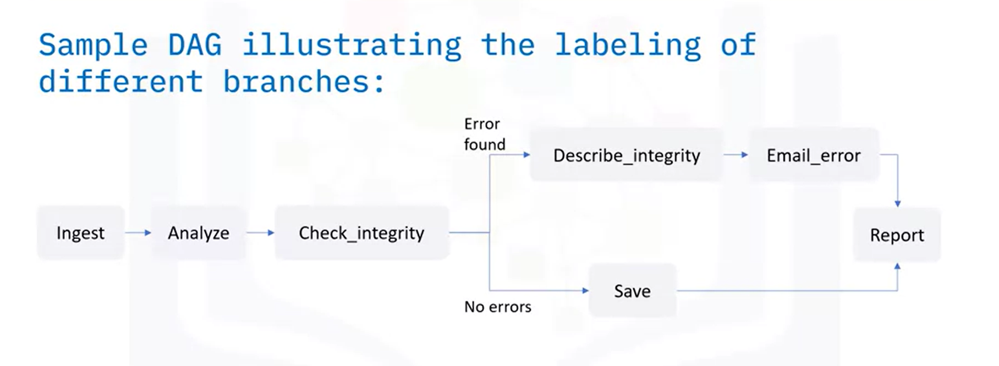
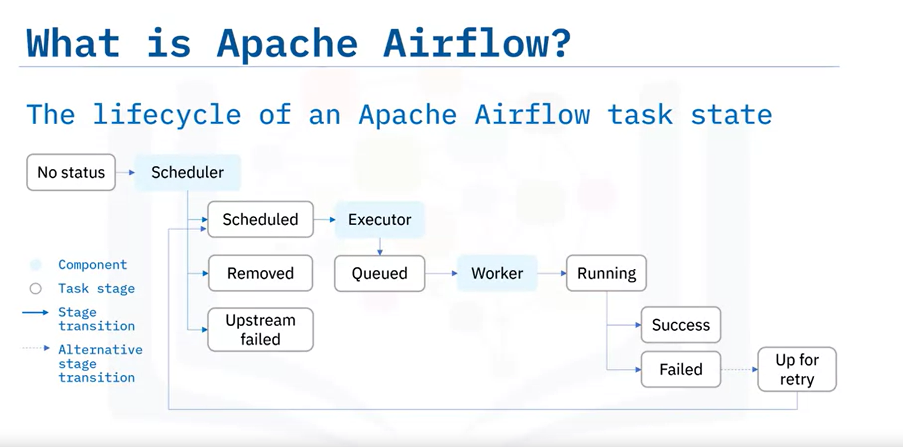
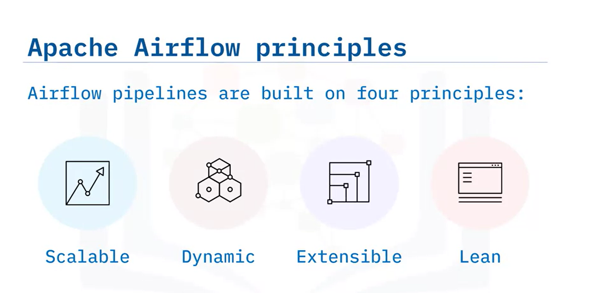
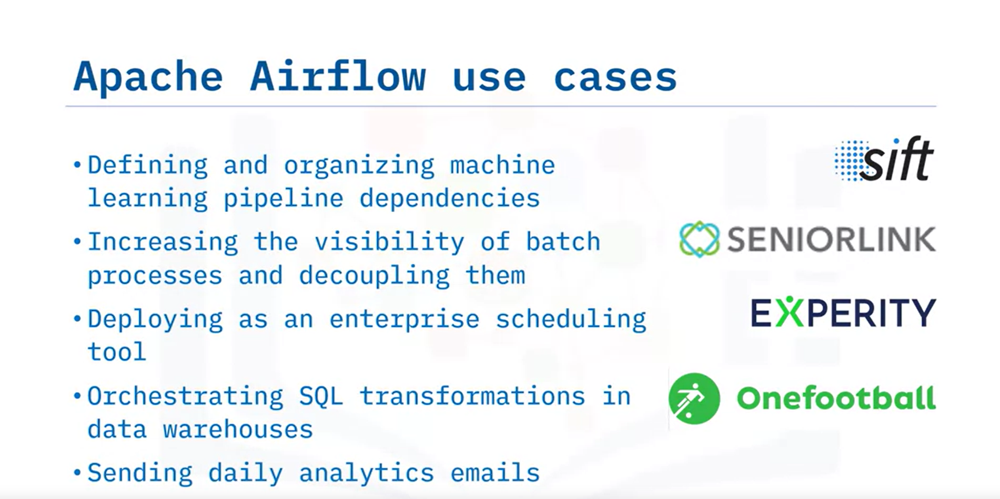
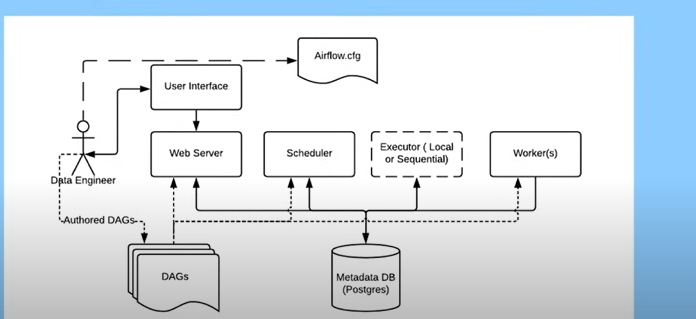
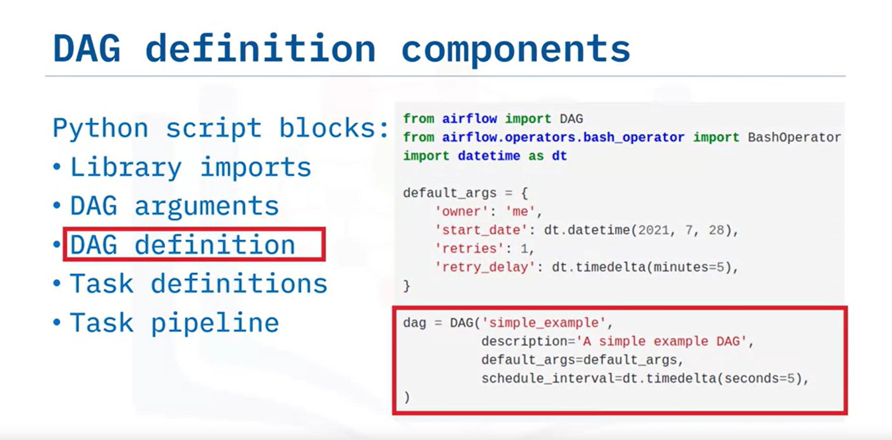

# Introduction to Data Pipelines

## What is a Data Pipeline?

A data pipeline is a series of processes where the output of one is the input to the next, similar to a relay race. This sequential process is used to move or modify data.

### Performance Metrics

- **Latency:** The time it takes for a data packet to travel through the pipeline. It's influenced by the slowest stage in the process.
- **Throughput:** The amount of data passing through the pipeline over a given time. Larger data packets can improve throughput.

## Data Pipeline Use Cases

- Copying data from one place to another (e.g., backups).
- Integrating various data sources into a data lake.
- Transferring data to a data warehouse.
- Streaming from IoT devices to dashboards or alerts.
- Processing data for machine learning.
- Facilitating message exchange (email, SMS, video calls).

# Key Data Pipeline Processes

## Key Processes

Data pipeline processes typically have the following stages in common:

1. **Extraction**: Obtaining data from one or more sources.
2. **Ingestion**: Bringing the extracted data into the pipeline.
3. **Transformation**: Optionally modifying the data within the pipeline.
4. **Loading**: Placing the transformed data into a destination facility.
5. **Scheduling/Triggering**: Initiating and managing job executions.
6. **Monitoring**: Overseeing the entire workflow.
7. **Maintenance and Optimization**: Ensuring smooth pipeline operation.

## Monitoring Considerations

Key monitoring considerations include:

- **Latency**: Time taken for data packets to move through the pipeline.
- **Throughput Demand**: Volume of data passing through over time.
- **Errors and Failures**: Issues like network overload or system failures.
- **Utilization Rate**: Efficiency of pipeline resource usage, impacting costs.

Additionally, pipelines should log events and alert administrators on failures.

## Load Balancing

A well-designed pipeline should minimize bottlenecks and maintain load balance:

- Stages should ideally process data packets in equal time.
- Parallelizing bottleneck stages can reduce latency.
- Parallelization involves replicating processes across multiple resources.
- Dynamic pipelines utilize parallelism and I/O buffers to regulate data flow.

# Batch Versus Streaming Data Pipeline Use Cases

Welcome to Batch Versus Streaming Data Pipeline Use Cases. After watching this video, you will be able to:

- Differentiate between batch and streaming data pipelines.
- Describe micro-batch and hybrid Lambda data pipelines.
- List use cases for batch data pipelines.
- List use cases for streaming data pipelines.

## Batch Data Pipelines

Batch data pipelines are used when datasets need to be processed all at once. They usually run on a fixed schedule or triggered by specific events, suitable for tasks where data recency isn't critical but accuracy is. Examples include:

- Periodic data backups
- Transaction history loading
- Customer orders and billing processing
- Historical data analysis
- Diagnostic medical image processing
   

## Streaming Data Pipelines

Streaming data pipelines process data one piece at a time, rapidly and in real-time. They are ideal for tasks requiring up-to-date information. Use cases for streaming pipelines include:

- Watching movies and listening to music or podcasts
- Social media feeds and sentiment analysis
- Fraud detection
- User behavior analysis and targeted advertising
- Stock market trading
- Real-time product pricing and recommender systems
    

## Micro-Batch and Hybrid Lambda Pipelines

Micro-batch processing reduces batch sizes and increases refresh rates to approach real-time processing, improving load balancing and lowering latency. Hybrid Lambda architecture combines batch and streaming methods, integrating historical and real-time data. Although complex, it's useful for accuracy and speed.

In summary, batch pipelines are for accuracy with less focus on recency, while streaming pipelines are for real-time needs. Micro-batch processing bridges the gap between batch and streaming, and Lambda architecture integrates both for accuracy and speed.

In this video, you learned the differences between batch and streaming data pipelines, as well as their use cases and architectures.

# Data Pipeline Tools and Technologies

Welcome to Data Pipeline Tools and Technologies. After watching this video, you will be able to:

- Discuss data pipeline technologies.
- List open source and enterprise ETL and ELT tools.
- List streaming data pipeline tools.

## Enterprise ETL and ELT Tools

Modern ETL (Extract, Transform, Load) and ELT (Extract, Load, Transform) tools offer advanced features such as:

- Fully automated pipeline creation
- Ease of use with rule recommendations and drag-and-drop GUIs
- Support for complex transformations
- Security and compliance features

**Open Source Tools:**

- **Pandas:** Popular Python library for data manipulation and analysis.
- **Dask:** Python library for parallel computing.
- **Apache Airflow:** Open-source platform for authoring, scheduling, and monitoring workflows.
- **Talend Open Studio:** Open-source platform for data migration, warehousing, and profiling.

**Enterprise Tools:**

- **AWS Glue:** Fully managed ETL service on AWS.
- **Panoply:** Focuses on ELT with SQL functionality and seamless integration with BI tools.
- **Alteryx:** Self-service analytics platform with drag-and-drop ETL tools.
- **IBM InfoSphere DataStage:** Data integration tool for designing and running ETL and ELT pipelines.

## Streaming Data Pipeline Tools

Streaming data pipeline technologies enable real-time analytics and include:

- **Apache Kafka**
- **IBM Streams**
- **SQLstream**
- **Apache Spark**
- **Azure Stream Analytics**

These tools empower continuous intelligence by blending data in motion with data at rest.

In this video, you learned about the features of modern enterprise-grade data pipeline tools, open-source Python libraries for building pipelines, and various streaming data pipeline technologies available in the market.

# Apache Airflow

# Apache Airflow Overview

## Learning Outcomes
- Understand Apache Airflow for creating, scheduling, and monitoring workflows.
- Know the key features and principles of Apache Airflow.
- Identify common applications of Apache Airflow.

## Introduction to Apache Airflow
Apache Airflow is an open-source workflow management tool, backed by a vibrant community. It enables you to build batch data pipelines and other workflows, represented as DAGs (Directed Acyclic Graphs) with tasks that have dependencies.

## Airflow Components
- **Scheduler**: Initiates all scheduled workflows.
- **Executor**: Manages task execution, assigning them to workers.
- **Workers**: Execute the tasks.
- **Web Server**: Offers an interactive UI for DAG and task management.
- **DAG Directory**: Stores the DAG files.
- **Metadata Database**: Records the state of DAGs and tasks.

## Task Lifecycle
- **No status**: Task is not queued.
- **Scheduled**: Task is ready to run.
- **Removed**: Task is no longer in the DAG.
- **Upstream failed**: A prior task failed.
- **Queued**: Task is waiting for a worker.
- **Running**: Task is executing.
- **Success**: Task completed successfully.
- **Failed**: Task encountered an error.
- **Up for retry**: Task will be retried.

## Airflow's Main Features
1. **Pure Python**: Use Python to create flexible workflows.
2. **Useful UI**: Sophisticated web app for workflow management.
3. **Integration**: Offers numerous ready-to-use integrations.
4. **Easy to Use**: Accessible for those with Python skills.
5. **Open Source**: Contribute by opening pull requests.

## Airflow Principles
- **Scalable**: Handles numerous tasks with a message queue.
- **Dynamic**: Allows for Python-based dynamic pipeline generation.
- **Extensible**: Customize with your own operators and libraries.
- **Lean**: Utilizes Jinja templating for parameterization.

## Airflow in Action
- **Machine Learning**: Manage pipeline dependencies.
- **Batch Processes**: Improve visibility and decouple processes.
- **Enterprise Scheduling**: Use as a scheduling tool.
- **Data Warehousing**: Orchestrate SQL transformations and analytics.

## Summary
Apache Airflow is a powerful, Python-based platform for workflow orchestration that's scalable, dynamic, extensible, and lean, and is commonly used for managing machine learning pipeline dependencies.

# Advantages of Representing Data Pipelines as DAGs in Apache Airflow

## Understanding DAGs
- **DAG**: A directed graph with no cycles, consisting of nodes and directed edges.
- **Nodes**: Represent tasks in a workflow.
- **Edges**: Indicate dependencies between tasks, defining the order of execution.

## Examples of DAGs
- Simple DAG: One directed edge with a root node and terminal node.
- Complex DAG: Multiple nodes with varying dependencies, not necessarily following a hierarchical structure like a tree.

## Workflows as DAGs in Airflow
- **Tasks**: Nodes in a DAG, written in Python, using Airflow operators.
- **Dependencies**: Directed edges defining task order.

## DAG Definition File Components
- **Library Imports**: Include necessary Python libraries.
- **DAG Arguments**: Set default parameters like 'start date'.
- **DAG Definition**: Establish the DAG's properties.
- **Task Definitions**: Specify individual tasks using operators.
- **Task Pipeline**: Outline task dependencies.

## Example DAG Definition Blocks
1. **Import Libraries**: `from airflow import DAG`
2. **Set Default Arguments**: Define the default 'start date'.
3. **Instantiate DAG**: Specify DAG properties.
4. **Define Tasks**: Use operators to create tasks.
5. **Specify Dependencies**: Establish how tasks depend on each other.

## Deploying and Executing DAGs
- **Airflow Scheduler**: Runs as a service to deploy workflows on workers.
- **DAG Runs**: Triggered by the 'start date' and scheduled intervals defined in the DAG script.

## Advantages of DAGs Expressed as Code
- **Maintainable**: Code is explicit and readable.
- **Versionable**: Changes are trackable through version control systems.
- **Collaborative**: Facilitates teamwork in development and maintenance.
- **Testable**: Allows for unit testing to verify functionality.

## Conclusion
In Apache Airflow, DAGs represent data pipelines as Python code, making workflows maintainable, testable, and suitable for collaboration. The Scheduler automates the execution of these pipelines across workers.
