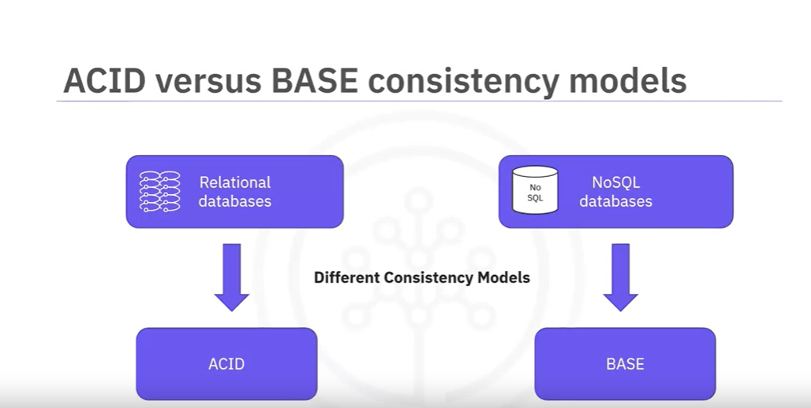
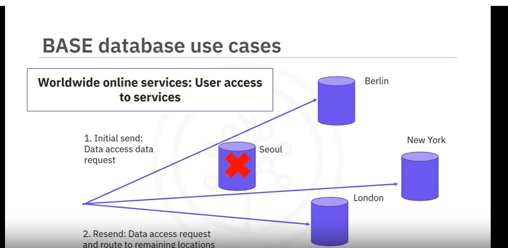
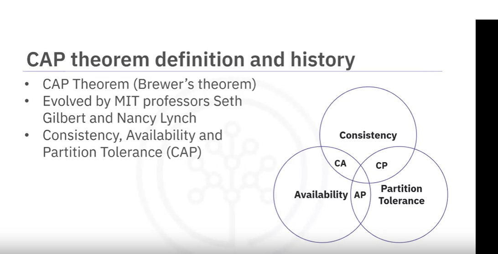
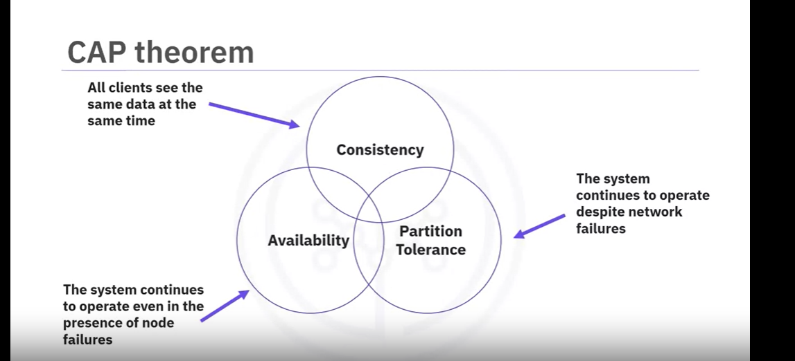
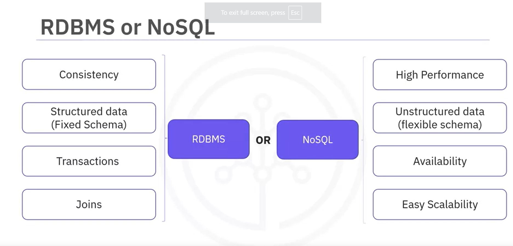
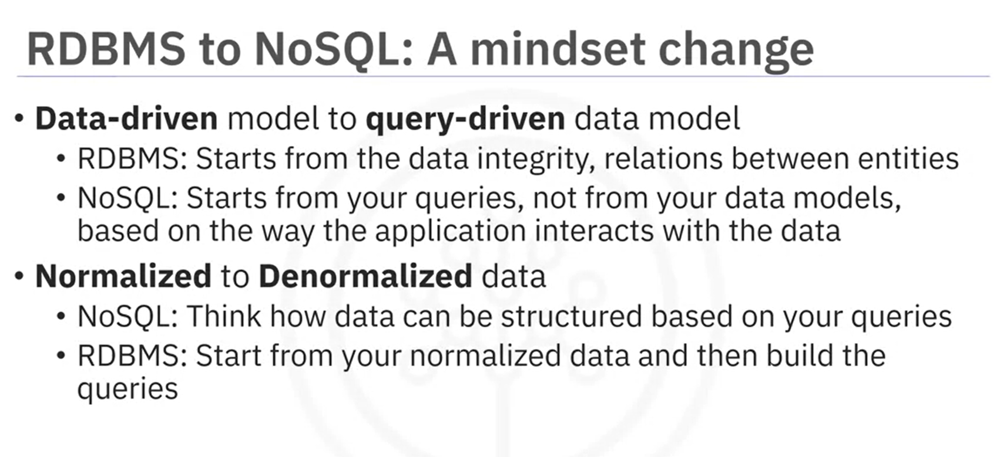
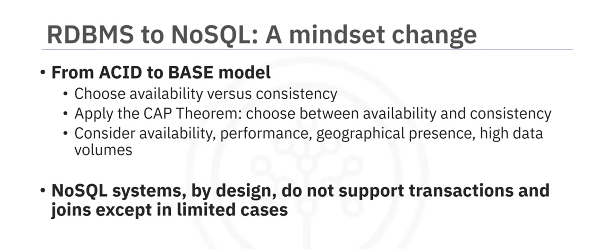

# Welcome to ACID versus BASE Operations

After watching this video, you'll be able to:

- Define the ACID and BASE acronyms.
- Describe the differences between ACID and BASE.
- Identify the use cases for ACID and BASE modeled systems.

One of the biggest and most striking differences between relational database management systems and NoSQL databases is their data consistency models. The two most common consistency models in use today are ACID and BASE.

Relational databases use the ACID model, while NoSQL databases generally use the BASE model. For example, MongoDB, a document-based NoSQL database, started supporting ACID transactions from Version 4.0.

Although ACID and BASE models are often seen as opposing approaches, the truth is that both come with their own advantages and disadvantages. Let's take a closer look at what both terms mean.

## ACID

The ACID acronym stands for:

- **Atomic**: All operations in a transaction succeed, or every operation is rolled back.
- **Consistent**: On the completion of a transaction, the structural integrity of the data in the database is not compromised.
- **Isolated**: Transactions cannot compromise the integrity of other transactions by interacting with them while they are still in progress.
- **Durable**: The data related to the completed transaction will persist, even in the case of network or power outages. If a transaction fails, it will not impact the already changed data.

Many developers are familiar with ACID transactions from working with relational databases. As such, the ACID consistency model has been the norm for some time. The ACID consistency model ensures that a performed transaction is always consistent. This makes the ACID consistency model a good fit for businesses that deal with online transaction processing, such as financial institutions or data warehousing applications. These organizations need database systems that can handle many small simultaneous transactions like relational databases can. An ACID system provides a consistent model you can count on for the structural integrity of your data.

### ACID Use Case Example

Financial institutions almost exclusively use ACID databases for their money transfers because these operations depend on the atomic nature of ACID transactions. An interrupted transaction that is not immediately removed from the database can cause serious complications, such as money being debited from one account but never credited to the other due to an error.

## BASE

In the NoSQL database world, ACID transactions are less common because some databases have loosened the requirements for immediate consistency, data freshness, and accuracy. They do this to gain other benefits, such as availability, scale, and resilience.

The BASE consistency model is used by marketing and customer service companies that deal with sentiment analysis and social network research. Social media applications that contain vast amounts of data and need to be always available, as well as worldwide online services like Netflix, Spotify, and Uber, also use the BASE model.

### BASE Consistency Model

The BASE data store values availability over consistency, but it doesn't offer guaranteed consistency of replicated data at write times. NoSQL databases use the BASE consistency model. Essentially, the BASE consistency model provides high availability.

The BASE acronym stands for:

- **Basically Available**: Rather than enforcing immediate consistency, BASE modeled NoSQL databases ensure the availability of data by spreading and replicating it across the nodes of the database cluster.
- **Soft State**: Due to the lack of immediate consistency, data values may change over time. In the BASE model, data stores don't have to be right consistent nor do different replicas have to be mutually consistent all the time.
- **Eventually Consistent**: The BASE model does not enforce immediate consistency, but it does eventually achieve it. However, until it does, data reads might be inconsistent.

### BASE Use Case Example

The fame of BASE databases increased because well-known worldwide online services such as Netflix, Apple, Spotify, and Uber use BASE data stores for applications like user profile data storage. A common characteristic of these services is that they must always be accessible, no matter where users are located. If a part of their database cluster becomes unavailable, the system needs to be able to serve user requests without any disruptions.

## Summary

In this video, you learned that ACID and BASE are the consistency models used in relational and NoSQL databases. 

- **ACID** stands for Atomicity, Consistency, Isolation, and Durability.
- **BASE** stands for Basically Available, Soft State, and Eventually Consistent.

While the ACID model focuses on data consistency, the BASE model focuses on data availability. Both consistency models have their applicability, and each model's usage is based on a case-by-case business analysis.

# Welcome to Distributed Databases

After watching this video, you will be able to:

- Describe the concepts of distributed databases.
- Define fragmentation and replication of data.
- Describe the advantages and challenges of distributed systems.

## What is a Distributed Database?

A distributed database is a collection of multiple interconnected databases, which are spread physically across various locations that communicate via a computer network. Distributed databases are physically distributed across the data sites by fragmenting and replicating the data and generally follow the BASE consistency model.

## Fragmentation of Data

To store large pieces of data on all servers of a distributed system, data needs to be broken into smaller pieces. This process, also known as fragmentation of data, is also called partitioning or sharding by some NoSQL databases. No matter the name, all distributed systems need to expose a way to store large chunks of data. 

### Methods of Fragmentation

1. **Lexical Grouping**: Grouping all keys lexically. For example, all keys that start with A or between A and C can be found on a specific server.
2. **Key-based Grouping**: Grouping all records that have the same key and placing them on the same server. For example, all transactions from a store where store ID is the key of the records. This way, a query like "give me all sales from a store" can retrieve all records from a single server.

## Replication of Data

Once data is distributed to all the cluster nodes, replication ensures that if a node fails, the data is not lost. Replication involves storing all fragments or partitions of your data redundantly in two or more sites. 

### Advantages of Replication

- **Increased Availability**: If one node fails, data can be retrieved from another node.
- **Redundancy**: Ensures data is not lost if a node fails.

### Disadvantages of Replication

- **Data Synchronization**: Changes made at one site need to be replicated to every site where that data is stored, or else it will lead to inconsistency.

## Advantages of Distributed Databases

1. **Reliability and Availability**: Data is replicated at multiple sites. If the local server is unavailable, data can be retrieved from another available server.
2. **Improved Performance**: Especially for high volumes of data, query processing time is reduced.
3. **Scalability**: You can easily grow or scale to increase your system capacity by adding new servers to the cluster.
4. **Continuous Operation**: No reliance on a central site, ensuring continuous operation.

## Challenges of Distributed Databases

### Concurrency Control

Because the same piece of data is stored in multiple locations, modifying, updating, or deleting data can lead to synchronization issues. 

- **Directed Operations**: Some distributed databases direct operations for a certain fragment of data to only one node, leaving the cluster to synchronize with the other nodes.
- **Writing to Multiple Nodes**: Others write to all nodes holding that particular fragment of data and read from as many nodes as required for consistency.

In both cases, the developer can control the consistency of the operation, determining how many nodes need to answer for an operation to be considered successful.

### Limited Transactions

Due to concurrency control issues, distributed databases by design don't typically support transactions or provide a very limited version of them. They follow the BASE model, which emphasizes availability over immediate consistency, with the understanding that data might be inconsistent at times but will eventually achieve consistency.

## Summary

In this video, you learned that distributed databases:

- Are physically distributed across data sites by fragmenting and replicating the data.
- Use fragmentation to store large pieces of data across all servers of a distributed system by breaking the data into smaller pieces.
- Use replication to store all partitions of your data redundantly in two or more sites. If one node fails, data can be retrieved from another node.
- Provide several advantages, including reliability, availability, improved performance, scalability, and continuous operation.
- Have challenges, including concurrency control and limited transaction support, due to the distributed nature of the data.
- Follow the BASE consistency model, focusing on availability over immediate consistency.

# Database Sharding and Partitioning

## Introduction

Database sharding and partitioning are techniques used to distribute data across multiple servers or nodes to improve performance, scalability, and manageability of large datasets. While the terms are often used interchangeably, they have specific meanings and applications in database management.

## What is Database Sharding?

**Sharding** refers to the process of breaking up a large database into smaller, more manageable pieces called "shards." Each shard is a complete, independent database that contains a subset of the data. Sharding is primarily used to improve the performance and scalability of databases by distributing the load across multiple servers.

### Key Concepts in Sharding

- **Shard Key**: A field or set of fields that determine how data is distributed across shards. The shard key is used to locate which shard contains a particular piece of data.
- **Horizontal Scaling**: Adding more servers to handle the increased load by distributing data horizontally across multiple shards.
- **Shard Map**: A map that keeps track of which shard contains which data, enabling the database to route queries to the appropriate shard.

### Types of Sharding

1. **Range Sharding**: Data is divided into shards based on a range of values. For example, users with IDs from 1 to 1000 are stored in Shard A, users with IDs from 1001 to 2000 in Shard B, and so on.
   
2. **Hash Sharding**: Data is distributed across shards using a hash function on the shard key. This ensures an even distribution of data but can complicate range queries.
   
3. **Directory-Based Sharding**: A lookup table or directory determines the shard location for each piece of data. This method offers flexibility but adds complexity due to the need for the directory management.

### Advantages of Sharding

- **Scalability**: Easily add more shards to handle increased load.
- **Performance**: Distribute the workload across multiple servers to reduce latency and improve query response times.
- **Fault Tolerance**: Failure of a single shard does not affect the availability of others.

### Challenges of Sharding

- **Complexity**: Implementing and managing sharding logic can be complex.
- **Data Consistency**: Ensuring data consistency across shards can be challenging.
- **Rebalancing**: Adding or removing shards requires rebalancing data, which can be resource-intensive.

## What is Database Partitioning?

**Partitioning** refers to dividing a single database into multiple pieces or partitions. Unlike sharding, partitioning typically occurs within a single database server and is used to improve query performance and manageability.

### Key Concepts in Partitioning

- **Partition Key**: A field or set of fields used to determine how data is divided into partitions.
- **Vertical Partitioning**: Splitting a table into smaller tables, each containing a subset of the columns. For example, splitting a user table into user profile and user settings tables.
- **Horizontal Partitioning**: Dividing a table into smaller tables, each containing a subset of the rows. This is similar to sharding but occurs within a single database server.

### Types of Partitioning

1. **Range Partitioning**: Data is divided into partitions based on a range of values. For example, orders from January go into Partition A, orders from February into Partition B, etc.
   
2. **List Partitioning**: Data is divided based on predefined lists of values. For example, orders from the US go into Partition A, orders from Canada into Partition B, etc.
   
3. **Hash Partitioning**: Data is distributed across partitions using a hash function. This method helps ensure an even distribution of data.

4. **Composite Partitioning**: Combines two or more partitioning methods. For example, range-list partitioning first divides data by range, then by list within each range.

### Advantages of Partitioning

- **Improved Performance**: Queries can be optimized to scan only relevant partitions.
- **Manageability**: Easier to manage smaller partitions than a single large table.
- **Maintenance**: Maintenance tasks like backups and indexing can be performed on individual partitions, reducing downtime.

### Challenges of Partitioning

- **Complexity**: Designing effective partitioning schemes can be complex.
- **Data Skew**: Uneven distribution of data can lead to imbalanced partitions.
- **Partition Management**: Maintaining and managing partitions can be resource-intensive.

## Conclusion

Both sharding and partitioning are essential techniques for managing large datasets and improving database performance. While sharding distributes data across multiple servers to handle large-scale operations, partitioning divides data within a single database to optimize query performance and manageability. Choosing the right approach depends on the specific requirements and constraints of your application.

# Welcome to CAP Theorem

## Introduction

After watching this video, you will be able to:
- Define the CAP theorem
- Describe the characteristics of CAP theorem
- Describe the history and relevance of CAP theorem

## History and Relevance

In the early 2000s, the big data Hadoop architecture was being created as the first open-source, distributed architecture that could store and process high volumes of data. At this time, more and more services were developed that required databases to be distributed as well. These businesses required not only that their services were active and accessible in most parts of the world, but also that their services were always available. For relational databases that rely so much on the consistency of data, the new concept of availability while having a distributed system seemed impossible, and this was proven by the CAP Theorem.

The CAP Theorem is also called Brewer’s Theorem because it was first advanced by Professor Eric A. Brewer during a talk he gave on distributed computing in the year 2000. Two years later, it was revised by MIT professors Seth Gilbert and Nancy Lynch, and there have been many other contributors since. The theorem states that there are three essential system requirements necessary for the successful design, implementation, and deployment of applications in distributed systems. These are Consistency, Availability, and Partition Tolerance, or CAP. A distributed system can guarantee delivery of only two of these three desired characteristics.

## Characteristics of CAP Theorem

### Consistency

Consistency refers to whether a system operates fully or not. Do all nodes within a cluster see all the data they are supposed to?

### Availability

Availability means just as it sounds. Does each request get a response outside of failure or success?

### Partition Tolerance

Partition Tolerance represents the fact that a given system continues to operate even under circumstances of data loss or network failure. A partition is a communications break within a distributed system—a lost or temporarily delayed connection between nodes. Partition tolerance means that the cluster must continue to work despite any number of communication breakdowns between nodes in the system.

## Understanding Partition Tolerance

In distributed systems, partitions can’t be avoided. Therefore, partition tolerance becomes a basic feature of native distributed systems such as NoSQL. In a cluster with eight distributed nodes, a network partition could occur, and communication will be broken between all the nodes. Instead of one 8-node cluster, there will be two smaller 4-node clusters available. Consistency between the two clusters will be achieved when network communication is re-established. Partition tolerance has become more of a necessity than an option in distributed systems. It is made possible by sufficiently replicating records across combinations of nodes and networks.

## CAP Theorem and NoSQL Systems

For systems such as NoSQL, since partition tolerance is mandatory, a system can be either Consistent and Partition Tolerant (CP) or Available and Partition Tolerant (AP). Existing NoSQL systems, like MongoDB or Cassandra, can be classified using CAP Theorem. For example, MongoDB chooses consistency as the primary design driver of the solution, and Apache Cassandra chooses availability. This doesn't mean that MongoDB cannot be available, or that Cassandra cannot become fully consistent. It means that these solutions first ensure that they are consistent (in the case of MongoDB) or available (in the case of Cassandra) and the rest is tunable.

## Conclusion

In this video, you have learned that:
- CAP theorem can be used to classify NoSQL databases.
- NoSQL databases choose between availability and consistency.
- Partition Tolerance is a basic feature of NoSQL databases.

# Glossary of Key Database Concepts

## ACID
- **Atomicity**: Ensures that all operations in a transaction are completed; if not, the transaction is fully rolled back.
- **Consistency**: Guarantees that a transaction brings the database from one valid state to another.
- **Isolation**: Ensures that transactions do not interfere with each other.
- **Durability**: Guarantees that once a transaction is committed, it will remain so, even in the event of a system failure.

## BASE
- **Basic Availability**: The system guarantees availability, in terms of the CAP theorem, this means every request receives a response.
- **Soft-state**: The state of the system may change over time, even without input due to eventual consistency.
- **Eventual Consistency**: The system will become consistent over time, given that the system doesn't receive input during that time.

## ACID vs. BASE
- ACID and BASE are the consistency models used in relational and NoSQL databases respectively.
- **ACID**: Prioritizes consistency and reliability, making it ideal for financial applications and scenarios where data integrity is paramount.
- **BASE**: Prioritizes availability and partition tolerance, making it suitable for large-scale distributed systems and scenarios where eventual consistency is acceptable.

## Distributed Databases
- **Fragmentation**: Enables an organization to store a large piece of data across all the servers of a distributed system by breaking the data into smaller pieces.
- **Replication**: Involves storing copies of data on multiple servers to ensure data availability and fault tolerance.
- **CAP Theorem**: Used to classify NoSQL databases, emphasizing that a distributed system can provide only two out of the three guarantees: Consistency, Availability, and Partition Tolerance.
- **Partition Tolerance**: A basic feature of NoSQL databases, ensuring that the system continues to operate even in the event of network partitions.

## NoSQL vs. RDBMS
- **NoSQL systems**: Not a de facto replacement for RDBMS; they are designed to handle different use cases.
- **RDBMS**: Ideal for structured data and transactions requiring strong consistency.
- **NoSQL**: Suitable for unstructured data and applications requiring high availability and scalability.
- **Hybrid Solutions**: Your solution could use both RDBMS and NoSQL, leveraging the strengths of each to cater to different aspects of the application.

By understanding these key concepts and their applications, you can make informed decisions about which database technologies to use for your specific use cases and requirements.

