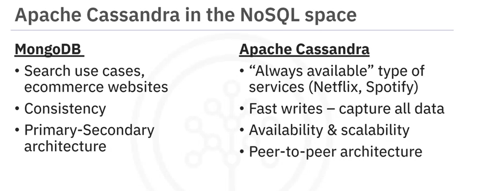
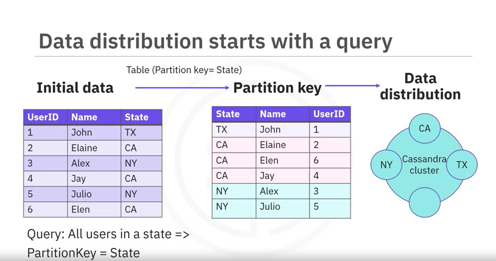

# Apache Cassandra Overview

This video provides an overview of Apache Cassandra, its features, capabilities, and best usage scenarios.

## What is Apache Cassandra?

Apache Cassandra is an open-source, distributed, decentralized, elastically scalable, highly available, fault-tolerant, tunable, and consistent database. It is designed based on Amazon's Dynamo for distribution and Google's Bigtable for data modeling.

### Key Points:
- **Distribution Design**: Based on Amazon's Dynamo.
- **Data Model**: Inspired by Google's Bigtable.
- **Usage**: Widely used at popular websites like Netflix, Spotify, and Uber.

## Cassandra vs. MongoDB

- **MongoDB**: Primarily for search-related use cases.
- **Cassandra**: Fast storage, easy retrieval, availability, scalability, and geographical distribution.


## Main Capabilities of Cassandra

- **Distributed & Decentralized**
- **Peer-to-Peer Architecture**
- **Always Available with Tunable Consistency**
- **Fault-Tolerant**
- **Fast Write Throughput**
- **Linear Scalability**
- **Multi-Data Center Deployment Support**
- **SQL-like Query Language**

## Cassandra Limitations

- **No Support for Joins**
- **Limited Aggregation Support**
- **Limited Transaction Support**

## Best Usage Scenarios for Cassandra

- **Write-Intensive Applications**
- **Append-Like Data**
- **Known Primary Key (Partition Key) Access**
- **No Need for Joins or Complex Aggregations**

## Common Use Cases for Cassandra

- **Click Tracking on Websites**
- **User Access Logging**
- **Storing Transactions for Analysis**
- **User Profile Storage**
- **Time Series Data**

## Conclusion

Apache Cassandra is suitable for always-available online applications requiring high scalability, fault tolerance, and write performance. It is commonly used in online services like Netflix, Uber, and Spotify, as well as e-commerce and time series applications.

By understanding Apache Cassandra's capabilities and limitations, you can leverage it effectively in your applications.

---
This video provides a comprehensive overview of Apache Cassandra, explaining its features, capabilities, and ideal usage scenarios. Whether you're new to Cassandra or looking to understand its fit in your projects, this guide can help.


# Key Features of Apache Cassandra

After watching this video, you will be able to:

- Explain what is meant by distributed and decentralized.
- Describe how replication works in Cassandra.
- List the difference between availability and consistency.
- Describe the scalability of Cassandra.
- Explain how Cassandra provides high write throughput.
- Explain what the CQL language is.

In this video, we will go through some of the key features in order to understand what makes Apache Cassandra a:
- Distributed and decentralized
- Highly available
- Fault-tolerant
- High write performance
- Elastically scalable
- Geographically distributed
- Easy to interact with database.

## Distributed and Decentralized Architecture

- Cassandra clusters can be run on multiple machines, but to users and applications, everything appears as a unified whole.
- Every node in the Cassandra cluster is identical, with no primary or secondary nodes.
- Cassandra uses a peer-to-peer communication protocol and keeps all nodes in sync through a protocol called gossip.

## Data Distribution and Replication

- Data is distributed in the cluster based on partition keys and hashed tokens.
- Replication ensures data redundancy and fault tolerance.
- Cassandra provides high availability by always being available, even in the event of node failures.

## Scalability

- Cassandra scales linearly by adding nodes to the cluster, increasing performance with each added node.
- Adding and removing nodes is seamless without interrupting cluster operations.

## High Write Throughput

- Cassandra parallelizes writes to all nodes holding replicas of the data.
- No read-before-write by default; writes are performed in memory and then flushed on disk.

## Cassandra Query Language (CQL)

- CQL is used for data definition and manipulation, similar to SQL syntax.
- Operations like create table, insert, update, delete, and more can be used in CQL.



In summary, Cassandra's distributed and decentralized architecture helps it be available, scalable, and fault-tolerant. Data distribution and replication occur in one or more data center clusters. Cassandra provides high write throughput, and CQL is the language used to communicate with Cassandra.


# Apache Cassandra Data Model Part 1

Welcome to Apache Cassandra Data Model Part 1. After watching this video, you will be able to:

- Describe the logical entities of the Cassandra data model.
- Describe the role of primary keys in Cassandra tables.
- Explain what partition keys are.
- Describe the two types of tables supported in Cassandra.

## Key Concepts

### Tables and Keyspaces

- **Tables**: Logical entities that organize data storage at cluster and node levels, containing rows of columns.
- **Keyspaces**: Logical entities that contain one or more tables. They define options that apply to all contained tables, such as the replication strategy. It's encouraged to use one keyspace per application.

### Table Schema

- **Schema Definition**: A table schema includes the primary key and the regular columns.
- **Creating a Table**: Done using Cassandra Query Language (CQL). You can create, drop, and alter tables without impacting running updates or queries.

### Primary Key

- **Definition**: A subset of the table's declared columns.
- **Roles**: Optimizes read performance and provides uniqueness to entries.
- **Components**: 
  - **Partition Key**: Mandatory, determines data locality in the cluster.
  - **Clustering Key**: Optional, helps order data within partitions.

### Partition Key

- **Function**: Data is grouped per partition key into partitions.
- **Hashing**: A hash function is applied to the partition key to determine data distribution across nodes.

## Types of Tables

- **Static Tables**: Have a primary key that contains only the partition key, with no clustering key. Partitions in static tables have only one entry.
- **Dynamic Tables**: Have a primary key composed of both partition key(s) and clustering key(s).


# Apache Cassandra Data Model, Part 2


Welcome to Apache Cassandra Data Model, Part 2. Let's continue our Cassandra data modeling journey. After watching this video, you will be able to:

- Explain what clustering keys are
- Describe dynamic tables
- Explain basic guidelines for modeling your data

## Clustering Keys

- **Primary Key Components**: The second component of the primary key is the clustering key.
- **Role**: Specifies the order (ascending or descending) of data inside the partition, optimizing retrieval of similar values.
- **Example**: A clustering key can be a single or multiple column key. For instance, if the clustering key is `username`, data in the group partition will be stored by `username` in ascending order by default.
- **Purpose**: Adds uniqueness to each entry and improves read query performance.


## Dynamic Tables

- **Example Query**: To find all users in `group ID 12` aged 32, a possible data model could have `group ID` as the partition key and `age` and `username` as clustering keys.
- **Data Organization**: Data inside each partition is grouped and ordered first by `age`, then by `username`. This reduces the amount of data read from a partition, which is crucial for query performance, especially in large partitions.


## Inserting Data in Dynamic Tables

- **Insertion**: Adding new data increases the partition size. In dynamic tables, partitions grow dynamically with the number of distinct entries due to the clustering key.
- **Node Responsibility**: A node holds the partition for a group, and writes/reads for that group are routed to that node. Changes in the cluster, like adding or removing nodes, trigger new token allocation and data distribution.

## Data Modeling Process

- **Primary Key Definition**: The process starts with building a primary key to answer queries optimally.
- **Rules**:
  - Choose a partition key that helps answer your query and spreads data uniformly around the cluster.
  - Build a primary key that minimizes the number of partitions read to answer a query, ensuring data distribution across the cluster.
- **Clustering Key**: Order clustering key columns according to your query to further reduce the data read.

## Summary

- **Clustering Key**: Specifies the order of data within partitions (ascending/descending) and can be single or multiple columns.
- **Purpose**: Provides uniqueness to the primary key and improves read query performance.
- **Dynamic Tables**: Partitions grow dynamically with the number of entries.
- **Primary Key**: Crucial for optimal query response time; start with the queries you want to answer, then build your primary key accordingly.


| Term            | Definition                                                                                                                                                                                                                                           |
|-----------------|-------------------------------------------------------------------------------------------------------------------------------------------------------------------------------------------------------------------------------------------------------|
| **BSON**        | Binary JSON, or BSON, is a binary-encoded serialization format used for its efficient data storage and retrieval. BSON is similar to JSON but designed for compactness and speed.                                                                       |
| **Aggregation** | Aggregation is the process of summarizing and computing data values.                                                                                                                                                                                   |
| **Availability**| In the context of CAP, availability means that the distributed system remains operational and responsive, even in the presence of failures or network partitions. Availability is a fundamental aspect of distributed systems.                         |
| **CAP**         | CAP is a theorem that highlights the trade-offs in distributed systems, including NoSQL databases. CAP theorem states that in the event of a network partition (P), a distributed system can choose to prioritize either consistency (C) or availability (A). Achieving both consistency and availability simultaneously during network partitions is challenging. |
| **Cluster**     | A group of interconnected servers or nodes that work together to store and manage data in a NoSQL database, providing high availability and fault tolerance.                                                                                            |
| **Clustering key** | A clustering key is a primary key component that determines the order of data within a partition.                                                                                                                                                    |
| **Consistency** | In the context of CAP, consistency refers to the guarantee that all nodes in a distributed system have the same data at the same time.                                                                                                                  |
| **CQL**         | Cassandra Query Language, known as CQL, is a SQL-like language used for querying and managing data in Cassandra.                                                                                                                                        |
| **CQL shell**   | The CQL shell is a command-line interface for interacting with Cassandra databases using the CQL language.                                                                                                                                              |
| **Decentralized** | Decentralized means there is no single point of control or failure. Data is distributed across multiple nodes or servers in a decentralized manner.                                                                                                     |
| **Dynamic table** | A dynamic table allows flexibility in the columns that the database can hold.                                                                                                                                                                          |
| **Joins**       | Combining data from two or more database tables based on a related column between them.                                                                                                                                                                 |
| **Keyspace**    | A keyspace in Cassandra is the highest-level organizational unit for data, similar to a database in traditional relational databases.                                                                                                                    |
| **Partition Key** | The partition key is a component of the primary key and determines how data is distributed across nodes in a cluster.                                                                                                                                 |
| **Partitions**  | Partitions in Cassandra are the fundamental unit of data storage. Data is distributed across nodes and organized into partitions based on the partition key.                                                                                            |
| **Peer-to-peer** | The term peer-to-peer refers to the overall Cassandra architecture. In Cassandra, each node in the cluster has equal status and communicates directly with other nodes without relying on a central coordinator. If a primary node fails, another node automatically becomes the primary node. |
| **Primary key** | The primary key consists of one or more columns that uniquely identify rows in a table. The primary key includes a partition key and, optionally, clustering columns.                                                                                   |
| **Replication** | Replication involves creating and maintaining copies of data on multiple nodes to ensure data availability, reduce data loss, fault tolerance (improve system resilience), and provide read scalability.                                                |
| **Scalability** | Scalability is the ability to add more nodes to the cluster to handle increased data and traffic.                                                                                                                                                       |
| **Static table** | A static table has a fixed set of columns for each row.                                                                                                                                                                                                |
| **Table**       | A table is a collection of related data organized into rows and columns.                                                                                                                                                                                |
| **Transactions** | Transactions are sequences of database operations (such as reading and writing data) that are treated as a single, indivisible unit.                                                                                                                   |

# Cassandra Query Language Data Types

## Overview
This guide will help you:
- Describe the main data types in CQL.
- Explain how to use these data types when defining a Cassandra table.
- Understand the role of collection data types and user-defined data types.

## Data Types in CQL
CQL data types are grouped into three main categories:
- Built-in data types
- Collection data types
- User-defined data types

### Built-in Data Types
Built-in data types are predefined in Cassandra. Common types include:
- **Ascii**
- **Boolean**
- **Decimal**
- **Double**
- **Float**
- **Int**
- **Text**

#### Other Notable Types
- **Blob**: Stores binary large objects, recommended size ≤ 1 MB.
- **Bigint**: Stores 64-bit signed long integers.
- **Varchar**: Represents UTF8 encoded strings.

### Collection Data Types
Collection types group and store data together in a column, useful for avoiding joins. Appropriate for limited data storage.

#### Types of Collections
- **Lists**: Maintain the order of elements, allow duplicates.
- **Maps**: Store key-value pairs.
- **Sets**: Store sorted, unique elements.

Example: Storing a user's jobs in a list in the `users` table.

### User-Defined Data Types (UDTs)
UDTs allow multiple data types in a single column, useful for one-to-one relationships. Fields can include any valid data type, even other UDTs.

Example: Creating an `address` UDT and using it in a `location` table.

## Summary
- **Built-in data types**: Standard types for various data.
- **Collection data types**: Group data in lists, maps, or sets.
- **User-defined data types (UDTs)**: Custom types for more complex data structures.
- **Collections**: Emulate one-to-many relationships.
- **UDTs**: Emulate one-to-one relationships, attach multiple data fields to a column.


# Apache Cassandra Keyspace Operations

## Overview
After completing this video, you will be able to:
- Describe the role of keyspaces in Apache Cassandra.
- Describe the replication factor and replication strategy.
- Create, modify, and delete a keyspace.

## Keyspaces in Cassandra
- A keyspace must be defined before creating tables; there is no default keyspace.
- A keyspace can contain any number of tables, but a table belongs to only one keyspace.
- Replication is specified at the keyspace level, including the replication factor, which can be modified later.

### Creating a Keyspace
To create a keyspace, specify the replication strategy and replication factor.

**Example:**
```cql
CREATE KEYSPACE intro_cassandra
WITH REPLICATION = {
  'class': 'NetworkTopologyStrategy',
  'datacenter1': 3,
  'datacenter2': 2
};
```

### Replication Factor and Strategy
- **Replication Factor**: Number of replicas of data placed on different nodes.
- **Replication Strategy**: Determines which nodes the replicas are placed on.
- **Key Points**:
  - All replicas are equally important (no primary or secondary replicas).
  - Replication factor should not exceed the number of nodes in the cluster.

### Example: Single Data Center
In a four-node cluster with one data center and a replication factor of 3:
- Data is replicated to three nodes, considering rack placement to distribute replicas evenly.

**Example:**
```cql
CREATE KEYSPACE intro_cassandra
WITH REPLICATION = {
  'class': 'NetworkTopologyStrategy',
  'datacenter1': 3
};
```

### Example: Multi-Data Center
In a cluster with two data centers and a replication factor of 5:
- Replicas are placed in both data centers, ensuring even distribution.

**Example:**
```cql
CREATE KEYSPACE intro_cassandra
WITH REPLICATION = {
  'class': 'NetworkTopologyStrategy',
  'datacenter1': 3,
  'datacenter2': 2
};
```

### Modifying a Keyspace
You can modify the replication factor using the `ALTER KEYSPACE` command.

**Example:**
```cql
ALTER KEYSPACE intro_cassandra
WITH REPLICATION = {
  'class': 'NetworkTopologyStrategy',
  'datacenter1': 3,
  'datacenter2': 3
};
```

### Deleting a Keyspace
Delete a keyspace using the `DROP KEYSPACE` command. Cassandra will take a snapshot of the keyspace before deleting it to protect against data loss.

**Example:**
```cql
DROP KEYSPACE intro_cassandra;
```

## Summary
- **Keyspaces**: Defined before creating tables, can contain multiple tables.
- **Replication**: Specified at the keyspace level, includes replication factor and strategy.
- **Common Operations**: `CREATE KEYSPACE`, `ALTER KEYSPACE`, `DROP KEYSPACE`.


# Apache Cassandra CRUD Operations (Part 1)

## Overview
After this video, you'll be able to:
- Describe the Write process in Cassandra.
- Explain INSERT and UPDATE operations.
- Understand the role of lightweight transactions.

## Write Process in Cassandra
- At the cluster level, the coordinator node handles the write operation.
- Write operations are directed towards all replicas of the partition.
- Acknowledgement from a minimum number of nodes is expected for consistency.

## Insert Operations
- Requires full primary key specification.
- Insert behaves as both Insert and Upsert.
- Mandatory to specify all primary key columns.
- Can specify Time-To-Live (TTL) at record level.

### Insert Examples
- Inserting new data:
  ```cql
  INSERT INTO users (group_id, username, age) VALUES (12, 'user1', 30);
  ```
- Inserting with partial primary key:
  ```cql
  INSERT INTO users (group_id, username) VALUES (45, 'user2');
  ```
- Inserting with TTL:
  ```cql
  INSERT INTO users (group_id, username) VALUES (25, 'user3') USING TTL 10;
  ```

## Update Operations
- Use INSERT for updating existing data.
- Full primary key required unless updating a static column.
- UPDATE behaves as an INSERT if the record does not exist.

### Update Examples
- Updating a static column:
  ```cql
  UPDATE groups SET group_name = 'new_group_name' WHERE group_id = 45;
  ```
- Updating an existing record:
  ```cql
  UPDATE users SET age = 45 WHERE group_id = 12 AND username = 'user1';
  ```

## Lightweight Transactions (LWT)
- LWT introduces IF in INSERT and UPDATE statements.
- Ensures read before write but slower than normal operations.

### LWT Examples
- Conditional update:
  ```cql
  UPDATE users SET age = 40 WHERE group_id = 12 AND username = 'user1' IF age = 30;
  ```
- Conditional insert:
  ```cql
  INSERT INTO users (group_id, username, age) VALUES (12, 'user1', 40) IF NOT EXISTS;
  ```

## Summary
- Default behavior: No read before write in Cassandra.
- Insert and update operations behave similarly by default.
- Lightweight Transactions enforce read before write but are slower.
- Acknowledgement from minimum nodes ensures write consistency.


| Term                   | Definition                                                                                                         |
|------------------------|-------------------------------------------------------------------------------------------------------------------|
| Cluster                | A group of interconnected servers or nodes that work together to store and manage data in a NoSQL database, providing high availability and fault tolerance.                                |
| Consistency            | In the context of CAP, consistency refers to the guarantee that all nodes in a distributed system have the same data at the same time.                                              |
| Dynamic table          | A dynamic table allows flexibility in the columns that the database can hold.                                        |
| Keyspace               | A keyspace in Cassandra is the highest-level organizational unit for data, similar to a database in traditional relational databases.                                                |
| Lightweight transactions | Lightweight transactions provide stronger consistency guarantees for specific operations, though they are more resource-intensive than regular operations.                              |
| Partition key          | The partition key is a component of the primary key and determines how data is distributed across nodes in a cluster.                                                            |
| Primary key            | The primary key consists of one or more columns that uniquely identify rows in a table. The primary key includes a partition key and, optionally, clustering columns.              |
| Replication factor     | The replication factor specifies the number of copies of data that should be stored for fault tolerance.                                                                        |
| Replicas               | Replicas in Cassandra refer to the copies of data distributed across nodes.                                                                                                       |
| Replication strategy   | The replication strategy determines how data is copied across nodes.                                                                                                               |
| Secondary indexes      | Secondary indexes allow you to query data based on non-primary key columns.                                                                                                        |
| Static table           | A static table has a fixed set of columns for each row.                                                                                                                           |
| Table                  | A table is a collection of related data organized into rows and columns.                                                                                                          |

