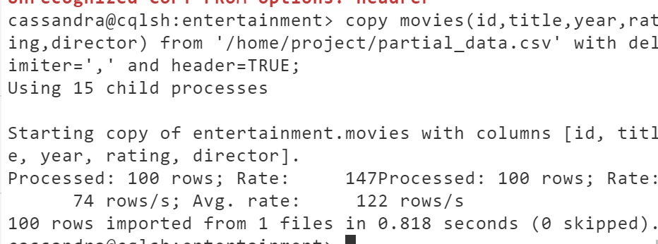

# MongoDB Overview


Welcome to an overview of MongoDB. After watching this video, you will be able to:
- Explain what MongoDB is
- List the different components of MongoDB
- Describe why and where to use MongoDB

## What is MongoDB?

MongoDB is a document and NoSQL database. Instead of storing data in tables of rows or columns like SQL databases, each record in a MongoDB database is a document. You store the data in a non-relational way. Documents are associative arrays like JSON objects or Python dictionaries.

### Example Document

A student document might represent a student's first name, last name, email address, and ID.

### Collections

MongoDB documents of similar type are grouped into a collection. For example:
- The Campus Management system stores all student records or documents in the `students` collection.
- All staff documents are stored in the `employees` collection.

### Database

Following our example, the Campus Management system stores all different types of data related to it in a MongoDB database called `CampusManagementDB`.

### Document Structure

In the document below, `first name`, `last name`, `email`, and `student ID` are fields or properties with values representing a student named John Doe. Each field name is unique within that document.

## Data Types

MongoDB supports a variety of data types, allowing you to use the correct data type to store your information. For example:
- Dates should be stored as `ISODate` or Unix-style epoch dates, which helps with queries like "give me all students born between 15th January to 15th February".
- Numbers can be stored as whole numbers or decimals.

### Subdocuments and Lists

Being a document database, MongoDB allows you to store subdocuments to group secondary information together. It also supports lists of values, including mixed types.

## Working with MongoDB

Working with MongoDB is easy because you can focus on the data you are writing and how you are going to read it. Traditional relational databases required you to:
1. Create the schema first.
2. Create table structures to hold your data.
3. Alter tables if you need to store an additional field.

In MongoDB, you can change as you go along.

## Data Flexibility

MongoDB allows you to bring in any structured or unstructured data. It provides high availability by keeping multiple copies of your data. You can design complex data structures easily in MongoDB without worrying about the complexity of how it is stored and linked. For example, your Campus Management application is also launched in the USA, where they use zip codes instead of postcodes.

## Scalability

MongoDB provides scalability as your data needs grow:
- **Vertically** by introducing bigger, faster, better hardware.
- **Horizontally** by partitioning your data.

This can be done whether you are running a self-managed on-premises MongoDB or using hybrid or cloud-hosted fully managed services such as:
- IBM Cloud databases for MongoDB
- MongoDB Atlas on AWS, Azure, and Google Cloud

## Summary

In this video, you have learned that:
- MongoDB is a document and NoSQL database.
- MongoDB supports various data types.
- Documents provide a flexible way of storing data.
- MongoDB documents of a similar type are grouped into collections.
- MongoDB models data as you read and write.
- MongoDB brings structured or unstructured data and provides high availability.
- MongoDB can be used for a variety of purposes due to its flexibility in storing structured or unstructured data.


# Advantages of MongoDB

Welcome to **Advantages of MongoDB**. After watching this video, you will be able to:
- Identify the key benefits of using MongoDB
- Explain why it suits your evolving data needs

## Key Benefits of MongoDB

### 1. Flexible Schema

MongoDB allows for a flexible schema, accommodating different data formats effortlessly.

#### Example
- UK addresses have no zip code.
- US addresses have no postcode.
  
In relational databases, this would lead to either many empty fields or complex, overarching fields. In MongoDB, this flexibility is inherent, allowing for easy storage of unstructured data from various sources.

### 2. Code-First Approach

MongoDB's document-based nature means you can start writing data immediately without the need for complex table definitions. This eliminates the need for third-party frameworks for read and write operations.

### 3. Evolving Schema

MongoDB supports schema evolution with minimal disruption. For example, if you run a courier company and need to store additional information for contactless delivery, you can easily add this new data to your existing documents.

### 4. Handling Unstructured Data

MongoDB excels in handling unstructured data, making it ideal for applications like stock market aggregators that collect diverse data from different sources.

### 5. Querying and Analytics

Mongo Query Language (MQL) offers robust querying capabilities. For more complex queries, MongoDB's aggregation pipelines allow for sophisticated data analysis.

#### Example
- Grouping student results by year and finding top-scoring students by semester.

### 6. High Availability

MongoDB supports high availability through redundancy. Typical setups involve three-node replica sets:
- One primary member
- Two secondary members

If the primary node fails, a secondary node takes over, ensuring no downtime. This setup also facilitates maintenance tasks like software updates or security patches without disrupting the system.

## Summary

In this video, you learned that:
- MongoDB offers a flexible schema, allowing for dynamic data changes.
- MongoDB uses a code-first approach, simplifying the development process.
- MongoDB supports evolving schemas, accommodating new data requirements easily.
- Complex data analysis is facilitated through aggregation pipelines.
- MongoDB ensures high availability through replica sets and redundancy.


# Use Cases for MongoDB

Welcome to **Use Cases for MongoDB**. After watching this video, you will be able to:
- List the most common use cases for MongoDB
- Describe the Many Sources – One View use case
- Describe the IoT use case
- Describe the E-commerce use case
- Describe the Real-time Analytics use case
- Describe the Gaming use case
- Describe the Finance use case

## Common Use Cases for MongoDB

### 1. Many Sources – One View

MongoDB allows you to bring data from different sources into a single view. Instead of each part of your data living in silos, you can ingest multiple shapes and formats of data into MongoDB. This unified view is facilitated by MongoDB's flexible schema.

### 2. IoT (Internet of Things)

MongoDB can be used with IoT devices, which generate vast amounts of data. Examples include:
- Autonomous car components
- Internet-connected light bulbs
- Weather stations sending temperature and wind speed readings every minute

MongoDB's scaling capabilities allow it to store this data globally. Using MongoDB's expressive querying capabilities, this data can be utilized in complex analysis and decision-making.

### 3. E-commerce

E-commerce products have diverse attributes. For example:
- A phone has storage, network, and color attributes.
- A book has publisher, writer, and number of pages attributes.

MongoDB supports dynamic schemas, allowing for the storage of products with varying attributes using documents, sub-documents, and lists. This optimizes data for reads and is ideal for e-commerce solutions.

### 4. Real-time Analytics

MongoDB is well-suited for real-time analytics. Most organizations aim to make better decisions based on data, but often struggle with complex ETL (Extract, Transform, Load) processes. MongoDB enables real-time analysis of semi-structured or unstructured data where it is stored, facilitating immediate response to changes.

### 5. Gaming

MongoDB supports the gaming industry, especially for multiplayer games played globally. With native scalability (sharding), MongoDB helps distribute data efficiently. Its flexible schema supports ever-changing data needs, making it ideal for dynamic gaming environments.

### 6. Finance

In the finance industry, MongoDB supports:
- High-speed transactions, performing thousands of operations per second
- Secure data handling with encryption during transfer and on disk
- Additional field-level encryption to prevent data incidents

MongoDB ensures high reliability and availability, critical for banking, trading, and financial services, ensuring no downtime and secure, fast transactions.

## Summary

In this video, you learned that MongoDB can be used in a variety of use cases:
- The scalability provided by MongoDB makes it easier to work globally.
- MongoDB enables real-time analysis of your data.
- MongoDB's flexible schema and robust security features make it suitable for diverse industries, including IoT, e-commerce, gaming, and finance.


```markdown
# CRUD Operations

Welcome to **CRUD Operations**. After watching this video, you will be able to use Mongo shell to connect to your MongoDB database and perform basic CRUD operations. 

## Mongo Shell

Mongo shell is a command line tool provided by MongoDB to interact with your databases. It is an interactive JavaScript interface used for performing data and administrative operations on MongoDB.

### Connecting to the Database

First, connect to your cluster by providing a connection string. Once connected, you can view the list of all your databases. For simplicity, we assume the shell is already connected to our MongoDB instance. To start working on the Campus Management database, run the following command:

```sh
use campus_management
```

Then, to see what collections are present in the Campus Management database, use this command:

```sh
show collections
```

It shows two collections: `staff` and `students`.

## CRUD Operations

CRUD operations are Create, Read, Update, and Delete operations.

### Create Operation

To insert a new document into the `students` collection:

```javascript
db.students.insertOne({
    firstName: "John",
    lastName: "Doe",
    email: "john.doe@example.com"
})
```

This operation returns an acknowledgment of success and shows the `insertedId`. The `_id` field is required in every MongoDB document. If not provided, MongoDB generates it automatically.

You can also insert multiple documents:

```javascript
let students_list = [
    { firstName: "Jane", lastName: "Doe", email: "jane.doe@example.com" },
    { firstName: "Jim", lastName: "Beam", email: "jim.beam@example.com" }
];

db.students.insertMany(students_list);
```

### Read Operations

To find the first document in the collection:

```javascript
db.students.findOne();
```

To find a specific student by email:

```javascript
db.students.findOne({ email: "john.doe@example.com" });
```

To retrieve all students with the last name "Doe":

```javascript
db.students.find({ lastName: "Doe" });
```

To count how many students have the last name "Doe":

```javascript
db.students.countDocuments({ lastName: "Doe" });
```

### Update Operations

#### Replace Operation

To replace a student's document:

1. Retrieve and modify the document:

    ```javascript
    let student = db.students.findOne({ lastName: "Doe" });
    student.onlineStatus = "on campus";
    student.email = "john.doe@campus.edu";
    ```

2. Replace the document:

    ```javascript
    db.students.replaceOne({ lastName: "Doe" }, student);
    ```

#### In-place Update

For small changes, use in-place updates:

```javascript
db.students.updateOne(
    { lastName: "Doe" },
    { $set: { onlineStatus: "online only", email: "john.doe@campus.edu" } }
);
```

To update multiple documents:

```javascript
db.students.updateMany(
    {},
    { $set: { onlineStatus: "online only" } }
);
```

### Delete Operations

To delete a specific document:

```javascript
db.students.deleteOne({ email: "john.doe@example.com" });
```

To delete multiple documents:

```javascript
db.students.deleteMany({ lastName: "Doe" });
```

## Summary

In this video, you learned that the Mongo shell is an interactive command line tool provided by MongoDB to interact with your databases. To use the Mongo shell:
- Connect to your cluster via a connection string.
- Use `show dbs` to list databases.
- Use `use <database_name>` to select a database.
- Use `show collections` to list collections in a database.

CRUD operations consist of:
- **Create**: `insertOne`, `insertMany`
- **Read**: `findOne`, `find`, `countDocuments`
- **Update**: `replaceOne`, `updateOne`, `updateMany`
- **Delete**: `deleteOne`, `deleteMany`

Different kinds of acknowledgments are returned based on the operation being run.


# Indexes

Welcome to **Indexes**. After watching this video, you will be able to:
- Explain why we need indexes
- Use indexes to perform efficient searches and sorts
- Describe how MongoDB stores indexes

## Importance of Indexes

Indexes help quickly locate data without scanning the entire collection. For example, finding a specific book in the British Library without an index would require searching through 25 million books. With an index, you can go directly to the appropriate section and find the book quickly.

### Everyday Examples of Indexes

- **Telephone Books**: Names are indexed by surname and first name.
- **Dictionaries**: Words are indexed alphabetically.
- **Books**: Indexes at the end of books help locate specific topics.

## Creating Indexes in Databases

Indexes should be created for the most frequent queries. In the Campus Management Database, for the `course enrollment` collection, we find students using `courseId`. Creating an index on the `courseId` field allows efficient searches:

```javascript
db.course_enrollment.createIndex({ courseId: 1 })
```

This command creates an ascending index on the `courseId` field. If you need to sort by `studentId` as well, you can create a compound index:

```javascript
db.course_enrollment.createIndex({ courseId: 1, studentId: 1 })
```

In this compound index, documents with the same `courseId` are sorted by `studentId`.

## How MongoDB Stores Indexes

Indexes in MongoDB are special data structures that store:
- The indexed fields
- The location of documents on disk

MongoDB stores indexes in a balanced tree form. For example, with a compound index on `courseId` and `studentId`, the tree structure allows efficient equality and range searches. Additionally, if a field is already indexed, MongoDB can skip sorting it again.

### Tree Structure

- **Balanced Tree**: Ensures efficient search operations.
- **Organized Order**: Indexed fields are in ascending or descending order, providing quick access to documents.

## Summary

In this video, you learned that:
- Indexes help quickly locate data without scanning the entire collection.
- Indexes should be created for the most frequent queries.
- A compound index indexes more than one field.
- MongoDB stores indexed data and document locations.
- MongoDB uses a balanced tree structure for indexes, enhancing search efficiency.

# Aggregation Framework

Welcome to **Aggregation Framework**. After watching this video, you will be able to:

- Explain what an aggregation framework is in MongoDB
- Describe how an aggregation framework is built
- List some of the most commonly used stages
- Describe when you can use aggregation

## What is an Aggregation Framework?

An aggregation framework, also known as an aggregation pipeline, is a series of operations applied to data to obtain a specific outcome. For example, to understand whether students are developing their knowledge, you might want to see the average student scores in 2020 organized by `courseId`. To get this information, you would:
1. Filter the 2020 documents
2. Group those documents by course
3. Calculate the average score

### Sample Data

Consider the following sample data for `courseResults`:
- Each document contains `courseId`, `courseYear`, and `score`.

### Aggregation Stages

1. **$match**: Filters documents from the year 2020.
2. **$group**: Groups documents by `courseId` and calculates the average score, stored in `averageScore`.

Processing this code is like running a pipeline where documents enter from one side, go through one or more processes, and come out in the desired format.

### Sample Data Flow

- **$match Stage**: Filters documents that do not have the year 2020.
- **$group Stage**: Groups documents by `courseId` and calculates the average score.

### Common Aggregation Stages

- **$project**: Reshapes documents by including or excluding fields.
- **$sort**: Sorts the documents in the requested order by field.
- **$count**: Counts documents in that stage.
- **$merge**: Moves output to a collection.

## Examples

### $project Stage

Using the `students` data, apply the `$project` stage to only include `firstName` and `lastName`:

```javascript
db.students.aggregate([
  { $project: { firstName: 1, lastName: 1 } }
])
```

This will only display `firstName`, `lastName`, and `_id` (unless explicitly excluded).

### $sort Stage

Sort by `lastName` in descending order:

```javascript
db.students.aggregate([
  { $sort: { lastName: -1 } }
])
```

### $count Stage

Calculate the total number of students:

```javascript
db.students.aggregate([
  { $count: "totalStudents" }
])
```

This produces the output `totalStudents: 3`.

### $merge Stage

Store the output into a collection called `averageScores`:

```javascript
db.courseResults.aggregate([
  { $match: { courseYear: 2020 } },
  { $group: { _id: "$courseId", averageScore: { $avg: "$score" } } },
  { $merge: "averageScores" }
])
```

## When to Use Aggregation Framework

- Track student progress by course
- Calculate the average sale of a product per country in an ecommerce application
- Create simplified or complex calculations
- Provide multiple perspectives about the data

## Summary

In this video, you learned:
- The purpose and function of an aggregation framework in MongoDB
- How to build an aggregation process using stages like `$match`, `$group`, `$project`, and `$sort`
- How to use `$merge` to store outcomes in another collection
- Use cases for the aggregation framework, such as reporting and analysis tasks


# Replication and Sharding

Welcome to **Replication and Sharding**. The scale and availability we see with MongoDB is achieved using these two concepts. After watching this video, you will be able to:
- Define replication
- Explain the benefits of replication
- Describe what sharding is and its benefits
- Explain how sharding helps scale a database

## Replication

A typical MongoDB cluster is made of three data-bearing nodes, known as a Replica Set. Each node has the same data, ensuring redundancy and high availability.

### Key Concepts

- **Primary Node**: The main node where data is written.
- **Secondary Nodes**: Nodes that replicate data from the primary node.

### Benefits of Replication

1. **Redundancy**: Multiple copies of data ensure that if one node fails, others can take over.
2. **High Availability**: Provides continuous availability during hardware failures or maintenance.

### Misconception

- Replication **does not** protect against accidental deletions or data corruption. For disaster recovery, rely on backups and restoration processes.

### Replication Process

1. **Write Operation**: Changes are written to the primary node.
2. **Oplog**: The primary node records changes in its operations log (Oplog).
3. **Replication**: Secondary nodes observe the primary Oplog, copy changes, and apply them.

### Example

Deleting students from a database:
```javascript
db.students.deleteMany({/* criteria */});
```
This operation appears as a single entry in the Oplog.

## Sharding

When data grows beyond hardware capacity, you can scale horizontally using sharding, which partitions large collections across multiple nodes.

### Benefits of Sharding

1. **Increased Throughput**: Queries are directed only to relevant shards.
2. **Greater Storage**: Allows storage of more data than a single node can handle.
3. **Regional Data Distribution**: Data can be partitioned based on regions (e.g., US and Europe).

### Sharding Example

- **US Data**: Stored on US shards.
- **European Data**: Stored on European shards.

## High Availability and Elections

- **Primary Node**: Accepts write operations.
- **Election**: If the primary node fails, MongoDB can automatically elect a secondary node as the new primary.

### Election Triggers

1. Primary node becomes unavailable.
2. New replica set initialization.
3. Manual failover initiated by an administrator.

### Voting System

- Ensures only one member becomes the primary.
- Eligible members with the most recent data and minimal replication lag are considered.
- The node with the most votes becomes the primary.

## Summary

In this video, you learned that:
- Replication is the duplication of data and changes, providing fault tolerance, redundancy, and high availability.
- Replication does not protect against human errors like deletions; backups are necessary for disaster recovery.
- Sharding allows horizontal scaling for growing datasets by partitioning data across multiple nodes.


# Accessing MongoDB from Python

Welcome to **Accessing MongoDB from Python**. After watching this video, you will be able to:
- Explain what the `MongoClient` is
- Perform basic CRUD operations for our Campus Management database using Python

## Introduction to MongoClient

The `MongoClient` is a class that helps you interact with MongoDB. Let's explore how to use it.

### Steps to Use MongoClient

1. **Import MongoClient** from `pymongo`, the official MongoDB driver for Python.
2. **Create a connection** to MongoDB using a URI.
3. **Get a reference** to the Campus Management database.
4. **Point to the `students` collection** within the database.

### Example Code

```python
from pymongo import MongoClient

# Step 1: Define the URI for MongoDB connection
uri = "your_mongo_db_uri"

# Step 2: Create the MongoClient
client = MongoClient(uri)

# Step 3: Get the Campus Management database
db = client['campus_management']

# Step 4: Get the students collection
students_collection = db['students']
```

## Create Operations

### Insert a Single Document

To create a student document, call the `insert_one` function:

```python
student = {
    "firstName": "John",
    "lastName": "Doe",
    "email": "john.doe@example.com"
}
result = students_collection.insert_one(student)
print(f"Inserted student with id: {result.inserted_id}")
```

### Insert Multiple Documents

To perform a bulk insert, use the `insert_many` function:

```python
students = [
    {"firstName": "Jane", "lastName": "Doe", "email": "jane.doe@example.com"},
    {"firstName": "Jim", "lastName": "Beam", "email": "jim.beam@example.com"}
]
result = students_collection.insert_many(students)
print(f"Inserted student ids: {result.inserted_ids}")
```

## Read Operations

### Find One Document

Retrieve the first document:

```python
student = students_collection.find_one()
print(student)
```

### Find a Document with Criteria

Retrieve the first student with a specific email:

```python
student = students_collection.find_one({"email": "john.doe@example.com"})
print(student)
```

### Find All Documents with Criteria

Retrieve all students with the last name "Doe":

```python
students = students_collection.find({"lastName": "Doe"})
for student in students:
    print(student)
```

### Count Documents

Count the number of students with the last name "Doe":

```python
count = students_collection.count_documents({"lastName": "Doe"})
print(f"Number of students with last name Doe: {count}")
```

## Update Operations

### Replace a Document

Retrieve a student and make some changes:

```python
student = students_collection.find_one({"lastName": "Doe"})
if student:
    student['email'] = "john.doe@campus.edu"
    student['status'] = "online"
    students_collection.replace_one({"lastName": "Doe"}, student)
```

### In-place Update

Perform small changes without retrieving the document:

```python
students_collection.update_one(
    {"lastName": "Doe"},
    {"$set": {"email": "john.doe@campus.edu", "status": "online"}}
)
```

### Update Multiple Documents

Update all students to online status due to lockdown:

```python
students_collection.update_many({}, {"$set": {"status": "online"}})
```

## Delete Operations

### Delete One Document

Delete a single document:

```python
students_collection.delete_one({"lastName": "Doe"})
```

### Delete Multiple Documents

Delete multiple documents:

```python
students_collection.delete_many({"lastName": "Doe"})
```

## Summary

In this video, you learned that:
- `MongoClient` is a class that helps you interact with MongoDB.
- `MongoClient` is imported from `pymongo`, the official MongoDB driver for Python.
- You can perform single or bulk inserts, replace whole documents, perform in-place updates, and delete one or more documents from your collection.


| Term                 | Definition                                                                                                                                                                                                                                    |
|----------------------|-----------------------------------------------------------------------------------------------------------------------------------------------------------------------------------------------------------------------------------------------|
| Aggregation pipeline | The aggregation pipeline in MongoDB allows for data transformation and processing using a series of stages, including filtering, grouping, sorting, and projecting. The aggregation pipeline is a powerful tool for expressive data manipulation. |
| B+ Tree              | The B+ Tree is a data structure commonly used in database indexing to efficiently store and retrieve data based on ordered keys.                                                                                                                |
| CRUD                 | CRUD is an acronym for create, read, update, and delete, which are the basic operations for the basic operations for interacting with and manipulating data in a database.                                                                     |
| Election             | In a MongoDB replica set, an election is the process of selecting a new primary node when the current primary becomes unavailable.                                                                                                             |
| Horizontal scaling   | The process of adding more machines or nodes to a NoSQL database to improve its performance and capacity. This is typically achieved through techniques like sharding.                                                                         |
| Idempotent changes   | Idempotent operations are those that can be safely repeated multiple times without changing the result. MongoDB encourages idempotent operations to ensure data consistency.                                                                  |
| Indexing             | The creation of data structures that improve query performance by allowing the database to quickly locate specific records based on certain fields or columns.                                                                                 |
| Mongo shell          | The MongoDB shell, known as mongo shell, is an interactive command-line interface that allows users to interact with a MongoDB server using JavaScript-like commands. The mongo shell is a versatile tool for administration and data manipulation.  |
| MongoClient          | MongoClient is the official MongoDB driver that provides a connection to a MongoDB server and allows developers to interact with the database in various programming languages.                                                               |
| Oplog                | The Oplog is a special collection that records all write operations in a primary node. It is used to replicate data to secondary nodes and recover from failures.                                                                              |
| Primary node         | In a MongoDB replica set, the primary node is the active, writable node that processes all write operations.                                                                                                                                  |
| Replication          | Replication involves creating and maintaining copies of data on multiple nodes to ensure data availability, reduce data loss, fault tolerance (improve system resilience), and provide read scalability.                                     |
| Replication lag      | Replication lag refers to the delay in data replication from a primary node to its secondary nodes in a replica set. Replication lag can impact the consistency of secondary data.                                                            |
| Secondary            | Secondary nodes replicate data from the primary and can be used for read-operations.                                                                                                                                                         |
| Sharding             | Refers to the practice of partitioning a database into smaller, more manageable pieces called shards to distribute data across multiple servers. Sharding helps with horizontal scaling.                                                      |
| Vertical scaling     | Vertical scaling involves upgrading the resources (For example, CPU and RAM) of existing machines to improve performance.                                                                                                                     |


Here's a markdown version of the MongoDB cheat sheet:


# MongoDB Cheat Sheet

## Basic commands

### Connect to MongoDB: Different ways to connect using Mongoshell
```shell
mongosh "URI"
mongosh --host mongodb0.example.com --port 28015
mongosh "mongodb://mongodb0.example.com:28015" --username alice --authenticationDatabase admin
```

### Show databases
```shell
show dbs
```

### Switch database
```shell
use <database_name>
```

### Create a collection
```shell
db.createCollection("<collection_name>")
```

### Show collections in the current database
```shell
show collections
```

### Insert a document
```shell
db.<collection_name>.insert({ field1: value1, field2: value2, ... })
```

### Insert multiple documents
```shell
db.<collection_name>.insertMany([document1, document2, ...])
```

### Find documents
```shell
db.<collection_name>.find()
```

## Querying

### Filter documents with a query
```shell
db.<collection_name>.find({ field: value })
```

### Equality query
```shell
db.<collection_name>.find({ field: "value" })
```

### Range query
```shell
db.<collection_name>.find({ field: { $lt: value } })
db.<collection_name>.find({ field: { $gt: value } })
db.<collection_name>.find({ field: { $lt: value, $gt: value } })
```

### AND query
```shell
db.<collection_name>.find({ field1: value1, field2: value2 })
```

### OR query
```shell
db.<collection_name>.find({ $or: [ { field1: value1 }, { field2: value2 } ] })
```

### Sort ascending
```shell
db.<collection_name>.find().sort({ field: 1 })
```

### Sort descending
```shell
db.<collection_name>.find().sort({ field: -1 })
```

## Update and delete

### Update documents
```shell
db.<collection_name>.updateOne({ field: value }, { $set: { new_field: new_value } })
db.<collection_name>.updateMany({ field: value }, { $set: { new_field: new_value } })
```

### Delete documents
```shell
db.<collection_name>.deleteOne({ field: value })
db.<collection_name>.deleteMany({ field: value })
```

## Aggregation

### Aggregation pipeline
```shell
db.<collection_name>.aggregate([
    { $match: { field: value } },
    { $group: { _id: "$field", total: { $sum: 1 } } }
])
```

## Indexing

### Create a single field index
```shell
db.<collection_name>.createIndex({ field: 1 })
```

### Create a compound index
```shell
db.<collection_name>.createIndex({ field: 1, another_field: 1 })
```

### List all indexes
```shell
db.<collection_name>.getIndexes()
```

## Export and import data

### Export data to JSON
```shell
mongoexport --db <database_name> --collection <collection_name> --out <output_file.json>
```

### Import data from JSON
```shell
mongoimport --db <database_name> --collection <collection_name> --file <input_file.json>
```


## Handson

```shell

curl -O https://cf-courses-data.s3.us.cloud-object-storage.appdomain.cloud/IBMSkillsNetwork-DB0151EN-edX/labs/FinalProject/movies.json

mongoimport -u root -p MjI2ODgtc2FuamVl --authenticationDatabase admin -d entertainment -c movies movies.json
```


- ### Write a mongodb query to find the year in which most number of movies were released
  
```Mongoshell
db.movies.aggregate([{"$group":{"_id":"$year","moviecount":{"$sum":1}}},{$sort:{"moviecount":-1}},{$limit:1}])

```


- ##  Write a mongodb query to find the count of movies released after the year 1999
  
```mongosh
    db.movies.countDocuments({year:{$gt:1999}})
```


- ## Write a query to find out the average votes for movies released in 2007
  
  ```mongosh

    db.movies.aggregate([{$match:{year:2007}},{$group:{_id: "$year",averageVotes: { $avg: "$Votes"}}}])

  ```

  


```

    curl -O https://cf-courses-data.s3.us.cloud-object-storage.appdomain.cloud/IBMSkillsNetwork-DB0151EN-edX/labs/FinalProject/partial_data.csv

    COPY keyspace.table_name(columns) FROM 'file_path' WITH DELIMITER=',' AND HEADER=TRUE;

    CREATE TABLE table_name(
    field_name text PRIMARY KEY,
    second_field_name text
    );

    CREATE INDEX IF NOT EXISTS index_name
    ON keyspace.table_name ( column_name )  

    SELECT COUNT(*) FROM table_name WHERE some_field='some value';  


```
```sh
mongoexport -u
 root -p NDQzMy1zYW5qZWV2 --authenticationDatabase admin -d entertainment -c movies -f _id,title,year,rating,director --type=csv -o partial_data.csv
```


- ### Cassandra Hands on

```sh
curl -O https://cf-courses-data.s3.us.cloud-object-storage.appdomain.cloud/IBMSkillsNetwork-DB0151EN-edX/labs/FinalProject/partial_data.csv


create keyspace entertainment with replication={'class':'SimpleStrategy','replication_factor':3};

cassandra@cqlsh> use entertainment ;
cassandra@cqlsh:entertainment> create table movies(id
 text PRIMARY KEY,title text,year text,rating text,di
rector text);

```




```sh

cassandra@cqlsh:entertainment> copy movies(id,title,year,rating,director) from '/home/project/partial_data.csv' with delimiter=',' and header=TRUE;


select count(*) from movies;

cassandra@cqlsh:entertainment> create index movies_index on movies(rating);


select count(*) from movies where rating='G';

```


