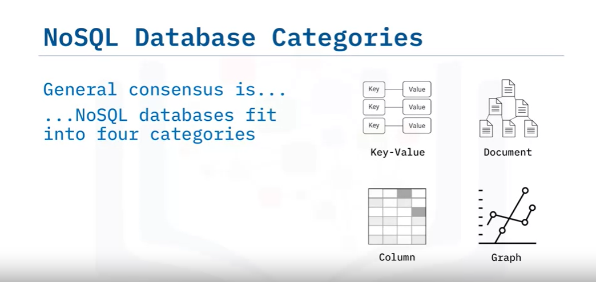
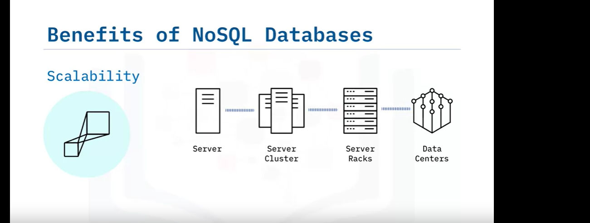

# Overview of NoSQL

Welcome to an overview of NoSQL. This video defines the term NoSQL, explains the technology it references, and describes the history of NoSQL in the database landscape.

### What is NoSQL?

The name NoSQL was introduced at an event discussing new open-source distributed databases, and it has stuck ever since. Contrary to its appearance, NoSQL stands for "Not Only SQL," not "NO SQL." The term describes databases that are non-relational, meaning they do not follow the traditional row and column relational database management system (RDBMS) structure. A more accurate term might be "non-relational" databases.

### Key Characteristics of NoSQL Databases

NoSQL databases provide new ways of storing and querying data that address modern application issues, particularly those associated with the "big data" movement. These databases are designed to handle:
- **Scale Problems**: Both in terms of data size and the number of concurrent users.
- **Specialized Use Cases**: They can be simpler to develop for specific application functionality compared to relational databases.

### History of NoSQL

#### 1970-2000: Dominance of Relational Databases
- Non-relational databases like IBM's IMS existed but were not widespread.
- The market was dominated by relational databases such as Oracle, IBM DB2, Microsoft SQL Server, and MySQL.

#### Dotcom Boom (Late 1990s/Early 2000s)
- Internet applications and companies surged, shifting from serving thousands of internal employees to millions of public users.
- Availability and performance became critical, leading to the development of new scalable technologies.
- Major contributions included:
  - **Google's MapReduce**: Described processing large data sets on distributed systems.
  - **Amazon's Dynamo**: Detailed a quorum-based architecture for distributing data and workload within a cluster.

#### Late 2000s: Emergence of NoSQL Databases
- Open-source communities developed several new databases:
  - **Apache CouchDB, Cassandra, HBase**
  - **MongoDB, Redis, Riak, Neo4j**
- These databases became popular for applications requiring larger scale than relational databases could handle.

#### Last 10 Years: Database-as-a-Service (DBaaS)
- NoSQL databases began leveraging a fully managed service model to offload administration and maintenance:
  - **IBM Cloudant**
  - **Amazon DynamoDB**


# Characteristics of NoSQL Databases

Welcome to "Characteristics of NoSQL Databases." This video describes the concepts and characteristics of NoSQL databases and explains the primary benefits of adopting a NoSQL database.

### What is NoSQL?

The most common trait among NoSQL databases is their non-relational architecture. But what types of NoSQL databases are available? And what is common to them?

### Types of NoSQL Databases

Efforts to categorize NoSQL databases have resulted in a general consensus that they fit into four types:
1. **Key-Value**
2. **Document**
3. **Column-based**
4. **Graph**


While there is some overlap among these types, the definitions aren’t always clear. You’ll learn more about the different types and their use cases later in this course.

### Common Characteristics of NoSQL Databases

Despite technical differences, NoSQL databases share several common traits:
- **Open Source Roots**: Many NoSQL databases originated from the open-source community, which has been fundamental for their growth. Companies often provide both a commercial version and services and support for the open-source counterpart. Examples include IBM Cloudant for CouchDB, Datastax for Apache Cassandra, and MongoDB.
- **Horizontal Scalability**: Most NoSQL databases are designed to scale horizontally and share their data more easily than relational databases. This often requires the use of a global unique key for simplifying partitioning (or ‘sharding’).


- **Specialization**: NoSQL databases are often more specialized for certain use cases compared to the Swiss army knife nature of relational databases.
- **Ease of Data Modeling**: Developers appreciate the ease of data modeling and use with NoSQL databases.
- **Flexible Schemas**: Unlike fixed schemas in relational databases, NoSQL databases often allow for more agile development with flexible schemas.

### Benefits of NoSQL Databases

The popularity of NoSQL databases is growing rapidly due to several benefits. Here are some of the most common reasons to adopt a NoSQL database:

1. **Scalability**:
   - Ability to horizontally scale across clusters of servers, racks, and data centers.
   - Elasticity to scale up and down to meet varying application demands.
   - Well-suited for large data sizes and high numbers of concurrent users typical of Big Data applications.

2. **Performance**:
   - Fast response times even with large data sets and high concurrency.
   - Leverage resources of large server clusters for optimal performance.

3. **High Availability**:
   - Running on a cluster of servers with multiple data copies ensures resilience.
   - More robust than single server solutions.

4. **Cost Efficiency**:
   - Reduced costs compared to traditional databases, especially when deployed on clusters in cloud architectures.
   - Cost savings without sacrificing performance and functionality.

5. **Flexible Schema and Intuitive Data Structures**:
   - Ability to build new features quickly without database locking or downtime.
   - More eloquent data structures for solving development needs, such as key-value stores, document stores, and graph databases.

6. **Specialized Capabilities**:
   - Specific indexing and querying capabilities, such as geospatial search.
   - Robust data replication and modern HTTP APIs.

### Why Not Always Use NoSQL?

Despite these benefits, there are still many requirements best met with a relational database management system (RDBMS). We’ll cover these scenarios later in the course.

### Summary

In this video, you learned that:
- NoSQL databases are non-relational.
- There are four categories of NoSQL databases.
- NoSQL databases have their roots in the open-source community.
- NoSQL database implementations vary technically, but they share several common characteristics.
- There are multiple benefits to adopting NoSQL databases.

Stay tuned for more detailed discussions on the different types of NoSQL databases and their specific use cases.


# NoSQL Database Types and Use Cases

## Document Store Databases
Document-store databases, also known as document-oriented databases, store data in a document format (typically JSON or BSON), where each document contains key-value pairs or key-document pairs. These databases are schema-less, allowing flexibility in data structures within a collection.

### Characteristics
- **Schema Flexibility**: Documents within collections can have varying structures, accommodating evolving data requirements.
- **Efficient CRUD Operations**: Well-suited for read and write-intensive applications due to their ability to retrieve whole documents.
- **Scalability**: Horizontal scalability by sharding data across clusters.

### Use Cases
- **Content Management Systems (CMS)**: Fast storage and access to various content types such as articles, images, and user data. *(MongoDB)*
- **E-commerce**: Management of product catalogs with diverse attributes and hierarchies, accommodating the dynamic nature of product listings. *(Couchbase, Amazon DocumentDB with MongoDB compatibility)*

### Frequently Mentioned Vendors
- MongoDB
- Couchbase
- Amazon DocumentDB

## Key-Value Stores
Key-value stores are the simplest NoSQL databases, storing data as a collection of key-value pairs where the key is unique and directly points to its associated value.

### Characteristics
- **High Performance**: Efficient for read and write operations, optimized for speedy retrieval based on keys.
- **Scalability**: Easily scalable due to their simple structure and ability to distribute data across nodes.
- **Caching**: Fast access via caching mechanisms.

### Use Cases
- **Web Performance**: Caching frequently accessed data for enhanced web performance. *(Redis, Memcached)*
- **E-commerce Platforms and Software Applications**: Handling high traffic and scaling dynamically for distributed systems. *(Amazon DynamoDB)*

### Frequently Mentioned Vendors
- Redis
- Memcached
- Amazon DynamoDB

## Column-Family Stores
Column-family stores, also referred to as columnar databases, organize data in columns rather than rows. These databases store columns of data together, making them efficient for handling large data sets with dynamic schemas.

### Characteristics
- **Column-Oriented Storage**: Efficient retrieval of specific columns.
- **Scalability**: Distributed architecture for high availability and scalability.

### Use Cases
- **IoT Applications**: Efficient management of massive amounts of sensor data, handling time-stamped data at scale. *(Apache Cassandra)*
- **User Preferences and Behaviors**: Storing and analyzing user preferences and behaviors for personalization. *(HBase)*

### Frequently Mentioned Vendors
- Apache Cassandra
- HBase

## Graph Databases
Graph databases are designed to manage highly interconnected data, representing relationships as first-class citizens alongside nodes and properties.

### Characteristics
- **Graph Data Model**: Relationships are as important as the data itself, enabling efficient traversal and querying of complex relationships.
- **Fast Relationship Queries**: Optimized for queries involving relationships, making them ideal for social networks, recommendation systems, and network analysis.

### Use Cases
- **Social Networks**: Efficient data management of relationships between users, posts, comments, and likes. *(Neo4j)*
- **Recommendation Systems**: Creating sophisticated recommendation engines by analyzing complex relationships between users, products, and behaviors. *(Amazon Neptune)*

### Frequently Mentioned Vendors
- Neo4j
- Amazon Neptune
- ArangoDB

## Wide-Column Stores
Wide-column store NoSQL databases organize data in tables, rows, and columns like relational databases but with a flexible schema.

### Characteristics
- **Columnar Storage**: Efficient retrieval of specific columns.
- **Scalability and Fault Tolerance**: Horizontal scalability and fault tolerance.

### Use Cases
- **Big Data Analysis**: Efficient handling of large-scale data processing for real-time analytics. *(Apache HBase)*
- **Enterprise Content Management**: Managing vast amounts of structured data like employee records or inventory. *(Cassandra)*

### Frequently Mentioned Vendors
- Apache HBase
- Apache Cassandra

## Expanded Use Case Example: Using MongoDB for a Content Management System (CMS)
Content management systems (CMS) collect, govern, manage, and enrich enterprise content, including HTML pages, images, articles, and more. MongoDB is a practical choice for CMS due to its schema flexibility and scalability.

### Content Structure Using MongoDB
In MongoDB, content is represented as documents. Each document corresponds to a piece of content, such as an article, image, video, or page.

#### Example of Structuring: Storing a Blog Post
```json
{
  "_id": 1,
  "title": "Sample Blog Post",
  "content": "This is the content of the blog post...",
  "author": {
    "name": "John Doe",
    "email": "john@example.com",
    "bio": "A passionate blogger.",
    "created_at": "2023-09-20T00:00:00Z"
  },
  "created_at": "2023-09-20T08:00:00Z",
  "tags": ["mongodb", "blogging", "example"],
  "comments": [
    {
      "text": "Great post!",
      "author": "Emily Johnson",
      "created_at": "2023-09-20T10:00:00Z"
    },
    {
      "text": "Thanks for sharing!",
      "author": "James Martin",
      "created_at": "2023-09-20T11:00:00Z"
    }
  ]
}
```


# Key-Value NoSQL Databases

## Introduction
Key-Value NoSQL databases are one of the four main categories of NoSQL databases, alongside Document, Wide Column, and Graph databases. This type of database is the least complex architecturally, making it highly suitable for applications requiring quick Create-Read-Update-Delete (CRUD) operations.

## Architecture
- **Structure**: Key-Value databases store data as a collection of key-value pairs, where each key is unique and directly points to its associated value.
- **Representation**: Typically represented as a hashmap.
- **Scalability**: These databases scale well and can be easily sharded across multiple nodes. Each shard contains a range of keys and their associated values.
- **Operation**: Best suited for single key operations due to their atomic nature for such operations. Complex queries involving multiple pieces of data are not ideal for Key-Value stores.
- **Value Blob**: The value blob is opaque, meaning it has limited flexibility in indexing and querying compared to other database types.

## Primary Use Cases
Key-Value databases are ideal for scenarios requiring fast performance for basic CRUD operations without the need for complex queries or relationships between data points. Typical use cases include:

1. **Session Information Storage**:
   - **Example**: Storing and retrieving session information for web applications.
   - **Details**: Each user session receives a unique key, and all session data is stored together in the value blob. Transactions are based solely on the unique key.

2. **User Profiles and Preferences**:
   - **Example**: Storing user profiles and preferences within an application.
   - **Details**: Each user profile is identified by a unique key, with all relevant data stored in the value blob.

3. **Shopping Cart Data**:
   - **Example**: Storing shopping cart data for online stores or marketplaces.
   - **Details**: Each shopping cart is associated with a unique key, containing all cart data in the value blob.

## When Not to Use Key-Value Databases
Key-Value databases may not be suitable for certain scenarios, including:
- **Interconnected Data**: Applications requiring complex queries or handling many-to-many relationships, such as social networking or recommendation engines, may exhibit poor performance.
- **Multi-Operation Transactions**: Use cases requiring a high level of consistency for multi-operation transactions involving multiple keys may need databases supporting ACID transactions.
- **Querying by Value**: If querying based on values rather than keys is required, consider using Document databases instead.

## Popular Implementations
Some well-known Key-Value NoSQL databases include:
- **Amazon DynamoDB**
- **Oracle NoSQL Database**
- **Redis**
- **Aerospike**
- **Riak KV**
- **MemcacheDB**
- **Project Voldemort**

## Summary
Key-Value NoSQL databases are a powerful solution for applications requiring fast CRUD operations and simple data storage mechanisms. They excel in scenarios where data is not highly interconnected and complex queries are not needed. By understanding their architecture and primary use cases, developers can effectively leverage Key-Value databases to meet their application requirements.


# Welcome to Document-Based NoSQL Databases

This guide describes the document-based NoSQL database category, including its architecture and primary use cases.

## Architecture

- **Document Model**: Builds off the Key-Value model by making the value visible and queryable.
- **Data Format**: Each piece of data is a document, typically stored in JSON or XML format.
- **Flexible Schema**: Documents offer a flexible schema, allowing different structures and information.
- **Indexing and Querying**: Ability to index and query the document contents, supporting key and value range lookups and analytical queries (e.g., MapReduce).
- **Scalability**: Horizontally scalable with sharding across multiple nodes, usually sharded by a unique key in the document.
- **Transaction Guarantees**: Guarantees atomic transactions only on single document operations.

## Use Cases

1. **Event Logging**: 
   - For applications or processes.
   - Each event instance is a document containing relevant information.

2. **Online Blogging**:
   - Users, posts, comments, likes, and actions are represented as documents.
   - Each document contains information such as username, content, and timestamps.

3. **Operational Datasets**:
   - Suitable for web and mobile applications.
   - Designed with the internet in mind, supporting JSON, RESTful API, and unstructured data.

## Limitations

- **ACID Transactions**: Not suitable for use cases requiring ACID transactions over multiple documents. Relational databases are better for this.
- **Aggregate-Oriented Design**: If data fits a normalized/tabular model naturally, a relational database may be more appropriate.

## Popular Implementations

- **IBM Cloudant**
- **MongoDB**
- **Apache CouchDB**
- **Terrastore**
- **OrientDB**
- **Couchbase**
- **RavenDB**

## Summary

- **Document-Based NoSQL Databases**: Use documents to make values visible and queryable.
- **Data Format**: Documents stored in JSON or XML.
- **Schema Flexibility**: Each document has a flexible schema.
- **Primary Use Cases**: Event logging, online blogging, and operational datasets for web and mobile applications.


# Welcome to Column-Based NoSQL Databases

This guide describes the column-based NoSQL database category, including its architecture and primary use cases.

## Architecture

- **Origin**: Derived from Google's Bigtable architecture, also known as Bigtable clones, Columnar databases, or Wide-Column databases.
- **Data Focus**: Emphasizes storing and accessing data in columns and groups of columns.
- **Column Families**: Consist of several rows, each with a unique key, that belong to one or more columns.
  - Rows in a column family are not required to share the same columns.
  - Columns can be added to any number of rows independently.

## Use Cases

1. **Sparse Data Handling**:
   - Ideal for large amounts of sparse data.
   - More efficient data compression compared to row-oriented databases.
   - Saves storage space.

2. **Horizontal Scalability**:
   - Can be deployed across clusters of nodes, similar to Key-Value and Document databases.

3. **Event Logging and Blogs**:
   - Suitable for enterprise logging where each application can write to its own set of columns.
   - Rows can be formatted to promote easy lookup based on application and timestamp.

4. **Counters**:
   - Useful for applications needing easy counting or incrementing as events occur.
   - Some databases, like Cassandra, have special column types for counters.

5. **Data with Expiration**:
   - Columns can have a time-to-live (TTL) parameter, useful for data with expiration dates, such as trial periods or ad timing.

## Limitations

- **ACID Transactions**: Not suitable for use cases requiring traditional ACID transactions provided by relational databases.
  - Reads and writes are atomic only at the row level.
- **Query Pattern Changes**: Early development may require numerous changes to column-based designs, potentially slowing down production.

## Popular Implementations

- **Cassandra**
- **HBase**
- **Hypertable**
- **Accumulo**

## Summary

- **Origin**: Column-based databases originated from Google's Bigtable.
- **Data Storage**: Data is stored in columns or groups of columns.
- **Column Families**: Consist of several rows with unique keys belonging to one or more columns.
- **Primary Use Cases**: Event logging, blogs, counters, and data with expiration values.


# Welcome to Graph NoSQL Databases

This guide describes the Graph NoSQL Database category, including its architecture and primary use cases.

## Architecture

- **Structure**: Stores information in entities (nodes) and relationships (edges).
- **Efficiency**: Excellent for traversing relationships quickly and efficiently.
- **Scalability**: Does not scale well horizontally. Sharding is not recommended due to performance issues with nodes split across multiple servers.
- **ACID Compliance**: Unlike other NoSQL databases, graph databases are ACID compliant, preventing dangling relationships between non-existent nodes.

## Use Cases

1. **Social Networking Sites**:
   - Quickly locate friends, friends of friends, likes, etc.

2. **Routing, Spatial, and Map Applications**:
   - Model data for finding close locations or building shortest routes.

3. **Recommendation Engines**:
   - Leverage close relationships and links between products to provide other options to customers.

## Limitations

- **Horizontal Scalability**: Not suitable for applications requiring horizontal scalability.
- **Node Updates**: Updating all or a subset of nodes with a given parameter can be difficult and complex.

## Popular Implementations

- **Neo4j**
- **OrientDB**
- **ArangoDB**
- **Amazon Neptune** (part of Amazon Web Services)
- **Apache Giraph**
- **JanusGraph**

## Summary

- **Structure**: Stores information in nodes (entities) and edges (relationships).
- **Efficiency**: Best for datasets resembling graph-like structures.
- **Scalability**: Does not shard well, but supports ACID transactions.
- **Primary Use Cases**: Highly connected data, social networking, routing, spatial and map applications, and recommendation engines.


# Glossary: Basics of NoSQL

Welcome! This alphabetized glossary contains many of the terms you'll find within this course. This comprehensive glossary also includes additional industry-recognized terms not used in course videos. These terms are important for you to recognize when working in the industry, participating in user groups, and participating in other certificate programs.

## A

- **ACID**: An acronym for Atomicity, Consistency, Isolation, and Durability, which is a set of properties that guarantee reliable processing of database transactions in traditional relational databases.
- **Atomic**: In the context of database transactions, atomic means that an operation is indivisible and either completes fully or is completely rolled back. It ensures that the database remains in a consistent state.

## B

- **BASE**: An alternative to ACID. Stands for basically available, soft state, eventually consistent. BASE allows for greater system availability and scalability, sacrificing strict consistency in favor of performance.
- **Bigtable**: A NoSQL database system developed by Google, designed for handling large amounts of data and providing high performance, scalability, and fault tolerance.

## C

- **Caching**: The temporary storage of frequently accessed data in high-speed memory reduces the need to fetch the data from the primary storage, which can significantly improve response times.
- **Cluster**: A group of interconnected servers or nodes that work together to store and manage data in a NoSQL database, providing high availability and fault tolerance.
- **Column database**: A NoSQL database model that stores data in column families rather than tables, making it suitable for storing and querying vast amounts of data with high scalability. Examples include Apache Cassandra and HBase.
- **CRUD**: CRUD is an acronym for create, read, update, and delete, which are the basic operations for interacting with and manipulating data in a database.

## D

- **DBaaS**: This acronym stands for database as a service, a cloud-based service that provides managed database hosting, maintenance, and scalability, allowing users to focus on application development without managing the database infrastructure.
- **Document**: A NoSQL database model that stores data in semi-structured documents, often in formats like JSON or BSON. These documents can vary in structure and are typically grouped within collections.

## G

- **Graph database**: A NoSQL database model optimized for storing and querying data with complex relationships, represented as nodes and edges. Examples include Neo4j and OrientDB.

## H

- **Horizontal scaling**: The process of adding more machines or nodes to a NoSQL database to improve its performance and capacity. This is typically achieved through techniques like sharding.

## I

- **Indexing**: The creation of data structures that improve query performance by allowing the database to quickly locate specific records based on certain fields or columns.

## J

- **JSON**: JSON is an acronym for JavaScript Object Notation, a lightweight data-interchange format used in NoSQL databases and other data systems. JSON is human-readable and easy for machines to parse.

## K

- **Key-value**: A NoSQL database model that stores data as key-value pairs. It's a simple and efficient way to store and retrieve data where each key is associated with a value.

## N

- **Normalized**: A database design practice where data is organized to minimize redundancy and maintain data integrity by breaking it into separate tables and forming relationships between them.
- **NoSQL**: NoSQL stands for "not only SQL." A type of database that provides storage and retrieval of data that is modeled in ways other than the traditional relational tabular databases.

## S

- **Sharding**: Refers to the practice of partitioning a database into smaller, more manageable pieces called shards to distribute data across multiple servers. Sharding helps with horizontal scaling.

## T

- **TTL**: Stands for "Time to Live," which is a setting in NoSQL databases that determines how long a piece of data should be retained before it's automatically removed from the database.

## X

- **XML**: Stands for Extensible Markup Language, another data interchange format used in some NoSQL databases. It's also human-readable and can represent structured data.


# Welcome to ACID versus BASE Operations

After watching this video, you'll be able to:

- Define the ACID and BASE acronyms.
- Describe the differences between ACID and BASE.
- Identify the use cases for ACID and BASE modeled systems.

One of the biggest and most striking differences between relational database management systems and NoSQL databases is their data consistency models. The two most common consistency models in use today are ACID and BASE.

Relational databases use the ACID model, while NoSQL databases generally use the BASE model. For example, MongoDB, a document-based NoSQL database, started supporting ACID transactions from Version 4.0.

Although ACID and BASE models are often seen as opposing approaches, the truth is that both come with their own advantages and disadvantages. Let's take a closer look at what both terms mean.

## ACID

The ACID acronym stands for:

- **Atomic**: All operations in a transaction succeed, or every operation is rolled back.
- **Consistent**: On the completion of a transaction, the structural integrity of the data in the database is not compromised.
- **Isolated**: Transactions cannot compromise the integrity of other transactions by interacting with them while they are still in progress.
- **Durable**: The data related to the completed transaction will persist, even in the case of network or power outages. If a transaction fails, it will not impact the already changed data.

Many developers are familiar with ACID transactions from working with relational databases. As such, the ACID consistency model has been the norm for some time. The ACID consistency model ensures that a performed transaction is always consistent. This makes the ACID consistency model a good fit for businesses that deal with online transaction processing, such as financial institutions or data warehousing applications. These organizations need database systems that can handle many small simultaneous transactions like relational databases can. An ACID system provides a consistent model you can count on for the structural integrity of your data.

### ACID Use Case Example

Financial institutions almost exclusively use ACID databases for their money transfers because these operations depend on the atomic nature of ACID transactions. An interrupted transaction that is not immediately removed from the database can cause serious complications, such as money being debited from one account but never credited to the other due to an error.

## BASE

In the NoSQL database world, ACID transactions are less common because some databases have loosened the requirements for immediate consistency, data freshness, and accuracy. They do this to gain other benefits, such as availability, scale, and resilience.

The BASE consistency model is used by marketing and customer service companies that deal with sentiment analysis and social network research. Social media applications that contain vast amounts of data and need to be always available, as well as worldwide online services like Netflix, Spotify, and Uber, also use the BASE model.

### BASE Consistency Model

The BASE data store values availability over consistency, but it doesn't offer guaranteed consistency of replicated data at write times. NoSQL databases use the BASE consistency model. Essentially, the BASE consistency model provides high availability.

The BASE acronym stands for:

- **Basically Available**: Rather than enforcing immediate consistency, BASE modeled NoSQL databases ensure the availability of data by spreading and replicating it across the nodes of the database cluster.
- **Soft State**: Due to the lack of immediate consistency, data values may change over time. In the BASE model, data stores don't have to be right consistent nor do different replicas have to be mutually consistent all the time.
- **Eventually Consistent**: The BASE model does not enforce immediate consistency, but it does eventually achieve it. However, until it does, data reads might be inconsistent.

### BASE Use Case Example

The fame of BASE databases increased because well-known worldwide online services such as Netflix, Apple, Spotify, and Uber use BASE data stores for applications like user profile data storage. A common characteristic of these services is that they must always be accessible, no matter where users are located. If a part of their database cluster becomes unavailable, the system needs to be able to serve user requests without any disruptions.

## Summary

In this video, you learned that ACID and BASE are the consistency models used in relational and NoSQL databases. 

- **ACID** stands for Atomicity, Consistency, Isolation, and Durability.
- **BASE** stands for Basically Available, Soft State, and Eventually Consistent.

While the ACID model focuses on data consistency, the BASE model focuses on data availability. Both consistency models have their applicability, and each model's usage is based on a case-by-case business analysis.

