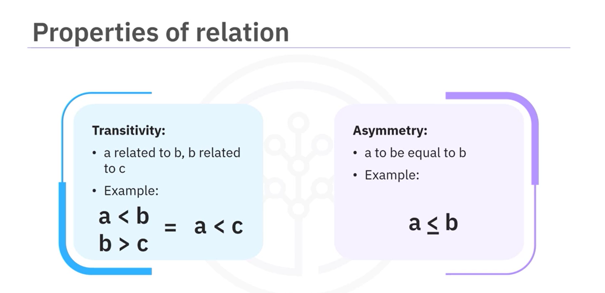
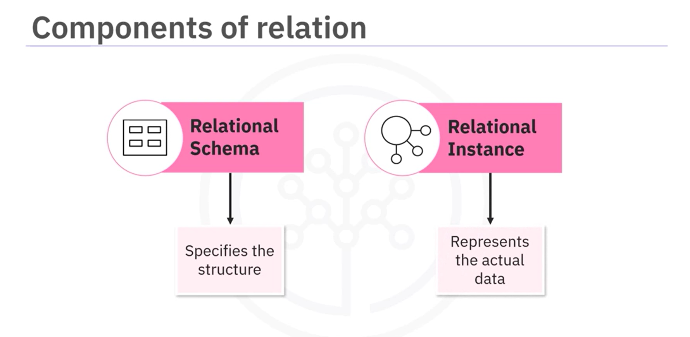

- Welcome to Review of Data Fundamentals. After watching this video, you will be able to:
  - Describe three important data structures with examples for each.
  - Identify common file formats for transferring data between systems.
  - Describe relational and non-relational databases.

- **Definition of Data:**
  - Data refers to unorganized information that undergoes processing to make it meaningful. It includes facts, observations, perceptions, numbers, characters, symbols, images, or a combination of these elements.

- **Types of Data Structures:**
  - **Structured Data:**
    - Highly organized and follows a predefined format.
    - Examples:
      - Excel spreadsheets
      - SQL databases
      - Online forms
  - **Unstructured Data:**
    - Lacks a specific format or organization.
    - Examples:
      - Text files
      - Media files (images, audio, video)
      - Web pages
      - Social media content
  - **Semi-Structured Data:**
    - Possesses some organizational properties but does not adhere to a strict tabular structure.
    - Examples:
      - JSON files
      - XML documents
      - Emails

- **Common File Formats for Data Transfer:**
  - Delimited text files (e.g., CSV, TSV)
  - Spreadsheets
  - Language files (e.g., XML, JSON)

- **Data Repositories:**
  - Actively store, manage, and organize data in a centralized manner.
  - Two major categories:
    - Relational databases
    - Non-relational databases

- **Relational Databases:**
  - Consist of structured data stored in related tables.
  - Examples: IBM DB2, Microsoft SQL Server, Oracle, MySQL
  - Used primarily for OLTP (Online Transaction Processing).

- **OLAP Systems:**
  - Focus on querying and analyzing large datasets for meaningful insights.
  - Include relational and non-relational databases, data warehouses, data lakes, and big data stores.

- **Non-Relational Databases:**
  - Offer flexibility in handling diverse and unstructured data.
  - Examples: MongoDB, Cassandra, Redis
  - MongoDB is suitable for storing semi-structured or unstructured data.

- **Conclusion:**
  - Different types and structures of data demand appropriate storage solutions.
  - Relational databases serve OLTP needs, OLAP systems enable complex analytics, and non-relational databases provide flexibility for diverse data.

### Data Models

- Welcome to Information and Data Models. After watching this video, you will be able to:
  - Describe the difference between an information model and a data model.
  - Explain the advantage of the relational model.
  - Describe the difference between an entity and an attribute.

- **Information Model vs Data Model:**
  - **Information Model:**
    - Abstract, formal representation of entities including properties, relationships, and operations.
    - Serves conceptual level, defining relationships between objects.
  - **Data Model:**
    - Concrete level, specific, includes details.
    - Blueprint of a database system.

- **Hierarchical Information Model:**
  - Organizes data using a tree structure.
  - Root is parent node, followed by child nodes.
  - First hierarchical database management system: IBM's Information Management System (1968).

- **Relational Model:**
  - Most used data model for databases.
  - Allows for data independence.
  - Data stored in tables providing logical, physical, and storage independence.

- **Entity-Relationship Data Model (ER Model):**
  - Alternative to relational model.
  - Used as a tool to design relational databases.
  - Entities are objects that exist independently in the database.
  - Entities have attributes characterizing them.
  - Entities represented as rectangles, attributes as ovals in ER Diagrams.
  - Entities become tables in the database, attributes become columns.

- **Example of ER Model:**
  - **Entity: Book**
    - Attributes: Title, edition, year written, etc.
  - **Entity: Author**
    - Attributes: Last name, first name, email, city, country, author ID.

- **Process of Entity Identification:**
  - Progress through identifying entities and their attributes.
  - Each entity becomes a table in the database.

- **In Conclusion:**
  - Information Models are abstract representations, while Data Models are more concrete and specific.
  - Relational Model offers advantages of logical, physical, and storage independence.
  - Entities represent objects independently in the database, with attributes characterizing them.

### Types of Relationships

- Welcome to Types of Relationships. After watching this video, you will be able to:
  - Describe the building blocks of a relationship.
  - Explain the symbols used in a relationship set.
  - Describe the difference between the one-to-one and many-to-many relationship.

- **Building Blocks of a Relationship:**
  - Entities
  - Relationship sets
  - Crows foot notations

- **Representation of Entities and Relationships:**
  - Entity sets: represented by rectangles
  - Relationship sets: represented by diamonds, with lines connecting associated entities
  - Crows foot notations: utilize symbols such as greater-than, less-than, and vertical lines for relationships

- **Entity-Relationship Diagram (ER Diagram):**
  - Represents entities (e.g., Book, Author) and their attributes (e.g., title, edition, author ID)
  - Attributes are connected to exactly one entity
  - Attributes omitted in relationship diagrams for clarity

- **Types of Relationships:**
  - **One-to-One Relationship:**
    - One entity associated with one and only one instance of another entity.
    - Example: One book has only one author.
    
  - **One-to-Many Relationship:**
    - One entity associated with one or more instances of another entity.
    - Example: One book has many authors.
    
  - **Many-to-Many Relationship:**
    - Many instances of an entity associated with many instances of another entity.
    - Example: Many authors write many different books.
    

- **Representation of Relationships:**
  - **One-to-One Relationship:**
    - Thick lines indicate each entity in the entity set is involved in exactly one relationship.
  - **One-to-Many Relationship:**
    - Represented by a less-than symbol, indicating one entity participating in more than one relationship.
  - **Many-to-Many Relationship:**
    - Represented by greater-than and less-than symbols on either side of the relationship set.

- **Conclusion:**
  - Building blocks of a relationship include entities, relationship sets, and crows foot notations.
  - One-to-one, one-to-many, and many-to-many relationships differ in the association between entities.
  - Understanding these relationships helps in modeling data effectively.

### Data Types

- Welcome to Data Types. After watching this video, you will be able to:
  - Explain what data types are.
  - Explain how data types are used in a database.
  - Identify some common data types.
  - Describe the advantages of using appropriate data types.

- **Database Table Representation:**
  - Represents a single entity with columns as attributes.
  - Each column should contain data of the same type.

- **Defining Data Types:**
  - Data type controls the type of data a column can store.
  - Different database management systems may have variations but generally support a standard set.

- **Common Data Types in RDBMS:**
  - **Character String Data Types:**
    - Fixed-length (e.g., CHAR(10)) and variable-length (e.g., VARCHAR).
  - **Numeric Data Types:**
    - Integer types (e.g., INT, SMALLINT, BIGINT) and decimal types (e.g., DECIMAL, NUMERIC).
  - **Date/Time Data Types:**
    - Dates, times, timestamps (e.g., DATE, TIME, DATETIME).
  - **Other Common Data Types:**
    - Boolean (e.g., BOOLEAN), binary string, large object (LOB), XML.

- **Advantages of Using Appropriate Data Types:**
  - Prevents incorrect data insertion.
  - Facilitates accurate sorting and selection of data.
  - Enables numeric calculations and standard function usage.

- **Custom Data Types:**
  - Relational databases allow creating custom or user-defined data types (UDTs) derived from built-in types.

- **Conclusion:**
  - Data types define the type of data stored in a column.
  - Choosing the correct data type offers several advantages.

### Relation Models

- **Welcome to Relational Model Concepts.** After watching this video, you will be able to:
  - Identify various set operations.
  - Describe the properties and aspects of relations.
  - Explain the difference between a relational schema and a relational instance.
  - Define relational terms such as degree and cardinality.

- **Sets and Relations:**
  - **Sets:**
    - Collections of unique elements without a specified order.
    - Basic operations include membership, subsets, union, intersection, and difference.
    
    
    
    
  - **Relations:**
    - Describe connections between elements of sets.
    - Common types include binary relations and ordered pairs.
    - Properties: reflexivity, symmetry, transitivity, and antisymmetry.
    
    

- **Relational Concepts:**
 
  - **Relation Schema:**
    - Specifies the structure of a relation including column names and types (attributes).
    
  - **Relation Instance:**
    - Represents the actual data stored in the table, consisting of rows (tuples) and columns.
    
  - **Degree and Cardinality:**
    - Degree: Number of attributes or columns in a relation.
    - Cardinality: Number of tuples or rows in a relation.

- **Conclusion:**
  - Sets and relations are fundamental concepts in the relational model.
  - Understanding key set operations and relation properties is crucial.
  - Relational schema and instance delineate the structure and data of relations.
  - Degree and cardinality are essential measures in analyzing relations.
