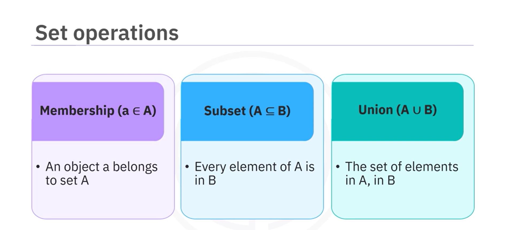
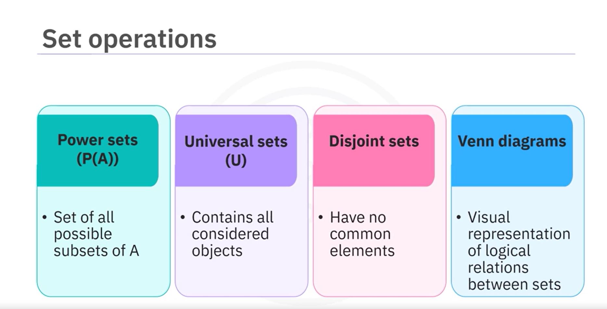
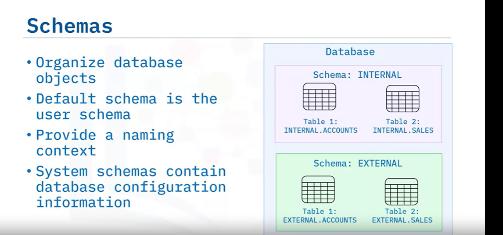
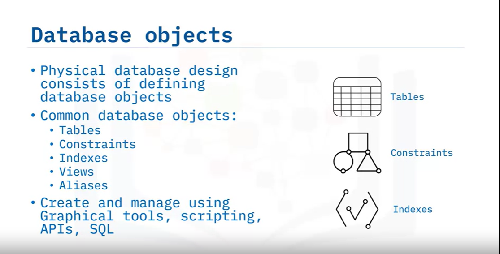
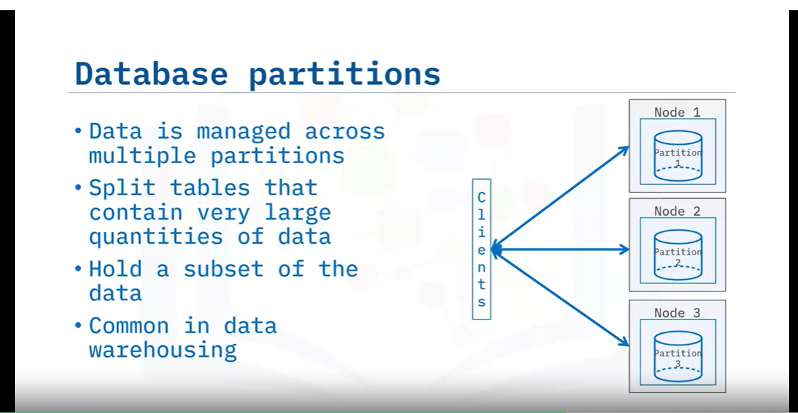

- Welcome to Review of Data Fundamentals. After watching this video, you will be able to:
  - Describe three important data structures with examples for each.
  - Identify common file formats for transferring data between systems.
  - Describe relational and non-relational databases.

- **Definition of Data:**
  - Data refers to unorganized information that undergoes processing to make it meaningful. It includes facts, observations, perceptions, numbers, characters, symbols, images, or a combination of these elements.

- **Types of Data Structures:**
  - **Structured Data:**
    - Highly organized and follows a predefined format.
    - Examples:
      - Excel spreadsheets
      - SQL databases
      - Online forms
  - **Unstructured Data:**
    - Lacks a specific format or organization.
    - Examples:
      - Text files
      - Media files (images, audio, video)
      - Web pages
      - Social media content
  - **Semi-Structured Data:**
    - Possesses some organizational properties but does not adhere to a strict tabular structure.
    - Examples:
      - JSON files
      - XML documents
      - Emails

- **Common File Formats for Data Transfer:**
  - Delimited text files (e.g., CSV, TSV)
  - Spreadsheets
  - Language files (e.g., XML, JSON)

- **Data Repositories:**
  - Actively store, manage, and organize data in a centralized manner.
  - Two major categories:
    - Relational databases
    - Non-relational databases

- **Relational Databases:**
  - Consist of structured data stored in related tables.
  - Examples: IBM DB2, Microsoft SQL Server, Oracle, MySQL
  - Used primarily for OLTP (Online Transaction Processing).

- **OLAP Systems:**
  - Focus on querying and analyzing large datasets for meaningful insights.
  - Include relational and non-relational databases, data warehouses, data lakes, and big data stores.

- **Non-Relational Databases:**
  - Offer flexibility in handling diverse and unstructured data.
  - Examples: MongoDB, Cassandra, Redis
  - MongoDB is suitable for storing semi-structured or unstructured data.

- **Conclusion:**
  - Different types and structures of data demand appropriate storage solutions.
  - Relational databases serve OLTP needs, OLAP systems enable complex analytics, and non-relational databases provide flexibility for diverse data.

### Data Models

- Welcome to Information and Data Models. After watching this video, you will be able to:
  - Describe the difference between an information model and a data model.
  - Explain the advantage of the relational model.
  - Describe the difference between an entity and an attribute.

- **Information Model vs Data Model:**
  - **Information Model:**
    - Abstract, formal representation of entities including properties, relationships, and operations.
    - Serves conceptual level, defining relationships between objects.
  - **Data Model:**
    - Concrete level, specific, includes details.
    - Blueprint of a database system.

- **Hierarchical Information Model:**
  - Organizes data using a tree structure.
  - Root is parent node, followed by child nodes.
  - First hierarchical database management system: IBM's Information Management System (1968).

- **Relational Model:**
  - Most used data model for databases.
  - Allows for data independence.
  - Data stored in tables providing logical, physical, and storage independence.

- **Entity-Relationship Data Model (ER Model):**
  - Alternative to relational model.
  - Used as a tool to design relational databases.
  - Entities are objects that exist independently in the database.
  - Entities have attributes characterizing them.
  - Entities represented as rectangles, attributes as ovals in ER Diagrams.
  - Entities become tables in the database, attributes become columns.

- **Example of ER Model:**
  - **Entity: Book**
    - Attributes: Title, edition, year written, etc.
  - **Entity: Author**
    - Attributes: Last name, first name, email, city, country, author ID.

- **Process of Entity Identification:**
  - Progress through identifying entities and their attributes.
  - Each entity becomes a table in the database.

- **In Conclusion:**
  - Information Models are abstract representations, while Data Models are more concrete and specific.
  - Relational Model offers advantages of logical, physical, and storage independence.
  - Entities represent objects independently in the database, with attributes characterizing them.

### Types of Relationships

- Welcome to Types of Relationships. After watching this video, you will be able to:
  - Describe the building blocks of a relationship.
  - Explain the symbols used in a relationship set.
  - Describe the difference between the one-to-one and many-to-many relationship.

- **Building Blocks of a Relationship:**
  - Entities
  - Relationship sets
  - Crows foot notations

- **Representation of Entities and Relationships:**
  - Entity sets: represented by rectangles
  - Relationship sets: represented by diamonds, with lines connecting associated entities
  - Crows foot notations: utilize symbols such as greater-than, less-than, and vertical lines for relationships

- **Entity-Relationship Diagram (ER Diagram):**
  - Represents entities (e.g., Book, Author) and their attributes (e.g., title, edition, author ID)
  - Attributes are connected to exactly one entity
  - Attributes omitted in relationship diagrams for clarity

- **Types of Relationships:**
  - **One-to-One Relationship:**
    - One entity associated with one and only one instance of another entity.
    - Example: One book has only one author.
    
  - **One-to-Many Relationship:**
    - One entity associated with one or more instances of another entity.
    - Example: One book has many authors.
    
  - **Many-to-Many Relationship:**
    - Many instances of an entity associated with many instances of another entity.
    - Example: Many authors write many different books.
    

- **Representation of Relationships:**
  - **One-to-One Relationship:**
    - Thick lines indicate each entity in the entity set is involved in exactly one relationship.
  - **One-to-Many Relationship:**
    - Represented by a less-than symbol, indicating one entity participating in more than one relationship.
  - **Many-to-Many Relationship:**
    - Represented by greater-than and less-than symbols on either side of the relationship set.

- **Conclusion:**
  - Building blocks of a relationship include entities, relationship sets, and crows foot notations.
  - One-to-one, one-to-many, and many-to-many relationships differ in the association between entities.
  - Understanding these relationships helps in modeling data effectively.

### Data Types

- Welcome to Data Types. After watching this video, you will be able to:
  - Explain what data types are.
  - Explain how data types are used in a database.
  - Identify some common data types.
  - Describe the advantages of using appropriate data types.

- **Database Table Representation:**
  - Represents a single entity with columns as attributes.
  - Each column should contain data of the same type.

- **Defining Data Types:**
  - Data type controls the type of data a column can store.
  - Different database management systems may have variations but generally support a standard set.

- **Common Data Types in RDBMS:**
  - **Character String Data Types:**
    - Fixed-length (e.g., CHAR(10)) and variable-length (e.g., VARCHAR).
  - **Numeric Data Types:**
    - Integer types (e.g., INT, SMALLINT, BIGINT) and decimal types (e.g., DECIMAL, NUMERIC).
  - **Date/Time Data Types:**
    - Dates, times, timestamps (e.g., DATE, TIME, DATETIME).
  - **Other Common Data Types:**
    - Boolean (e.g., BOOLEAN), binary string, large object (LOB), XML.

- **Advantages of Using Appropriate Data Types:**
  - Prevents incorrect data insertion.
  - Facilitates accurate sorting and selection of data.
  - Enables numeric calculations and standard function usage.

- **Custom Data Types:**
  - Relational databases allow creating custom or user-defined data types (UDTs) derived from built-in types.

- **Conclusion:**
  - Data types define the type of data stored in a column.
  - Choosing the correct data type offers several advantages.

### Relation Models

- **Welcome to Relational Model Concepts.** After watching this video, you will be able to:
  - Identify various set operations.
  - Describe the properties and aspects of relations.
  - Explain the difference between a relational schema and a relational instance.
  - Define relational terms such as degree and cardinality.

- **Sets and Relations:**
  - **Sets:**
    - Collections of unique elements without a specified order.
    - Basic operations include membership, subsets, union, intersection, and difference.
    
    
    
    
  - **Relations:**
    - Describe connections between elements of sets.
    - Common types include binary relations and ordered pairs.
    - Properties: reflexivity, symmetry, transitivity, and antisymmetry.
    
    

- **Relational Concepts:**
 
  - **Relation Schema:**
    - Specifies the structure of a relation including column names and types (attributes).
    
  - **Relation Instance:**
    - Represents the actual data stored in the table, consisting of rows (tuples) and columns.
    
  - **Degree and Cardinality:**
    - Degree: Number of attributes or columns in a relation.
    - Cardinality: Number of tuples or rows in a relation.

- **Conclusion:**
  - Sets and relations are fundamental concepts in the relational model.
  - Understanding key set operations and relation properties is crucial.
  - Relational schema and instance delineate the structure and data of relations.
  - Degree and cardinality are essential measures in analyzing relations.

# Database Architectures

Welcome to Database Architectures. After watching this video, you will be able to:

- Describe deployment topologies for DBs
- Explain 2-Tier and 3-Tier architectures, including their layers such as database drivers, interfaces, and APIs

The deployment topology you use for your database is determined by how it will be used and accessed. For example, you can deploy a small database which requires limited user access on a local desktop. The database resides on the user's system and access is often limited to a single user. This deployment topology is sometimes known as single-tier architecture. It is useful for development and testing or when the database is embedded in a local application.

You can deploy a larger database that many users must access in a client-server architecture. In this scenario, the database resides on a remote server and users access it from client systems, often through a web page or local application. Some scenarios employ a middle-tier (or an application server layer) between the application client and the remote database server. These client/server deployments are commonly used for multi-user scenarios and typical of production environments.

Deploying a database in the Cloud is an increasingly popular option. In a Cloud deployment, the database resides in a Cloud environment and has all the advantages of a cloud-based service. You don’t have to download or install the database software, you don’t have to maintain the supporting infrastructure, and it is easy for users to access from wherever they are, whatever they are doing, so long as they have an internet connection. In Cloud deployments, client apps and users typically access the database through an application server layer or interface in the cloud. Cloud deployments are very flexible; you can use them for development, testing, and full production environments.

## 2-Tier Architecture

Let’s look more closely at the client-server topology. It is also referred to as a 2-Tier architecture. In a 2-Tier database architecture, the database server and the application run in 2 separate tiers. The application in the client tier connects to the database server through some sort of database interface such as an API or Framework, which can be dependent on the programming language the application is written in. The database interface communicates with the database server through a Database Client or API that is installed on client system. The database management system software (DBMS) on the server includes multiple layers which on a high level can be categorized as:

- Data Access layer
- Database Engine layer
- Database Storage layer

The Data Access layer server includes interfaces for different types of clients which can include data industry standard APIs such as JDBC and ODBC, Command Line Processor (CLP) interfaces as well vendor specific or proprietary interfaces. The database server also contains an Engine which compiles queries, and retrieves and processes the data and returns the result set. The database storage or persistence layer is where the data is stored, which may be on local storage on the same device, or reside physically on network storage or specialized storage appliances.

## 3-Tier Architecture

In most production environments, especially in the last 20-25 years, the database server is typically not accessed directly (except by administrators). The client applications and users typically go through a middle tier such as a web application server, a BI server, etc, and hence referred to as 3-tier architecture. In this architecture, the application presentation layer and the business logic layer reside in different tiers. The presentation layer is the interface with which end-users interact, which could be a traditional desktop application, a web browser or a mobile application. The client application communicates with an application server over the network. The application server encapsulates the application and business logic and communicates with the database server through a database API or driver.

## Summary

In this video, you learned that databases are deployed in different topologies, depending on which best suits the processing and access requirements. 

- A single-tier topology is one where the database is installed on a user’s local desktop. It is useful for small databases that only require single user access.
- In 2-tier database topologies, the database resides on a remote server and users access it from client systems.
- In 3-tier database topologies, the database resides on a remote server and users access it through an application server or a middle-tier.
- In Cloud deployments, the database resides in the cloud, and users access it through an application server layer or another interface that also resides in the cloud.

# Distributed Architecture and Clustered Databases

Welcome to Distributed Architecture and Clustered Databases. After watching this video, you will be able to:

- Describe common types of database architecture along with their benefits.
- Describe some techniques for managing data and optimizing performance.

In our exploration of database architectures, we've primarily focused on single-server configurations. However, for critical or large-scale workloads where high availability or scalability is important, relational database management systems, RDBMSs, offer distributed architectures. These distributed database architectures involve clusters of machines interconnected through a network, distributing data processing and storage tasks. The approach brings about notable benefits including enhanced scalability, fault tolerance, and overall performance improvements.

## Types of Database Architecture

Let's now discuss the types of database architecture. The common types of database architecture include:

- Shared disk architecture
- Shared nothing architecture
- Combination and specialized architectures

### Shared Disk Architecture

Shared disk architecture involves multiple database servers processing workloads in parallel. Each server establishes a connection to shared storage and communications with other servers using high-speed interconnection. The shared disk architecture also facilitates the effective distribution of workloads, ensuring scalability as the demand for processing power grows. In the event of a server failure, a mechanism is in place to reroute clients seamlessly to other servers, maintaining high availability and minimizing service disruptions.

### Shared Nothing Architecture

Shared nothing architecture utilizes either replication or partitioning techniques. The approach allows for the effective distribution of client workloads across multiple nodes, promoting parallel processing and efficient resource utilization. One of the key advantages lies in enhanced fault tolerance achieved by rerouting clients to alternative nodes in the event of a server failure.

### Combination and Specialized Architectures

Certain distributed database architectures employ a combination of shared disk, shared nothing, replication, or partitioning techniques. Additionally, they integrate specialized hardware components to achieve specific goals related to availability and scalability.

## Techniques for Managing Data and Optimizing Performance

Now that you know different types of database architectures, let's explore some techniques for managing data and optimizing performance. Some of the common techniques include:

- Database replication
- Database partitioning and sharding

### Database Replication

Database replication involves copying changes from one database server to one or more replicas. This process distributes the client workload across servers, leading to improved performance. Replicas can be established for high availability within the same location or for disaster recovery across geographically distributed locations.

### Database Partitioning and Sharding

An alternative strategy involves partitioning tables with substantial data into logical segments, each containing a subset of the overall data, e.g., sales records for different quarters. This technique, known as sharding, places these partitions on separate nodes in a cluster. Each shard possesses its compute resources, processing, memory, and storage to operate on its specific subset of data. When a client issues a query, it is processed in parallel across multiple nodes or shards, and the results from different nodes are synthesized and returned to the client. Database partitioning and sharding are particularly prevalent in handling data warehousing and business intelligence workloads that involve extensive volumes of data.

In this video, you learned that RDBMSs offer distributed architectures for critical or large-scale workloads. Shared disk allows parallel processing with mechanisms for high availability during server failures. Shared nothing employs replication or partitioning for optimized performance. Database replication involves copying changes from one database server to one or more replicas. Sharding involves placing partitions on separate nodes, facilitating increased parallel processing and improved overall performance.

# Welcome to Db2

After watching this video, you will be able to:

- Describe Db2 and its history and features
- List various Db2 products and deployment options
- Describe Db2 on Cloud and its Plans
- Explain how you can work with Db2 on Cloud
- Describe Db2 high availability options
- Describe Db2 scalability with partitioning

## History and Features

Database 2, or DB2, was first released by IBM in 1983 and was an early example of a relational database management system. This first release ran on IBM mainframe computers, but over the years different versions were developed to run on many other platforms, including OS/2, UNIX, Linux, and Windows. After some time, the product was rewritten to use the same codebase across the multiple operating systems so that you can easily port applications accessing Db2 data from one operating system to another. After many iterations of the offering across many platforms and with enhanced functionality, today Db2 is a whole suite of database management products including Db2 Database, Db2 Warehouse, Db2 on Cloud, Db2 Warehouse on Cloud, Db2 Big SQL, Db2 Event Store, and Db2 for z/OS.

## Db2 Products and Deployment Options

- **Db2 Database**: Powerful enterprise-ready RDBMS optimized for OLTP.
- **Db2 Warehouse**: On-premises data warehouse for advanced data analytics and massively parallel processing.
- **Db2 on Cloud**: Fully managed, cloud-based SQL database with performance, high availability, scalability, and resilience.
- **Db2 Warehouse on Cloud**: Fully managed, elastic, cloud-based data warehouse with features similar to on-premises Db2 Warehouse.
- **Db2 Big SQL**: SQL-on-Hadoop engine for massively parallel processing and advanced querying functionality.
- **Db2 Event Store**: Memory-optimized database for analyzing streamed data for event-driven applications.
- **Db2 for z/OS**: Enterprise data server for IBM Z.

## Db2 on Cloud Plans

- **Lite Plan**: Free and time unlimited, limited to 200 MB of data and 15 simultaneous connections.
- **Standard Plan**: Provides flexible scaling of compute capability and storage, with built-in three-node high availability clustering.
- **Enterprise Plan**: Provides a dedicated database instance with flexible scaling of compute capability and storage, with built-in three-node high availability clustering.

## Working with Db2 on Cloud

- Access databases using CLPPlus command line interface, Db2 on Cloud GUI console, or standard APIs such as ODBC, JDBC, and REST.
- Load data from Excel, CSV, and text files, or from Amazon S3 object storage.
- Programmatically load data from IBM Cloud Object Storage.

## High Availability Options

- **HADR (High Availability Disaster Recovery)**: Replicates changes made at a primary database to up to three standby servers, supporting automatic promotion and failover.

## Scalability with Partitioning

- **Database Partitioning Feature**: Transparently splits data across partitions and servers for massively parallel processing.

In this video, you learned that Db2 is a family of products that you can use to work with and manage your data in whatever way you need. You can deploy Db2 across many platforms, both on premises and in the cloud. Cloud Pak for Data includes Db2 and many IBM tools for data. Db2 on Cloud is a fully managed, cloud-based SQL database that can run on IBM Cloud or AWS. Db2 provides high availability, disaster recovery, and scalability functionality.

# Welcome to MySQL

After watching this video, you will be able to:

- Describe MySQL
- Explain how you can work with MySQL
- List some of the MySQL storage engines
- Understand MySQL high availability and scalability options

## Description of MySQL

MySQL was first developed by a Swedish company MySQL AB and named after My, the daughter of one of the co-founders of MySQL AB, Monty Widenius. The company was later acquired by Sun Microsystems, which in turn was acquired by Oracle Corporation. MySQL soared in popularity in the late 1990s and early 2000s, partly because it was a key component in the LAMP (Linux operating system, Apache web server, MySQL database, and PHP scripting language) stack which was being used to build many popular websites at the time. MySQL is available under dual license: the open source GNU GPL and a commercial license for applications and solutions that embed MySQL. Because the GNU GPL is open source, there have been various forks of MySQL, the most prominent being MariaDB which is led by some of the original developers of MySQL. MySQL is an object-relational database management system.

## Working with MySQL

- MySQL is available in various flavors and editions, including a clustered version for demanding workloads.
- You can run MySQL on many versions of UNIX, as well as Microsoft Windows and Linux.
- Client applications for MySQL can be written using most modern programming languages.
- MySQL uses standard SQL syntax, as well as its own extensions for additional functionality.

## MySQL Storage Engines

- MySQL supports multiple storage engines, including:
  - **InnoDB**: Default engine providing a balance of high performance and reliability.
  - **MyISAM**: Suitable for mainly read operations with few updates.
  - **NDB**: Supports multiple instances of MySQL servers running in a cluster for high availability and redundancy.

## MySQL High Availability and Scalability

- **Replication**: Create copies of your data on one or more replicas to improve scalability and availability.
- **Clustering Options**:
  - **InnoDB with Group Replication**: Allows one read-write primary server and multiple secondary servers, with MySQL Router for load balancing and failover.
  - **MySQL Cluster Edition**: Uses the NDB storage engine for highly available and scalable solutions with multiple MySQL server nodes and data nodes.

In this video, you learned that MySQL is an object-relational database available in various editions, supports many operating systems and languages for client application development, supports relational and JSON data, provides multiple storage engines for differing workloads, and offers high availability and scalability options.

# Welcome to PostgreSQL

After watching this video, you will be able to:

- Describe PostgreSQL
- Explain how you can work with PostgreSQL
- Describe replication functionality in PostgreSQL

## Description of PostgreSQL

PostgreSQL originates from the POSTGRES project at the University of California more than 30 years ago. POSTGRES was used for many research and production applications across a range of industries, including financial services, aviation, and medicine. In 1994, the open-source Postgres95 was released which included an SQL language interpreter. This was soon renamed PostgreSQL and is today generally pronounced as simply Postgres. You can use it as part of the LAPP (Linux, Apache, PostgreSQL, and PHP) stack for web applications and websites. And you can also use independently developed extensions for additional functionality, such as PostGIS for geographic and spatial data handling. PostgreSQL is a free open-source object-relational database management system.

## Working with PostgreSQL

- PostgreSQL is compatible with most commonly used operating systems and supports many programming languages, enabling integration with web applications.
- It supports ANSI SQL standards and offers both relational database constructs and some NoSQL functionality.
- You can use standard relational database constructs such as keys, transactions, views, functions, and stored procedures.

## Replication Functionality in PostgreSQL

- PostgreSQL supports replication for high availability.
- It supports two-node synchronous replication where changes made to Node 1 are applied to Node 2, enabling shared read loads and failover.
- It also supports multi-node asynchronous replication for scalability, where changes from a master node are distributed to read-only replicas.
- Commercial editions like EDB PostgreSQL Replication Server provide multi-master read/write replication for greater flexibility in scaling applications.
- PostgreSQL also includes technologies like partitioning and sharding to enhance scalability and work with larger datasets.

In this video, you learned that PostgreSQL is an open-source, object-relational database that supports a range of languages for client application development, supports relational, structured, and non-structured data, and supports replication and partitioning for high availability and scalability.

## Data Movement Utilities

- Data engineers and database administrators often need to move data into and out of databases for various reasons, including:
  - Initially populating the entire database with objects such as tables.
  - Creating a working copy of the database for development and testing purposes.
  - Creating a snapshot of the database for disaster recovery.
  - Creating new tables from data extracted from external sources or files.
  - Adding or appending data into existing tables.
- Tools and utilities used for data movement in relational databases can be broadly classified into three categories:
  - Backup and Restore
  - Import and Export
  - Load
- Backup and Restore:
  - Backup creates files encapsulating all database objects and data, allowing restoration of an exact copy of the original database.
  - Useful for disaster recovery, development/test environments, and periodic backups of production databases.
- Import and Export:
  - Import reads data from a file and performs INSERT statements into the target table.
  - Export selects data from a table and saves it into a file.
  - Supported through various interfaces, including command-line utilities, management APIs, and graphical/web tools.
  - Common file formats include DEL (Delimited ASCII), ASC (Non-delimited ASCII), PC/IXF, and JSON.
- Example of Export in DB2:
  - In the DB2 console, select the table to export.
  - View data and click Export to CSV, specifying the file name and location.
- Load:
  - A faster alternative to Import, writes formatted pages directly into the database.
  - May bypass database logging for higher performance.
  - Useful for large volumes of data where referential or table constraints checking is not necessary.

## Database Objects and Hierarchy

Welcome to Database Objects and Hierarchy. After watching this video, you will be able to:

- Recall the hierarchy of database objects
- Describe an instance of a database
- Define the term relational database
- Explain when to create a new database
- Define the term schema
- Compare user schemas and system schemas
- Describe a database partition
- List commonly used database objects

Relational Database Management Systems (RDBMSes) contain many objects that Database Engineers and Database Administrators must organize. Storing tables, constraints, indexes, and other database objects in a hierarchical structure allows database administrators to manage security, maintenance, and accessibility. This example hierarchy gives you an overview of how RDBMSes are structured, although slight variations may occur between products. 

- Instance:
  - A logical boundary for organizing the database and its objects.
  - Can contain multiple databases.
  
- Schema:
  - A logical grouping of objects within a database.
  - Prevents ambiguous references and defines object naming conventions.
  
- Database Objects:
  - Tables, constraints, and indexes reside within a schema.
  
  
An instance is a logical boundary for a database or set of databases where you organize database objects and set configuration parameters. A relational database is a set of objects used to store, manage, and access data. Relationships between tables reduce redundant data and improve data integrity. 

- Schema:
  - Provides a way to logically group tables, views, triggers, functions, etc.
  - Helps distinguish between objects with the same name.
- User Schema:
  - Contains database objects like tables, views, functions.
- System Schema:
  - Contains configuration information and metadata for the database.

You can split very large tables across multiple partitions to improve performance. Database objects are items that exist within the database, such as tables, constraints, indexes, views, and aliases.

In this video, you learned that:
- An instance is a logical boundary for organizing a database.
- A relational database stores, manages, and accesses data.
- Schemas logically group database objects.
- User schemas contain database objects, while system schemas contain configuration information.
- Large tables can be split across multiple partitions for performance.
- Database objects include tables, constraints, indexes, views, and aliases.

