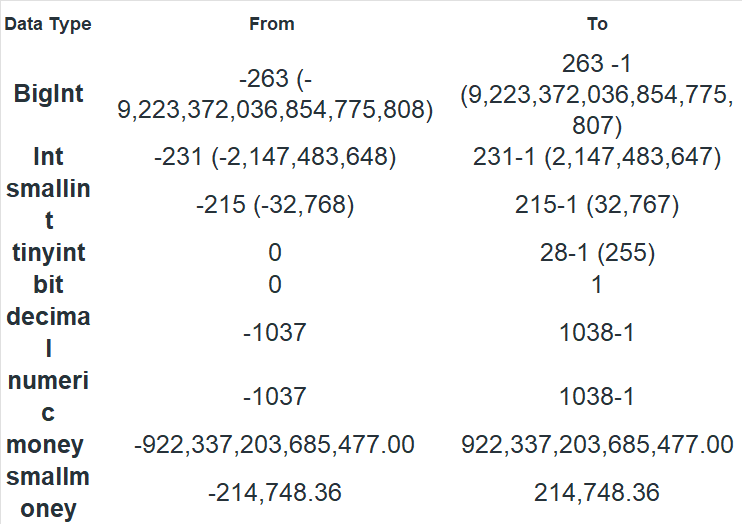
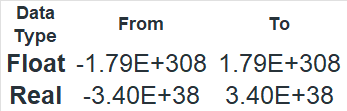
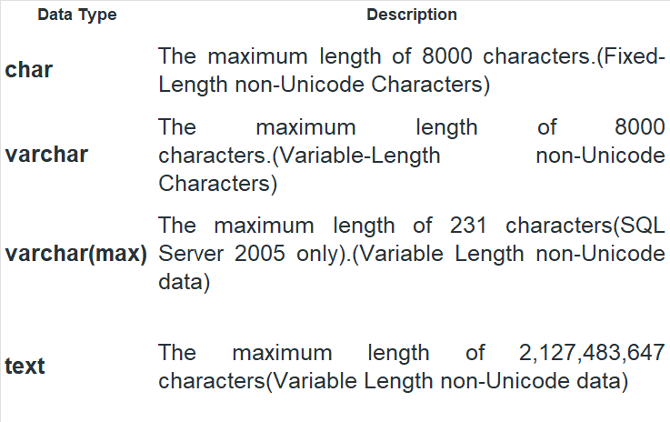
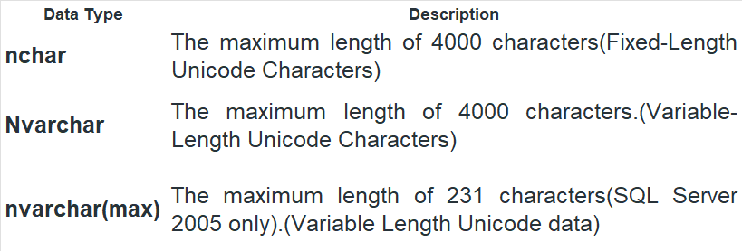
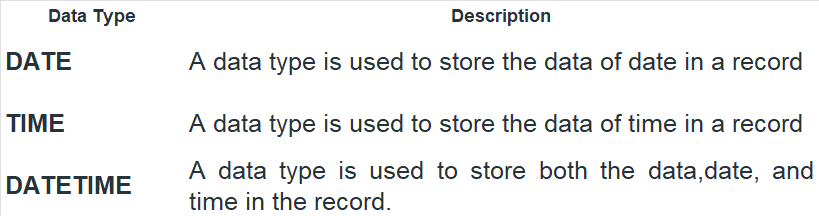

## Creating Table

```CREATE TABLE `movie` (
  `movie_name` text,
  `release_year` int DEFAULT NULL,
  `duration` int DEFAULT NULL,
  `rating` double DEFAULT NULL,
  `metascore` int DEFAULT NULL,
  `votes` text,
  `genre` text,
  `director` text,
  `cast` text,
  `gross` text,
  `date` datetime DEFAULT CURRENT_TIMESTAMP
) ENGINE=InnoDB DEFAULT CHARSET=utf8mb4 COLLATE=utf8mb4_0900_ai_ci;```
### Data Types in SQL

- Numeric Data Types 




- String Data Types




- Date Data Types


### Types of Database Languages


