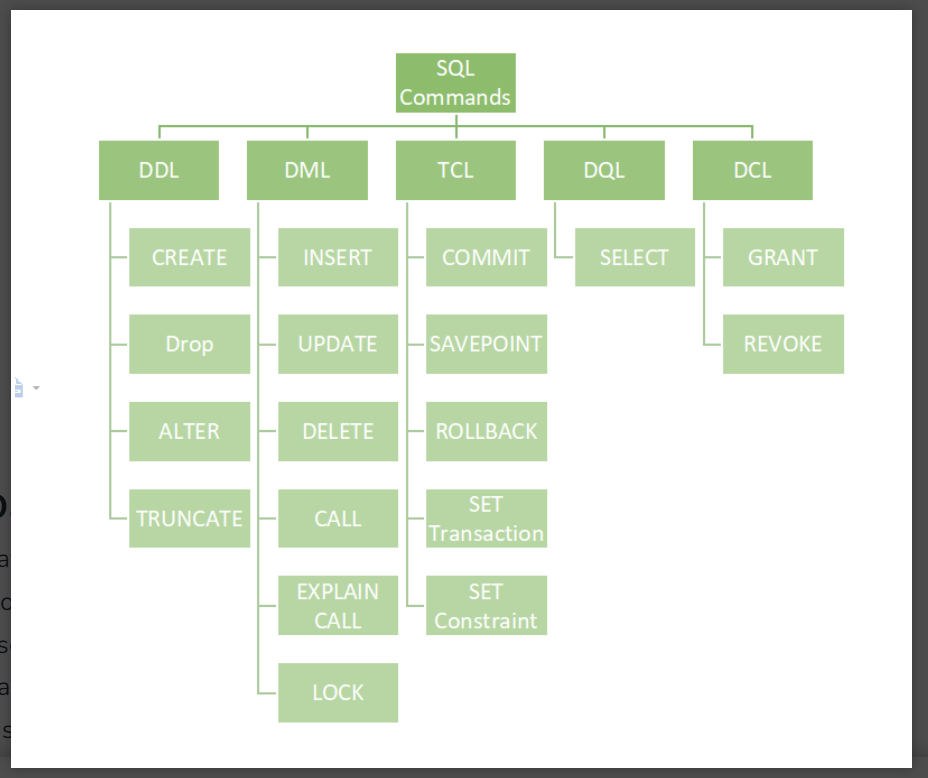

## Get the second highest grossing movies

```sql
   SELECT gross, movie_name FROM movie where gross != "NA" order by gross desc limit 1,1 ; 
   ```
   
### Creating DataBase
`CREATE DATABASE new_db;`

### List Databases in SQL
`SHOW DATABASES;`
### Use/Select Databases
`USE new_db`
### Drop Database in SQL
`DROP DATABASE new_db;`
### Rename Database
`ALTER DATABASE new_db MODIFY NAME = Example`

### Data Types in SQL

- Numeric Data Types 


- String Data Types


- Date Data Types


### Types of Database Languages
- DDL – Data Definition Language
- DQL – Data Query Language
- DML – Data Manipulation Language
- DCL – Data Control Language
- TCL – Transaction Control Language



- Data Definition Language
  -  Data Definition Language actually consists of the SQL commands that can be used to define the database schema. It simply deals with descriptions of the database schema and is used to create and modify the structure of database objects in the database. DDL is a set of SQL commands used to create, modify, and delete database structures but not data.
   - CREATE: to create a database and its objects like (table, index, views, store procedure, function, and triggers)
  
     ```CREATE TABLE `movie` (
  `movie_name` text,
  `release_year` int DEFAULT NULL,
  `duration` int DEFAULT NULL,
  `rating` double DEFAULT NULL,
  `metascore` int DEFAULT NULL,
  `votes` text,
  `genre` text,
  `director` text,
  `cast` text,
  `gross` text,
  `date` datetime DEFAULT CURRENT_TIMESTAMP
) ENGINE=InnoDB DEFAULT CHARSET=utf8mb4 COLLATE=utf8mb4_0900_ai_ci;```
   - ALTER: alters the structure of the existing database
   
  ```sql 
   ALTER TABLE `learn_sql`.`movie`RENAME TO  `learn_sql`.`movie_details`:
   
   ALTER TABLE `learn_sql`.`movie` ADD COLUMN `new_column` VARCHAR(45)NULL AFTER `date`, RENAME TO `learn_sql`.`movie_details`;
  
   ALTER TABLE `learn_sql`.`movie` DROP COLUMN `moviecol`;
  
   ALTER TABLE `learn_sql`.`movie` CHANGE COLUMN `date` `date` BLOB NULL DEFAULT NULL ;
   
   ALTER TABLE `learn_sql`.`movie` CHANGE COLUMN `date` `dateddd` BLOB NULL DEFAULT NULL ;
  
   ALTER TABLE `learn_sql`.`movie` CHANGE COLUMN `date` `date` datetime DEFAULT current_timestamp ;
  
   ALTER TABLE `learn_sql`.`movie` MODIFY COLUMN `date` BLOB NULL DEFAULT NULL ;
  
   ALTER TABLE Student ADD (AGE number(3),COURSE varchar(40));

  
 - DROP: delete objects from the database
  ```sql
   DROP TABLE movie;
   DROP DATABASE learn_sql; 
  ```
 - TRUNCATE: remove all records from a table, including all spaces allocated for the records are removed
  ```sql
    TRUNCATE `learn_sql`.`movie`;
  ```
 - COMMENT: add comments to the data dictionary
 - RENAME: rename an object


