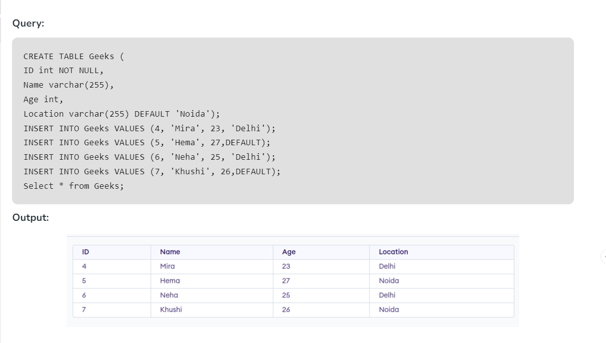

```sql
select max(release_year) as max_y from movie;
select min(release_year) as max_y from movie;
select count(*) from movie;
select avg(rating) from movie;
select sum(rating) from movie;
```

## Constraints

- ### NOT NULL
```sql
  CREATE TABLE `movie` (
  `movie_name` text not null primary key,
  `release_year` int DEFAULT NULL,
  `duration` int DEFAULT NULL,
  `rating` double DEFAULT NULL,
  `metascore` int DEFAULT NULL,
  `votes` text,
  `genre` text,
  `director` text,
  `cast` text,
  `gross` text,
  `date` datetime DEFAULT CURRENT_TIMESTAMP
) ENGINE=InnoDB DEFAULT CHARSET=utf8mb4 COLLATE=utf8mb4_0900_ai_ci;

ALTER TABLE movie modify movie_name Varchar(50) NOT NULL;

```

- ### UNIQUE

```sql
-- alter table movie add unique(sl_id);
-- alter table movie drop index `sl_id`;
-- CREATE TABLE Persons (
    ID int NOT NULL UNIQUE,
    LastName varchar(255) NOT NULL,
    FirstName varchar(255),
    Age int
);
-- alter table movie add unique(sl_id);
-- alter table movie drop index `sl_i
```

- ### PRIMARY KEY
- Properties :

  - No duplicate values are allowed, i.e. Column assigned as primary key should have UNIQUE values only.
  - NO NULL values are present in column with Primary key. Hence there is Mandatory value in column having Primary key.
  - Only one primary key per table exist although Primary key may have multiple columns.
  - No new row can be inserted with the already existing primary key.
  - Classified as : a) Simple primary key that has a Single column 2) Composite primary key has Multiple column.
  - Defined in Create table / Alter table statement.

```sql
  -- Create Table Person
        ( Id int NOT NULL PRIMARY KEY, 
        Name varchar2(20), 
        Address varchar2(50)
        );
  -- Alter Table movie add Primary Key(duration);
  -- Alter Table Person add Primary Key(Id, Name);
  -- ALTER table Person DROP PRIMARY KEY;

```
- ### FOREIGN KEY
  - Properties:
    - The parent field that is being referenced has to be unique/Primary Key.
    - The child field may have duplicates and nulls.
    - Parent records can be deleted if no child exists.
    - The master table cannot be updated if a child exists.
    - Must reference PRIMARY KEY in the primary table.
    - The foreign key column and constraint column should have matching data types.
    - Records cannot be inserted in the child table if a corresponding record in the master table does not exist.
    - Records of the master table cannot be deleted if corresponding records in the child table exist.
  
```sql

CREATE TABLE people (no int references person, 
                          Fname varchar2(20));
                OR
CREATE TABLE people (no int references person(id), 
                              Fname varchar2(20));

CREATE TABLE people (
   no varchar2(10),
   fname varchar2(20),
   foreign key(no) references 'person' on delete cascade
);

CREATE TABLE 
people(no varchar2(10), 
       fname varchar2(20), 
       foreign key(no) references `person` on delete set null);

```

- ### COMPOSITE KEY

```sql
CREATE TABLE student
(rollNumber INT, 
name VARCHAR(30), 
class VARCHAR(30), 
section VARCHAR(1), 
mobile VARCHAR(10),
PRIMARY KEY (rollNumber, mobile));

-- In this example, we have made the composite key as the combination of two columns i.e. rollNumber and mobile because all the rows of the table student can be uniquely identified by this composite key.
```

- ### ALTERNATE KEY


- A Primary Key can’t be an Alternate Key. For a table with a single Candidate Key which has to be the Primary Key will not contain any Alternate Key.
- A Foreign Key can’t be an Alternate Key as it is only used to reference another table.
- The alternate Key should be unique.
- An Alternate Key can be a set of a single attribute or multiple attributes.
- It can be NULL as well.

```sql
CREATE TABLE Table_name(
col_1 TYPE col_1_constraint,
col_2 TYPE col_2 constraint,
col_3 TYPE UNIQUE,
col_4 TYPE REFERENCES Table_Name(col_name),
.....
)

col: The name of the columns.
TYPE: Data type whether an integer, variable character, etc
col_constraint: Constraints in SQL like PRIMARY KEY, NOT NULL, UNIQUE, REFERENCES, etc.
col_3: Defining an ALTERNATE KEY using constraint UNIQUE
col_4: Defining an FOREIGN KEY using constraint REFERENCES

```


- ### CHECK

```sql
CREATE TABLE pets(
        ID INT NOT NULL,
        Name VARCHAR(30) NOT NULL,
        Breed VARCHAR(20) NOT NULL,
        Age INT,
        GENDER VARCHAR(9),
        PRIMARY KEY(ID),
        check(GENDER in ('Male', 'Female', 'Unknown'))
        );
 
 CREATE TABLE student(
        StudentID INT NOT NULL,
        Name VARCHAR(30) NOT NULL,
        Age INT NOT NULL,
        GENDER VARCHAR(9),
        PRIMARY KEY(ID),
        check(Age >= 17)
        );
  
alter table TABLE_NAME modify COLUMN_NAME check(Predicate);

alter table TABLE_NAME add constraint CHECK_CONST check (Predicate);

alter table TABLE_NAME drop constraint CHECK_CONSTRAINT_NAME;

alter table TABLE_NAME drop check CHECK_CONSTRAINT_NAME;


```

- ### DEFAULT


```sql

CREATE TABLE Geeks (
ID int NOT NULL,
Name varchar(255),
Age int,
Location varchar(255) DEFAULT 'Noida');
INSERT INTO Geeks VALUES (4, 'Mira', 23, 'Delhi');
INSERT INTO Geeks VALUES (5, 'Hema', 27,DEFAULT);
INSERT INTO Geeks VALUES (6, 'Neha', 25, 'Delhi');
INSERT INTO Geeks VALUES (7, 'Khushi', 26,DEFAULT);
Select * from Geeks;


ALTER TABLE Geeks ALTER COLUMN Location DROP DEFAULT;
```