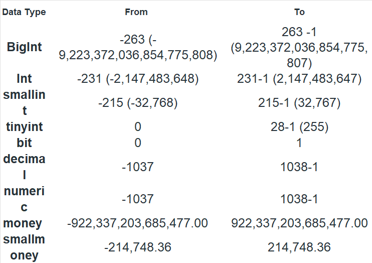
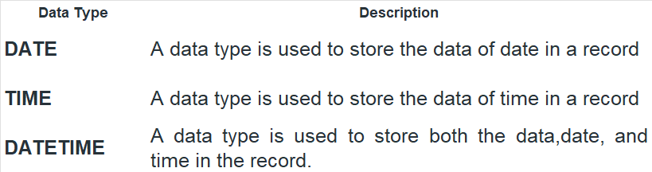

## Get the second highest grossing movies

```sql
   SELECT gross, movie_name FROM movie where gross != "NA" order by gross desc limit 1,1 ; 
   ```
   
### Creating DataBase
`CREATE DATABASE new_db;`

### List Databases in SQL
`SHOW DATABASES;`
### Use/Select Databases
`USE new_db`
### Drop Database in SQL
`DROP DATABASE new_db;`
### Rename Database
`ALTER DATABASE new_db MODIFY NAME = Example`

### Data Types in SQL

- Numeric Data Types 




- String Data Types


- Date Data Types


### Types of Database Languages
- DDL – Data Definition Language
- DQL – Data Query Language
- DML – Data Manipulation Language
- DCL – Data Control Language
- TCL – Transaction Control Language


### Data Definition Language
  -  Data Definition Language actually consists of the SQL commands that can be used to define the database schema. It simply deals with descriptions of the database schema and is used to create and modify the structure of database objects in the database. DDL is a set of SQL commands used to create, modify, and delete database structures but not data.
   - CREATE: to create a database and its objects like (table, index, views, store procedure, function, and triggers)
  
     ```CREATE TABLE `movie` (
  `movie_name` text,
  `release_year` int DEFAULT NULL,
  `duration` int DEFAULT NULL,
  `rating` double DEFAULT NULL,
  `metascore` int DEFAULT NULL,
  `votes` text,
  `genre` text,
  `director` text,
  `cast` text,
  `gross` text,
  `date` datetime DEFAULT CURRENT_TIMESTAMP
) ENGINE=InnoDB DEFAULT CHARSET=utf8mb4 COLLATE=utf8mb4_0900_ai_ci;```
   - ALTER: alters the structure of the existing database
   
  ```sql 
   ALTER TABLE `learn_sql`.`movie`RENAME TO  `learn_sql`.`movie_details`:
   
   ALTER TABLE `learn_sql`.`movie` ADD COLUMN `new_column` VARCHAR(45)NULL AFTER `date`, RENAME TO `learn_sql`.`movie_details`;
  
   ALTER TABLE `learn_sql`.`movie` DROP COLUMN `moviecol`;
  
   ALTER TABLE `learn_sql`.`movie` CHANGE COLUMN `date` `date` BLOB NULL DEFAULT NULL ;
   
   ALTER TABLE `learn_sql`.`movie` CHANGE COLUMN `date` `dateddd` BLOB NULL DEFAULT NULL ;
  
   ALTER TABLE `learn_sql`.`movie` CHANGE COLUMN `date` `date` datetime DEFAULT current_timestamp ;
   
   ALTER TABLE movie RENAME COLUMN NAME TO FIRST_NAME;
   
   ALTER TABLE table_name CHANGE COLUMN old_name TO new_name;

   ALTER TABLE `learn_sql`.`movie` MODIFY COLUMN `date` BLOB NULL DEFAULT NULL ;
  
   ALTER TABLE Student ADD (AGE number(3),COURSE varchar(40));

  
 - DROP: delete objects from the database
  ```sql
   DROP TABLE movie;
   DROP DATABASE learn_sql; 
  ```
 - TRUNCATE: remove all records from a table, including all spaces allocated for the records are removed
  ```sql
    TRUNCATE `learn_sql`.`movie`;
  ```
 - COMMENT: add comments to the data dictionary
  ```sql
 -- select * from movie;
   /* alter table movie modify 
   column movie_name ; */ 
  ```

 - RENAME: rename an object
  ```sql
  alter table movie rename movie_name to movie_names; 
  ```

### Data Query Language

- ### SELECT

### Data Manipulation Language
- ### INSERT

```sql
    INSERT into movie (`movie_name`) values ("Test Movie");
    insert into movie(`movie_name`) values ("new Movie"),("New Movie 2");
    INSERT into movie values ("Test Movie",2024,180,9,100,'100200','Horror',"New","new",'$12.3M',current_timestamp);
    INSERT INTO Student SELECT * FROM LateralStudent;
    INSERT INTO Student(ROLL_NO,NAME,Age) SELECT ROLL_NO, NAME, Age FROM LateralStudent;
    INSERT INTO Student SELECT * FROM LateralStudent WHERE Age = 18;
```

- ### UPDATE

```sql
update movie set duration = 181; -- will update the every rows
update movie set duration = 180 where movie_name LIKE 'Test%' and duration <= 180; -- update the rows with condition
UPDATE Customer SET CustomerName = 'Satyam', Country = 'USA' WHERE CustomerID = 1;


```

- ### DELETE

```sql
delete from movie where movie_name like 'Test%';
DELETE FROM movie; or DELETE * FROM movie; -- to delete all records
```

- ### LOCK


- Shared (S) Locks: When the object needs to be read, this type of lock will occur, but this is not harmful.
- Exclusive (X) Locks: It prevents other transactions like inserting/updating/deleting etc., Hence no modifications can be done on a locked object.
- Update (U) Locks: More or less similar to Exclusive lock but here the operation can be viewed as “read phase” and “write phase”. Especially during the read phase, other transactions are prevented. 
- Intent Locks: When SQL Server has the shared (S) lock or exclusive (X) lock on a row, then the intent lock is on the table.
- Regular intent locks: Intent exclusive (IX) , Intent shared (IS), and Intent update (IU).
- Conversion locks: Shared with intent exclusive (SIX), Shared with intent update (SIU), and Update with intent exclusive (UIX).
```sql
UNLOCK TABLES;
```

### Data Control Language
- DCL includes commands such as GRANT and REVOKE which mainly deal with the rights, permissions, and other controls of the database system.

- ### GRANT

  ```sql
  GRANT ALL ON Users TO 'Amit'@'localhost'; -- Granting All the Privilege to a User in a Table
  GRANT SELECT  ON Users TO '*'@'localhost'; -- Granting a Privilege to all Users in a Table
  GRANT EXECUTE ON  PROCEDURE  object TO user;
  GRANT EXECUTE ON  FUNCTION  object TO user;
  GRANT EXECUTE ON FUNCTION Calculatesalary TO 'Amit'@'localhost';
  GRANT EXECUTE ON FUNCTION Calculatesalary TO '*'@'localhost'; 
  GRANT EXECUTE ON PROCEDURE DBMSProcedure TO 'Amit'@'localhost'; 
  GRANT EXECUTE ON PROCEDURE DBMSProcedure TO '*'@'localhost';
  SELECT * FROM mysql.user; 
  show grants for 'root'@'localhost';
    GRANT APPLICATION_PASSWORD_ADMIN,AUDIT_ABORT_EXEMPT,AUDIT_ADMIN,AUTHENTICATION_POLICY_ADMIN,BACKUP_ADMIN,BINLOG_ADMIN,BINLOG_ENCRYPTION_ADMIN,CLONE_ADMIN,CONNECTION_ADMIN,ENCRYPTION_KEY_ADMIN,FIREWALL_EXEMPT,FLUSH_OPTIMIZER_COSTS,FLUSH_STATUS,FLUSH_TABLES,FLUSH_USER_RESOURCES,GROUP_REPLICATION_ADMIN,GROUP_REPLICATION_STREAM,INNODB_REDO_LOG_ARCHIVE,INNODB_REDO_LOG_ENABLE,PASSWORDLESS_USER_ADMIN,PERSIST_RO_VARIABLES_ADMIN,REPLICATION_APPLIER,REPLICATION_SLAVE_ADMIN,RESOURCE_GROUP_ADMIN,RESOURCE_GROUP_USER,ROLE_ADMIN,SENSITIVE_VARIABLES_OBSERVER,SERVICE_CONNECTION_ADMIN,SESSION_VARIABLES_ADMIN,SET_USER_ID,SHOW_ROUTINE,SYSTEM_USER,SYSTEM_VARIABLES_ADMIN,TABLE_ENCRYPTION_ADMIN,TELEMETRY_LOG_ADMIN,XA_RECOVER_ADMIN ON *.* TO `root`@`localhost` WITH GRANT OPTION
    GRANT PROXY ON ``@`` TO `root`@`localhost` WITH GRANT OPTION
    GRANT SELECT, INSERT, UPDATE, DELETE, CREATE, DROP, RELOAD, SHUTDOWN, PROCESS, FILE, REFERENCES, INDEX, ALTER, SHOW DATABASES, SUPER, CREATE TEMPORARY TABLES, LOCK TABLES, EXECUTE, REPLICATION SLAVE, REPLICATION CLIENT, CREATE VIEW, SHOW VIEW, CREATE ROUTINE, ALTER ROUTINE, CREATE USER, EVENT, TRIGGER, CREATE TABLESPACE, CREATE ROLE, DROP ROLE ON *.* TO `root`@`localhost` WITH GRANT OPTION

  ```

- ### REVOKE

```sql
REVOKE SELECT ON  Users FROM 'Amit'@'localhost';
REVOKE SELECT, INSERT, DELETE, UPDATE ON Users FROM 'Amit'@'localhost'; 
REVOKE ALL ON Users FROM 'Amit'@'localhost'; 
REVOKE SELECT  ON Users FROM '*'@'localhost'; 
REVOKE EXECUTE ON [ PROCEDURE | FUNCTION ] object FROM User; 
REVOKE EXECUTE ON FUNCTION Calculatesalary FROM 'Amit'@'localhost'; 
REVOKE EXECUTE ON FUNCTION Calculatesalary FROM '*'@'localhost'; 
REVOKE EXECUTE ON PROCEDURE DBMSProcedure FROM 'Amit'@'localhost'; 
REVOKE EXECUTE ON PROCEDURE DBMSProcedure FROM '*'@'localhost'; 

```

### Transaction Control Language (TCL)

- ### BEGIN: Opens a Transaction.
- ### COMMIT: Commits a Transaction.
```sql
COMMIT;  
```
- ### ROLLBACK
- The process of reversing changes is called rollback. This command can only be used to undo transactions since the last COMMIT or ROLLBACK command was issued. 
```sql

DELETE FROM Student WHERE AGE = 20;
ROLLBACK;

```

- ### SAVEPOINT
- SAVEPOINT creates points within the groups of transactions in which to ROLLBACK. 

```sql
SAVEPOINT SP1;
//Savepoint created.
DELETE FROM Student WHERE AGE = 20;
//deleted
SAVEPOINT SP2;
//Savepoint created.

ROLLBACK TO SP1;
//Rollback completed

RELEASE SAVEPOINT SP1
This command is used to remove a SAVEPOINT that you have created.


```

### COPY

```sql

create table movie_copy as select * from movie; -- copy the table with the data
create table movie_copy_copy as select * from movie where 1 = 2; -- copy the table without data
create table movie_names  as select movie_name , release_year from movie;
```

### Temporary Table

- Temporary Tables are most likely as Permanent Tables. Temporary Tables are Created in TempDB and are automatically deleted as soon as the last connection is terminated. Temporary Tables helps us to store and process intermediate results. Temporary tables are very useful when we need to store temporary data.

```sql
create temporary table movie_temp as select * from movie limit  1;
```