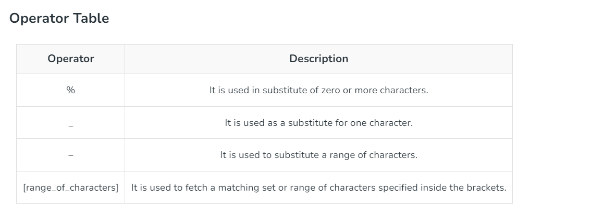

```sql

-- select * from movie where release_year > 2000;
-- select * from movie where release_year >= 1972;
-- select * from movie where release_year < 1972;
-- select * from movie where release_year <= 1972;
-- select * from movie where release_year = 1972;
-- select * from movie where release_year <> 2000;
-- select * from movie where release_year between 1972 and 1995;
-- select * from movie where movie_name not like 'S%';
-- select * from movie where movie_name not like '% %';
-- select * from movie where movie_name like '% %';
-- select * from movie where movie_name like 'S%';
-- select * from movie where movie_name like 'B_g'; -- matches the movie name with char of 3 letters startswith B and endswith g 
-- SELECT * FROM movie WHERE movie_name  regexp '[:space:]'; -- matches the row name does  conatin any space between
-- SELECT * FROM movie WHERE movie_name  not regexp '[:space:]'; -- matches the row name does not  conatin any space between
-- SELECT * FROM movie WHERE movie_name  not regexp '[a-b]'; --  matches the row name does not  conatin any letters 'a' and 'b'
-- select * from movie where votes like '1__2%'; -- tp fetch the records with votes having 1 at first position and 2 at third position
-- select * from movie where char_length(movie_name) < 4;
-- select * from movie where release_year in (1971,2000);
-- select date_format( release_date,'%d %M %Y') from movie;
-- select * from movie where movie_name like 'S%' and release_year between 1980 and 2000;
-- select * from movie where movie_name like 'S%' or release_year between 1980 and 2000;
-- select * from movie where movie_name like 'S%' or ( release_year between 1980 and 2000 and metascore < 100);
-- select * from movie where movie_name like 'S%' or ( release_year between 1980 and 2000 and metascore < 100);
-- select * from movie where release_year <> -- 1982;
-- select * from movie where release_year != 1982;
-- select * from movie where release_year is null;
-- select * from movie where release_year is not null;
-- select count(*) from  (select * from movie union all select * from movie_copy) as t;
-- select count(*) from  (select * from movie union all select * from movie_copy) as t;
-- alter  table movie_copy add column `sl_id` INT primary key auto_increment;
-- alter table movie_copy rename column `date` to `release_date`;
-- select * from (select movie_name from movie except select * from movie_copy)
-- select movie_name from movie except all select movie_name from movie_copy;
-- select movie_name from movie except select movie_name from movie_copy;
-- select all movie_name from movie;
-- select * from movie where movie_name = ANY ( select movie_name from movie_copy where movie_name  like 'S%');
-- select * from movie where movie_name = ALL ( select movie_name from movie_copy where movie_name  like 'S%');
-- select *,sum(votes) from movie group by release_year;

-- alter table movie change column `votes` `votes` int(2) default null;
-- delete from movie where votes is null;
-- select * from movie;

-- select movie_name from movie where movie_name like 's%' INTERSECT select movie_name from movie_copy where movie_name like 's%';
-- select * from movie where exists (select * from movie where release_year = 2025);
-- select * from movie where not exists (select * from movie where release_year = 2024); 

-- select movie_name, release_year , case when release_year between 1970 and 1980 THEN 'Oldest Movie' when release_year between 1980 and 2000 then 'old movie' else 'New movie' end as movie_old from movie;

```
-- 