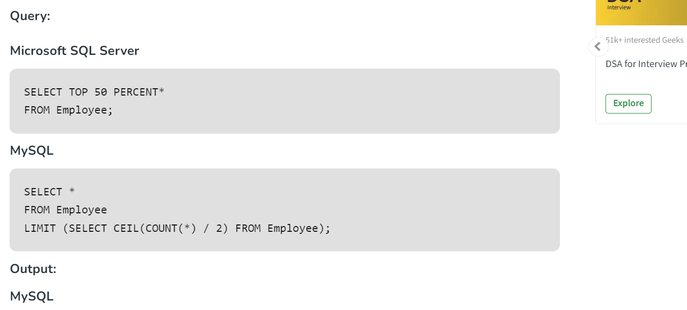
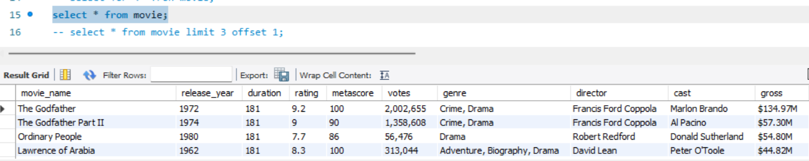
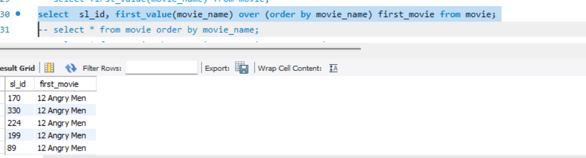
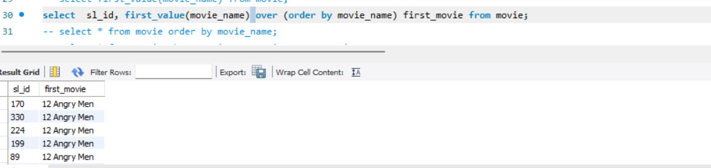
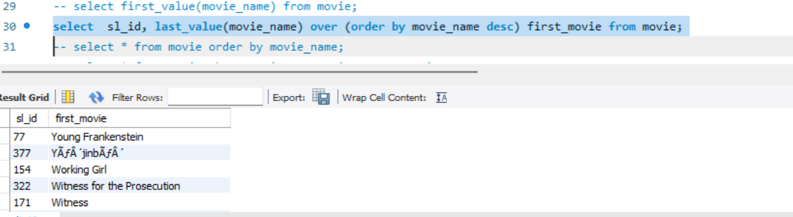

## SELECT TOP





## LIMIT

```sql
select * from movie limit 3 offset 1;
select * from movie limit 3,1;
```



```sql
select  sl_id, first_value(movie_name) over (order by movie_name desc) first_movie from movie;
select  sl_id, last_value(movie_name) over (order by movie_name desc) first_movie from movie;


```



## SELECT RANDOM


```sql
select * from movie order by rand();
```

## IN

```sql
select * from movie where movie_name in (select movie_name from movie_copy where movie_name like 'The%');
```

## DATE

```sql
select * from movie where date >= current_date();
select * from movie where  date(release_date)='2024-03-31';
select * from movie where  time(release_date)='14:31:28';

```

## Insert Multiple Values

```sql
insert into movie values ('The new movie', 2024,181,7.7,100,30000,'Action','New director','New cast','$100M',null,500),
						 ('The new movie1', 2024,181,7.7,100,30000,'Action','New director 2','New cast','$101M',null,501);
```

## FInd the duplicate entries

```sql
SELECT movie_name,release_year,
COUNT(*) FROM movie
GROUP BY release_year
HAVING COUNT(*)>1;
```

## Delete the dupicate rows

```sql

DELETE FROM DETAILS
WHERE SN NOT IN (
    SELECT MIN(SN)
    FROM DETAILS
    GROUP BY EMPNAME, DEPT, CONTACTNO, CITY
);
Select * FROM DETAILS;
```

## get all tables in mysql

```sql
SELECT table_name FROM information_schema.tables;
```
