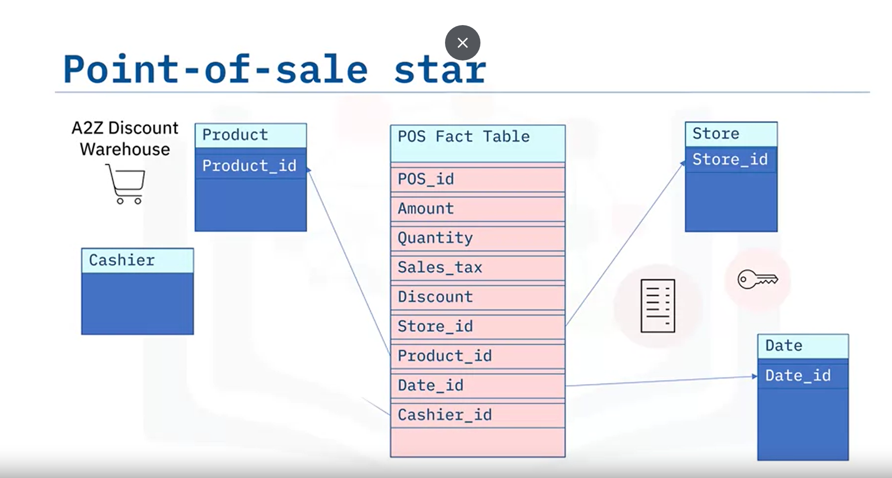
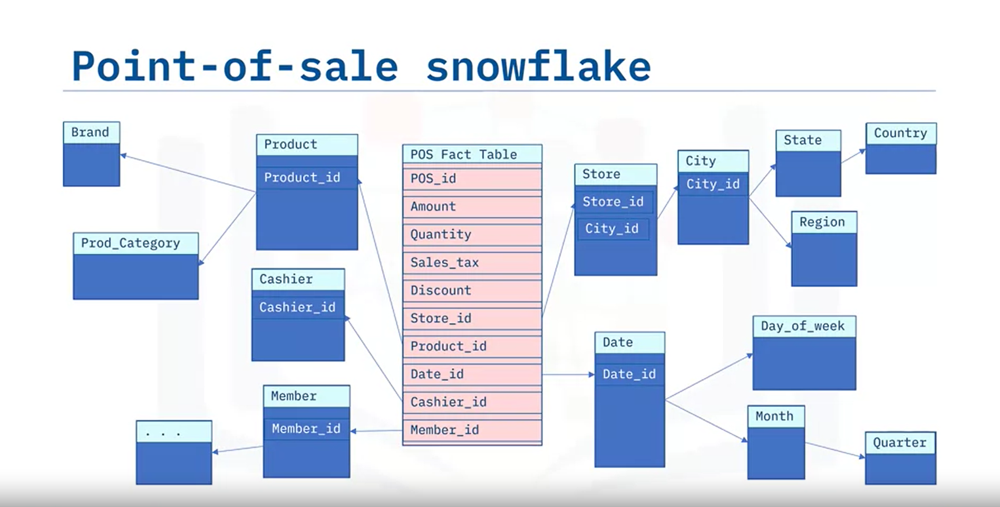
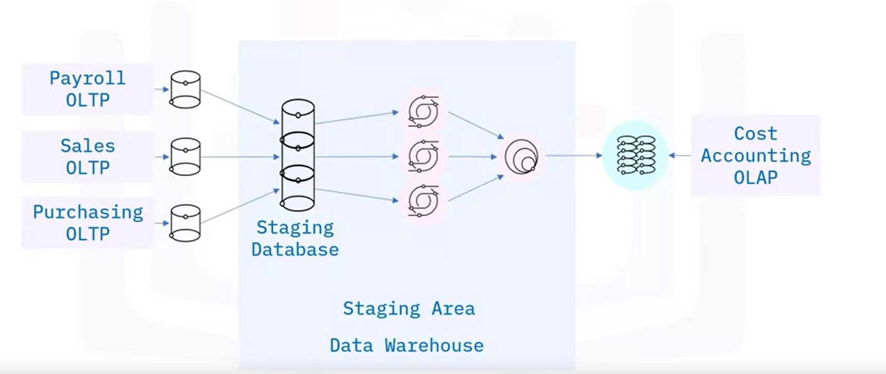

# Data Warehouse Overview

## Learning Objectives
After watching this video, you will be able to:
- Define a data warehouse.
- Identify data warehouse use cases.
- List the benefits of a data warehouse.

## What is a Data Warehouse?
A data warehouse is a system that aggregates data from multiple sources into a single, central, consistent data store to support various data analytics requirements.

## Data Warehouse Analytics
Data warehouses support:
- **Data mining**: Including AI and machine learning applications.
- **ETL process**: Speeds up front-end reporting by transforming data.
- **OLAP (Online Analytical Processing)**: Provides fast, flexible, multidimensional data analysis for business intelligence and decision support.

## Evolution of Data Warehouses
Traditionally hosted on-premises within enterprise data centers:
- Initially on mainframes, then Unix, Windows, and Linux systems.
- Data warehouse appliances emerged in the 2000s for managing large-scale data with specialized hardware and software.

### Cloud Data Warehouses (CDWs)
- Gained popularity with the growth of data stored in the cloud.
- Offered as scalable, pay-as-you-go services without the need for purchasing hardware or installing software.

## Use Cases of Data Warehouses
Data warehouses are used across various industries including:
- **Retail and e-commerce**: Analyzing sales performance and providing machine learning-assisted shopping recommendations.
- **Healthcare**: Applying AI to patient data for accurate diagnosis and treatment.
- **Transportation**: Optimizing routes, travel times, equipment, and staffing.
- **Financial tech and banking**: Evaluating risks, detecting fraud, and cross-selling services.
- **Social media**: Measuring customer sentiment and projecting product sales.
- **Government**: Analyzing citizen-focused programs and assisting with policy decisions.

## Benefits of Data Warehouses
- **Centralized Data**: Integrates data from multiple sources into a single source of truth.
- **Improved Data Quality**: Standardizes data, removes duplicates, and eliminates bad data.
- **Efficient Data Access**: Separates database operations from data analytics, improving performance and speeding up business insights.
- **Advanced BI Functions**: Facilitates smarter decisions through data mining, AI, and machine learning tools.
- **Competitive Advantage**: Enables better decision-making, resulting in competitive gains.

## Summary
In this video, you learned that:
- A data warehouse aggregates data from multiple sources into a single consistent data store for analytics.
- Data warehouses support data mining, AI, machine learning, OLAP, and front-end reporting.
- They help improve data quality, speed business insights, and enhance decision-making, leading to competitive advantages.


# Popular Data Warehouse Systems

## Overview

After watching this video, you will be able to:
- Categorize popular data warehouse systems.
- List popular data warehouse vendors and their offerings.

## Platforms

Most data warehouse systems are supported on one or more of three platforms:

1. **Appliances**: Pre-integrated bundles of hardware and software that provide high performance and low maintenance.
2. **Cloud**: Offers scalability and pay-per-use economics, often delivered as fully managed services.
3. **On-premises**: Traditionally installed within local environments, now also available as cloud-deployed systems.

## Popular Data Warehouse Systems

### Appliance Solutions

1. **Oracle Exadata**
   - Deployable on-premises or via Oracle Public Cloud.
   - Supports OLTP, data warehouse analytics, in-memory analytics, and mixed workloads.

2. **IBM Netezza**
   - Deployable on IBM Cloud, AWS, Microsoft Azure, and private clouds using IBM Cloud Pak for Data System.
   - Known for data science and machine-learning capabilities.

### Cloud-Based Solutions

1. **Amazon RedShift**
   - Uses AWS-specific hardware and proprietary software.
   - Features data compression, encryption, machine learning, and graph-optimization algorithms.

2. **Snowflake**
   - Multi-cloud analytics solution compliant with GDPR and CCPA.
   - Offers always-on encryption and is FedRAMP Moderate authorized.

3. **Google BigQuery**
   - Described as a flexible, multi-cloud data warehouse solution.
   - Reports 99.99% uptime and sub-second query response times.

### Hybrid Solutions (On-premises and Cloud-Based)

1. **Microsoft Azure Synapse Analytics**
   - Offers code-free visual ETL/ELT processes and supports data lake and data warehouse use cases.
   - Supports T-SQL, Python, Scala, Spark SQL, and .NET.

2. **Teradata Vantage**
   - Multi-cloud data platform for enterprise analytics unifying data lakes, data warehouses, and new data sources.
   - Combines open source and commercial technologies, offering performance for mixed workloads.

3. **IBM Db2 Warehouse**
   - Known for scalability, massively parallel processing, and security features.
   - Provides a containerized scale-out solution for public, private, or on-premises deployment.

4. **Vertica**
   - Supports multi-cloud environments including AWS, Google, Microsoft Azure, and on-premises Linux hardware.
   - Known for fast data transfer rates, scalable compute and storage, and system fault tolerance.

5. **Oracle Autonomous Data Warehouse**
   - Runs in Oracle Public Cloud and on-premises with support for multi-model data and multiple workloads.
   - Provides extensive automated security features, including autonomous data encryption and threat detection.

## Summary

In this video, you learned that data warehouse systems can include appliances, exist on-premises, exist in the cloud, or use a combination of these deployment options. Popular data warehouse vendors include Oracle, Teradata, Vertica, Google, IBM, Microsoft, Snowflake, Amazon, and others.


# Selecting a Data Warehouse System

## Overview

After watching this video, you will be able to:
- Identify criteria organizations can use to evaluate data warehouse systems.
- Describe key considerations for each data warehouse selection criteria.
- Summarize how organizations decide between an on-premises or a public cloud data warehouse system.
- List the various types of warehouse costs.

## Evaluation Criteria

### Features and Capabilities

1. **Location**: 
    - Data warehouses can be on-premises, on appliances, or in the cloud.
    - Consider data ingestion, storage, and access requirements.
    - Security and data privacy (CCPA, GDPR) may necessitate on-premises or geo-specific solutions.

2. **Architecture and Structure**:
    - Vendor-specific architecture commitment.
    - Need for multi-cloud installation.
    - Scalability for future needs.
    - Support for various data types (structured, semi-structured, unstructured).
    - Support for both batch and streaming data.

3. **Implementation**:
    - Data governance, migration, and transformation capabilities.
    - System performance optimization.
    - User management and zero-trust security policies.
    - Notifications and reporting for error correction and risk mitigation.

### Ease of Use and Skills

- Assess the skills of your organization's staff for implementing the technology.
- Consider the expertise of implementation partners.
- Evaluate the skills of technology and engineering staff for configuring front-end tools.

### Support Considerations

- Single vendor for accountability.
- Availability of service level agreements (SLAs) for uptime, security, scalability, etc.
- Support hours and channels (phone, email, chat, text).
- Self-service solutions and user community.

### Cost Considerations

- Calculate the total cost of ownership (TCO) over several years.
- Include infrastructure costs (compute and storage), software licensing, data migration, administration, and support.

## Key Takeaways

- Businesses evaluate data warehouse systems based on features and capabilities, compatibility and implementation, ease of use and required skills, support quality and availability, and multiple cost considerations.
- Traditional on-premises installations may be necessary for data security and privacy.
- Public cloud sites offer scalable and flexible price-for-performance options.
- Consider TCO, including infrastructure, compute and storage, data migration, administration, and data maintenance costs.


# Data Marts Overview

## Overview

After watching this video, you will be able to:
- Define what a data mart is.
- Give examples of data marts.
- Compare data marts to transactional databases and enterprise data warehouses.
- Describe data pipelines for loading data marts.

## What is a Data Mart?

A data mart is an isolated part of the larger enterprise data warehouse, built to serve a particular business function, purpose, or community of users. For example:
- Sales and finance departments may have data marts for their quarterly sales reports and projections.
- The marketing team may use data marts to analyze customer behavior.
- Shipping, manufacturing, and warranty departments may have their own data marts.

## Uses of Data Marts

Data marts are designed to provide specific support for making tactical decisions. They focus on the most relevant data, saving end users time and effort searching for insights.

## Structure of a Data Mart

Data marts typically have a relational database with a star or snowflake schema:
- Central fact table with business metrics.
- Surrounding dimension tables providing context.

## Differences Between Data Marts, Transactional Databases, and Data Warehouses

### Data Marts vs. Databases

- **Data Marts and Data Warehouses**: OLAP systems optimized for read-intensive queries.
- **Transactional Databases**: OLTP systems optimized for write-intensive applications.
- **Data Sources**: Data marts use transactional databases or data warehouses; transactional databases use operational applications.
- **Data Storage**: Data marts store validated, transformed, and cleaned data; databases store raw data.
- **Historical Data**: Data marts accumulate historical data; transactional databases may not.


### Data Marts vs. Data Warehouses
- **Scope**: Data marts have a smaller, tactical scope; data warehouses support strategic enterprise requirements.
- **Speed**: Data marts are lean and fast; data warehouses can be very large and slower.

## Types of Data Marts

1. **Dependent Data Marts**:
   - Draw data from the enterprise data warehouse.
   - Offer analytical capabilities within a restricted area of the data warehouse.
   - Inherit the security of the enterprise data warehouse.
   - Have simpler data pipelines.
 - 

2. **Independent Data Marts**:
   - Created directly from sources, bypassing the data warehouse.
   - Require custom extract, transform, and load (ETL) data pipelines.
   - May require separate security measures.
    
    
3. **Hybrid Data Marts**:
   - Depend partially on the enterprise data warehouse.
   - Combine inputs from data warehouses with operational systems and external sources.

## Purpose of Data Marts

- Provide end-users with relevant data when they need it.
- Accelerate business processes with efficient query response times.
- Offer a cost-efficient method for data-driven decisions.
- Ensure secure access and control over data.

## Key Takeaways

- A data mart is an isolated part of the larger enterprise data warehouse, built for specific business functions.
- Designed to provide specific, timely, and rapid support for making tactical decisions.
- Typically has a star or snowflake schema.
- Unlike OLTP databases, OLAP data marts store clean and validated data and accumulate historical data.
- Data marts can be dependent on, independent of, or hybrid with the enterprise data warehouse.


# Data Lakes Overview


## Overview

After watching this video, you will be able to:
- Define what a data lake is.
- List benefits of using a data lake.
- Compare data lakes to data warehouses.

## What is a Data Lake?

A data lake is a storage repository that can store large amounts of structured, semi-structured, and unstructured data in their native format, classified and tagged with metadata. Unlike a data warehouse, which stores processed data for specific needs, a data lake is a pool of raw data with unique identifiers and metatags for further use.

## When to Use a Data Lake

You would opt for a data lake if you generate or have access to large amounts of data on an ongoing basis but don’t want to be restricted to specific or predefined use cases. Data lakes can also serve as a staging area for transforming data before loading it into a data warehouse or data mart.

## Characteristics of a Data Lake

- **Storage Capacity**: Can store structured, semi-structured, and unstructured data in its native format.
- **Flexibility**: No need to define the structure and schema of data before loading.
- **Versatility**: Useful for a wide range of current and future use cases.
- **Technology Independence**: Data lakes can be deployed using cloud object storage (e.g., Amazon S3), large-scale distributed systems (e.g., Apache Hadoop), relational database management systems, or NoSQL data repositories.

## Benefits of Data Lakes

- **All Types of Data**: Can store unstructured data (documents, emails), semi-structured data (JSON, XML files), and structured data (relational databases).
- **Scalability**: Scalable storage capacity from terabytes to petabytes.
- **Time Savings**: No need to define structures, create schemas, or transform data before storage.
- **Flexible Reuse**: Data in its original format allows for fast, flexible reuse.

## Vendors Offering Data Lake Solutions

- Amazon
- Cloudera
- Google
- IBM
- Informatica
- Microsoft
- Oracle
- SAS
- Snowflake
- Teradata
- Zaloni

## Data Lakes vs. Data Warehouses

| Feature             | Data Lake                                  | Data Warehouse                             |
|---------------------|--------------------------------------------|--------------------------------------------|
| **Data**            | Raw, unstructured, semi-structured         | Processed, conformed to standards          |
| **Schema**          | Not required before loading                | Strict schema required before loading      |
| **Data Quality**    | May not be curated, agile                  | Curated, adheres to governance guidelines  |
| **Users**           | Data scientists, data developers, ML engineers | Business analysts, data analysts          |

## Key Takeaways

- **Definition**: A data lake is a storage repository for large amounts of structured, semi-structured, and unstructured data in their raw or native format, classified and tagged with metadata.
- **Schema**: No need to define structure and schema before loading data into the data lake.
- **Benefits**: Includes storage for all types of data, scalable storage capacity, time savings, and flexible data reuse.
- **Use Cases**: Suitable for machine learning development, advanced analytics, and other varied use cases.

# Data Lake House: Bridging Data Lakes and Data Warehouses

## Overview

After watching this video, you will be able to:
- Understand the analogy between a restaurant's logistics and data architecture.
- Identify the similarities and differences between data lakes and data warehouses.
- Learn about the concept and benefits of a data lake house.

## Introduction

Imagine you're at a bustling restaurant. You notice the efficiency with which ingredients are transformed into delicious meals. This process mirrors how data is handled within organizations. Let's break down this analogy to better understand data lakes, data warehouses, and the emerging concept of the data lake house.

## The Restaurant Analogy

### Ingredients Delivery and Storage

- **Delivery:** Ingredients arrive at the restaurant's loading dock on pallets.
- **Unloading:** The palettes are unwrapped, sorted, labeled, and routed to their respective storage areas (pantries, fridges, freezers).
- **Organization:** Ingredients are organized to ensure food safety and efficiency (e.g., FIFO for expiring items, temperature control).

### Preparing for Cooking

- **Efficiency:** This organization allows cooks to quickly find ingredients and focus on preparing meals, similar to how data needs to be organized for effective use.

## Data Architecture

### Data Lakes

- **Raw Data Repository:** Data lakes store large amounts of structured, semi-structured, and unstructured data in their native format.
- **Flexibility:** No need to define the structure and schema before loading data.
- **Cost-Effective:** Useful for capturing vast amounts of data cheaply.

### Data Warehouses

- **Processed Data:** Data warehouses store data that has been processed and conformed to standards.
- **Structured Schema:** Requires defining structure and schema before loading data.
- **High Performance:** Optimized for specific analytical tasks, powering BI workloads, dashboards, and reports.
- **Governance:** Ensures data quality and governance, similar to organizing a pantry or fridge.

## Challenges

### Data Lakes

- **Governance and Quality:** Without proper management, data lakes can become data swamps with duplicate, inaccurate, or incomplete data.
- **Query Performance:** Not optimized for complex analytical queries, making it difficult to derive insights directly.

### Data Warehouses

- **Cost:** High costs similar to maintaining large freezers.
- **Data Freshness:** Slower to update, which can be an issue for applications needing real-time data.
- **Limited Data Types:** Less support for semi-structured and unstructured data sources.

## Introducing the Data Lake House

### Combining the Best of Both

- **Flexibility and Cost-Effectiveness of Data Lakes:** Stores data from various sources in a low-cost way.
- **Performance and Structure of Data Warehouses:** Optimized for high performance and structured query capabilities.

### Benefits of Data Lake House

- **Unified Architecture:** Integrates the strengths of data lakes and data warehouses.
- **Efficient Data Management:** Built-in data management and governance features.
- **Support for Advanced Workloads:** Powers both BI and high-performance machine learning workloads.

### Implementation Strategies

- **Modernize Existing Data Lakes:** Upgrade current data lakes to include governance and performance features.
- **Complement Data Warehouses:** Use lake houses alongside data warehouses to handle new AI and machine learning workloads.

## Conclusion

The next time you're at a restaurant, think about the journey of your meal from raw ingredients to the plate. This process is akin to how data is managed in organizations, evolving from raw data in lakes to structured insights in warehouses, and now merging the best of both worlds in data lake houses.

Thank you for watching. If you enjoyed this video and want to see more, please like and subscribe. If you have questions, please drop them in the comments below.


# Data Warehouse Architecture Overview

Welcome to **Data Warehouse Architecture Overview**. After watching this video, you will be able to:

- List use cases that drive data warehouse design considerations.
- Describe a general data warehousing architecture and list its component layers.
- Distinguish between general and reference enterprise data warehouse architecture.
- Describe reference architectures for two enterprise data warehouse platforms.


The details of the architecture of a data warehouse depend on the intended usage of the platform. Requirements can include:

- Report generation and dashboarding.
- Exploratory data analysis.
- Automation and machine learning.
- Self-serve analytics.

Let’s start by considering a general architectural model for an **Enterprise Data Warehouse** (EDW) platform, which companies can adapt for their analytics requirements. In this architecture, you can have various layers or components, including:

- Data sources (e.g., flat files, databases, and existing operational systems).
- ETL layer for extracting, transforming, and loading data.
- Optional staging and sandbox areas for holding data and developing workflows.
- Enterprise data warehouse repository.
- Data marts (known as a “hub and spoke” architecture when multiple data marts are involved).
- Analytics layer and business intelligence tools.

Data warehouses also enforce security for incoming data and data passing through to further stages and users throughout the network. Enterprise data warehouse vendors often create proprietary reference architecture and implement template data warehousing solutions that are variations on this general architectural model.

A data warehousing platform is a complex environment with lots of moving parts. Thus, interoperability among components is vital. Vendor-specific reference architecture typically incorporates tools and products from the vendor’s ecosystem that work well together.

## IBM-specific Reference Data Warehouse Architecture

Each layer of the architecture performs a specific function:

1. **Data Acquisition Layer:** Components to acquire raw data from source systems (e.g., human resources, finance, and billing departments).
2. **Data Integration Layer:** Essentially a staging area, with components for extracting, transforming, and loading data into the data repository layer. It also houses administration tools and central metadata.
3. **Data Repository Layer:** Stores the integrated data, typically employing a relational model.
4. **Analytics Layer:** Often stores data in a cube format to make it easier for users to analyze it.
5. **Presentation Layer:** Incorporates applications that provide access for different sets of users (e.g., marketing analysts, users, and agents). Applications consume the data through web pages and portals defined in the reporting tool or through web services.

IBM reference architecture is supported and extended using several products from the **IBM InfoSphere suite**:

- **IBM InfoSphere DataStage:** Scalable ETL platform for near real-time integration of all data types, on-premises, and in cloud environments.
- **IBM InfoSphere MetaData Workbench:** Provides end-to-end data flow reporting and impacts analysis of information assets.
- **IBM InfoSphere QualityStage:** Supports data quality and information governance initiatives.
- **IBM Db2 Warehouse:** Family of highly performant, scalable, and reliable data management products.
- **IBM Cognos Analytics:** Advanced business intelligence platform for generating reports, scoreboards, and dashboards, performing exploratory data analysis, and curating and joining data from multiple sources.

In summary, you learned that:

- An architectural model for a general data warehousing platform includes various components such as data sources, ETL pipelines, optional staging and sandbox areas, an enterprise data warehouse repository, optional data marts, and analytics and business intelligence tools.
- Companies can modify general enterprise data warehouse architecture to suit their analytics requirements.
- Vendors offer proprietary reference architecture based on the general model, which they test for interoperability among components.
- An IBM enterprise data warehouse solution combines InfoSphere with Db2 Warehouse and Cognos Analytics.


# Cubes, Rollups, and Materialized Views and Tables

Welcome to **Cubes, Rollups, and Materialized Views and Tables**. After watching this video, you will be able to:

- Relate what a data cube is in terms of star schema.
- Discuss the terms slice, dice, drill up or down, roll up, and pivot in terms of data cubes.
- Describe what a materialized view is.
- Recall two use cases for materialized views.

## Data Cube Example

Let's use an example to illustrate the concept of a data cube. Here is a cube generated from an imaginary star schema for a Sales OLAP (online analytical processing system). The coordinates of the cube are defined by a set of dimensions, selected from the star schema. In this illustration, we are showing three dimensions, but data cubes can have many dimensions:

- **Product categories**: Items sold
- **State or Province**: Location items were sold
- **Year**: Year these products were sold

The cells of the cube are defined by a fact of interest from the schema, such as “total sales in thousands of dollars.” For example, "243" indicates "243 thousand dollars" for some given Product, State, and Year combination.

## Operations on Data Cubes

There are many operations you can perform on data cubes, such as:

- **Slicing**: Selecting a single member from a dimension, resulting in a data cube with one less dimension. E.g., selecting the year 2018.
- **Dicing**: Selecting a subset of values from a dimension, effectively shrinking the cube. E.g., selecting "Gloves," "T-shirts," and "Jeans" from the Product-Type dimension.
- **Drilling Down**: Going into a particular member of a dimension to see more specific data. E.g., drilling down into “T-shirts” to see “Classic,” “Slim fit,” and “Regular fit.”
- **Drilling Up**: The reverse of drilling down.
- **Pivoting**: Rotating the data cube. E.g., interchanging year and product dimensions while keeping the State dimension fixed.
- **Rolling Up**: Summarizing along a dimension by applying aggregations such as COUNT, MIN, MAX, SUM, and AVERAGE. E.g., calculating the average selling price of different T-shirt types across states.

## Materialized Views

A **materialized view** is essentially a local, read-only copy or snapshot of the results of a query. They can be used to:

- Replicate data, for example in a staging database as part of an ETL process.
- Precompute and cache expensive queries, such as joins or aggregations, for use in data analytics environments.

Materialized views can be automatically refreshed to keep your query up-to-date. Refresh options include:

- **Never**: Populated only when created, useful if data seldom changes.
- **Upon request**: Manually refresh, e.g., after data changes, or scheduled refresh.
- **Immediately**: Automatically refresh after every statement.

### Creating a Materialized View

Here is how to create a materialized view in Oracle using SQL statements:

```sql
CREATE MATERIALIZED VIEW My_Mat_View
REFRESH FAST
START WITH SYSDATE
NEXT SYSDATE + 1
AS SELECT * FROM my_table_name;
```


# Facts and Dimensional Modeling

Welcome to **Facts and Dimensional Modeling**. After watching this video, you will be able to:

- Define what facts are in the context of data warehousing.
- Define what a fact table is.
- Define what dimensions are in the context of data warehousing.
- Define what a dimension table is.
- Describe an example of a fact and its dimensions.

## Facts and Dimensions

Data can be lumped into two categories: Facts and dimensions.

- **Facts**: Usually quantities which can be measured, such as temperature, number of sales, or millimeters of rainfall. Facts can also be qualitative in nature.
- **Dimensions**: Attributes which can be assigned to facts, providing context and making facts useful.

### Example: Weather Report

Facts:
- Temperature: 24°C
- Humidity
- Probability of precipitation
- Wind speed
- Qualitative facts like "partly cloudy" or "Clear with periodic clouds"

Dimensions:
- Location: "Kuala Lumpur, Malaysia"
- Time: "Tuesday at 3 a.m."

The statement "24°C in Kuala Lumpur, Malaysia on Tuesday, August 17th at 3:00 a.m." provides meaningful information by combining facts and dimensions.

## Fact Tables

A **fact table** consists of the facts of a business process and contains foreign keys to dimension tables.

- Facts are usually additive measures or metrics, such as dollar amounts for individual sales transactions.
- Fact tables can contain detail level facts or aggregated facts (summary tables).

### Example: Sales Transactions

A fact table for recording sales at a car dealership might include:
- Sale date
- Sale amount
- Primary key: "Sale ID"

## Types of Fact Tables

- **Detail level fact tables**: Individual sales transactions.
- **Summary tables**: Aggregated facts, such as quarterly sales totals.
- **Accumulating snapshot fact tables**: Record events during a business process.

### Example: Custom Computer Order

An accumulating snapshot table might record:
- Order date
- Order amount
- Payment date
- Build start-date
- Build end-date
- Ship date
- Unique "Order ID"

## Dimension Tables

A **dimension table** stores the dimensions of a fact and is joined to the fact table via a foreign key.

### Types of Dimension Tables

- **Product tables**: Describe products (make, model, color, size).
- **Employee tables**: Describe employees (name, title, department).
- **Temporal tables**: Describe time at the level of granularity (e.g., year, month, day).
- **Geography tables**: Location data (country, state, city, postal code).

### Example: Car Sales Schema

Fact table for sales:
- Sale date
- Sale amount
- Sale ID (primary key)

Dimension tables:
- **Vehicle table**: Attributes like Make and Model.
- **Salesperson table**: Attributes like First and Last name.

Foreign keys in the fact table link to dimension tables:
- Vehicle ID
- Salesperson ID


# Data Modeling Using Star and Snowflake Schemas

Welcome to **Data Modeling Using Star and Snowflake Schemas**. After watching this video, you will be able to:

- Describe star schema modeling in terms of facts and dimensions.
- Describe snowflake schema as an extension of star schema.
- Distinguish star from snowflake schema in terms of normalization.

## Star Schema

A **star schema** is a type of data model used in data warehousing. It consists of:

- A central **fact table** containing foreign keys that refer to the primary keys of **dimension tables**.
- **Dimension tables** radiating from the central fact table, forming a star-like structure.

### Key Components

- **Fact Table**: Contains quantitative data and foreign keys to dimension tables.
- **Dimension Tables**: Provide context for the facts, such as dates, products, and locations.

### Example: Point-of-Sale (POS) Transactions

1. **Business Process**: Point-of-sale transactions.
2. **Granularity**: Individual line items from store receipts.
3. **Dimensions**: Date and time, store name, products purchased, cashier, payment method, customer membership number.
4. **Facts**: Transaction amount, quantity, discounts, sales tax, environmental fees, deposit fees.

#### Fact Table: `pos_fact_table`
- **POS ID**: Unique identifier for each line item.
- **Transaction Amount**: Dollar amount.
- **Quantity**: Number of items.
- **Sales Tax**: Applied tax.
- **Discount**: Applied discount.

#### Dimension Tables
- **Store Table**: Linked by `Store ID`.
- **Product Table**: Linked by `Product ID`.
- **Date Table**: Linked by `Date ID`.
- **Cashier Table**: Linked by `Cashier ID`.
- **Member Table**: Linked by `Member ID`.

## Snowflake Schema

A **snowflake schema** is an extension of the star schema. It involves normalizing the dimension tables.

### Key Concepts

- **Normalization**: Separating levels or hierarchies of a dimension table into separate child tables.
- **Hierarchy of Tables**: Creating multiple layers of dimension tables, reducing data redundancy.

### Example: Extended POS Transactions

#### Normalized Dimension Tables
- **City Table**: Linked by `City ID` in the `Store Table`.
- **State Table**: Linked by `State ID` in the `City Table`.
- **Country Table**: Linked by `Country ID` in the `State Table`.
- **Product Brand Table**: Linked by `Brand ID` in the `Product Table`.
- **Product Category Table**: Linked by `Category ID` in the `Product Table`.
- **Date Breakdown**: Separate tables for day, month, quarter.

## Comparison: Star Schema vs. Snowflake Schema

- **Star Schema**:
  - Simpler, with fewer tables.
  - Denormalized structure.
  - Easier to query but may use more storage.



- **Snowflake Schema**:
  - More complex, with multiple layers of tables.
  - Normalized structure.
  - Reduces data redundancy and storage footprint but may require more complex queries.

## Summary

In this video, you learned that:

- **Star Schema**: Consists of a central fact table and dimension tables, used for simple and efficient querying.
- **Snowflake Schema**: A normalized version of the star schema, used to reduce data redundancy and storage needs.
- **Design Considerations**: Involve identifying the business process, granularity, dimensions, and facts.
- **Normalization**: Involves breaking down dimension tables into hierarchical levels.

Both schemas have their advantages and are chosen based on the specific needs of the data warehousing environment.


# Comparison of Star Schema and Snowflake Schema

When deciding between using a star schema and a snowflake schema for your data warehousing or database design, consider the following attributes and their impacts:

| **Attribute**           | **Star Schema**                    | **Snowflake Schema**                  |
|-------------------------|------------------------------------|---------------------------------------|
| **Read Speed**          | Fast                               | Moderate                              |
| **Write Speed**         | Moderate                           | Fast                                  |
| **Storage Space**       | Moderate to high                   | Low to moderate                       |
| **Data Integrity Risk** | Low to moderate                    | Low                                   |
| **Query Complexity**    | Simple to moderate                 | Moderate to complex                   |
| **Schema Complexity**   | Simple to moderate                 | Moderate to complex                   |
| **Dimension Hierarchies** | Denormalized single tables       | Normalized over multiple tables       |
| **Joins per Dimension Hierarchy** | One                    | One per level                         |
| **Ideal Use**           | OLAP systems, Data Marts           | OLTP systems                          |

### Detailed Comparison

1. **Read Speed**:
   - **Star Schema**: Offers fast read speeds due to fewer joins, making it ideal for Online Analytical Processing (OLAP) systems.
   - **Snowflake Schema**: Read speeds are moderate as the normalization increases the number of joins required for queries.

2. **Write Speed**:
   - **Star Schema**: Write operations are moderate in speed due to the need to update fewer tables.
   - **Snowflake Schema**: Faster write operations as updates are spread across multiple normalized tables, reducing data redundancy.

3. **Storage Space**:
   - **Star Schema**: Requires more storage due to denormalization, which can lead to data redundancy.
   - **Snowflake Schema**: More storage-efficient due to normalization, which reduces data redundancy.

4. **Data Integrity Risk**:
   - **Star Schema**: Moderate risk, as denormalization can introduce inconsistencies if not managed properly.
   - **Snowflake Schema**: Low risk, as normalization helps maintain data integrity through fewer redundancies.

5. **Query Complexity**:
   - **Star Schema**: Queries are simpler and easier to write, suitable for end-users and analysts.
   - **Snowflake Schema**: Queries can become complex due to multiple joins across normalized tables.

6. **Schema Complexity**:
   - **Star Schema**: Simpler and easier to understand and implement, making it suitable for quick deployment.
   - **Snowflake Schema**: More complex due to the normalized structure, requiring more detailed design and maintenance.

7. **Dimension Hierarchies**:
   - **Star Schema**: Uses denormalized single tables for each dimension, simplifying the schema.
   - **Snowflake Schema**: Normalizes dimension hierarchies into multiple related tables, reducing redundancy.

8. **Joins per Dimension Hierarchy**:
   - **Star Schema**: Requires only one join per dimension, simplifying queries.
   - **Snowflake Schema**: Requires one join per level of the dimension hierarchy, increasing query complexity.

9. **Ideal Use**:
   - **Star Schema**: Best suited for OLAP systems and data marts where quick query performance is crucial.
   - **Snowflake Schema**: Ideal for Online Transaction Processing (OLTP) systems where data integrity and storage efficiency are prioritized.

### Conclusion

Choose the **star schema** if you need faster read performance and simpler queries, typically for OLAP and data marts. Opt for the **snowflake schema** if you prioritize data integrity, storage efficiency, and write performance, commonly used in OLTP systems.


# Staging Areas for Data Warehouses

Welcome to Staging Areas for Data Warehouses. After watching this video, you will be able to:

- Describe what a data warehouse staging area is.
- Describe why a staging area may be used.
- Relate how a staging area is used as a first step for integrating data sources.

### What is a Data Warehouse Staging Area?

A data warehouse staging area is an intermediate storage area used for Extract, Transform, Load (ETL) processing. It serves as a bridge between data sources and target data warehouses, data marts, or other data repositories. 

- **Transient Nature**: Staging areas are often temporary and erased after successfully running ETL workflows.
- **Archival and Troubleshooting**: Some architectures hold data for longer periods for archival or troubleshooting purposes.
- **Monitoring and Optimization**: Useful for monitoring and optimizing ETL workflows.

### Implementation of Staging Areas

Staging areas can be implemented in various ways:

1. **Simple Flat Files**: Such as CSV files stored in a directory, managed with tools like Bash or Python.
2. **SQL Tables**: In a relational database such as Db2.
3. **Self-contained Database Instances**: Within a data warehousing or business intelligence platform such as Cognos Analytics.

### Example Use Case

Consider an enterprise creating a dedicated "Cost Accounting" OLAP system. The required data is managed in separate OLTP systems for Payroll, Sales, and Purchasing departments. 

1. **Extraction**: Data is extracted to individual Staging Tables in the Staging Database.
2. **Transformation**: Data is transformed in the Staging Area using SQL to conform to the Cost Accounting system requirements.
3. **Integration**: Transformed tables are integrated into a single table.
4. **Loading**: Data is loaded into the target cost-accounting system.

### Functions of a Staging Area

Staging areas perform several critical functions, including:

- **Integration**: Consolidation of data from multiple source systems.
- **Change Detection**: Managing extraction of new and modified data as needed.
- **Scheduling**: Running ETL tasks in a specific sequence, concurrently, and at certain times.
- **Data Cleansing and Validation**: Handling missing values and duplicated records.
- **Aggregating Data**: Summarizing data, e.g., aggregating daily sales into weekly, monthly, or annual averages.
- **Normalizing Data**: Ensuring consistency of data types and category names.

### Benefits of Using a Staging Area

- **Decoupling from Source Systems**: Extraction decouples processes such as validation and cleansing from the source environment.
- **Minimized Risk**: Helps minimize the risk of corrupting source-data systems.
- **Simplified ETL Workflows**: Simplifies ETL workflow construction, operation, and maintenance.
- **Recovery**: Allows easy recovery if extracted data becomes corrupted.

### Conclusion

In this video, you learned that:

- A staging area acts as a bridge between data sources and target systems.
- Staging areas are mainly used to integrate disparate data sources in data warehouses.
- They can be implemented as flat files managed with scripts or as tables in a database.
- Staging areas decouple data processing from source systems, minimizing the risk of data corruption.
- They can be transient or held for archiving and troubleshooting purposes.

By understanding and utilizing staging areas, you can improve the efficiency, integrity, and manageability of your ETL processes and overall data warehousing strategy.


# Populating a Data Warehouse

Welcome to “Populating a Data Warehouse.” After watching this video, you will be able to:

- Describe populating a data warehouse as an ongoing process.
- List the main steps for populating a data warehouse.
- List methods for change detection and incremental loading.
- Manually create and populate tables for a sales star schema.
- Recall the periodic maintenance required to keep your data warehouse running smoothly.

### Ongoing Process of Populating a Data Warehouse

Populating an enterprise data warehouse is an ongoing process involving:
1. **Initial Load**: Setting up and loading data for the first time.
2. **Periodic Incremental Loads**: Regularly updating the warehouse with new data, which may occur daily or weekly. Rarely, a full refresh is needed due to major schema changes or failures.

Generally, **fact tables** are dynamic and frequently updated, while **dimension tables** remain relatively static. 

### Tools for Automating Data Loading

Many tools can automate the ongoing process of keeping your data warehouse current:
- **Db2 Load Utility**: Faster than row-by-row insertion.
- **Apache Airflow and Apache Kafka**: Automate ETL data pipelines.
- **Custom Scripts**: Using Bash, Python, and SQL.
- **InfoSphere DataStage**: Compile and run jobs to load your data.

### Preparing for Data Warehouse Population

Before populating your data warehouse:
1. **Schema Modeling**: Ensure your schema is modeled.
2. **Data Staging**: Data should be staged in tables or files.
3. **Data Quality Verification**: Mechanisms to verify data quality should be in place.

### Initial Load Process

1. **Instantiate the Data Warehouse**: Set up the data warehouse and its schema.
2. **Create Production Tables**: Create the necessary tables.
3. **Establish Relationships**: Define relationships between fact and dimension tables.
4. **Load Data**: Load transformed and cleaned data into the warehouse from staging tables or files.

### Setting Up Ongoing Data Loads

After the initial load:
1. **Automate Incremental Loads**: Use scripts as part of your ETL data pipeline.
2. **Schedule Loads**: Schedule incremental loads daily or weekly.
3. **Change Detection**: Implement logic to detect new or updated data.

#### Methods for Change Detection
- **Timestamps**: Use timestamps to identify new, modified, or deleted records.
- **Database Mechanisms**: Use relational database mechanisms to track changes.
- **Brute-Force Comparison**: Load the entire source for comparison if the source data isn't too large.

### Periodic Maintenance

- **Archiving**: Archive old data to less costly storage.
- **Deletion**: Script the deletion of older data.
- **Frequency**: Perform maintenance monthly or yearly.

### Example: Populating a Sales Star Schema

Assuming you’ve already instantiated the data warehouse and the 'sales' schema:

1. **Auto Sales Transaction Data**: Contains columns like "sales ID," "emp no," "class ID," "date," and "amount."

2. **Creating Dimension Tables**:
   - Use `CREATE TABLE` to create the `DimSalesPerson` table:
     ```sql
     CREATE TABLE sales.DimSalesPerson (
         SalesPersonID SERIAL PRIMARY KEY,
         SalesPersonAltID INTEGER,
         SalesPersonName VARCHAR(255)
     );
     ```

3. **Populating Dimension Tables**:
   - Use `INSERT INTO` to populate the table:
     ```sql
     INSERT INTO sales.DimSalesPerson (SalesPersonAltID, SalesPersonName)
     VALUES (680, 'Cadillac Jack');
     ```

4. **Creating Fact Table**:
   - Use `CREATE TABLE` to create the `FactAutoSales` table:
     ```sql
     CREATE TABLE sales.FactAutoSales (
         TransactionID BIGSERIAL PRIMARY KEY,
         SalesID INTEGER,
         Amount MONEY,
         SalesPersonID INTEGER,
         AutoClassID INTEGER,
         SalesDateKey DATE
     );
     ```

5. **Establishing Relationships**:
   - Use `ALTER TABLE` to set up foreign key constraints:
     ```sql
     ALTER TABLE sales.FactAutoSales
     ADD CONSTRAINT FKAutoClassID
     FOREIGN KEY (AutoClassID) REFERENCES sales.DimAutoCategory(AutoClassID);
     ```

6. **Populating Fact Table**:
   - Use `INSERT INTO` to populate the table:
     ```sql
     INSERT INTO sales.FactAutoSales (SalesID, Amount, SalesPersonID, AutoClassID, SalesDateKey)
     VALUES (1629, 42000, 2, 1, '2023-01-01');
     ```

### Conclusion

In this video, you learned that:

- Populating an enterprise data warehouse includes initial creation of fact and dimension tables and their relations and loading clean data into tables.
- It is an ongoing process starting with an initial load followed by periodic incremental loads.
- Fact tables require frequent updating while dimension tables remain relatively static.
- Incremental loading and maintenance can be automated using scripts or data pipeline tools.


# Querying the Data

Welcome to "Querying the Data." After watching this video, you will be able to:

- Interpret an entity-relationship diagram (ERD) for a star schema and use the relations between tables to set up queries.
- Create a materialized view by denormalizing, or joining tables from, a star schema.
- Apply the CUBE and ROLLUP options in a GROUP BY clause to generate commonly requested total and subtotal summaries.

### Overview of CUBE and ROLLUP Operations

CUBE and ROLLUP operations generate summaries that management often requests, making it easier to implement than multiple SQL queries. 

- **CUBE**: Generates all possible combinations of columns for summaries.
- **ROLLUP**: Generates a hierarchy of subtotals and grand totals based on the column order in the GROUP BY clause.

Materialized views store precomputed data, enhancing performance by reducing the load on the database. Combining cubes or rollups with materialized views can further improve efficiency.

### Scenario: Creating Live Summary Tables for Reporting

Let's consider the task of creating live summary tables for reporting January sales by salesperson and automobile type for ShinyAutoSales.

1. **Understanding the Star Schema**:
   - Connect to the "sasDW" data warehouse using PostgreSQL.
   - The central fact table is "fact_auto_sales," which contains the "amount" column.
   - The three foreign keys in "fact_auto_sales" link to:
     - "Date dimension table" with date-related values.
     - "Auto category dimension table" with "auto class name" and "is new" column.
     - "Salesperson dimension table" with "salesperson's name."

2. **Exploring the Schema**:
   - Query the "fact_auto_sales" table:
     ```sql
     SELECT * FROM sales.fact_auto_sales LIMIT 10;
     ```
   - Query the "auto category dimension table":
     ```sql
     SELECT * FROM sales.dim_auto_category;
     ```
   - Query the "salesperson dimension table":
     ```sql
     SELECT * FROM sales.dim_salesperson;
     ```
   - Query the "date dimension table":
     ```sql
     SELECT * FROM sales.dim_date;
     ```

3. **Creating a Denormalized View**:
   - Select relevant columns and join the dimension tables to the fact table:
     ```sql
     SELECT 
         d.date,
         c.auto_class_name,
         c.is_new,
         s.salesperson_name,
         f.amount
     FROM 
         sales.fact_auto_sales f
     INNER JOIN 
         sales.dim_date d ON f.sales_date_key = d.date_key
     INNER JOIN 
         sales.dim_auto_category c ON f.auto_class_id = c.auto_class_id
     INNER JOIN 
         sales.dim_salesperson s ON f.salesperson_id = s.salesperson_id;
     ```
   - Create a materialized view:
     ```sql
     CREATE MATERIALIZED VIEW dn_sales AS
     SELECT 
         d.date,
         c.auto_class_name,
         c.is_new,
         s.salesperson_name,
         f.amount
     FROM 
         sales.fact_auto_sales f
     INNER JOIN 
         sales.dim_date d ON f.sales_date_key = d.date_key
     INNER JOIN 
         sales.dim_auto_category c ON f.auto_class_id = c.auto_class_id
     INNER JOIN 
         sales.dim_salesperson s ON f.salesperson_id = s.salesperson_id;
     ```
   - View the materialized data:
     ```sql
     SELECT * FROM dn_sales LIMIT 10;
     ```

4. **Applying CUBE and ROLLUP Operations**:
   - **CUBE Operation**:
     ```sql
     SELECT 
         auto_class_name, 
         salesperson_name, 
         SUM(amount) AS total_sales
     FROM 
         dn_sales
     WHERE 
         is_new = TRUE
     GROUP BY 
         CUBE(auto_class_name, salesperson_name);
     ```
     - This generates all combinations of auto class name and salesperson name.
   - **ROLLUP Operation**:
     ```sql
     SELECT 
         auto_class_name, 
         salesperson_name, 
         SUM(amount) AS total_sales
     FROM 
         dn_sales
     WHERE 
         is_new = TRUE
     GROUP BY 
         ROLLUP(auto_class_name, salesperson_name);
     ```
     - This generates a hierarchy of subtotals and a grand total based on the order of columns.

### Conclusion

In this video, you learned that:

- CUBE and ROLLUP summaries on materialized views provide powerful capabilities for quickly querying and analyzing data in data warehouses.
- CUBE and ROLLUP operations generate summaries grouped by dimensions that management often requests.
- You can denormalize star schemas using joins to bring together human-interpretable facts and dimensions in a single materialized view.
- You can create staging tables from materialized views, which can be incrementally refreshed during off-peak hours.

```sql

select year,category, sum(billedamount) as totalbilledamount
from "FactBilling"
left join "DimCustomer"
on "FactBilling".customerid = "DimCustomer".customerid
left join "DimMonth"
on "FactBilling".monthid="DimMonth".monthid
group by grouping sets(year,category);


select year,category, sum(billedamount) as totalbilledamount
from "FactBilling"
left join "DimCustomer"
on "FactBilling".customerid = "DimCustomer".customerid
left join "DimMonth"
on "FactBilling".monthid="DimMonth".monthid
group by rollup(year,category)
order by year, category;


select year,category, sum(billedamount) as totalbilledamount
from "FactBilling"
left join "DimCustomer"
on "FactBilling".customerid = "DimCustomer".customerid
left join "DimMonth"
on "FactBilling".monthid="DimMonth".monthid
group by cube(year,category)
order by year, category;


CREATE MATERIALIZED VIEW countrystats (country, year, totalbilledamount) AS
(select country, year, sum(billedamount)
from "FactBilling"
left join "DimCustomer"
on "FactBilling".customerid = "DimCustomer".customerid
left join "DimMonth"
on "FactBilling".monthid="DimMonth".monthid
group by country,year);


select year, quartername, sum(billedamount) as totalbilledamount
from "FactBilling"
left join "DimCustomer"
on "FactBilling".customerid = "DimCustomer".customerid
left join "DimMonth"
on "FactBilling".monthid="DimMonth".monthid
group by grouping sets(year, quartername);

REFRESH MATERIALIZED VIEW countrystats;

select * from countrystats;

-- Create a grouping set for the columns year, quartername, sum(billedamount).

select year, quartername, sum(billedamount) as totalbilledamount
from "FactBilling"
left join "DimCustomer"
on "FactBilling".customerid = "DimCustomer".customerid
left join "DimMonth"
on "FactBilling".monthid="DimMonth".monthid
group by grouping sets(year, quartername);

-- Create a rollup for the columns country, category, sum(billedamount).

select year, quartername,  sum(billedamount) as totalbilledamount
from "FactBilling"
left join "DimCustomer"
on "FactBilling".customerid = "DimCustomer".customerid
left join "DimMonth"
on "FactBilling".monthid="DimMonth".monthid
group by rollup(year, quartername)
order by year, quartername;

 Create a cube for the columns year,country, category, sum(billedamount).

 select year, quartername, sum(billedamount) as totalbilledamount
from "FactBilling"
left join "DimCustomer"
on "FactBilling".customerid = "DimCustomer".customerid
left join "DimMonth"
on "FactBilling".monthid="DimMonth".monthid
group by cube(year,quartername);

-- Create an MQT named average_billamount with columns year, quarter, category, country, average_bill_amount.

CREATE MATERIALIZED VIEW average_billamount (year,quarter,category,country, average_bill_amount) AS
    (select   year,quarter,category,country, avg(billedamount) as average_bill_amount
    from "FactBilling"
    left join  "DimCustomer"
    on "FactBilling".customerid =  "DimCustomer".customerid
    left join "DimMonth"
    on "FactBilling".monthid="DimMonth".monthid
    group by year,quarter,category,country
    );

refresh MATERIALIZED VIEW average_billamount;

-- Write a query using grouping sets

select year,category, sum(billedamount) as totalbilledamount
from factbilling
left join dimcustomer
on factbilling.customerid = dimcustomer.customerid
left join dimmonth
on factbilling.monthid=dimmonth.monthid
group by rollup(year,category)
order by year, category

select year,category, sum(billedamount) as totalbilledamount
from factbilling
left join dimcustomer
on factbilling.customerid = dimcustomer.customerid
left join dimmonth
on factbilling.monthid=dimmonth.monthid
group by cube(year,category)
order by year, category


CREATE TABLE countrystats (country, year, totalbilledamount) AS
  (select country, year, sum(billedamount)
from factbilling
left join dimcustomer
on factbilling.customerid = dimcustomer.customerid
left join dimmonth
on factbilling.monthid=dimmonth.monthid
group by country,year)
     DATA INITIALLY DEFERRED
     REFRESH DEFERRED
     MAINTAINED BY SYSTEM;


select country, year, sum(billedamount)
from factbilling
left join dimcustomer
on factbilling.customerid = dimcustomer.customerid
left join dimmonth
on factbilling.monthid=dimmonth.monthid
group by country,year


-- Create a grouping set for the columns year, quartername, sum(billedamount).

select year, quartername, sum(billedamount) as totalbilledamount
from factbilling
left join dimcustomer
on factbilling.customerid = dimcustomer.customerid
left join dimmonth
on factbilling.monthid=dimmonth.monthid
group by grouping sets(year, quartername)

-- Create a rollup for the columns country, category, sum(billedamount).

select country, category, sum(billedamount) as totalbilledamount
from factbilling
left join dimcustomer
on factbilling.customerid = dimcustomer.customerid
left join dimmonth
on factbilling.monthid=dimmonth.monthid
group by rollup(country,category)

-- Create a cube for the columns year,country, category, sum(billedamount).


select year,country, category, sum(billedamount) as totalbilledamount
from factbilling
left join dimcustomer
on factbilling.customerid = dimcustomer.customerid
left join dimmonth
on factbilling.monthid=dimmonth.monthid
group by cube(year,country, category)

-- Create an MQT named average_billamount with columns year, quarter, category, country, average_bill_amount.

CREATE TABLE average_billamount (year,quarter,category,country, average_bill_amount) AS
    (select   year,quarter,category,country, avg(billedamount) as average_bill_amount
    from factbilling
    left join dimcustomer
    on factbilling.customerid = dimcustomer.customerid
    left join dimmonth
    on factbilling.monthid=dimmonth.monthid
    group by year,quarter,category,country
    )
     DATA INITIALLY DEFERRED
     REFRESH DEFERRED
     MAINTAINED BY SYSTEM;


```

