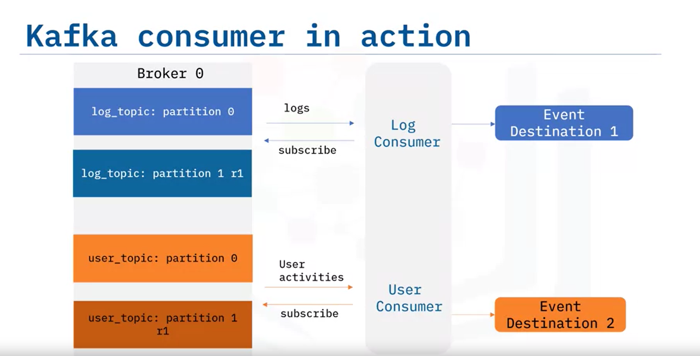

## Understanding Events
An event signifies something worth noticing. In event streaming, an event is data describing an entity's state updates over time. Examples include:


- GPS coordinates of a moving car.
- Room temperature.
- Blood pressure measurements of a patient.
- RAM usage of a running application.


## Event Formats

Events can be in various formats:

1. **Primitive types**: Plain text, number, or date.
2. **Key-value format**: The value can be a primitive type or a complex type like a list, tuple, JSON, XML, or bytes.
3. **Time-sensitive events**: Often associated with a timestamp.

## Event Streaming

Event streaming involves the continuous transportation of events from an event source to an event destination. This process becomes complex with multiple sources and destinations, each potentially using different communication protocols such as FTP, HTTP, JDBC, or SCP.

## Event Stream Platform (ESP)

An ESP manages the complexities of multiple event sources and destinations. It acts as a middle layer, providing a unified interface for event-based ETL (Extract, Transform, Load).

### Key Components of an ESP


1. **Event Broker**: Receives and consumes events.
2. **Event Storage**: Stores received events for later retrieval.
3. **Analytic and Query Engine**: Queries and analyzes stored events.

#### Event Broker Sub-components

1. **Ingester**: Receives events from various sources.
2. **Processor**: Performs operations on data (e.g., serialization, compression, encryption).
3. **Consumption**: Distributes events to subscribed destinations.

## Popular ESPs

- Apache Kafka
- Amazon Kinesis
- Apache Flink
- Apache Spark
- Apache Storm
- Logstash (Elastic Stack)

### Summary

- An event stream represents entities’ status updates over time.
- Common event formats include primitive data types, key-value, and key-value with a timestamp.
- An ESP is essential for managing multiple event sources and destinations.
- Main components of an ESP: Event broker, Event storage, Analytic and Query Engine.
- Apache Kafka is the most popular open-source ESP.
- Other popular ESPs: Amazon Kinesis, Apache Flink, Apache Spark, Apache Storm, Logstash.


# Welcome to Apache Kafka Overview

After watching this video, you will be able to:
- Recognize Apache Kafka as an Event Streaming Platform (ESP).
- Describe the architecture of Apache Kafka.
- List common use cases for Apache Kafka.
- Summarize the main features and benefits of Apache Kafka.
- List popular Kafka-based ESP-as-a-Service providers.

## Introduction
Apache Kafka is a highly popular open-source event streaming platform. It simplifies the implementation of an ESP with many built-in capabilities.

## Common Use Cases
Kafka is used in various scenarios, such as:
- **User Activity Tracking**: Keyboard strokes, mouse clicks, page views, searches.
- **Metric Streaming**: Sensor readings, GPS data, hardware and software monitoring.
- **Log Integration**: Collecting and centralizing logs for enterprise applications.
- **Financial Transactions**: Widely used in banking, insurance, and FinTech for payments and transactions.

Kafka provides high throughput and reliable data transportation services, making it suitable for:
- Data storage and movement to other databases.
- Real-time processing and analytics.
- Notifications (email, text messages).
- Data governance and auditing.

## Kafka Architecture
Kafka has a distributed client-server architecture:
- **Server Side**: Kafka operates as a cluster of servers called brokers, managed by ZooKeeper, to ensure efficient collaboration.
- **Network Protocol**: Uses TCP for communication between clients and servers.
- **Client Side**: Provides various clients, such as Kafka CLI, high-level APIs (Java, Scala, REST), and third-party clients.

## Key Features of Apache Kafka
- **Distributed System**: Highly scalable and can handle high data throughput.
- **Event Brokers**: Multiple brokers handle event streaming in parallel.
- **Partitioning and Replication**: Ensures fault tolerance and reliability.
- **Permanent Storage**: Events are stored permanently, allowing flexible consumption.
- **Open Source**: Free to use and customizable.

## Challenges and Solutions
Deploying Kafka can be complex, especially for enterprise-level deployments. Professional assistance is often needed for configuration and tuning. Fortunately, several providers offer Kafka-based ESP-as-a-Service, adding value for customers.

## Popular Kafka-Based ESP-as-a-Service Providers
- **Confluent Cloud**: Fully managed Kafka services on-premises or on-cloud.
- **IBM Event Streams**: Offers enterprise-grade security, disaster recovery, and 24/7 monitoring.
- **Amazon Managed Streaming for Apache Kafka**: Facilitates the build and deployment of Kafka.

## Summary
- Apache Kafka is a leading open-source ESP.
- Common use cases include user-activity tracking, metrics streaming, log integration, and financial transactions.
- Kafka is scalable, reliable, and stores events permanently.
- Popular Kafka-based ESP service providers include Confluent Cloud, IBM Event Streams, and Amazon Managed Streaming.


## Core Components of Kafka

### Kafka Cluster
A Kafka cluster consists of one or more brokers, which are dedicated servers for receiving, storing, processing, and distributing events. Brokers are managed by ZooKeeper.

### Topics
Each broker contains one or more topics, which are like databases for storing specific types of events, such as logs, transactions, and metrics.

### Partitioning and Replication
Kafka uses partitioning and replication to increase fault-tolerance and throughput. Topics are divided into partitions, which are duplicated (replicated) across brokers.

### Producers and Consumers

- **Producers**: Client applications that publish events to topic partitions.


- **Consumers**: Client applications that subscribe to topics and read stored events.

## Using Kafka CLI

### Managing Topics
- **Create a Topic**: 
  ```bash
  kafka-topics.sh --create --topic log_topic --partitions 2 --replication-factor 2 --bootstrap-server localhost:9092
  ```

### List Topics:
```bash
kafka-topics.sh --list --bootstrap-server localhost:9092
```

### Describe Topics

```bash
kafka-topics.sh --describe --topic log_topic --bootstrap-server localhost:9092

#Describe a topic
kafka-topics.sh --describe --topic log_topic --bootstrap-server localhost:9092

## Delete a topic
kafka-topics.sh --delete --topic log_topic --bootstrap-server localhost:9092

```


### Publishing Events with Kafka Producer

```bash
kafka-console-producer.sh --topic log_topic --bootstrap-server localhost:9092

kafka-console-producer.sh --topic user_topic --bootstrap-server localhost:9092 --property parse.key=true --property key.separator=,

```


### Consuming Events with Kafka Consumer

```bash
# Start a consumer
kafka-console-consumer.sh --topic log_topic --bootstrap-server localhost:9092

# Read from Beginning:
kafka-console-consumer.sh --topic log_topic --from-beginning --bootstrap-server localhost:9092
```




# Welcome to Kafka Streaming Process

After watching this video, you will be able to:

- Describe what the Kafka Streams API is and its main benefits.
- Describe what the Kafka Stream processing topology is.

## Kafka Streams API Overview

In event streaming, besides transporting data, data engineers need to process data through tasks such as filtering, aggregation, and enhancement. Stream processing applications handle this. For Kafka-based applications, you can implement a data processor to read events from one topic, process them, and publish them to another topic.

### Example: Weather Data Processing

1. **Request raw weather JSON data** from a weather API.
2. **Start a weather producer** to publish the raw data to a raw weather topic.
3. **Start a consumer** to read raw weather data from the raw weather topic.
4. **Create a data processor** to filter the raw weather data for extreme events (e.g., high temperatures).
5. **Send processed data** to another producer, which publishes it to a processed weather topic.
6. **Consume processed weather data** and send it to a dashboard for visualization.

However, managing many ad hoc processors can be complex. Kafka Streams API simplifies this process.

## Kafka Streams API

The Kafka Streams API is a simple client library for processing data in event-streaming pipelines. It:

- Processes and analyzes data stored in Kafka topics.
- Ensures each record is processed only once.
- Processes one record at a time.

### Stream Processing Topology

The Kafka Streams API uses a computational graph called a stream-processing topology. In this topology:


- **Nodes** are stream processors that transform data.
- **Edges** are the input/output streams between processors.

There are two special types of processors:

- **Source Processor**: Acts like a consumer, with no upstream processors. It consumes streams from Kafka topics.
- **Sink Processor**: Acts like a producer, with no downstream processors. It publishes streams to Kafka topics.

### Example: Redesigning Weather Data Processing with Kafka Streams API

1. **Raw Weather Topic**: Source processor consumes streams from the raw weather topic.
2. **Stream Processor**: Filters the stream based on high temperature.
3. **Sink Processor**: Publishes the filtered stream to the processed weather topic.

This design is simpler than using ad hoc processors, especially when processing many topics.

## Summary

In this video, you learned that:

- The Kafka Streams API is a client library for data processing in event-streaming pipelines.
- A stream processor receives, transforms, and forwards streams.
- Kafka Streams API uses a stream-processing topology, where nodes are processors and edges are I/O streams.
- There are two special processors: source processors (consume streams) and sink processors (publish streams).

