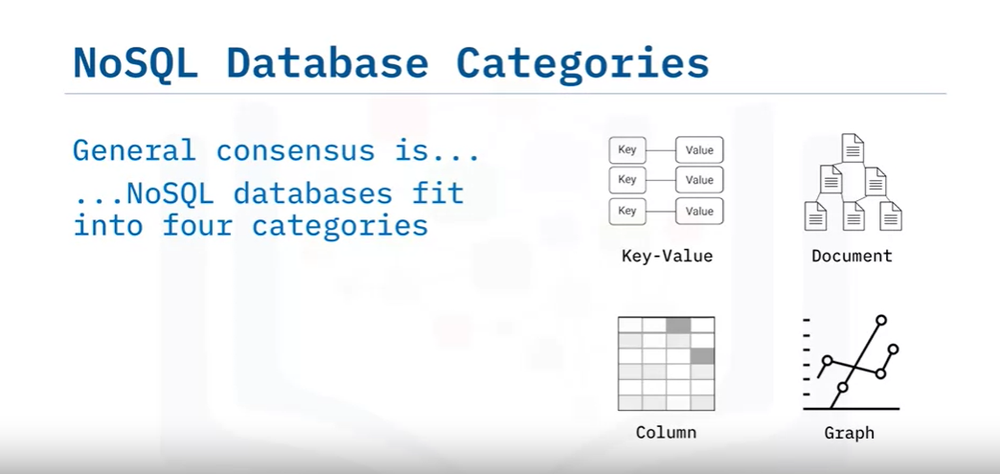
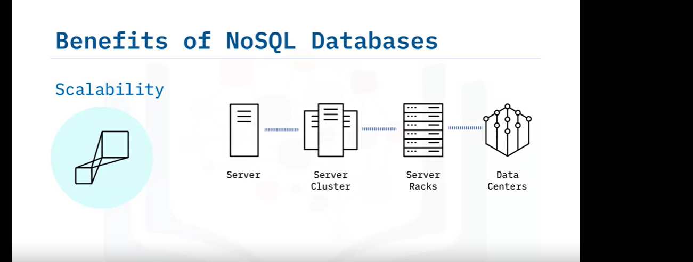

# Overview of NoSQL

Welcome to an overview of NoSQL. This video defines the term NoSQL, explains the technology it references, and describes the history of NoSQL in the database landscape.

### What is NoSQL?

The name NoSQL was introduced at an event discussing new open-source distributed databases, and it has stuck ever since. Contrary to its appearance, NoSQL stands for "Not Only SQL," not "NO SQL." The term describes databases that are non-relational, meaning they do not follow the traditional row and column relational database management system (RDBMS) structure. A more accurate term might be "non-relational" databases.

### Key Characteristics of NoSQL Databases

NoSQL databases provide new ways of storing and querying data that address modern application issues, particularly those associated with the "big data" movement. These databases are designed to handle:
- **Scale Problems**: Both in terms of data size and the number of concurrent users.
- **Specialized Use Cases**: They can be simpler to develop for specific application functionality compared to relational databases.

### History of NoSQL

#### 1970-2000: Dominance of Relational Databases
- Non-relational databases like IBM's IMS existed but were not widespread.
- The market was dominated by relational databases such as Oracle, IBM DB2, Microsoft SQL Server, and MySQL.

#### Dotcom Boom (Late 1990s/Early 2000s)
- Internet applications and companies surged, shifting from serving thousands of internal employees to millions of public users.
- Availability and performance became critical, leading to the development of new scalable technologies.
- Major contributions included:
  - **Google's MapReduce**: Described processing large data sets on distributed systems.
  - **Amazon's Dynamo**: Detailed a quorum-based architecture for distributing data and workload within a cluster.

#### Late 2000s: Emergence of NoSQL Databases
- Open-source communities developed several new databases:
  - **Apache CouchDB, Cassandra, HBase**
  - **MongoDB, Redis, Riak, Neo4j**
- These databases became popular for applications requiring larger scale than relational databases could handle.

#### Last 10 Years: Database-as-a-Service (DBaaS)
- NoSQL databases began leveraging a fully managed service model to offload administration and maintenance:
  - **IBM Cloudant**
  - **Amazon DynamoDB**


# Characteristics of NoSQL Databases

Welcome to "Characteristics of NoSQL Databases." This video describes the concepts and characteristics of NoSQL databases and explains the primary benefits of adopting a NoSQL database.

### What is NoSQL?

The most common trait among NoSQL databases is their non-relational architecture. But what types of NoSQL databases are available? And what is common to them?

### Types of NoSQL Databases

Efforts to categorize NoSQL databases have resulted in a general consensus that they fit into four types:
1. **Key-Value**
2. **Document**
3. **Column-based**
4. **Graph**


While there is some overlap among these types, the definitions aren’t always clear. You’ll learn more about the different types and their use cases later in this course.

### Common Characteristics of NoSQL Databases

Despite technical differences, NoSQL databases share several common traits:
- **Open Source Roots**: Many NoSQL databases originated from the open-source community, which has been fundamental for their growth. Companies often provide both a commercial version and services and support for the open-source counterpart. Examples include IBM Cloudant for CouchDB, Datastax for Apache Cassandra, and MongoDB.
- **Horizontal Scalability**: Most NoSQL databases are designed to scale horizontally and share their data more easily than relational databases. This often requires the use of a global unique key for simplifying partitioning (or ‘sharding’).


- **Specialization**: NoSQL databases are often more specialized for certain use cases compared to the Swiss army knife nature of relational databases.
- **Ease of Data Modeling**: Developers appreciate the ease of data modeling and use with NoSQL databases.
- **Flexible Schemas**: Unlike fixed schemas in relational databases, NoSQL databases often allow for more agile development with flexible schemas.

### Benefits of NoSQL Databases

The popularity of NoSQL databases is growing rapidly due to several benefits. Here are some of the most common reasons to adopt a NoSQL database:

1. **Scalability**:
   - Ability to horizontally scale across clusters of servers, racks, and data centers.
   - Elasticity to scale up and down to meet varying application demands.
   - Well-suited for large data sizes and high numbers of concurrent users typical of Big Data applications.

2. **Performance**:
   - Fast response times even with large data sets and high concurrency.
   - Leverage resources of large server clusters for optimal performance.

3. **High Availability**:
   - Running on a cluster of servers with multiple data copies ensures resilience.
   - More robust than single server solutions.

4. **Cost Efficiency**:
   - Reduced costs compared to traditional databases, especially when deployed on clusters in cloud architectures.
   - Cost savings without sacrificing performance and functionality.

5. **Flexible Schema and Intuitive Data Structures**:
   - Ability to build new features quickly without database locking or downtime.
   - More eloquent data structures for solving development needs, such as key-value stores, document stores, and graph databases.

6. **Specialized Capabilities**:
   - Specific indexing and querying capabilities, such as geospatial search.
   - Robust data replication and modern HTTP APIs.

### Why Not Always Use NoSQL?

Despite these benefits, there are still many requirements best met with a relational database management system (RDBMS). We’ll cover these scenarios later in the course.

### Summary

In this video, you learned that:
- NoSQL databases are non-relational.
- There are four categories of NoSQL databases.
- NoSQL databases have their roots in the open-source community.
- NoSQL database implementations vary technically, but they share several common characteristics.
- There are multiple benefits to adopting NoSQL databases.

Stay tuned for more detailed discussions on the different types of NoSQL databases and their specific use cases.


# NoSQL Database Types and Use Cases

## Document Store Databases
Document-store databases, also known as document-oriented databases, store data in a document format (typically JSON or BSON), where each document contains key-value pairs or key-document pairs. These databases are schema-less, allowing flexibility in data structures within a collection.

### Characteristics
- **Schema Flexibility**: Documents within collections can have varying structures, accommodating evolving data requirements.
- **Efficient CRUD Operations**: Well-suited for read and write-intensive applications due to their ability to retrieve whole documents.
- **Scalability**: Horizontal scalability by sharding data across clusters.

### Use Cases
- **Content Management Systems (CMS)**: Fast storage and access to various content types such as articles, images, and user data. *(MongoDB)*
- **E-commerce**: Management of product catalogs with diverse attributes and hierarchies, accommodating the dynamic nature of product listings. *(Couchbase, Amazon DocumentDB with MongoDB compatibility)*

### Frequently Mentioned Vendors
- MongoDB
- Couchbase
- Amazon DocumentDB

## Key-Value Stores
Key-value stores are the simplest NoSQL databases, storing data as a collection of key-value pairs where the key is unique and directly points to its associated value.

### Characteristics
- **High Performance**: Efficient for read and write operations, optimized for speedy retrieval based on keys.
- **Scalability**: Easily scalable due to their simple structure and ability to distribute data across nodes.
- **Caching**: Fast access via caching mechanisms.

### Use Cases
- **Web Performance**: Caching frequently accessed data for enhanced web performance. *(Redis, Memcached)*
- **E-commerce Platforms and Software Applications**: Handling high traffic and scaling dynamically for distributed systems. *(Amazon DynamoDB)*

### Frequently Mentioned Vendors
- Redis
- Memcached
- Amazon DynamoDB

## Column-Family Stores
Column-family stores, also referred to as columnar databases, organize data in columns rather than rows. These databases store columns of data together, making them efficient for handling large data sets with dynamic schemas.

### Characteristics
- **Column-Oriented Storage**: Efficient retrieval of specific columns.
- **Scalability**: Distributed architecture for high availability and scalability.

### Use Cases
- **IoT Applications**: Efficient management of massive amounts of sensor data, handling time-stamped data at scale. *(Apache Cassandra)*
- **User Preferences and Behaviors**: Storing and analyzing user preferences and behaviors for personalization. *(HBase)*

### Frequently Mentioned Vendors
- Apache Cassandra
- HBase

## Graph Databases
Graph databases are designed to manage highly interconnected data, representing relationships as first-class citizens alongside nodes and properties.

### Characteristics
- **Graph Data Model**: Relationships are as important as the data itself, enabling efficient traversal and querying of complex relationships.
- **Fast Relationship Queries**: Optimized for queries involving relationships, making them ideal for social networks, recommendation systems, and network analysis.

### Use Cases
- **Social Networks**: Efficient data management of relationships between users, posts, comments, and likes. *(Neo4j)*
- **Recommendation Systems**: Creating sophisticated recommendation engines by analyzing complex relationships between users, products, and behaviors. *(Amazon Neptune)*

### Frequently Mentioned Vendors
- Neo4j
- Amazon Neptune
- ArangoDB

## Wide-Column Stores
Wide-column store NoSQL databases organize data in tables, rows, and columns like relational databases but with a flexible schema.

### Characteristics
- **Columnar Storage**: Efficient retrieval of specific columns.
- **Scalability and Fault Tolerance**: Horizontal scalability and fault tolerance.

### Use Cases
- **Big Data Analysis**: Efficient handling of large-scale data processing for real-time analytics. *(Apache HBase)*
- **Enterprise Content Management**: Managing vast amounts of structured data like employee records or inventory. *(Cassandra)*

### Frequently Mentioned Vendors
- Apache HBase
- Apache Cassandra

## Expanded Use Case Example: Using MongoDB for a Content Management System (CMS)
Content management systems (CMS) collect, govern, manage, and enrich enterprise content, including HTML pages, images, articles, and more. MongoDB is a practical choice for CMS due to its schema flexibility and scalability.

### Content Structure Using MongoDB
In MongoDB, content is represented as documents. Each document corresponds to a piece of content, such as an article, image, video, or page.

#### Example of Structuring: Storing a Blog Post
```json
{
  "_id": 1,
  "title": "Sample Blog Post",
  "content": "This is the content of the blog post...",
  "author": {
    "name": "John Doe",
    "email": "john@example.com",
    "bio": "A passionate blogger.",
    "created_at": "2023-09-20T00:00:00Z"
  },
  "created_at": "2023-09-20T08:00:00Z",
  "tags": ["mongodb", "blogging", "example"],
  "comments": [
    {
      "text": "Great post!",
      "author": "Emily Johnson",
      "created_at": "2023-09-20T10:00:00Z"
    },
    {
      "text": "Thanks for sharing!",
      "author": "James Martin",
      "created_at": "2023-09-20T11:00:00Z"
    }
  ]
}
```


# Key-Value NoSQL Databases

## Introduction
Key-Value NoSQL databases are one of the four main categories of NoSQL databases, alongside Document, Wide Column, and Graph databases. This type of database is the least complex architecturally, making it highly suitable for applications requiring quick Create-Read-Update-Delete (CRUD) operations.

## Architecture
- **Structure**: Key-Value databases store data as a collection of key-value pairs, where each key is unique and directly points to its associated value.
- **Representation**: Typically represented as a hashmap.
- **Scalability**: These databases scale well and can be easily sharded across multiple nodes. Each shard contains a range of keys and their associated values.
- **Operation**: Best suited for single key operations due to their atomic nature for such operations. Complex queries involving multiple pieces of data are not ideal for Key-Value stores.
- **Value Blob**: The value blob is opaque, meaning it has limited flexibility in indexing and querying compared to other database types.

## Primary Use Cases
Key-Value databases are ideal for scenarios requiring fast performance for basic CRUD operations without the need for complex queries or relationships between data points. Typical use cases include:

1. **Session Information Storage**:
   - **Example**: Storing and retrieving session information for web applications.
   - **Details**: Each user session receives a unique key, and all session data is stored together in the value blob. Transactions are based solely on the unique key.

2. **User Profiles and Preferences**:
   - **Example**: Storing user profiles and preferences within an application.
   - **Details**: Each user profile is identified by a unique key, with all relevant data stored in the value blob.

3. **Shopping Cart Data**:
   - **Example**: Storing shopping cart data for online stores or marketplaces.
   - **Details**: Each shopping cart is associated with a unique key, containing all cart data in the value blob.

## When Not to Use Key-Value Databases
Key-Value databases may not be suitable for certain scenarios, including:
- **Interconnected Data**: Applications requiring complex queries or handling many-to-many relationships, such as social networking or recommendation engines, may exhibit poor performance.
- **Multi-Operation Transactions**: Use cases requiring a high level of consistency for multi-operation transactions involving multiple keys may need databases supporting ACID transactions.
- **Querying by Value**: If querying based on values rather than keys is required, consider using Document databases instead.

## Popular Implementations
Some well-known Key-Value NoSQL databases include:
- **Amazon DynamoDB**
- **Oracle NoSQL Database**
- **Redis**
- **Aerospike**
- **Riak KV**
- **MemcacheDB**
- **Project Voldemort**

## Summary
Key-Value NoSQL databases are a powerful solution for applications requiring fast CRUD operations and simple data storage mechanisms. They excel in scenarios where data is not highly interconnected and complex queries are not needed. By understanding their architecture and primary use cases, developers can effectively leverage Key-Value databases to meet their application requirements.

