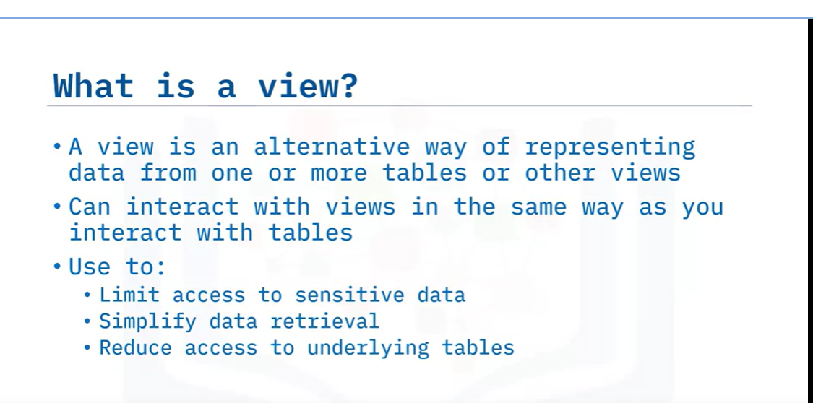
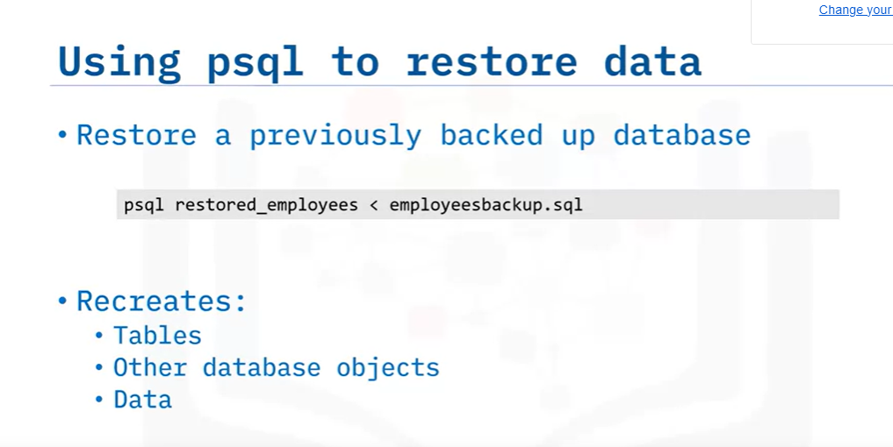

- Welcome to Getting Started with PostgreSQL
- After watching this video, you will be able to:
  - Describe PostgreSQL
  - Explain how you can work with PostgreSQL databases
  - Describe psql
  - Describe pgAdmin, the Query Tool, and the ERD Tool

Postgres is an open source object-relational database management system with a strong reputation for reliability and flexibility and support for both relational and non-relational data types. Postgres is a popular database choice for OLTP, data analytics, and geographic information systems. 

You can use PostgreSQL in a number of ways:
- You can download and install on your own servers, on a range of operating systems such as macOS, UNIX, or Windows.
- You can install and self manage PostgreSQL in virtual machine images or containers in the cloud or use managed services such as IBM Cloud Databases for PostgreSQL, Amazon RDS, Google Cloud SQL for PostgreSQL, EnterpriseDB cloud, or Microsoft Azure for PostgreSQL.

There are a variety of tools that you can use to connect to Postgres databases:
- `psql` provides a command line interface for PostgreSQL.
- `pgAdmin` provides an open source graphical interface to the database server which is available as a desktop application or as a web application that you can install on your web servers.
- `Navicat` and `Dbeaver` are commercial graphical interface options that you can use to access Postgres, MySQL, and other types of database.

Managed database and cloud service providers are other options for working with PostgreSQL. For example, Amazon RDS for PostgreSQL provides a web-based management console and RDS APIs.

`psql` is an interactive command line tool you can use to work with your Postgres databases. You can run interactive queries and display information about the objects in your database.

`pgAdmin` also includes an ERD Tool that you can use to create an ERD for an existing database or to create a new ERD and generate the SQL statements for creating the underlying database objects.

In this video, you learned that:
- You can install PostgreSQL on your own servers or work with it in the cloud
- `psql` provides a command-line interface to a Postgres server
- `pgAdmin` is a popular database management tool for PostgreSQL which includes object navigation, the Query Tool, and the ERD Tool

## Views

- Welcome to Views
- After watching this video, you will be able to:
  - Describe views
  - Create and use a view
  - Explain how materialized views differ from regular views
  - Create and use a materialized view

A view is an alternative way of representing data from one or more tables or other views. You can interact with views in the same way as you interact with tables, inserting, updating, and deleting data as required. Views are a useful way of limiting access to sensitive data, simplifying data retrieval, and reducing access to underlying tables. 

For example, you could create a view to include the name and email columns from these two tables. Users can then easily access this data without needing to know that it is stored in two different tables and without being given access to the sensitive salary information.

To create a view:
- Right-click Views in the tree view on the left-hand side, click Create, and then click View.
- Name the view and enter the SQL code that defines the view on the Code page, and then click Save.

PostgreSQL also supports another type of view – a materialized view. When you refresh a materialized view for the first time, the result set is materialized, or saved, for future use. This materialization does mean that you can only query the data and cannot update or delete it. However, it also enhances performance for future querying of the view because the result set is readily available, often stored in memory.

To create a materialized view:
- Start in the materialized views folder in the tree view.
- Enter the name for the view and define it using SQL code on the Definition page, and then click Save.

After creating a materialized view, you need to refresh it with the current rows from the underlying tables before using it to access the data it holds. You can refresh the data in the view at any time to update it with the data in the underlying tables.

- Views are an alternative way of representing data
- You can use views to limit access to sensitive data and simplify data retrieval
- Materialized views store the result set for quicker subsequent access
- You cannot insert, update, or delete rows via a materialized view
